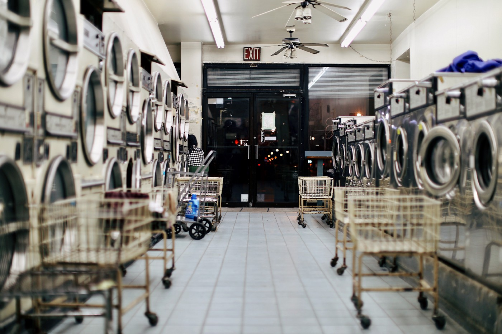

# $100,000 and You Absolutely Can Be Set For Life
 4 things to do so you can stop freaking out over saving $1 million

 

 _Move your money like a criminal, so you never have to worry about retiring._

 Earlier this year, I likened my personal financial strategy to laundering money. Not really, but it’s realistic enough to make a better than average analogy in a sea of pretty bad analogies.

 

 In that article, I describe my pots of money approach to personal finance.

 I do it [here](https://themakingofamillionaire.com/why-a-pots-of-money-approach-is-the-best-way-to-manage-your-money-78ef56a0141) as well.

 Later in the year, I developed the money laundering thought, introducing the [idea of recycling cash](https://themakingofamillionaire.com/saving-1-000-000-is-a-waste-of-your-time-7a5301930b4a):

## Aim to save two years’ worth of living expenses.
 

    Let’s say you spend $4,000 a month on fixed and discretionary expenses. This means you’ll need to get to — or close to — $96,000.

    It might take a while to get there. This isn’t easy. Stuff with money usually isn’t. But it’s a hell of a lot easier than saving a million to rely on when you hit your sixties or seventies.

    Once you have achieved this goal — and you have other key conditions in place — you can semi-retire. You can recycle cash on an ongoing basis…

    After you save two years of expenses ($96,000), you pull out one year’s worth ($48,000) and live off of that money for a year.

    As you deplete this $48,000, you’re saving almost all of your ensuing cash flow.

    If throughout this year, you can decrease expenses and steadily increase income, you operate from an ideal position of strength.

 

 All of this assumes you’re of modest means. That is, you’re not rich or even close to it.

 You have to work.

 You’re among the millions of us who — for one reason or another — will not be able to traditionally retire. The math the retirement planners and investment gurus give us simply doesn’t add up. [We have no choice, but to accept this](https://themakingofamillionaire.com/never-retire-the-killer-mantra-of-the-new-way-better-middle-class-ef79d3c5d3cf) and devise alternative strategies to live the lives we wanna live now and for the duration.

 ## So I say aim for $100,000, not the oft-prescribed $1 million or more.

 Sounds insane. Except it’s not.

 Here are the things you probably gotta do — or some variation of them — to get it done.

## Shake the prevailing get rich quick mindset.
 Every part-time DJ or bartender you know isn’t getting rich on meme stocks and cryptocurrency. Your old high school friend isn’t side hustling her way to an easy $5,000 or $10,000 a month with some multilevel marketing bull shit.

 Don’t believe everything you see on Facebook.

 At the same time, accept the fact that — if you’re like me — you’re probably never going to save $1 million. You won’t even come close.

 Embrace the happy medium between the unrealistic and impossible.

 Saving $100,000 (or whatever two year’s worth of expenses adds up to for you) won’t be easy, particularly if you start from scratch. Meaning you don’t count what you already have saved.

 It’s hard work.

 But it’s easier than saving a million or more to use when you’re an old bastard.

 It’s also more realistic than putting $1,000 into the coin of the day, thinking it’ll suddenly morph into hundreds of thousands or even millions like those record-spinning Facebook friends tout.

## Stop feeling guilty.
 I wrote [this](https://themakingofamillionaire.com/never-retire-the-killer-mantra-of-the-new-way-better-middle-class-ef79d3c5d3cf) the other day. It’s super important for taking control of your money situation.

## They’re asking the impossible.
 

    For many of us, what they ask of us — for one reason or another — simply isn’t happening.

    It’s not going to happen. Because we can’t make it happen. Maybe we don’t want to make it happen. Or some mix of both.

    They being financial media writers, money gurus, retirement planners, our parents, other family, and friends.

 

 You know the ask. To live the typical middle class American life of —

 * Go to college (probably)
 * Get a “good” job (definitely)
 * Start a family (usually)
 * Buy a starter home
 * Move into a bigger home
 * Present ourselves like we made it
 * Save enough money each month — for like 40 years or thereabouts — so we end up with a million dollars or more post-sixty years old
 * Retire
 * Present ourselves like all that hard work paid off
 * Die

 You might not want this. And, more urgently, you might not be able to do it.

 The longer you wait to accept this reality, the longer it’ll take you to develop and execute an alternative personal financial strategy that counters the soullessness of traditional retirement.

 There’s nothing wrong with you if you don’t want to or simply cannot follow the traditional path.

 Maybe there’s something wrong with them. Not because of what they do with their money, but because of how they shame you for not doing likewise.

## Find the right type of work.
 The white collar work I describe in [this article](https://themakingofamillionaire.com/a-sad-near-pathetic-account-of-the-experience-of-work-and-retirement-d1af3bffeef4) isn’t gonna cut it — physically or mentally — for most of us.

 Neither is breaking your back in the service industry, [working for somebody else who doesn’t give a shit](https://roccopendola.medium.com/one-thing-we-rarely-discuss-in-the-nobody-wants-to-work-debate-cf0f712ea92e) about your physical or mental well-being.

 Whether you’re white or blue collar — or somewhere in between — you can start you own business. You can freelance. You can be self-employed. If you don’t go the brick and mortar route with the small business, they’re pretty much one and the same.

 Take inspiration from the line cook who started a food truck.

 From the guy born in 1934 who painted houses on the side (yeah, it was a side hustle 50 years ago, too!) and turned it into his full-time small business.

 From the person who turned their passion into full-time, self employment as a creator.

 Anybody can take an honest look at themselves, determine the skills they possess, and turn it into work they do on their own, not for somebody else.

 If the work is something relatively easy, like writing, you stand a better than decent chance of being able to do it into relative old age.

## Adopt and maintain a low cost of living.
 If I included it in every article (and I sorta, kinda do), it would not be enough.

 Coupled with work that endures — with consistent and maybe some form of passive cash flow — a low cost of living gives you a better chance at financial success and stability.

 With low expenses, the money you make takes you further. The money you save stays saved longer. And so on.

 Back to the $100,000.

 If you check these four boxes, a strategy where you aim to save two years’ worth of expenses and recycle that cash, bank the surplus, and adjust how much work you do along the way becomes feasible.

 _It’s not about quitting work altogether._

 _It’s about finding work you actually enjoy._

 _It’s about better pacing yourself._

 _It’s about living your conception of [the semi-retired life](https://themakingofamillionaire.com/exactly-what-it-means-to-be-semi-retired-e8502292d3e9)._

 This approach — and alternatives like it — sound crazy because they counter the norm the media, retirement and investment industries, and, subsequently, our parents and peers drill into our heads.

 This is where mindset comes in.

 Where not feeling guilt or shame comes in.

 We have these feelings around money in ways similar to what we experience with other areas of life society collectively deems taboo.

 It’s not healthy.

 However, it’s liberating when you break free and start to have your own experience, not one prescribed by others.

 Not only can it feel liberating, it can produce results and less stress around money.

---
This article is for informational purposes only. It should not be considered Financial or Legal Advice. Not all information will be accurate. Consult a financial professional before making any major financial decisions.