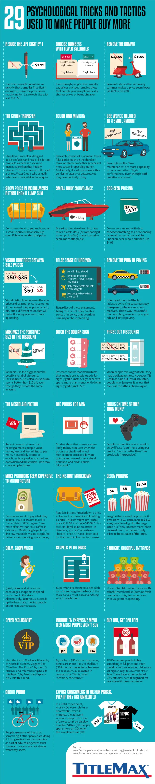

If you live and breathe, chances are good that you’re being bombarded with meticulously researched and executed marketing tactics without even realizing it. These tricks and methods toy with your mind, infiltrate your senses, and tap into your emotions to override analytical thought. This infographic explores 29 of these marketing tricks and tactics to help consumers be more mindful of the subtle influences we experience everyday.

## infographic

01. **Reduce the left digit by 1.** Our brain encodes numbers so quickly that a smaller first digit is enough to make the price seem much smaller: $2.99 feels like a lot less than $3.
02. **Choose numbers with fewer syllables.** Even though people don’t usually say prices out loud, studies show that people perceive phonetically shorter prices as being cheaper.
03. **Remove the comma.** Research shows that removing commas makes a price seem lower ($1,699 vs. $1699).
04. **The Gruen transfer.** Shop layouts are often designed to be confusing and maze-like, forcing people to wander and see more merchandise than they initially planned. This trick is named after mall architect Victor Gruen, who actually hated such manipulative techniques.
05. **Touch and mimicry.** Research shows that a woman’s touch (like a brief touch to the shoulder) makes customers of either gender feel more secure in spending money. Additionally, if a salesperson of either gender imitates your gestures, you may be more likely to buy.
06. **Use words related to a small amount.** Descriptions like “low maintenance” are more appealing to consumers than “high performance,” even though both qualities are valued.
07. **Show price in installments rather than a lump sum.** Consumers tend to get anchored on a smaller price subconsciously, even if they know the total price.
08. **Small daily equivalence.** Breaking the price down into how much it costs daily (or comparing it to a cup of coffee) makes the price seem more comfortable.
09. **Odd-even pricing.** Consumers are more likely to choose something at a price ending in an odd number that is right under an even whole number, like $4.97.
10. **Visual contrast between sale prices.** Visual distinction between the sale price and original price is powerful. If the original (higher price) is bold, big, and a different color, that will make the sale price seem more appealing.
11. **False sense of urgency.** “Very limited stock! Limited time offer: Prices will never be this low again! Only three seats are left on this flight! 500 people have this in their cart!” Regardless of these statements being true or not, they create a sense of urgency that overrides careful purchase planning.
12. **Remove the pain of paying.** Uber revolutionized the taxi industry by having customers pay transparently before service is received. This is way less painful than watching a meter rise as you ride and THEN paying.
13. **Maximize the perceived size of the discount.** Retailers use the biggest number possible to label discounts. For example, 20% off a $50 vacuum seems better than $10 off, even though they’re both the same amount.
14. **Ditch the dollar sign.** Research shows that menu items that include prices without dollar signs (“garlic knots 5”) get diners to spend more than menus with dollar signs (“garlic knots $5”).
15. **Phase out discounts.** When people miss a great sale, they may be disappointed. However, if it is still on sale but less discounted, people may jump on it in fear that they will miss their chance again.
16. **The nostalgia factor.** Recent research shows that nostalgia makes people value money less and feel more willing to pay. It especially seems to emotionally appeal to stressed and overwhelmed millennials, who may crave simpler times.
17. **Red prices for men.** Studies show that men are more likely to buy products when the prices are displayed in red. Men seem to process ads more quickly and use color as a visual heuristic, and “red” equals “discount.”
18. **Focus on time rather than money.** People are emotional and want to enjoy life, so “you’ll love using our product” works better than “our product is inexpensive.”
19. **Make products seem expensive to manufacture.** Consumers want to pay what they believe is fair, so statements like “our coffee is 100% organic” are more effective than “our coffee is delicious.” Mentioning top-of-the-line raw materials makes people feel better about spending money.
20. **The instant markdown.** Retailers instantly mark down a price as low as it can go while still making a profit. The sign might say, “Retail price $139.99: Our price $49.99.” This tactic is illegal some countries: In Denmark, you can’t advertise a “before” price if it hasn’t been sold for that much in the past two weeks.
21. **Decoy pricing.** Imagine a small popcorn is $4, a medium is $8, and a large is $8.50. Many people will go for the large since it is “only 50 cents more” than the medium. The medium only exists to boost sales of the large.
22. **Calm, slow music.** Quiet, calm, and slow music encourages shoppers to spend more time in the store. Alternatively, faster music speeds up the heart rate, moving people out of restaurants faster.
23. **Expose consumers to higher prices, even if it is unrelated.** In a 2004 experiment, music CDs were sold on a boardwalk. Every 30 minutes, the adjacent vendor alternated the price of a sweatshirt on display to either $10 or $80. People spent more on CDs when the sweatshirt was $80!
24. **A bright, colorful entrance.** Store often fill their entrances with colorful merchandise (such as fresh produce) to brighten moods and encourage more spending.
25. **Offer exclusivity.** Near the top of Maslow’s Hierarchy of Needs pyramid is esteem. Slogans like “The Few. The Proud.” by the U.S. Marines and “Membership has its privileges.” by American Express play into this need.
26. **Expensive menu item most people won’t buy.** By having a $50 dish on the menu, diners are more likely to shell out $30 for other menu items because it seems reasonable in comparison. This is called “arbitrary coherence.”
27. **Buy one get one free.** BOGO compels people to buy something at full price and often spend more than intended. Prices are set high enough to cover the “free” item. These have all but replaced 50%-off sales, even though half-off deals benefit consumers more.
28. **Social proof.** People are more willing to do something if other people are doing it. Using reviews and testimonials as part of advertising earns trust. However, reviews are not always what they seem.
29. **Staples in the back.** Supermarkets put necessities such as milk and eggs in the back so you must pass everything else to reach them.

## Tricks are for Marketers
While this list isn’t exhaustive, it provides some key examples of the ways that marketers are attempting to influence your subconscious mind.

There are some high-level trends among the 29 tactics, which are compiled into four overarching sections:

* **Visual Pricing Tricks**
  These tricks aim to intentionally minimize the appearance of the price, so it’s more palatable to consumers. For instance, a store will price something at $9.99 instead of $10.00, or label a product as “buy-one-get-one” rather than 50% off.
* **Intentional Language Tricks**
  It’s not what you say, but how you say it. Making products seem costly to manufacture, offering exclusivity, and using words associated with small amounts fall under this category. These tricks use semantics to position a product in an appealing way.
* **Brick-and-Mortar Tricks**
    A store’s layout is less arbitrary than you may realize. Having a bright and colorful entrance, playing calm and slow music, and putting the essential items at the back of the store are a few tactics that fall into this section. These tricks use displays and product placement to influence consumer behavior.
* **Urgency Tricks**
  A false sense of urgency and phase-out discounts are included in this category. If a consumer believes they might miss out on a deal, they’re more likely to buy.

## The Theories in Practice
While most retailers are guilty of using at least a few of these tactics, several big companies are notorious for their use of psychological tricks to boost sales.

For instance, Ikea is well known for its confusing, maze-like layout. This is no accident, as an Ikea store’s architecture is designed specifically to maximize product exposure—it’s mastered what’s called the [Gruen effect](https://en.wikipedia.org/wiki/Gruen_transfer), a term named after architect Victor Gruen, whose elaborate displays were proven to convert browsers into buyers.

Another example is Walmart’s rollback pricing, which uses visual contrast to make the sale price more appealing. It’s clearly served the company well—in 2019, Walmart made [$524 billion](https://www.fitchratings.com/research/corporate-finance/fitch-affirms-walmart-at-aa-f1-outlook-stable-16-07-2020#:~:text=DERIVATION%20SUMMARY-,Walmart's%20ratings%20reflect%20its%20dominant%20global%20retail%20market%20share%20position,leverage%20around%202x%20over%20time.) in revenue, making it the world’s largest retailer.

Costco uses a few tactics on the list, but one it’s notorious for is putting fresh produce [in the back](https://www.neatorama.com/2013/09/09/10-Most-Fascinating-Facts-About-Costco/#:~:text=Costco%20purposely%20put%20fresh%20food,Track%22%20to%20the%20food%20section.) of the store. That means customers need to pass through the electronics, clothing, and household goods sections before they can get to the necessities.

While the above tactics are in a gray area, other tricks are flat out dishonest. Makeup brand Sunday Riley was caught writing fake Sephora reviews to boost sales. Employees were encouraged to write outstanding reviews for the company, and the CEO even provided instructions on how to avoid getting caught.

## The Influencer Era
As consumers become aware of certain marketing tactics, retailers are forced to switch up their game in order to remain effective.

A relatively recent phenomenon is influencer marketing, which is when brands partner with [vloggers](https://www.visualcapitalist.com/worlds-most-popular-youtubers/) or influencers to endorse a product. And these partnerships tend to work—a recent survey revealed that [40%](https://www.ion.co/twitter-has-released-a-report-showing-consumers-seek-product-recommendations-from-influencers-almost-as-much-as-they-do-from-friends) of people have purchased something based on an influencer’s recommendation.

But how long will influencer marketing — or any of these tactics — stay effective? Some of the more subtle pricing tactics might stay relevant for longer, but it’s unlikely that all of these tricks will stand the test of time.

