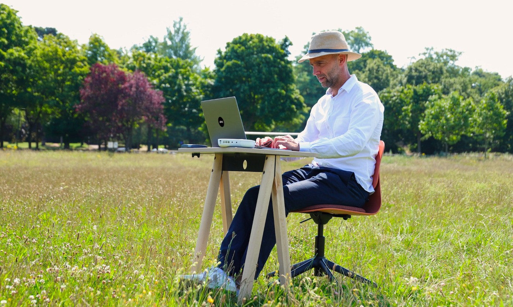

# I Built a 6-Figure Passive Income Machine — Here’s How to Do It Without Quitting Your Job
 It’s okay to be petrified of life without a job.

 

 The subject of passive income can make people vomit.

 I get it. There’s a lot of nonsense when it comes to the topic. There’s plenty of hyperbole too. My approach [is different](https://entrepreneurshandbook.co/a-kickass-side-hustle-costs-0-to-setup-and-helps-buy-back-your-time-9d25b80a5b32). I am not some passive income badass. Actually, when I started, I was more of a passive income snowflake. One gust of wind from a person at work and I’d blow over from their comments.

 Passive income is often framed as something only people with superman powers can access. The truth is if you’ve ever earned a dollar outside of your job without trying to, then you’ve experienced the mythical fairy-godmother of passive income. Congrats.

 The purpose of this article isn’t to make you feel bad or to get you to quit your job or start a blogging empire. All I want to do is share how I did it because it will give you ideas. You won’t do it the same as me. That’s cool. But you can copy and paste different parts. Let’s go.

## Your 9-5 fuels your side hustle
 I worked in a bank. They paid me okay, given all I had was a sound engineering qualification when I started.

 During business hours I’d serve clients and get them to bank with us. After hours I would write before and after work. There were plenty of times I’d be late to work because I got caught up in a blogging idea and couldn’t leave home until it was all on the page. Thankfully I had an understanding boss. Instead of caring how many hours I worked, his focus was on outcomes.

 Every two weeks I got paid. After I paid my living costs the money leftover went into:

 - Online courses related to blogging.
 - Books about the topics I write about.
 - Live events that everyday people attend to get business ideas.
 - Custom illustrations for my eBooks.
 - Wordpress hosting for my blog.
 - Web developers to update my website.
 - Software subscriptions like Grammarly.
 - Subscriptions to newsletters and content I would consume to serve as inspiration for my writing.

 For many years, I spent my salary on this [side hustle](https://entrepreneurshandbook.co/if-you-want-to-be-financially-free-then-start-with-a-side-hustle-d5e93d1f6d48) and didn’t make a dollar. My friends used to laugh at me. They said that the blog I started writing on 7 years ago was taking advantage of me. I had bills. The platform I wrote on paid none of them for me.

 On the one hand, they’re right. On the other hand, they’re wrong. When you fund a side hustle with your job and do it for free, it forces you to think differently. You don’t chase the dollars. Instead, you take your time. That means getting good at what you do.

 When a side hustle pays you on day one it makes you unconsciously entitled. You start to think a tech company owes you something. The truth is the world doesn’t owe you anything. You earn what you get. Took me a lifetime of pain and misery to learn that.

## Your side hustle fuels your investments
 Eventually my side hustle of blogging started to make some money through [eBooks](https://bettermarketing.pub/my-ebook-has-made-5-figures-7-months-in-i-sent-one-email-addd2905fc9a), consulting to businesses, 1-1 coaching, online courses, paid webinars, and platforms that pay for written content.

 I didn’t quit my job though once a bit of passive income started coming in the door. Nope. I stayed a scared little snowflake. The whole thing seemed like short-term luck.

 I did something nobody in the side hustle space talks about: I invested the money into financial assets. My regular salary paid my bills and what was left went into assets. Then the new passive income streams bought more financial assets. Those investments made money. That money compounded over the 7 years I followed this strategy.

## Your investments replace your 9-5 income
 I quit my job this year. Many people miss the point. I [quit my job](https://entrepreneurshandbook.co/i-finally-quit-my-job-today-heres-what-i-learned-b0ae090d603a) after doing my side hustle for 7 long years. It didn’t happen overnight. It’s definitely possible to replace a job a lot faster with a side hustle than I did. But every one of us has our path, our challenges, and the fears that hold us back.

 It’s okay to be petrified of life without a job. It’s okay to fear going back to the job market and being asked “why do you have a one-year employment gap?”

 A lot of old-school recruitment folks don’t understand side hustles. They think our lives are full of 5-year back-to-back stints in various roles. Cancer, having a baby, and divorce are life events they don’t get. Their resume software gets frazzled and has a fit when it sees a 1-year career gap.

 I shouldn’t admit this but screw it: the fear of going back to a job is what keeps me motivated every day not to give up.

 Now, when I say ‘investments,’ I need to disclose that one part of that puzzle is crypto. I did a tonne of research on platforms like ethereum and came to the conclusion, “this will replace the internet.” Don’t let crypto make you think this strategy doesn’t work.

 A friend of mine in his 40s quit his job as a school teacher to work on his side hustle. You know what it is? He writes tweets.

 He’s absolutely brilliant and has an eye for amazing artwork to accompany his words. The investment he chose is big tech companies like Google and Facebook. He decided to invest solely in a few tech stocks and nothing else. That gave him the passive income to tell his pain-in-the-ass school principal to go *Fuck* himself.

 I know another guy who had a public speaking side hustle. He quit his job in a rival bank to the one I worked at, to focus on his side hustle, by investing in local real estate.

 The type of financial asset doesn’t matter so much. The point is financial assets you buy with a basic understanding of how the economy works are what actually helps you quit a 9-5 for a side hustle.

 Bottom line: Combine a side hustle with a financial education that teaches you how to invest your money.

## The Passive Income Machine
 My side hustle approach is radically different. 
 
 1. I took an income from a job 
 2. I got returns and gains from financial assets. 
 3. I got passive income from my side hustle through eBooks, courses, consulting, coaching, content platforms, major publications, and webinars.

 The three diversified approaches de-risked my blogging side hustle — I call it my passive income machine with three engines. If one engine blows up the machine keeps moving forward.

 The three income sources helped build a buffer. They enabled me to reach the right people. They each taught me valuable lessons too.

 The takeaway is this: before you think you need to quit a job or become some ridiculous digital nomad with a backpack full of selfie sticks, remember that the path to unstoppable passive income, that lets you work on your side hustle full time, is different for everybody.

 Design your own passive income machine with a job, side hustle, and financial assets. That’s how you can make 6-figures of passive income to buy back your time and spend it however you want.

---

_This article is for informational purposes only, it should not be considered financial, tax or legal advice. Consult a financial professional before making any major financial decisions._