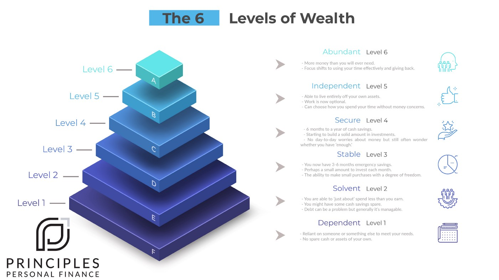

What does it mean to be financially secure? It’s a question we all ask ourselves but while we may have a decent grasp of where we are now, it can be difficult to quantify where we should be heading. So let’s consider — The 6 Levels of Wealth.

## Level 1 — Dependent
We all start our lives as financially dependent. Reliant on someone else to provide for us. Sadly, many of us have various times in our lives where due to unforeseen circumstances we find ourselves here. This can be dependent on ‘The State’ or on our family. When this occurs in adult life, money isn’t just on your mind, it’s seemingly the only thing on your mind.

Perhaps there are a debts that are building up and this is something that seems impossible to escape. If someone was to say what dominates your thoughts the most? Money worries would be pretty high on that list purely because of circumstances. Things like ‘financial independence’ are so far from realistic that they’re not worth thinking about. The focus is on trying to keep your head above water or maintaining some state of normality in what feels like a chaotic situation.

If this is you and you’d rather it wasn’t — don’t beat yourself up. Famously, J.K Rowling was dependent on the state when she wrote Harry Potter. Ray Dalio was dependent on a loan from his dad when his first investment firm went bankrupt before he launched Bridgewater Associates. A multi-billion dollar asset manager. Some of the most successful entrepreneurs have started their journey or changing the world from this point…..but this isn’t where we want to stay.

## Level 2 — Solvent
This is where you have enough to pay your bills. You’re not financially comfortable by any stretch but you have enough money to make ends meet. Holidays aren’t on the table very often and unforeseen bills have the ability to really drag back your financial position for months. You have limited emergency funds and savings which always seem to be devolving back down to zero. Credit card balances go down…. then somehow seem to climb again.

The concept of not getting paid for a month fills you with dread. This means you’re reluctant to take many risks with your job and your future. There is always a nagging feeling compared to your better off friends that they take opportunities you wish you had. Although you just don’t feel you can afford to take the risk. Saving for retirement is something that is always ‘for another day’ and the focus has to be on the here and now. The concept of being fully financially independent feels a distant and untouchable goal. Or, something that will only be achieved when your State Pension is payable and only then if you live a frugal lifestyle.

## Level 3 — Stable
You have 3–6 months in emergency funds and cash savings. You could bear the brunt of most reasonable unexpected expenses and you have enough money to lead a good quality of life. Holidays aren’t particularly extravagant but you manage to get away normally at least once or twice a year. Your main focus financially is really within the next 6 to 12 months. Anything beyond that seems difficult to plan for as there just isn’t the means to do this. You have managed to start putting some money aside to invest for your future but it’s only a small amount each month. You do have some assets that you're building, perhaps you’ve been able to get onto the property ladder. The majority of the focus has to be on the here and now.

## Level 4 — Secure
Your financial position is now looking a lot stronger. You have six to twelve months in emergency savings *in cash* and now quite a solid amount invested for the future. You feel confident that if you did have some trouble at work or there was a one-off expense, you’d be able to handle this. Your stronger financial position has changed your outlook on life slightly. You’re now looking forward at your career and your life and not just thinking about putting food on the table. Such as how you can find a meaningful career and if your current position fulfills you? Simply put, you have started to open up the luxury of choice and the concept of taking a risk doesn’t seem entirely unfeasible.

You don’t have a high degree of anxiety around money on a day to day basis but you still have concerns about the future and if you have *enough* to really do the things you want to do. Although you are without a doubt doing a lot better than some financially, it’s also a long way from where you’d like to be. There are certainly an endless list of people who you look enviously at wishing you had their means. You still have concerns about money just as everyone else does. It doesn’t keep you up at night but there still are big question marks about the future. Whether you can afford to give your family the type of life you want? Whether you can afford to improve your work/life balance?

## Level 5 — Independent
You’ve done it! It has taken some time and had not been easy but you have what has been called "F-U money." Work is now optional for you as you have enough money to live off your assets alone. Congratulations!

Beyond an initial break though, strangely you don’t really want to stop working altogether. Your concept of ‘work’ has just changed. This is incredibly powerful as while you still have the struggles and mundanity of everyday life. You are choosing what you want to do. Your time is an asset which has now become the focus of your everyday life. Life isn’t by any stretch ‘solved’ though. The habits you had to achieve this independence have taken a long time to ingrain into you and that person feels quite unfulfilled by spending all their days on the golf course. Something is missing but you just can’t put your finger on it…

## Level 6 — Abundant
You have more than you could ever spend now. Your focus shifts now from you to your legacy. Not just after you’ve gone but you start asking yourself the questions:

 * What difference can you make?
 * What was your impact on the world?

You have managed to achieve abundance by getting very good at a certain set of skills that the world needs and you feel that now is your time to pass on those skills. You do however have some questions on your mind, did I use my time wisely? Could I have made better decisions?

## The Reality
Perhaps you’ve worked your way up and felt motivated to move up the list. There is however a far bigger question here which is **ACTUALLY** the implied question:

‘*Will getting to the next stage make me happier?*’

*As humans, we have a tendency to romanticize our past and glorify future ‘ideal states.’*

Who reading this has achieved a financial goal to realise that once you are there, it didn’t actually make you feel as good as expected? In fact, it was very quickly replaced with ‘the very next’ goal. This hedonic treadmill is part of the human condition and it’s hardwired into us, so we have to keep a healthy level of appreciation about this when setting our goals.

Will getting to the higher stages make **YOU** happy? Well... it depends. Financial freedom will almost certainly improve your happiness compared to money worries. However money is a tool, not a goal in itself and pursuit of money by itself can be hollow and unfulfilling.

Let’s imagine a business entrepreneur who sells their business at a relatively young age. They have gone from *‘who is who*’ ⇢ … *‘who is she or he?*’

Financial goals on their own are meaningless unless your life has the fulfilment you need. The pot at the end of the rainbow doesn’t exist.

The question for anyone who hasn’t reached Level 5 or earlier stages. Is there a way you can structure things so instead of *deferred happiness* you can fully enjoy the journey? A structure instead of spending 50 years on a treadmill to buy happiness in last 16 years. Or, a version of the [FIRE strategy](https://www.investopedia.com/terms/f/financial-independence-retire-early-fire.asp569) — Save 75% income to age 40 and have the freedom later?

There may be a way you can try to structure your life so that you can be happy now while still having a lifetime of financial security. The wealth, health, *and happiness* strategy.