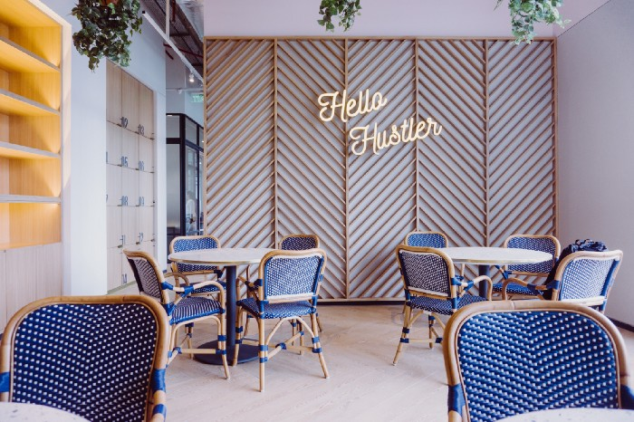

 *Some call them ripoffs. Others call them smart.*

 

 I call them good examples of what works with dubious ethical implications.

 We’re discussing startups that copied (“cloned”) ideas from more or less established businesses, altered them a bit, and made a fortune as a result.

 You’ll learn:
 * How these seven startups swiped others’ ideas and implemented them onto non-existing markets
 * Why Germans can be dangerous for established businesses
 * That there’s a LOT of money to be made from cloning

 Ready to learn from the very best in the cloning game? Let’s roll.

## Example #1: eBay and Alando
 Three brothers (Marc, Oliver, and Alexander Samwer) were mesmerized by the concept of eBay and wanted to reproduce it in Germany.

 Unfortunately, eBay never replied to their collaboration appeals.

 This wasn’t unfortunate for the brothers. It was unfortunate for eBay.

 The lack of response drove Samwers to launch the business themselves.

 **Fast forward three months.** The brothers just opened their fourth glass of champagne to celebrate the HUGE success they achieved in just 90 days after launching.

 (I’m guessing they drank champagne; that’s what I’d do).

 But their party is interrupted by a noisy phone ringing. One of the brothers picks up; it’s Goldman Sachs on the phone.

 eBay realized that Alando is a formidable competitor. They also realized that the best way to get rid of your competition is to acquire them.

 Long story short, eBay ended up buying Alando for a staggering $43 million just a month after the site went live.

### TL;DR
 eBay acquired Alando for $43 million just three months after the startup went into operation.

## Example #2: Zappos and Zalando
 Unless you’ve been living under a rock, you know that Zappos is an online shoe store. They have ads EVERYWHERE.

 But Zappos was almost as popular 10 years ago. Soon, what happened to eBay happened again to Zappos: a German man took note.

 His name was Rubin Ritter. With the help of his cofounders, Robert Gentz and David Schneider, he cloned Zappos’ idea and applied it to the European market.

 Alas, Zalando was born — a web retailer that even stole its first syllable from Zappos.

 (Fun fact: Zappos’ clone is called Zalando. eBay’s clone is called Alando. Coincidence? I think not.)

 But Zalando didn’t want to be just another clone. The store soon became as big as Zappos and even more valuable ([$5.3 billion](https://www.forbes.com/sites/ryanmac/2014/07/30/zalando-europe-zappos-fashion/?sh=7b963eb82fa6)).

### TL;DR
 Zalando became even more valuable than Zappos and was never acquired by the “original” company.

## Example #3: Quora and Zhihu
 Quora is an American-based Q&A site where users can interact with one another, exchange opinions, and answer or post questions.

 That’s pretty much how I’d describe Zhihu too, except it’s a China-based platform.

 In March of 2021, Zhihu hosted [315.3 million questions and answers](https://www.protocol.com/china/zhihu-ipo?rebelltitem=1#rebelltitem1) posted by 43.1 million people.

 For comparison, Quora hosted [88.6 million questions](https://www.quora.com/How-many-questions-have-been-asked-on-Quora-1) by March of the same year.

 Unfortunately, Quora didn’t publish the number of answers their platform hosts so we can’t really compare the numbers.

 But we should note that Zhihu is one year younger than Quora. This means that the knock-off at least reached the same success as Quora, if it hadn’t already surpassed it.

### TL;DR
 Despite Zhizhu ripping off Quora and being one year younger, the platform became ultra-successful on the Asian market.

## Example #4: Amazon and Lazada
 Lazada, “the Amazon of Asia”, [was founded in 2012](https://www.lazada.com/en/about/) and is now present in six countries: Indonesia, Malaysia, the Phillippines, Singapore, Thailand, and Vietnam.

 Just like Amazon, Lazada sells… well, *everything* — from electronics and appliances to clothes and books.

 The startup copied Amazon even when it comes to the shipping and return policies. Lazada offers free shipping and free returns, just like its big brother Amazon.

 The only real difference (but an important one) between Amazon and Lazada is tied to payment options.

 Many Asians either dislike using credit cards or don’t have them at all. I know, a shocker.

 While Amazon mostly offers payment via credit cards only, Lazada also offers a cash-upon-delivery option. This makes Lazada much more enticing to an average Asian consumer.

### TL;DR
 Lazada still can’t be compared to the giant that is Amazon, but the startup is doing exceptionally well in its own playing field. That’s because the startup met its consumers where they already are and implemented unique solutions.

## Example #5: Groupon and Beeconomic
 It seems like brothers really like to clone together. Just like Alando, Beeconomic was founded by brothers Karl and Chris Chong.

 They launched the startup in 2010, two years after Groupon was first launched. Beeconomic’s entire business model was *borrowed* from the American company.

 The startup would contact merchants, arrange discounts and special deals, and advertise them to their audience.

 This turned out to be just what the Asian market needed. Beeconomic was on the fast track to success.

 But Groupon had its eye on Beeconomic.

 Just seven months later, the company acquired it for a staggering $24 million.

 Beeconomic was renamed Groupon Singapore. Karl Chong — one of the two brothers that launched the startup — stayed at the company as the CEO, though not for too long.

 Watch the interview with Karl Chong here. He briefly discusses how and why the startup was acquired:

### Getting Your Startup Acquired for $24 Million in 7 Months!| Video (14:47 minutes)
 This episode features my interview with Karl Chong, CEO of Groupon Singapore, which is one of the fastest growing companies in Singapore. Karl is the driving force behind Beeconomic, a group buying site which he started in May 2010, which got acquired by Groupon less than seven months later for a whooping $24 million!

 This interview with Karl has him speaking from the position of someone who has been running the highly successful Beeconomic / Groupon Singapore for three years and has grown it from a humble startup of two people (just his brother and him in 2010) to 160 employees today!

 Get ready to hear Karl dish his best entrepreneur advice in this interview, including the following:
 * Karl's journey as an entrepreneur—that it started as early as when he was in high school
 * Is entrepreneurship for everyone? How you can be an entrepreneur no matter who you are or what you do
 * The 3 P's to achieve happiness in career/business
 * Why an eye for profits is not the most important criteria when it comes to being successful in business
 * What led Karl to quit his high-flying investment banking career in Macquarie Bank in 2010 Shoto start Beeconomic
 * Should one start a business with the end objective to get acquired?
 * Key factors which led to Beeconomic's success and eventual acquisition by Groupon
 * What Beeconomic had at that time which made it the best partnership candidate for Groupon (in 2010) over other deal-of-the-day competitors
 * Importance of having a competitive advantage in running a startup and how Karl created his competitive advantage for Beeconomic/Groupon Singapore
 * Why lack of funds should not stop you from starting your business
 * What you should do if you have family obligations
 * Biggest challenges Karl faced in starting Beeconomic and how he overcame them
 * Key factors that enabled Karl to land his first merchant deal
 * Karl's thoughts on the key traits needed to succeed in business in today's world
 * How to handle failure in life and business

 
  start: 0,
  allowfullscreen: 1,
  autoplay: 0,
  hl: en,
  cc_lang_pref: en,
  cc_load_policy: 1,
  color: white,
  controls: 1,
  disablekb: 0,
  enablejsapi: 1,
  fs: 0,
  iv_load_policy: 3,
  loop: 0,
  modestbranding: 1,
  playsinline: 0,
  privacy_mode: yes,
  rel: 0,
  showinfo: 0,
  origin: blog.richiebartlett.com,
  widget_referrer: blog.richiebartlett.com


### TL;DR
 Beeconomic did so well that they were acquired by Groupon just 7 months after the launch for a whopping $24 million.

## Example #6: Groupon and CityDeal
 Groupon made it twice to this list because it was cloned at least two times, but for different markets.

 Beeconomic was Asian-market-oriented. CityDeal was focused on Europe.

 I should also mention that CityDeal, a Groupon and Beeconomics knock-off, was yet another product from the Samwer brothers’ factory, Rocket Internet.

 (Remember them? They’re the same brothers that cloned eBay and made $43 million. Well, they realized they can make a lot of money by cloning. So they built a business that follows the formula: **find a non-existing market + clone successful ideas = make money**.)

 CityDeal shares Beeconomic’s fate. It was acquired by Groupon just five months after the launch, but at a better price for the Samwer brothers. $170 million, to be exact.

### TL;DR
 Samwer brothers ripped off Groupon too and made $170 million off of their look-alike.

## But Is It Moral?
 I’m not sure.

 Most of us are quick to judge Samwer brothers and the like. We’re convinced that what they’re doing is immoral, and we see their success as an undeserved reward.

 But we could also see it in a different light.

 Cloning startups share useful, valuable ideas with a larger population. They bring those ideas to non-existing markets and improve consumers’ lives.

 Think about it.

 Before Beeconomic, Asian people didn’t have the same opportunities as people in the U.S. They couldn’t access coupons and discounts, so they had to spend more money than an American citizen using Groupon.

 Beeconomic was the first to offer the Asian market the same solutions — and helped people save money.

 Are people supposed to refuse? Is the government supposed to say “No, don’t come to our market, even though we really need this solution”?

 It’s important we think about these questions.

 Let me know your take in the comments.