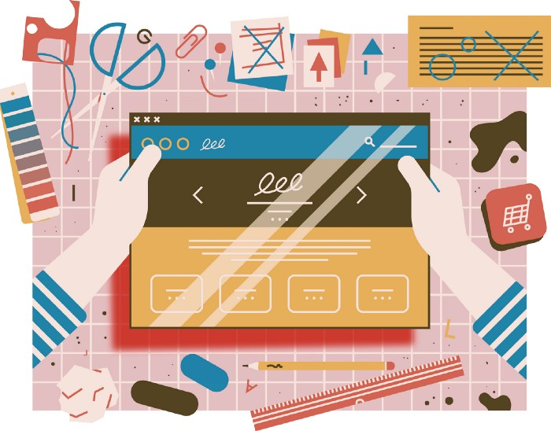

*Your website is often your first impression, and getting it right can make all the difference.*

For many small businesses, [a website](https://www.inc.com/guides/biz_online/20664.html) is one of the very first things that make their business seem “real.” In fact, for the increasing number of small businesses that [don’t have a physical storefront](https://www.inc.com/maria-haggerty/ecommerce-has-changed-way-we-shop-heres-why-your-online-business-needs-to-adapt-now.html), their website serves as their primary first point of contact for new business.

Even if you have a physical location, more and more potential customers will engage with your business online before they ever do in person. The good news is that your website can help you [reach customers](https://www.inc.com/larry-alton/12-online-marketing-tactics-you-should-be-using-in-2018.html) you would never be able to reach in person. The bad news is, you’re probably screwing it up.

Below are 6 common ways small businesses mess up their website, and how to avoid them.

## Not having a website at all
If you’re not online, you don’t exist to most of your potential clients. A website is maybe your most important engagement point with a potential customer short of a face to face conversation. Even then, you can bet your potential customers are checking out your website before they ever have a conversation with you.

By the way, **a Facebook page isn’t a website**. There are a lot of reasons why Facebook isn’t an adequate substitute for a website, not the least of which is that you should think long and hard whether or not you really want access to your online presence to be entirely at the mercy of someone else (*i.e.* Facebook).

## Not making it easy for people to connect with you
When visitors come to your website, there are a few things they’re looking for. They want to know who you are, what you do, and probably most importantly — how they can contact you.

Make it easy for your customers, and potential customers, to reach you by including a contact page with the best way for them to connect with a real person. A lot of companies use contact forms, which is fine, but you’d be surprised how much more accessible you seem when you include your email address and/or a phone number. (*Especially a phone number!*).

## Not keeping it up to date
There’s nothing worse than a website that’s completely out of date. If the most current entry in your list of “events,” is 4 months old, you’re sending a message that you don’t really care much about anyone who comes to the page. Or, if your blog hasn’t seen a new post for more than a week or so, visitors start to wonder what happened to you.

Make sure your contact info is current ([see above](#Not-making-it-easy-for-people-to-connect-with-you-7)), and if you are a retail establishment, make sure your website includes your current hours of operation. Think like a consumer, and make sure that any of the information they may be trying to find on your site is not only available but up to date.

## Not knowing your target
Your website should serve a purpose. For most companies, the purpose is to guide potential customers into a relationship with your business. Think about the things that matter to them and ignore pretty much everything else.

You are not your customer. You already understand your product, or your company, or whatever. Don’t use language that makes sense to insiders, unless your website is only for insiders. Consider every page, graphic, link, and text on your site, and be ruthless about making sure it is geared towards your target.

That means that calls-to-action (CTAs) should be clear and relevant to your potential customers. Remember that everything on your site should serve a purpose — connecting with your potential customers.

## Designing it yourself
Unless you’re a web designer it’s a really bad idea to design your own website. Sure, it’s easy — there are literally hundreds of inexpensive options to build websites — but that doesn’t mean it’s a good idea for your business.

If your website is really the starting point for the vast majority of your customers, it’s worth investing some time, energy, and money in getting it done right.

If you’re looking for real small business examples of what a professional can do for your website, check these out. (I don’t know them, I’m just a fan of their sites.)








Find a partner that can help you evaluate the message you want to communicate, and help you craft a design that represents — and reinforces your brand. There’s a saying, “you can pay now, or you can pay later.” You can pay a designer now, or you can pay later in the hit to your brand. Focus on what you do best, and find someone who can help you communicate that with your target market.

## Not making it mobile friendly
Over [52 percent of all web traffic](https://www.statista.com/statistics/241462/global-mobile-phone-website-traffic-share/) is from mobile devices. If your website design doesn’t adapt to mobile browsers, you’re missing the chance to reach half of your potential customers. At a minimum, you’re telling them you don’t really care about their business because you couldn’t be bothered to use one of the gagillion mobile-responsive themes available from basically every content management platform out there.

If you’re looking for a few examples of great mobile-friendly small business sites, here’s a few I like:








My guiding principle of marketing is, “make it easy for your customer to do business with you.” Just like it’s important to make it easy for them to find the information they want, or contact you, make it easy for them to do both of those things from their mobile device. It’s more likely than not that’s where they’re finding you anyway.

## BONUS
Building a site that that requires both cookies *and* Javascript to display. While most of your users don't disable these, it's a quick way to lose traffic when your website displays a blank page because the browser settings don't allow cookies or Javascript. During the design process, make certain the web designers consider this point and build the site so that minimum funcationality is available without Javascript. Also, make sure the Javascript coders build logic to not crash the code on the lack of cookie permissions. This is exactly how [RichieBartlett.com](https://RichieBartlett.com) was designed and built.