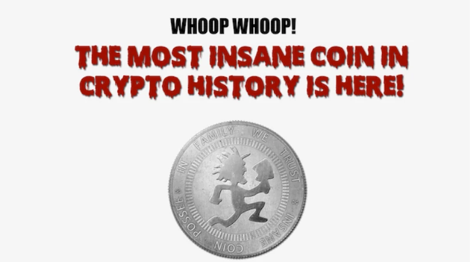


BitCoin? Who needs that when you can exercise your strong wrist???

When he reaches “1.21 jigafaps” of pumping power, their 1950s-style computer console ejaculates physical coins like a slut machine...



# Do You Accept WankCoin? A Tour of the Most Niche Digital Currencies

*From porn to tacos, there's an altcoin for everything. But for how long?*

To most people, the idea of cryptographic currency is essentially synonymous with [Bitcoin](http://motherboard.vice.com/tag/bitcoin). But Bitcoin is [just one of hundreds of competing mathematical currencies](http://motherboard.vice.com/blog/beyond-bitcoin-a-guide-to-the-most-promising-cryptocurrencies) available through online exchanges. As this spread of community-focused and oftentimes esoteric digital currencies continues exploding, what's it take to survive?

Some cryptocurrencies are marketed to particular groups. There's [HamRadioCoin](http://hamradiocoin.jimdo.com/faq-eng/) for amateur broadcasters, [TacoCoin](http://tacocoin.net) "for taco lovers everywhere," and [JuggaloCoin](http://juggalocoin.org) for fans of none other than the Insane Clown Posse. There are [digital coins modeled after rival currencies from Star Trek's United Federation of Planets and Klingon empire](http://scificointalk.com/index.php/board,1.0.html). There's even a currency called [BumbaCoin](http://www.reddit.com/r/bumbacoin) that's automatically distributed to Internet trolls who post Jamaican vulgarities in Bitcoin forums.

But even cryptocurrency creators say successfully launching a new alternative currency, or "[altcoin](http://motherboard.vice.com/tag/altcoins)," is far from trivial and requires careful attention to state-of-the-art math and computer science, economics, and old-fashioned marketing and community building. With so much competition, coins that don't quickly grab and hold on to the cryptocurrency market's attention and earn users' trust can easily drop in value and find themselves vanishing from online exchanges.

"Almost all the altcoins these days have been created with little or no consideration for the three aspects described above," Larry Ren, the lead developer on [ReddCoin](http://www.reddcoin.com), which aims to make it easier to send money through existing social networking sites, told me. "There is little surprise that the average shelf life of an altcoin is a couple of months or even weeks."

To tap into an existing community base, some other coins are tied to specific real-world geographical locations. There's a [NewYorkCoin](http://www.newyorkco.in), a [VegasCoin](http://vegascoin.co) (naturally), and an [ItalyCoin](https://github.com/corryl/ItalyCoin). Irish cryptocurrency fans can choose between [EireCoin](http://eirecoin.co), [Gaelcoin](http://www.gaelcoin.org), and [IrishCoin](http://irishcoin.org/about.html), which of course has already been used to buy a pint of Guinness in a Dublin pub.

Boosters of the geographical currencies say they can be used in giveaways to spur tourists to spend more money and can help keeps funds in local economies, similar to [paper community currencies already in use in some towns and cities](http://en.wikipedia.org/wiki/List_of_community_currencies_in_the_United_States). The same impulse seems to motivate members of other types of communities, like the creators of JuggaloCoin.

"The most important thing to understand about Juggalo culture is that it is all about Family and helping each other out," [says the JuggaloCoin site](http://webcache.googleusercontent.com/search?q=cache:pCPBIzzbW00J:juggalocoin.org/+&cd=1&hl=en&ct=clnk&gl=us). "By spending Juggalo Coins, Juggalos can be certain that their money is going to someone who is 'down with the clown.'"

And VegasCoin creator Brandon Yates told me he thinks cryptocurrency is a natural fit for Sin City, where visitors are already used to exchanging money for casino chips and cashing in drink vouchers at bars and clubs. In an email, he argued some visitors might be happy with the added anonymity of a virtual currency, which they'll be able to spend at bars, strip clubs and, perhaps one day, casinos through a smartphone wallet app.


**What happens in Vegas stays in Vegas—unless it's on your credit card statement.** Las Vegas is a sunny place for shady people and there are all sorts of transactions that visitors to the city of sin don't want seen by snooping spouses, corporate accountants, or the NSA.


Other coins are aimed at other types of markets where traditional payment systems aren't available, or buyers and sellers want extra anonymity. For instance, firearms enthusiasts, tired of being blacklisted by PayPal and other payment providers, can transact business in [Guncoin](http://guncoin.info). Guncoin's anonymous project manager told me in an email that many involved with firearms were distrustful of Bitcoin, and are more likely to accept a coin created by and for gun enthusiasts.

"Most people we have talked to really have no idea what 'cryptocurrency' or Bitcoin even is, and few are interested in learning more," Guncoin's manager wrote. "The industry really needed a firearms-specific crypto to get their attention."

Similarly, cannabis traders, who also experience [problems dealing with the banking system](http://motherboard.vice.com/blog/banks-wont-invest-in-legal-weed-until-the-justice-department-draws-clear-lines), can choose between [HempCoin](http://hempcoin.org), [PotCoin](http://www.potcoin.com), [Cannacoin](http://cannacoin.cc/index.php), and [CannabisCoin](http://cannabiscoin.net). Porn purveyors can offer customers a credit card alternative with [GroinCoin](http://groincoin.com), [TitCoin](http://www.titcoins.biz), or [WankCoin](http://www.wankcoin.com/). Really...

"People who want to buy adult material or tip cam models are often reluctant in doing so for fear of being caught by their significant others when credit card statements roll in," as "Greg," a Canadian accountant involved in WankCoin's creation, told me over email. And credit card fees are high in the adult industry because of the risk of chargebacks, making merchants willing to seek alternatives, he added.

In a [WankCoin promotional video](http://vimeo.com/99248388) modeled after a newscast, a trio of woman scientists—clad only in open lab coats, bras, and panties—force a male captive to masturbate, faster and faster, using his "wank energy" to power their computers and generate more currency. When he reaches "1.21 jigafaps" of pumping power, their 1950s-style computer console ejaculates physical coins like a slot machine, causing one of the buxom scientists to jump up and down with glee.

In reality, the mining process by which new WankCoins are created is more prosaic. As with Bitcoin, WankCoin transactions are published to the network of active users, and coin miners work to place them on the shared public ledger called the blockchain. Each block on that chain is a set of new transaction records, along with various other housekeeping data. When miners add a new block to the chain, they're automatically rewarded with newly-generated coins, plus transaction fees associated with the transactions logged in the block.

"We need more power! You heard her: Keep on pumping!"

Not every set of transaction records is a valid block, however—information from a block is run through a cryptographic [hashing function](http://en.wikipedia.org/wiki/Hash_function#Origins_of_the_term), a kind of algorithm that transforms arbitrary strings of data into a fixed-size number. Cryptographic hash functions are designed to make it difficult to predict the function's output or to find a string of data that hashes to a particular value other than by trial and error.

Only blocks that hash to a number smaller than a certain threshold are considered valid. This means miners have to try different combinations of transactions and other data until they find an acceptable block. Most coins aim to have new blocks added at a constant rate, and the underlying software will automatically adjust the difficulty of mining by raising and lowering the hash threshold as new blocks are created faster or slower than the target rate.

When Bitcoin first launched, it was possible to mine coins with a regular computer's CPU. But as the currency grew in popularity and value, miners moved first from the CPU to graphics cards, which were better suited to the rapid-fire arithmetic needed to quickly compute possible hash values, and then to machines with specialized mining chips called ASICs, for application-specific integrated circuits.

Partly to make mining practical on ordinary computers again, some currencies deliberately use different hashing algorithms than Bitcoin, so machines built to mine Bitcoin don't have the same advantages over ordinary household computers. [Litecoin](https://litecoin.org), often said to be [second in popularity to Bitcoin](http://www.technologyreview.com/news/513661/bitcoin-isnt-the-only-cryptocurrency-in-town/), uses a hashing algorithm called scrypt, as do its many variants, including the [Shiba-Inu-meme-inspired](http://motherboard.vice.com/tag/dogecoin) [Dogecoin](http://dogecoin.com).

And with scrypt-focused ASICs now on the market, other currencies have switched to still more esoteric hashing algorithms, including one formula called [X11](http://wiki.darkcoin.eu/wiki/X11#ASIC_resistance) that combines the output of 11 different functions into one hash. One currency, called [PrimeCoin](http://primecoin.io), requires that hashes be linked to certain chains of prime numbers of interest to mathematicians, so miners are potentially doing scientifically useful work as they record transactions and generate new coins.

Creators of new cryptocurrencies must choose all of the mathematical settings for their coins: the target mining rate, the hashing algorithm, the number of coins given per block to successful miners, and the total number of coins to be created, among others.

VegasCoin, for instance, tops out at 100 million total coins, compared to Bitcoin's 21 million and Litecoin's 84 million. Generating too many coins can mean the currency's not worth enough to motivate miners and investors; generate too few, and the currency can be worth too much and impractical to spend.

"We tried to be modest with our total number of coins to help ensure a higher value in the future," wrote VegasCoin's Yates. "Our 30 coin block reward was arrived at by the toss of the dice, gotta love that Vegas style!"

Yates' team picked LiteCoin's scrypt-mining algorithm to make the coin more approachable to at-home, amateur miners. Other coins take the opposite approach, picking Bitcoin's SHA-256 algorithm for its appeal to established miners.


**Our 30 coin block reward was arrived at by the toss of the dice, gotta love that Vegas style!**


"A key factor in our decision to use SHA-256 algorithm was because the majority of crypto enthusiasts have invested a lot of money in equipment that only mines using this algorithm," wrote Greg, of WankCoin. "We wanted people to be able to mine Wankcoin with ease, utilizing equipment they already had with minimal or no new investment. With Bitcoin's current difficulty it is becoming unprofitable to mine the currency, rendering this equipment almost obsolete."

And once those parameters are picked and new coin is launched, typically via a post on the [Bitcoin Talk announcements forum](https://bitcointalk.org/index.php?board=159.0), creators still need to take steps to promote it to would-be users and miners.

Getting coins listed on exchanges, where users can buy them using Bitcoin or traditional currency, has gotten harder as the number of coins has exploded, said Tim Renzetti, the creator of HempCoin.

"The folks who were in it in the beginning got on the exchanges pretty easy," he told me. "We were a month or two months after PotCoin, so getting on the exchanges was not a big goal for us, but it should have been."

Some older currencies were also "premined," Renzetti explained, meaning the currencies launched with a set of coins already in the creators' control. Premining helped some coins get off the ground by letting creators give them away to target users, or sell them IPO-style to raise money to promote the coins. But investors and miners are now wary of the practice after a series of "pump-and-dump" style scams where creators dumped their premined coins, then essentially abandoned their currencies.

"For anyone coming in the game right now, it would be very, very difficult," said Renzetti, who added that he still thinks different geographical regions and different industries will ultimately settle on different digital currencies. "You would have to have money to do it, because the idea of having a premined coin is not gonna happen any more. The community won't allow it."


**For anyone coming in the game right now, it would be very, very difficult.**


Alongside the announcements of new coins on Bitcoin Talk are [warnings about poorly planned coins and outright scams](https://bitcointalk.org/index.php?topic=522235.0), sometimes called "shitcoins." In some cases, users have even [spotted hidden premines](https://bitcointalk.org/index.php?topic=566870.msg6535095#msg6535095) embedded in the source code powering various coins, usually letting the creator of the first blocks in a coin's chain claim arbitrarily large rewards, letting coinmakers secretly sell large quantities of the coin as soon as exchanges open.

"Let me describe the scenario," [one Bitcoin Talk user wrote in warning of a possible scam](https://bitcointalk.org/index.php?topic=641057.msg7939691#msg7939691). "Dev releases some shitty [anonymity] system, gets all the IPO money. Dumps all the hidden premine and vanishes into the crypto-fog."

With premining out of fashion, coin creators should expect to spend about 10 Bitcoin of their own funds supporting a launch, one of the anonymous creators of GroinCoin wrote me in an email. That includes developer time for the coin software and website, ads and marketing, and coins for targeted giveaways and "faucets"— [websites and automated programs](http://altcoinfaucet.net) that distribute coins either for free or in exchange for promoting the coin online.

"It is not cheap, and it can rarely be done by one person," wrote the GroinCoin creator.

For its part, GroinCoin had a successful launch, despite more initial mining attention than its creators anticipated, according to the email. Bursts of mining have become a common issue for new currencies, after the creation of multipools—groups of miners who move in tandem from currency to currency, targeting the greatest monetary reward for the least computing power and pooling their collective earnings.

Newer coins with small dedicated bases have adopted new, more complicated algorithms to set mining complexity, since simpler approaches like taking a rolling average over time don't react well to a sudden influx or departure of multipool miners.

"People with large hashing power tend to jump between currencies, and without per difficulty block adjustments, the people left mining often face difficulties in the form of extended block finding times," wrote WankCoin's Greg, explaining that WankCoin uses an algorithm called DigiShield to stabilize difficulty rates.


Reddcoin is the social currency that enriches people's social lives and makes digital currency easy for the general public.


 allowfullscreen: 1,
 autoplay: 0,
 hl: en,
 cc_lang_pref: en,
 cc_load_policy: 1,
 color: white,
 controls: 1,
 disablekb: 0,
 enablejsapi: 1,
 fs: 0,
 iv_load_policy: 3,
 loop: 0,
 modestbranding: 1,
 playsinline: 0,
 privacy_mode: yes,
 rel: 0,
 showinfo: 0,
 origin: blog.richiebartlett.com,
 widget_referrer: blog.richiebartlett.com



But even with countermeasures in place, multipools generally push down the price of new coins, since a rising price will be counteracted by multipool mining and selling, said ReddCoin's Ren.

"Given the huge amount of hash power at the disposal of multipools, any price increase attracts more hash power which leads to more sell pressure which in turn causes the price to decrease," he wrote in an email. "An equilibrium is achieved when the price stabilizes at the cost of mining plus a thin profit margin (for miners). It's simple economics."

ReddCoin itself is in the midst of switching its mining algorithm to [a new formula called "proof-of-stake velocity"](http://www.reddcoin.com/papers/PoSV_FAQ.pdf) that seeks to give coins to active, dedicated fans of the currency, not just users with the most powerful computers.

"PoSV minting, the counterpart to [traditional proof of work] mining, requires little computing power or energy and can be done on CPUs of PCs, laptops and even mobile devices," [according to ReddCoin's description of the new algorithm](http://www.reddcoin.com/papers/PoSV_FAQ.pdf). "Every Reddcoin user will automatically become a PoSV minter."

Even so, Ren said many currency creators don't do enough to differentiate themselves technologically and economically, and effectively disappear after just a few weeks of trading.

"The value of the currency only increases if the developers and community are dedicated to building the ecosystem over a long period time," he wrote.

