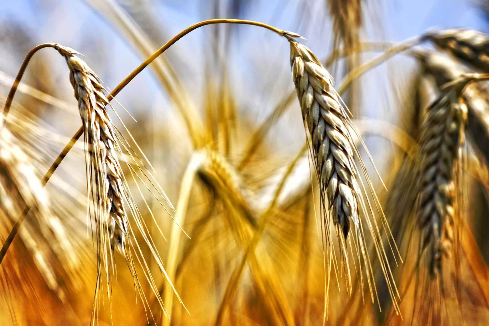


With the ever increasing extremes in weather patterns and Global Warming, wars over resources are not going to subside. In fact, you can expect increasing wars and migrations across the globe to more stable regions. And that happens to be closer to the poles.

With an expected increase of wars, supply chain issues, and migrants trying to escape these regions, land in more northern countries will become far more valuable. If you can afford to build a large size plot of land, you can cultivate self-sufficiency for your family's food with crops. The biggest technical challenge will be how to grow it without all the moisture evaporating into the broiling heat. This is where one could invest further into vertical farming. Be it underground or in a multistory building. The next generation of wealth could certainly be found with those that invest more time and research into how to build an "urban farm" the size of a skyscrapper.


While energy is making the headlines in terms of the economic impact of the war, food supply is equally in jeopardy. It’s important to understand that food on your table is one end of a long and complex supply chain. The farmers who grow food and raise livestock and the butchers and food processors who prepare that output into meat, poultry, bread, and dairy products are not the source of the supply; they’re intermediaries. The source of the supply chain is fertilizers made from chemicals, especially nitrogen and phosphate. So the complete agricultural supply chain runs as follows:

Chemicals 👉🏻 farms 👉🏻 processors 👉🏻 distribution centres 👉🏻 grocery stores 👉🏻 consumers.

Any break or bottleneck anywhere in this supply chain will result in higher prices or empty shelves at the consumer end. These breaks are already occurring. Russia and Ukraine provide more than 25% of the wheat supply in world trade and 20% of global corn sales. Ukrainian exports are already in disarray because of the war, and Russian exports will be handicapped by the financial sanctions imposed by the West.

This summary from *Foreign Policy*, 22 January 2022, explains the importance of Ukrainian wheat production both regionally and globally:


With some of the most fertile land on Earth, Ukraine has been known as Europe’s breadbasket for centuries. Its fast-growing agricultural exports — grains, vegetable oils, and a host of other products — are crucial to feeding populations from Africa to Asia. And it so happens that a substantial part of Ukraine’s most productive agricultural land is located in its eastern regions, exactly those parts most vulnerable to a… Russian attack…

Ukraine is a top exporter of corn, barley, and rye, but it’s the country’s wheat that has the biggest impact on food security around the world. In 2020, Ukraine exported roughly 18 million metric tons of wheat out of a total harvest of 24 million metric tons, making it the world’s fifth-largest exporter. Customers include China and the European Union, but the developing world is where Ukrainian wheat has become an essential import. For example, about half of all wheat consumed in Lebanon in 2020 came from Ukraine, according to data from the Food and Agriculture Organization (FAO)…

Should [an] attack on Ukraine turn into a Russian land grab from where Russian-supported separatists have already established their so-called republics, it could mean sharp declines in wheat production and a precipitous fall in wheat exports as farmers flee the fighting, infrastructure and equipment are destroyed, and the region’s economy is paralyzed. Whoever controls the land will ultimately extract its riches, but if conditions in the Russian-controlled eastern parts of Ukraine are any guide, instability and paralysis may lie over the region and seriously impact production far beyond the initial invasion.


As noted above, the disruption to agriculture and the upward pressure on food prices is not limited to direct export customers of Ukraine and Russia. Many of the inputs in farming, especially nitrogen fertilizer, are traded on world markets and have a world price. If Russian nitrogen exports are diminished and prices soar, that has a global impact, including on US farms. The impact of higher fertilizer prices doesn’t stop with grain. Most grains aren’t used for direct consumption by humans but as feed grains for livestock. That means the fertilizer price increase will flow to meat, poultry, eggs, and dairy products.

There’s also a multiplier effect in terms of higher energy prices and the food supply chain. Food has to be transported by truck or train, both of which require diesel fuel or electricity generated with oil or natural gas. The higher transportation costs are added to the higher food production costs to result in much higher retail prices once the food makes it to the grocery store.

The war in Ukraine is a triple whammy in terms of food costs. Ukrainian output is diminished because of the war. Russian exports are diminished because of sanctions. And Ukraine is a major export route for both Ukrainian and Russian output. Those transportation channels are now mostly closed. The food shock coming from the war in Ukraine could be as severe as the oil shock coming from the Middle East in the 1970s.

Fed monetary policy will not stop inflation because the coming inflation is not ‘demand-pull’ inflation from consumers, it’s ‘cost-push’ inflation from the supply side, which the Fed can’t control. In the end, we may have 1970s-style stagflation that includes both weak growth (due to monetary tightening) and higher prices (because of supply disruptions). That’s literally the worst of both worlds.