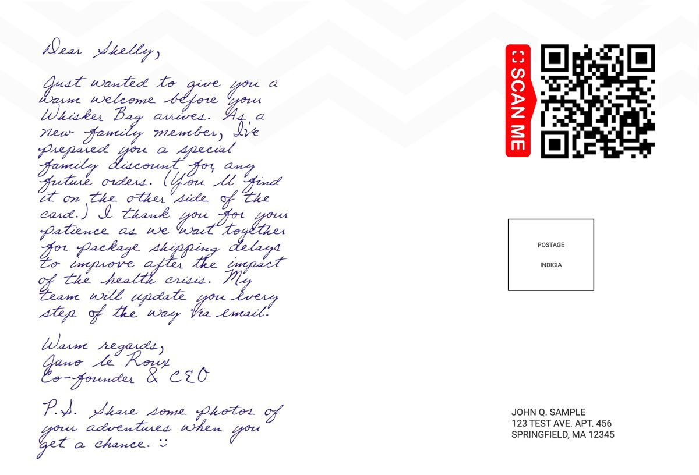

*Here’s what I’d do now if I had to do it all over again*

I built a [$100K/year](https://www.tidio.com/blog/whisker-bag-cat-travel-bag/) online travel niche side hustle in my bedroom and you can do it too.

My friends told me I was "insane." Mainstream media told me the travel industry was "dead." My grandma said it was the "stupidest idea” she’s ever heard. My stubborn little gut told me to proceed anyway &mdash; and it paid off.

My side hustle started with a struggle.

For years, I’ve been struggling to take my cat outside without traumatizing her. I tried every cruel cage I could get my hands on. Nothing worked. They were either too small, too uncomfortable, too ruthless, or honestly just too ugly.

One boring Friday night, I tried to work out what would be the best theoretical concept solution for my kitty problem. I ended up playing around with a couple of ideas in Cinema 4D and accidentally created what would be the beginning of my side hustle.

The idea was to create a cat backpack that was big enough to be comfy for a cat, yet tiny enough to be airline cabin approved. My fiancé loved the idea and shared it with some cat-loving friends.

They begged us to start selling them. Only then did I realize that small pet owners needed the idea that my grandma once called the "stupidest idea ever.”

Two weeks later, my fiancé and I launched [Whisker Bag](https://www.whiskerbag.com) and the rest is history.

If I had to do it all over again, here’s exactly what I would do.

## Sell tiny products
*Small products make the supply chain so much easier.*

I built Whisker Bag to solve a problem. I didn’t consider the logistics. Selling a smaller product would have made life so much easier.

**Hidden problems I didn’t fully expect**:

* Crazy storage fees
* High import taxes
* Nasty tier shipping costs
* Extremely slow shipping

**Actionable takeaway**: If I had to build a new side business today, I’d make sure my product was no bigger than an iPhone, or I’d simply go digital.

## Product page first
*Only 17% of paying customers ever visited my homepage; 100% visited my product page.*

I know as entrepreneurs we need to spend considerable time on our website’s home page, but I’ve learned the hard way that a product page is even more important when it comes to closing the sale.

It is the place that will drive more sales and increase the number of returning customers.

I cannot stress this enough: The product page is the single most important page on any site because that’s where people decide to buy or not.

**Actionable takeaway**: If I had to build a new side business today, I’d spend 17% of my time on my home page, 73% optimizing my main product page, and 10% on all other pages combined.

## Own the data
*Followers mean nothing, data is everything.*

Gather emails, not followers. If you’ve ever wondered why I call myself a data curator, this is why.

Focus on owning your data and not who follows your account or brand. The social media space is rented. Followers will come and go, but your contact list can never be lost or stolen.

**Actionable takeaway**: If I had to build a new side business today, I’d focus on owning my customer data instead of getting followers.

## Hyper personalize early
*Sell to the person, not the persona.*

One of the ways I’ve grown my side business is by selling on-demand handcrafted consumer products. It is the easiest way to build a brand that stands out.

Never before have companies had the ability to interact with consumers as directly as they can today. Don’t forget about old ways of marketing.

How would you react if the CEO of a business sends you a handwritten postcard?

Your customer might be one person, but don’t treat them like every person. Treat them like their own person by:

* Sending them handwritten postcards.
* Call them by their names.
* Ask them for special details (like their cat’s name).
* Give them a phone call.
* Send them gifts.

**Actionable takeaway**: If I had to build a new side business today, I’d make sure every element from product to marketing was personalized to the user.

## Abandon mainstream opinion
*Mainstream is another word for average little sheep.*

To succeed as an entrepreneur, you need to move away from the herd and develop the habit of thinking independently.

The fads and trends of today may not be the ones people talk about tomorrow.

Think about this for a second. If you’re doing the same as everyone else, it’s highly unlikely to achieve much. If you’re not following the mainstream trend, chances are that you’ll create something truly unique and valuable.

If I listened to what everyone told me, I would have never been able to build a side business that would give me the financial freedom I needed at the time.

**Actionable takeaway**: If I had to build a new side business today, I’d do the opposite of what everyone else is doing. If everyone was going right, I’d go left to the point where I’d start a travel niche side business while the traveling industry is on the brink of collapse.

## fini
I’ve since moved on to bigger projects in my life, but I will always remember the valuable projects that helped me become the entrepreneur I am today.

Creativity and ideas don’t come from a box, so it’s important to continue working on your project. Ideas need to be kept alive because the only way your idea dies is if you stop.

Why are you still reading this sentence? Go bring your ideas to life.

