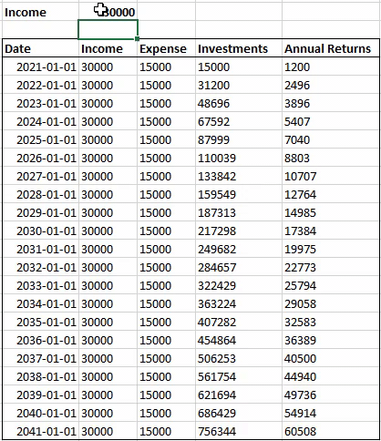

## Anyone Can Retire in 10 Years — Here’s How
 Using Data Science to Explain Financial Freedom

 

 Hello Everyone.
 **Most of us spend our lives working.**
 Some enjoy it, some do not.

 We work hard, fall sick, and even burn out from time to time.

 

      Doing what you love is the cornerstone of having abundance in your life.
 
 

 After some time, you feel like you’re in a **rat race**.
 When people around their 80s and 90s get asked about their biggest regrets, it's very seldom about work. Most of the time, it's about family and friends, or something they are passionate about.

 **There is more to life than work.**

 If we had the choice, we’ll probably spend more time on things outside of work — passion, hobbies, family, pets.

 There is a stage in life where we can pursue all the above without worrying about work, and that is retirement.

 **But what is retirement?**

 According to [Investopedia](https://www.investopedia.com/terms/r/retirement.asp), Retirement refers to the time of life when one chooses to **permanently leave the workforce behind**. In financial terms, the person who retires stops receiving actively earned income (excluding social benefits, etc).

 Hence, the first concern is usually how are you going to survive without any income. Well, that’s what **retirement funds** are for, traditionally that is. Your retirement fund has been accumulating ever since you started working, if you started at 20, you probably have more than 40 years worth of saved-up cash.

 **How much do we need to retire?**
 
 That is completely dependent on your lifestyle.
 Simple maths state that if you need to spend **30 thousand a year** to maintain your lifestyle, you will need at least **600 thousand** to last you 20 years after retirement (considering inflation and life expectancy ~ 80 Years Old).

 **When do we retire?**

 The traditional retirement age is **65** in the United States and most other developed countries, many of which have some kind of national pension or benefits system in place to supplement retirees’ incomes. However, you can actually **retire any time you want to**.

 According to Investopedia, **62** is considered early retirement age. That being said, there are countless examples of people who are retiring in their 30s and 40s during these times.

 **How is that even possible?**

 I am a data engineer by profession. By using some Data Science magic, I’m going to show you **how anyone can achieve financial freedom in 10 years, regardless of your income range**.


## 10 Year Retirement Rule
 

 There is this saying that if you invest over **half of your income**, regardless of your income range and considering an 8% per year return on your investments, you will be able to completely sustain yourself in **10 years**.
 We are going to prove that today with **actual data**.

 But before that, let's talk about a few things —


### Investments
 Some might disagree on the 8% per annum interest rate on investments.
 However, data shows that you would average more than 8% return per year if you had invested in any ETFs consistently.

 ETFs (Exchange-Traded Funds) are like mutual funds but are actively traded during the day. Instead of handpicking your own stocks, ETF offers a **pool of stocks you can invest in**. As a result, your risks are significantly lowered and returns are more consistent.

 Here’s a [list](https://firstbridgedata.com/page/list-of-active-etfs) of ETFs listed in the US stock exchange. Do me a favor and randomly pick one, observe the returns over a 5 Year Horizon.

 Even as simple as investing in the S&P 500 will average you more than that, and that’s just investing in the top 500 companies in the US.

 
  
 Hence, invest consistently for the long term and don't worry about it. Your investments will grow with the economy.

### Saving more than half
 How can I save more than half of my income when I’m barely getting by? — You can’t.

 Think of ways to reduce your expenses or increase your income. As a reference, the [U.S. Census Bureau](https://en.wikipedia.org/wiki/U.S._Census_Bureau) lists the annual real **median personal income at $35,977 in 2019**. If you’re bringing in more than that, maybe think about reducing your spending.

 If you’ve been backed up into a corner and still can’t save half of your income, it's alright. **Try doing 30%-40% instead.** It will slightly delay your retirement, but it’s better than nothing.

 With that out of the way, let's move on to the fun stuff.


## Actual Data
 

 Here’s a simulation of a 10 Year Horizon.
 Regardless of the income range, it is observed that if more than half of it is invested every year, with an 8% annual return, the **returns on the 10th Year will exceed yearly expense**.

 This simply means that if we **maintain our expenses over time** and invest consistently. In the 10th Year, our expenses will be covered by the returns from our investment, and we get to keep all the money we earned moving forward.

 This is also called **living off your investments**.
 As long as we only spend the interest of our investments, we technically have **unlimited money**. This is also referred to as the 4% rule.

 

 Let’s expand the timeframe to a 20 Year Horizon.
 If we continue on the same track, it is observed that by the 20th Year, **our investments’ return will exceed 4 times our yearly expense**. This is not considering any pay raise, promotions, or bonuses you might be getting.

 This, my friends, is the power of compounding interest.

 If you always wanted to splurge a little, always remember that a dollar today is worth almost 3 dollars 20 years later. It's called **delayed gratification**.

 Still not convinced? Here’s some Data Science Magic.


## Data Visualization
 

 Here’s an interactive visualization from the Actual Data we had.It can be observed that while our yearly expenses stay constant, our **Annual Returns grow exponentially over time**.

 Annual Returns start to exceed Yearly Expenses in the 10th Year. As mentioned previously, in the 20th Year, our returns will exceed 4 times our yearly expenses. This applies to any income range as shown above.

 Here’s the code for the visualization if you want to knock yourself out. 

 
 
 [expense_vs_returns.py](https://gist.githubusercontent.com/nickefy/9adfe7087224392b29dd5af6d58e61c6/raw/77260a1d736fcf8040c3659f34af146274fcfc9a/expense_vs_returns.py)
```python
 import pandas as pd
 
 # Standard plotly imports
 import plotly as py
 import plotly.tools as tls
 from plotly.offline import iplot, init_notebook_mode
 import plotly.graph_objs as go
 import cufflinks

 # Using plotly + cufflinks in offline mode
 init_notebook_mode(connected=True)
 cufflinks.go_offline(connected=True)

 df = pd.read_csv("ActualData.csv")
 df2 = pd.read_csv("ActualData2.csv")
 df3 = pd.read_csv("ActualData3.csv")


 data= [
 go.Scatter(x=df['Date'], y=df['Expense'],
                mode='lines',
                name='Yearly Expense'),
 go.Scatter(x=df['Date'], y=df2['Expense'],
                mode='lines',
                name='Yearly Expense'),
 go.Scatter(x=df['Date'], y=df3['Expense'],
                mode='lines',
                name='Yearly Expense'),
 go.Scatter(x=df['Date'], y=df['Annual Returns'],
                    mode='lines+markers',
                    name='Annual Returns'),
 go.Scatter(x=df['Date'], y=df2['Annual Returns'],
                    mode='lines+markers',
                    name='Annual Returns'),
 go.Scatter(x=df['Date'], y=df3['Annual Returns'],
                    mode='lines+markers',
                    name='Annual Returns')]

 #defining list_updatemenus
 list_updatemenus = [{'label': '50k Income',
   'method': 'update',
   'args': [{'visible': [True, False, False, True, False, False]}, {'title': 'Yearly Expense vs Annual Returns over 10 Years'}]},
  {'label': '30k Income',
   'method': 'update',
   'args': [{'visible': [False, True, False, False, True, False]}, {'title': 'Yearly Expense vs Annual Returns over 10 Years'}]},
   {'label': '100k Income',
   'method': 'update',
   'args': [{'visible': [False, False, True, False, False, True]}, {'title': 'Yearly Expense vs Annual Returns over 10 Years'}]}]

 #defining layout
 layout=go.Layout(title='Yearly Expense vs Annual Returns over 10 Years',updatemenus=list([dict(buttons= list_updatemenus)]))
 #defining figure and plotting
 fig = go.Figure(data,layout)
 iplot(fig)
```


## What does this mean for me?
 

 Now that you understand, you’re asking for some actual actionable plans. Here are a few.

### Be Frugal
 Try to live below your means. Reduce your expenses to a minimum. If you’re driving around an expensive car during your early years, you will heavily delay financial freedom.

### Invest Consistently
 Don’t lose money. Invest in an index fund and hold it for the long term. Understand that markets fluctuate and you might see some negative values during the start. The markets always go up in the long term.

 Fact: [Data](https://www.thebalance.com/rolling-index-returns-4061795) shows that the S&P 500 has never produced a negative return over a 15 year time period.


### Work Hard
 If you are making below average wage, try to look for a second job or a promotion. There are many ways to make extra cash, and most of the time it’s simply trading your time for money.

### Stay Healthy
 This applies to your physical and mental health. The last thing you want is to fall sick and be unable to enjoy your accumulated wealth after retirement.

 Get enough sleep, eat well. Don’t lose track of the end goal.Treat yourself to something nice.

 Be frugal, not pathetic. You can still have that Starbucks coffee every once in a while.
