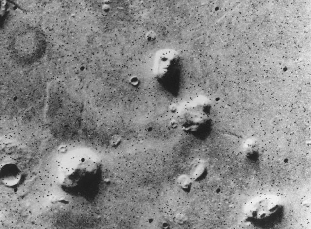


This is on the same level as the guy that claims the title of Solar system president and sells "real estate" for rights to the Moon, and planets...

Sad part is that this stuff is *actually making money*...

Who wants to name landmarks on Titan? I'll sell the rights to put your name on a map for any region of our Universe!


You may never set foot on Mars, but your words and pictures could land there later this year.

The space-funding company Uwingu launched its "Beam Me to Mars" project today (Aug. 19), inviting people to contribute, for a fee, to a "digital shout-out" that will send messages from Earth to the Red Planet on Nov. 28 — the 50th anniversary of [Mars exploration](https://www.space.com/12404-mars-explored-landers-rovers-1971.html). (The messages won't be read or recorded by anyone on Mars, of course, but they'll be archived here on Earth, and participants will receive a commemorative certificate.)

The first successful Mars mission, NASA's Mariner 4, launched on Nov. 28, 1964. "Beam Me to Mars" celebrates that landmark effort in a new and original way, Uwingu representatives said. [[The Boldest Mars Missions in History](https://www.space.com/16851-most-audacious-mars-missions-ever.html)]

Other goals for Beam Me to Mars include raising lots of money to fund space science, exploration and education (Uwingu's stated chief purpose) and letting policymakers know how important space exploration is to their constituents, Stern added.

"We want to make an impression on leaders," he told Space.com. "The more messages, the bigger impression it makes. If this thing goes viral, and it becomes the thing to do, then it'll make a huge impression."

All messages submitted for Beam Me to Mars will also be hand-delivered to Congress, NASA and the United Nations, Stern said. (Disclaimer: Space.com managing editor Tariq Malik has provided a 1,000-character message to the Beam Me to Mars database.)

You can beam your name — or someone else's — to the Red Planet for $4.95. For $9.95, you can contribute a name and a 100-character message, while $19.95 gets you a 1,000-character note instead of the shorter one. If you want to splurge, $99 gets you a name, a long message and an image of your choosing. The messages will be searchable for free on Uwingu's website, company representatives said.

Submissions must be made via [uwingu.com](http://www.uwingu.com) by Nov. 5. Uwingu (whose name means "sky" in Swahili) and its transmission partner, communications provider Universal Space Network, will use radio telescopes to beam the messages at Mars on Nov. 28 at the rate of 1 million bits per second.

The transmission, traveling at the speed of light, will reach the Red Planet on that day in just 15 minutes, Uwingu representatives said. For comparison, it took Mariner 4 more than seven months to get to [Mars](https://www.space.com/47-mars-the-red-planet-fourth-planet-from-the-sun.html) a half-century ago. The probe didn't touch down, but its historic flyby in July 1965 provided the first up-close look at the surface of another planet from deep space.

This is not the first Mars effort for Uwingu, which was founded in 2012. In February, the company launched its "People's Map of Mars," asking the public to name Red Planet landmarks for a small fee. To date, people have named more than 12,000 Mars craters, and Uwingu has set aside more than $100,000 for grants, company representatives said.