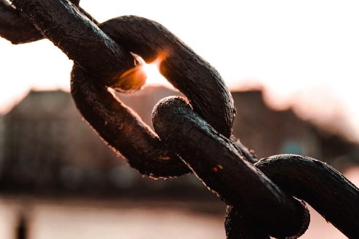

 *Hint: It’s about ownership of the fruit of your labor*

 


The worker becomes all the poorer the more wealth he produces, the more his production increases in power and size. The worker becomes an ever cheaper commodity the more commodities he creates. The devaluation of the world of men is in direct proportion to the increasing value of the world of things.


 This is not just academic theory or communist hogwash. Any manager knows this: *Profit is the difference between the total revenue generated by the firm and the cost of operation.*

 The majority of operational costs come from wages and salaries. It is hence in the interest of companies to control costs by minimizing wages.

 *In other words, profit is just value that is not captured by workers, but by shareholders.*

 Marx calls this the exploitation of “surplus value.” Exploitation is not only the norm &mdash; it is the only way the system can operate.

 How is that possible? And what does this mean for the average wage worker &mdash; *you*?

 Well, I’ve spent a long, long time thinking about this problem, and I think I finally have some answers.

## Workers Are Getting the Short End of the Stick
 Marx explains it clearly &mdash; this happens because workers do not own the fruit of their labor. In renting out their labor they have given up power to the capitalists.

 The capitalists own the means of production &mdash; machines, factories, and other infrastructure.

 And because the capitalists are the owners of the “means of production,” and labor is merely an input, **the products that a worker helps to produce are the property of the company**, not the worker.

 That’s not all. Marx tells us in his typical high-handed philosophical highfalutin the emotional damage this does to people:
 

First, the fact that labor is external to the worker, i.e., it does not belong to his intrinsic nature; that in his work, therefore, he does not affirm himself but denies himself, does not feel content but unhappy, does not develop freely his physical and mental energy but mortifies his body and ruins his mind.


 *Modern translation*: **Work is toxic.**
 

The worker therefore only feels himself outside his work, and in his work feels outside himself. He feels at home when he is not working, and when he is working he does not feel at home. His labor is therefore not voluntary, but coerced; it is forced labor.


 *Modern translation*: **Work sucks.**

 Intellectually, I knew about this problem. For a long time, [I struggled to find a way out of this conundrum](https://medium.com/@alvintanwx/but-i-being-poor-have-only-my-labor-5510e1bb6c85).

 I kept asking myself and Google the following questions:
 * “How to escape 9–5?”
 * “How to escape the corporate world?”

 I think I finally found a way out. And it doesn’t involve becoming a capitalist.

 Turns out, the answer was in communist philosophy all along. I just didn’t see it.

 It’s better. *Become a creator*!

## A Creator Is an Owner
 The biggest advantage that a creator has over a worker is that a creator has no need for means of production like factories and natural resources.

 Unlike a capitalist, you don’t need massive amounts of capital either.

 A creator only needs one thing &mdash; *creativity*.

 **The creator and the means of production are one and the same.**

 Sure, a creator needs to eat and drink, and sleep. He or she also needs some kind of device to write, photograph, record, edit, and an Internet connection to upload. But millions of dollars in hard infrastructure is not necessary.

 The advances in computing technology have made computers cheap and accessible. According to Statistica, [more than 80% of the global population today has a smartphone](https://www.bankmycell.com/blog/how-many-phones-are-in-the-world).

As long as you have some kind of computer and internet connection, you can be one. There may be banking or institutional problems to address, but generally, almost anyone can be a creator.

The output of the creator comes only from the whims and fancies of his or her mind.

Since the output of the creator is of a purely intellectual and artistic nature, the creator is vested with powers. Every work produced by a creator is given a magical status within the framework of modern intellectual property law &mdash; *copyright*.

Copyright is so powerful, I wonder why I only started investigating it seriously now.

## The Power of Copyright
 I have a hunch that many people don’t understand copyright.

 Understanding how it works is so critical I’m going to cite directly from the [U.S. Copyright Office](https://www.copyright.gov/what-is-copyright/):


Copyright is a type of intellectual property that protects original works of authorship as soon as an author fixes the work in a tangible form of expression.


 Everything that bears the mark of authorship (including photographs, articles, stories, essays, and books) is subject to [copyright](https://www.wipo.int/copyright/en/). This includes:

 * written works
 * software
 * films and music
 * visual works including paintings and photographs and illustrations
 * even architectural drawings and technical drawings
 * and many other types of works

 Anyone who creates an original piece of work is automatically granted copyright owner status.

 This seems like legalese, but please bear with me.

## The Difference Between Copyright and Licensing
 When you engage a photographer to shoot photos for you, technically, the *photos do not belong to you*.

 The photographer is the sole copyright holder of the photographs, although he/she can let you use the photographs for personal and non-commercial use as part of the original agreement.

 **This is called licensing usage.**

 In advertising, companies have to pay a *usage fee* to photographers for the usage of their work in advertisements. These can be on a yearly basis, or a one-off fee. It all depends on the contract.

 In either case, the creator of the content is now the owner.

 *You can be doing the exact same thing, but your output is given a completely different status when you are working as an independent creator.*

 Don’t be confused.

 To give a more concrete example, every single article or story I’ve written on this platform could be “rented” out to another magazine to make additional money.

 I own the copyright to all the stories and articles I have written. I can reproduce them as I wish. And I can change them in any way I wish.

 I, and only I alone have the right to be identified as the creator of those works.

 If I am a photographer, I can make money by selling usage licenses of the same photograph to multiple buyers. That’s what photographers do when selling stock photos.

 *Copyright multiplies your earning power.*

## Limited Downside, Unlimited Upside
 In contrast to receiving a monthly wage, I subject myself to *risk* &mdash; sometimes my content sells, and sometimes it doesn’t.

 **But when it does sell, there is no limit to the upside potential.**

 In trading, this is referred to as optionality &mdash; you have a pre-determined maximum loss (your time), while the upside is potentially unlimited. If your content goes viral, you get disproportionately rewarded.

 Just thinking about optionality and the power of copyright makes me incredibly excited.

 The opportunities are limitless for creators.


**Disclaimer**: *This is not financial advice, the information in this article is for educational purposes only.* Please consult an intellectual property legal professional to understand more about copyright law.

