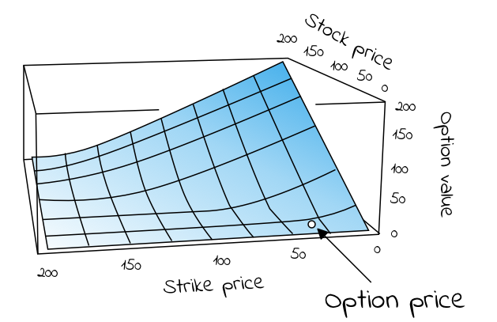
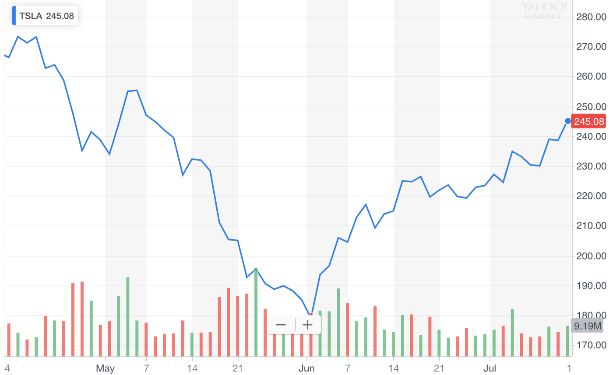

## Introduction to the most famous equation in finance.

The Black–Scholes model is a mathematical model simulating the dynamics of a financial market containing derivative financial instruments. Since its introduction in 1973 and refinement in the 1970s and 80s, the model has become the de-facto standard for estimating the price of stock options. The key idea behind the model is to hedge the options in an investment portfolio by buying and selling the underlying asset (such as a stock) in just the right way and as a consequence, eliminate risk. The method has later become known within finance as “continuously revised delta hedging”, and been adopted by many of the world’s foremost investment banks and hedge funds.

The goal of this article is to explain the Black-Scholes equation’s mathematical foundation, underlying assumptions and implications.

Happy reading!

## The Black-Scholes model

 The **Black–Scholes model** is a mathematical model simulating the dynamics of a financial market containing derivative financial instruments such as [options](https://en.wikipedia.org/wiki/Derivative_(finance)#Options), [futures](https://en.wikipedia.org/wiki/Derivative_(finance)#Futures), [forwards](https://en.wikipedia.org/wiki/Derivative_(finance)#Forwards) and [swaps](https://en.wikipedia.org/wiki/Derivative_(finance)#Swaps). The key property of the model is that it shows that an option has a unique price regardless of the risk of the underlying security and its expected return. The model is based on a partial differential equation (PDE), the so-called [Black-Scholes equation](https://en.wikipedia.org/wiki/Black%E2%80%93Scholes_equation), from which one can deduce the [Black-Scholes formula](https://en.wikipedia.org/wiki/Black%E2%80%93Scholes_model#Black%E2%80%93Scholes_formula), which gives a theoretical estimate of the correct price of European stock options.

### Assumptions

 The original Black-Scholes model is based on a core assumption that the market consists of at least one risky asset (such as a stock) and one (essentially) risk-free asset, such as a money market fund, cash or a government bond. In addition, it assumes three properties of the two assets, and four of the market itself:

   * Assumptions about the assets in the market are: 
    1. The rate of return on the risk-free asset is constant (thus effectively behaves as an interest rate); 
    2. The instantaneous log return of the risky asset’s price is assumed to behave as an infinitesimal random walk with constant drift and volatility, more precisely, according to [geometric Brownian motion](https://en.wikipedia.org/wiki/Geometric_Brownian_motion). 
    3. The risky asset does not pay a dividend.

   * Assumptions about the market itself are: 
    1. There are no arbitrage (risk-free profit) opportunities; 
    2. It is possible to borrow and lend any amount of cash at the same rate as the interest rate of the risk-free asset; 
    3. It is possible to buy and sell any amount of the stock (including short selling); and 
    4. There are no transaction costs in the market (i.e. no commission for buying or selling securities or derivative instruments).

 In subsequent extensions of the original model, these assumptions have been revised to adjust for dynamic interest rates for the risk-free asset (Merton, 1976), transaction costs for buying and selling (Ingersoll, 1976) and dividend payouts for the risky asset (Whaley, 1981). In this essay, assume we are working with the original model, unless stated otherwise.

## The Black-Scholes equation

 
 

 The Black-Scholes equation is the [partial differential equation](https://en.wikipedia.org/wiki/Partial_differential_equation) (PDE) that governs the price evolution of European stock options in financial markets operating according to the dynamics of the Black-Scholes (sometimes Black-Scholes-Merton) model. The equation is:

### Equation 1. The Black-Scholes partial differential equation describing the price of a European call or put option over time

 $$
   \frac{\partial V}{\partial t} + \frac{1}{2}\sigma^2 S^2 \frac{\partial^2 V}{\partial S^2} +rS  \frac{\partial V}{\partial S} - rV = 0
 $$

 Where V is the price of the option (as a function of two variables: the stock price S and time t), r is the risk-free interest rate (think interest rate akin to that which you would receive from a money-market fund, German government debt or similar “safe” debt securities) and σ is the volatility of the log returns of the underlying security (for the purposes of this article, we are considering stocks). A neat derivation of the equation is [available on Wikipedia](https://en.wikipedia.org/wiki/Black%E2%80%93Scholes_equation#Derivation), based on [John C. Hull](https://en.wikipedia.org/wiki/John_C._Hull)’s “Option, Futures and Other Derivatives” (1989).

 If we rewrite the equation to the following form

### Equation 2. Rewritten form of the Black-Scholes equation
 $$
   \frac{\partial V}{\partial t} + \frac{1}{2}\sigma^2 S^2 \frac{\partial^2 V}{\partial S^2} = rV - rS\frac{\partial V}{\partial S}
 $$

 Then the left side represents the change in the value/price of the option V due to time t increasing + the convexity of the option’s value relative to the price of the stock. The right hand side represents the risk-free return from a long position in the option and a short position consisting of ∂V/∂S shares of the stock. In terms of [the greeks](https://en.wikipedia.org/wiki/Greeks_%28finance%29):

### Equation 3. Theta (Θ) + Gamma (Γ) = (risk-free rate) x (price of the option) - (risk-free rate) x (price of stock) x Delta (Δ)

 $$
   \Theta + \frac{1}{2}\sigma^2 S^2 \Gamma = rV - rS\Delta
 $$

 The key observation of Black and Scholes (1973) was that the risk-free return of the combined portfolio of stocks and options on the right hand side over any infinitesimal time interval could be expressed as the sum of theta (Θ) and a term incorporating gamma (Γ). The observation is sometimes known as the “risk neutral argument”. This because the value of theta (Θ) is typically negative (because the value of the option decreases as time moves closer to expiration) and the value of gamma (Γ) is typically positive (reflecting the gains the portfolio receives from holding the option). In sum, the losses from theta and the gains from gamma offset one another, resulting in returns at a risk-free rate.

## The Black-Scholes formula
 The Black-Scholes _formula_ is a solution to the Black-Scholes PDE, given the boundary conditions below (eq. 4 and 5). It calculates the price of European put and call options. That is, it calculates the price of contracts for the right (but not obligation) to buy or sell some underlaying asset at a pre-determined price on a pre-determined date in the future. At maturity/expiration (T), the value of such European call (C) and put (P) options are given by, respectively:

### Equation 4 for the value/price of a European call option

 $$
   C_{E,T} = \max(0,S_T - X)
 $$

### Equation 5 for the value/price of a European put option

 $$
   P_{E,T} = \max(0,X - S_T)
 $$

 Black and Scholes showed that the functional form of the analytic solution to the Black-Scholes equation (eq. 1 above) with the boundary conditions given by eq. 4 and 5, for a European call option is:

### Equation 6. The Black-Scholes formula for the value of a call option C for a non-dividend paying stock of price S

 $$
   C_E(S,t) = N(d_1)S - N(d_2)Xe^{-rT}
 $$

 The formula gives the value/price of European call options for a non-dividend-paying stock. The factors going into the formula are S = price of security, T = date of expiration, t = current date, X = exercise price, r = risk-free interest rate and σ = volatility (standard deviation of the underlying asset). The function N(・) represents the cumulative distribution function for a normal ([Gaussian](https://en.wikipedia.org/wiki/Normal_distribution)) distribution and may be thought of as ‘the probability that a random variable is less or equal to its input (i.e. d₁ and d₂) for a normal distribution’. Being a probability, the of value N(・) in other words will always be between 0 ≤ N(・) ≤ 1. The inputs d₁ and d₂ are given by:

### Equation 7

 $$
   d_1 = {\ln(\frac{S}{X}) + (r + \frac{\sigma^2}{2})(T-t) \over \sigma \sqrt{T - t}}
   \hspace{3em}
   d_2 = {\ln(\frac{S}{X}) + (r - \frac{\sigma^2}{2})(T-t) \over \sigma \sqrt{T - t}}
 $$

 Very informally, the two terms in the sum given by the Black-Scholes formula may be thought of as ‘the current price of the stock weighted by the probability that you will exercise your option to buy the stock’ minus ‘the discounted price of exercising the option weighted by the probability that you will exercise the option’, or simply ‘what you are going to get’ minus ‘what you are going to pay’ (Khan, 2013).

 For a European put option (contracts for the right, but not obligation, to sell some underlaying asset at a pre-determined price on a pre-determined date in the future) the equivalent functional form is:

### Equation 9. The Black-Scholes formula for the value of a put option C for a non-dividend paying stock of price S

 $$
   P_E(S,t) = N(-d_2)Xe^{-r(T-t)} - SN(-d_1)
 $$

### Example: Calculating the price of a European call option

 In order to calculate what the price of a European call option should be, we know we need five values required by equation 6 above. They are: 1. The current price of the stock (S), 2. The exercise price of the call option (X), 3. The time to expiration (T - t), 4. The risk-free interest rate (r) and 5. The volatility of the stock, given by the standard deviation of historical log returns (σ).

 

    **Estimating the value of a call option for Tesla (TSLA)**
    
    The first four values we need are easily obtainable. 
    
    Let’s say we are interested in a call option for Tesla’s stock ($TSLA), maturing the day of its Q3 earnings in 2019 , at a price 20% higher than the stock is currently trading. Looking at Tesla’s NASDAQ listing ($TSLA) on [Yahoo Finance](https://finance.yahoo.com/quote/TSLA?p=TSLA&.tsrc=fin-srch) today (July 13th, 2019), we find a stock price of S = $245. Multiplying the current price with 1.2 gives us an exercise price 20% higher than the stock is currently trading , X = $294. Googling, we find that the day of its Q3 earnings call is October 22nd , giving us a time to expiration/maturity of Oct 22nd - July 13th = 101 days. As a proxy for a risk-free interest rate instrument , we’ll use US 10-year government bonds ($USGG10YR), currently paying off 2.12%.

    So, we find S = 245 , X = 294 , T - t = 101 and r = 0.0212. The only missing value is an estimation of the stock’s volatility (σ).

 

 We can estimate any stock’s volatility by observing its historical prices, or, even simpler, by calculating other option prices for the same stock at different maturity/expiration dates (T) and exercise/strike prices (X), if we know they have been set according to a Black-Scholes model. The resulting value, σ, is a number between 0 and 1, representing the market’s implied volatility for the stock. For Tesla, at the time of writing this article, the value averaged at approximately 0.38 for 4–5 different option prices around the same expiry/maturity date. Input into equation 6 above, we find that the call option we’re interested in should be priced somewhere around $7.

#### Implied volatility
 Although it is interesting to understand how options issuers arrive at the price of their call and put options, as investors it’s hard to “disagree” with such prices, per se, and so difficult to turn this knowledge into actionable investment theses.

 We can however get a lot of milage out of the Black-Scholes formula if we instead treat the price of an option (C or P) as a known quantity/independent variable (found by looking at different maturity/expiration dates T and different exercise prices X). This because, if we do, the Black-Scholes functional equation becomes a tool to help us understand _how the market estimates the volatility of a stock_, also known as the [implied volatility](https://en.wikipedia.org/wiki/Implied_volatility) of the option. This is information we can disagree over, and trade against.

 

    **Hypothetical scenario**

    If we for instance look at the chart for the Tesla stock over the last three months (figure 2), we see a rather (for a lack of a better word) volatile journey from hovering around $280 three months ago, to a low of $180 a month and a half ago, to now on its way back up at $245. This makes sense given the volatility we observed from call prices before ($280–$180 = $100, $100/280 = 0.36, vs 0.38). It does not make sense, however, if we think the fluctuation over the past three months was the mere tip of an iceberg, going into a period of more volatility for Tesla, say, due to an upcoming increase in short-selling.

 

 
 
    Let's say we disagree with an options issuer about the implied volatility of stock's performance over the last three months. We think the ride is going to get rockier. How much? Let's say that instead of 40% , we think the next three months will look more like 60%. Input into the functional Black-Scholes formula along with the same values for S , X , r , and T - t , we get a price of nearly twice of what the options issuer wants, at C(S,t) = $14.32. This we can trade on. We could , for instance , buy call options today and wait for volatility to increase or the value of the stock to go up, before selling at a profit.

 

### American options

 Because American options can be exercised at any date prior to expiration (so-called “continuous timeline instruments”), they are much more difficult to deal with that European options (“point in time instruments”). Primarily, since the optimal exercise policy will affect the value of the option, this needs to be taken into account when solving the Black-Scholes partial differential equation. There are no known “closed form” solutions for American options according to the Black-Scholes equation. There are, though, some special cases:

 * For American call options on underlying assets that **do not** pay dividend (or other payouts), the American call option price is the same as for European call options. This because the optimal exercise policy in this case is to not exercise the option.

 * For American call options on underlying assets that **do** pay _one known dividend_ in its lifetime, it may be optimal to exercise the option early. In such cases the option may be optimally exercised just before the stock goes ex-dividend, according to a solution given in closed-form by the so-called Roll-Geske-Whaley method (Roll, 1977; Geske, 1979; 1981; Whaley, 1981):

 First, check if it is optimal to exercise the option early, by investigating whether the following inequality is fulfilled:

### Equation 10.

 $$
   D_1 \le X(1 - e^{-r(T-t_1)})
 $$

 For S = stock price, X = exercise price, D₁ = dividend paid, t = current date, t₁ = date of dividend payment, T = expiration date of option.

 If the inequality **is not fulfilled**, early exercise it not optimal. If C(・) is the regular Black-Scholes formula for European call options on non-dividend-paying stock (eq x), the value of the American call option is then given by a version of the same equation where the stock price (S) is discounted:

### Equation 11. The value of an American call option when inequality (eq.8) is not fulfilled

 $$
   C_A (S - e^{-r(t_1-t)}D_1 , T - t)
 $$

 If the inequality is fulfilled, early exercise is optimal and the value of the American call option is given by the following, awful, mess of an equation (I tried to break it up by each term to make it more readable):

### Equation 12. The value of an American call option when inequality (eq. 10) is fulfilled

 $$
   \begin{align}
   C_A = \\ 
   (S - e^{-r(t_1-t)}D_1 \times \\ 
   (N(b_1) + N(a_1 , - b_1, \rho)) + \\
   Xe^{-r(T-t_1)}N(a_2 , - b_2, \rho)) - \\
   (X - D_1)e^{-r(t_1-t)}N(b_2)
   \end{align}
 $$

 Whereas before S = price of stock, T = date of expiration of option, X = exercise price and r = risk-free interest rate, σ = volatility (standard deviation of the log of the historical returns of the stock), and D₁ is the dividend payout. In addition, ρ is given by:

### Equation 13.

 $$
   \rho = - \sqrt{ {t_1 - t} \over {T - t}}
 $$

 a₁, a₂ by:

### Equation 14.

 $$
   a_1 = \frac{\ln\Bigl({  {S - D_1 e^{-r(T-t_1)}} \over X}\Bigr) + (r + \frac{1}{2}\sigma^2) (T - t) }  {\sigma \sqrt{T - t}}
 $$

### Equation 15.

 $$
   a_2  = a_1 - {\sigma \sqrt{T - t}}
 $$

 and b₁, b₂ by:

### Equation 16.

 $$
   a_1 = \frac{\ln\Bigl({  {S - D_1 e^{-r(t_1 - t)}} \over S}\Bigr) + (r + \frac{1}{2}\sigma^2) (t_1 - t) }  {\sigma \sqrt{t_1 - t}}
 $$

### Equation 17.

 $$
   b_2  = b_1 - {\sigma \sqrt{T - t}}
 $$

## Limitations

 It should go without saying that Black-Scholes model is precisely that, a theoretical model that tries to _estimate_ how a market behaves, given the assumptions stated above and the inherent limitations of our own numerical estimations of risk-free interest rates (r) and future volatility (σ). It should here be highlighted that not all the assumptions of (especially the original model) are in fact empirically valid. For instance, significant limitations arise from:

  * The underestimation of extreme moves in the stock, yielding [tail risk](https://en.wikipedia.org/wiki/Tail_risk)
  * The assumption of instant, cost-less trading, yielding [liquidity risk](https://en.wikipedia.org/wiki/Liquidity_risk)
  * The assumption of a stationary process, yielding [volatility risk](https://en.wikipedia.org/wiki/Volatility_risk)
  * The assumption of continuous time and trading, yielding [gap risk](https://www.investopedia.com/terms/g/gaprisk.asp)

 These should be accounted for in any and all investment strategies, for instance by hedging with out-of-the-money options, trading on multiple exchanges, hedging with volatility hedging and Gamma hedging, respectively.

## Background

 As briefly mentioned it was [Fischer Black](https://en.wikipedia.org/wiki/Fischer_Black) and [Myron Scholes](https://en.wikipedia.org/wiki/Myron_Scholes) who in 1973 showed that dynamically revising a portfolio according to certain rules removes the expected return of the underlying security (Black & Scholes, 1973). Their model built on previously established works by [Bachelier](https://en.wikipedia.org/wiki/Louis_Bachelier), [Samuelson](https://medium.com/cantors-paradise/brownian-motion-in-financial-markets-ea5f02204b14#8df3) and others. Robert C. Merton was the first to publish a paper expanding on the understanding of the model and who coined the term “Black-Scholes options pricing model”. Scholes and Merton was awarded the 1997 Nobel Memorial Prize in Economic Sciences for their discovery of the method of divorcing stock options from the risk of their underlying securities. As Fischer Black passed away in 1995, he would not be eligible to receive the award, but was acknowledged as a contributor by the Nobel Academy.

## Disclaimer

 I am not a mathematical economist, nor is any part of this or any article I publish meant as financial advice. For those interested in reading more about options trading, I especially recommend the now famous book [The Big Short](https://www.amazon.com/gp/product/0393338827/* by Michael Lewis and perhaps also my own essays on “[Brownian Motion in Financial Markets](https://medium.com/cantors-paradise/brownian-motion-in-financial-markets-ea5f02204b14#8df3)” and “[Event-driven investments, inflection points, and how I made 32x my money in two weeks](https://medium.com/@JorgenVeisdal/event-driven-investments-inflection-points-and-how-i-made-32x-my-money-in-two-weeks-81fa67995d1b)”.

 A good, free, Black-Scholes calculator is [available on WolframAlpha](https://www.wolframalpha.com/input/?i=black-scholes+equation).

 This essay is part of a series of stories on math-related topics, published in [Cantor’s Paradise](https://medium.com/cantors-paradise), a weekly Medium publication. Thank you for reading!

