 *Everyone is a brand. Yes, that means you!*

 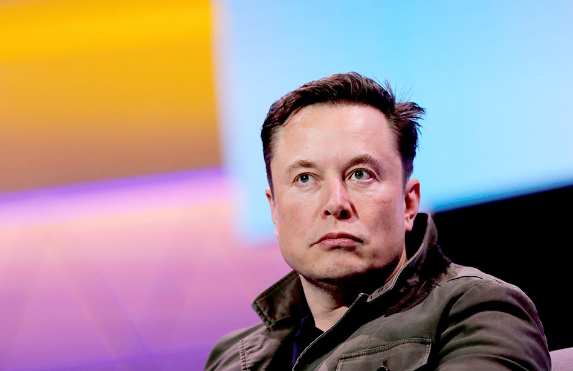

 I wanted to be a billionaire.

 So I did what everyone in Silicon Valley does — start a startup. Then this happened:

 * I quit my job
 * I spent 6 months building a product
 * I launched it
 * I got *ZERO* customers

 Suddenly I was running out of cash, and I had no clue what went wrong.

 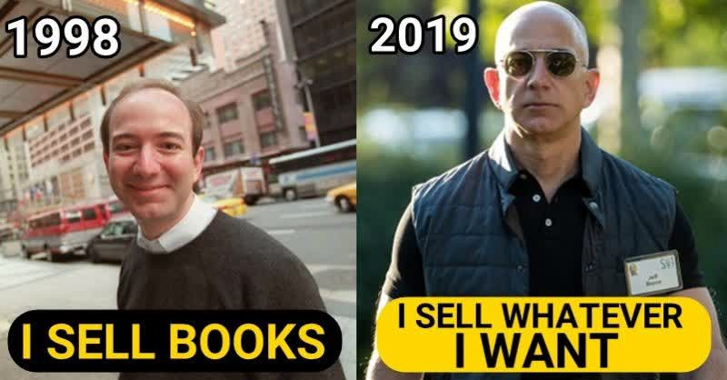

 Looking back, I know my mistake. I focused too much on building a product, and not enough time on the distribution channel.

 The channel is how you will drive traffic to your business — *e.g.* your YouTube channel, Instagram page, or blog.

 I now believe that people who want to work for themselves should NOT start by building a product. **Start by building a distribution channel instead.**

## Why Channels Matter More Than Products
 The number one reason why I believe in a channel-first strategy rather than a product-first one is because:



You’re more likely to fail from the lack of a distribution channel than from an inability to build a product.



 Here are 3 reasons why the channel matters more than the product.

### A Better Product Alone Won’t Win
 Product is no longer a differentiator. Any Google engineer can copy your website, but they can’t copy your channel. So a distribution channel is a business moat in itself.

 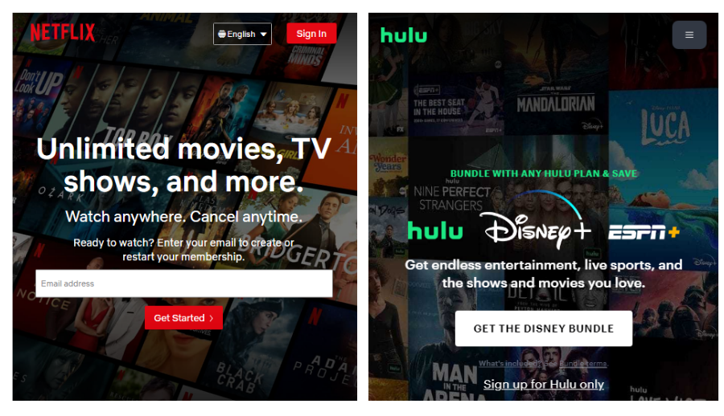

### Reusing Channels for Other Products
 Most products fail. But you can always reuse a channel to sell something else later.

 This is what Beyoncé does. If a product of hers flops, she can always change the link in her bio to promote another product.

 In fact, she recently did this when she changed her bio to promote her clothing line instead of her website.

 

### Channels Take Longer to Build Than Products
 It takes time to build a channel — you don’t get to rank one on Google overnight. So you need to start building this ASAP.
 
 For example, if you want to build a software business and your growth will mostly come from content marketing, don’t start by building the software. Start by pumping out articles on your blog.

 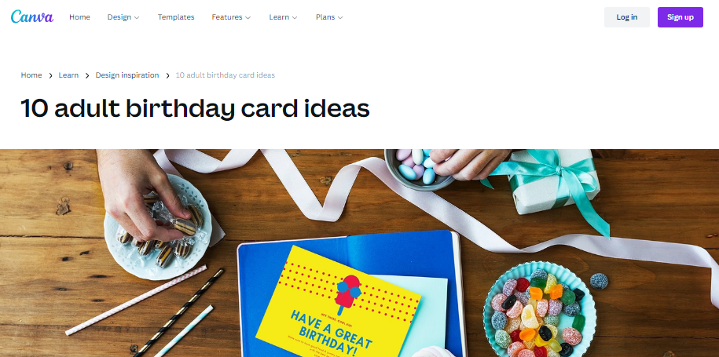

 Your readers will eventually see the product you sell. You can convert those repeat readers to paid customers later.

## The Best Distribution Channel is Your Brand
 It’s clear that the channel matters more than the product. So **if you want to quit your job and start a startup, you should start by building your brand first.** *Even better, start building your brand before you quit!* This is because:



Your brand is a distribution channel in itself.



 If you have tens of thousands of followers, it’s guaranteed that you can monetize later. Focusing on your brand has several other benefits:

 * Business Moat — No one has a better version of you than you. So no one will ever be able to copy your business.
 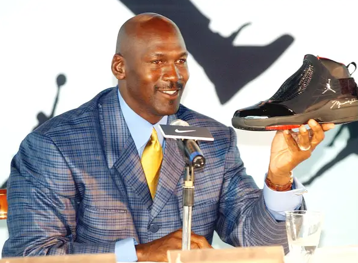

 * Faster launch time — there’s no code to write if you’re building a brand because the product already exists — it’s you!
 * Expertise — You’re already an expert in your domain, so you can produce content around your advice immediately.

## How to Build Your Brand
 Here are 3 questions to consider when building your brand:
 1. What do people ask you for advice on?
 2. What can you talk endlessly about?
 3. What are you best at: pictures, videos, writing, or talking?

 The advice that people ask you for is the world telling you what content to make.

 How you got your job? Is graduate school worth it? And advice for your younger self? These are all questions people ask. Each of these can be a separate brand.

 What you can talk about endlessly means you’ll never run out of content on this subject.

 And what you are good at is your future channel.
 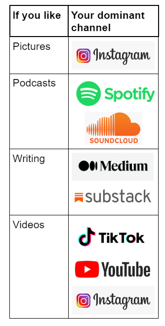

 Combine these three things, and you have a brand. 
 
### Some examples
 If you’re an engineer at a top tech company, you love giving career advice, and you love videos, you can make a YouTube channel helping people break into tech.

 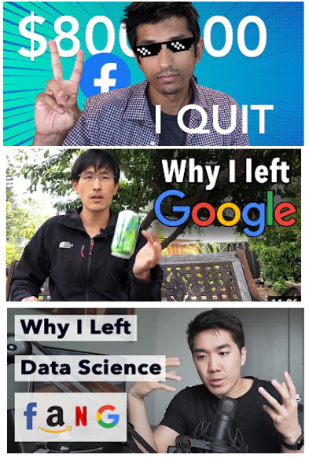

 Let’s say you are passionate about engineering, but you prefer talking. Then you can create the same content, but with a podcast. One Netflix manager did this with his “[Front End Happy Hour Podcast](https://www.frontendhappyhour.com).”

 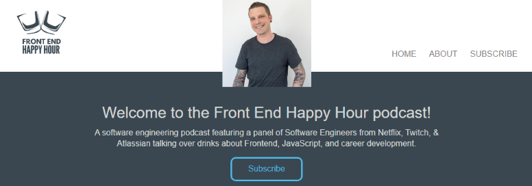

 Or if you prefer writing, then you can [publish on Medium](https://medium.com/@_michaellin) or [Substack](https://michaellin.substack.com) like me.

 In the above examples, the same product combined with three different channels creates three different businesses.

 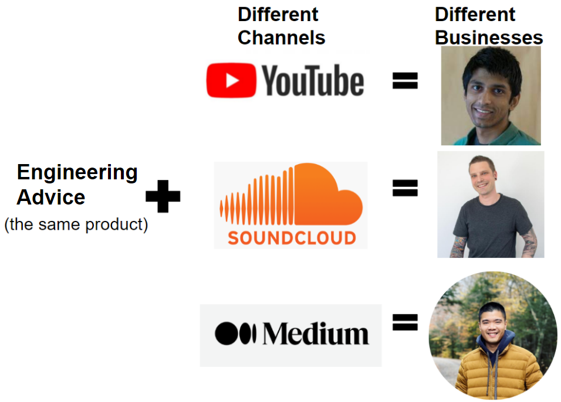

 You can mix and match any channel with any product, and you’ve got a new business. The opportunities for your brand are endless.

## How to Monetize Later
 As you start off, **your number ONE goal is to get more followers**. To do this, you should focus solely on providing **value for free** to your audience. It’s not about you! It’s about teaching others.

 Don’t monetize until you reach 10–20k followers on any one platform. This is because when you monetize, only a small fraction of your followers might convert.



Making a few hundred dollars now is nothing compared to the thousands you will make when your audience is bigger.



 By waiting to monetize, your build more trust with your target audience. As they trust you, they will recommend you to their friends. Word-of-mouth marketing is not just "low-tech" but very effective. Otherwise you risk kneecapping yourself as everyone will see that you are "only in it for the money" and not the community. 

 Substack for example only has a 5–10% paid conversion for newsletters. But if you have 10k followers, and 10% convert to paid for $10/each per month, you have a very livable $10k/month salary, or $120k/year annualized. Not bad for your first business!

 Two examples of how people monetize channels later include:
 * Making money from the content directly via ads, paywalls, or sponsorships. Twitch, OnlyFans and (*paid*) Substack newsletters are three examples of channels where you can directly monetize your content.
 * Keeping the channel free, and selling other paid products instead. This includes selling merchandise, consulting, courses, or your future startup’s product. Dave Ramsey is an expert at this.

 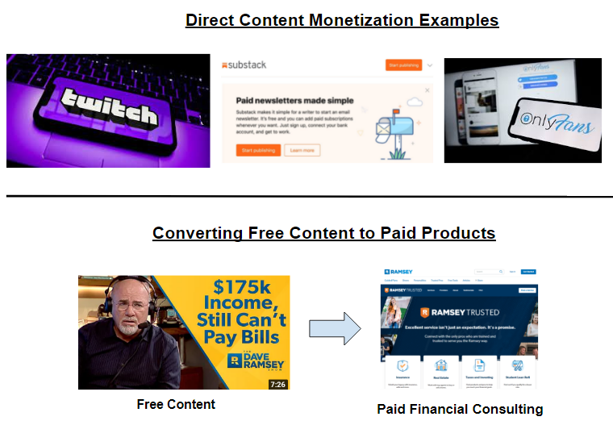

 Over time, you can combine these ideas to layer your business with multiple streams of income.

 Chess Grandmaster Eric Hansen did this with his Twitch stream. Look how he used his expertise (chess) and combined it with a channel (Twitch) to create a brand (ChessBrah).

 Then he layered it with several income streams by selling merchandise, Twitch subscriptions, and sponsorships.
 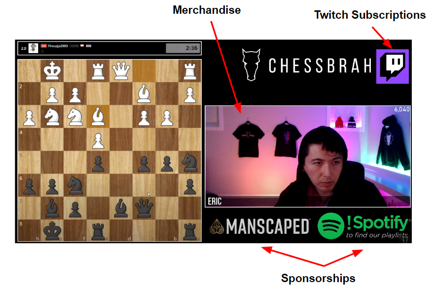
 

## How to Start Building Your Brand Today
 If you want to start a business, you need to start building a channel now.



My homework for you is to start by posting one piece of content on a platform of your choice by the end of next week.



 Your first piece of content need not be perfect. Your first YouTube video could just be you talking into your phone for a minute on “3 Quick Tips for How to Do ___ .” Another idea is “What I Wish I Knew Before I ___ .”

 Launch quickly. Don’t spend more than a day making your first piece of content. Your first try won’t be your best, but that’s OK.



Your goal is to do whatever it takes to get to 1,000 organic followers on any platform of your choice.



 And if you get to 10k followers, it’s less risky to go all-in on your business since you have a channel to work with already.

 Go out, let the world hear your message, and get creating! Feel free to DM me your first piece of content — I’d love to see it!
