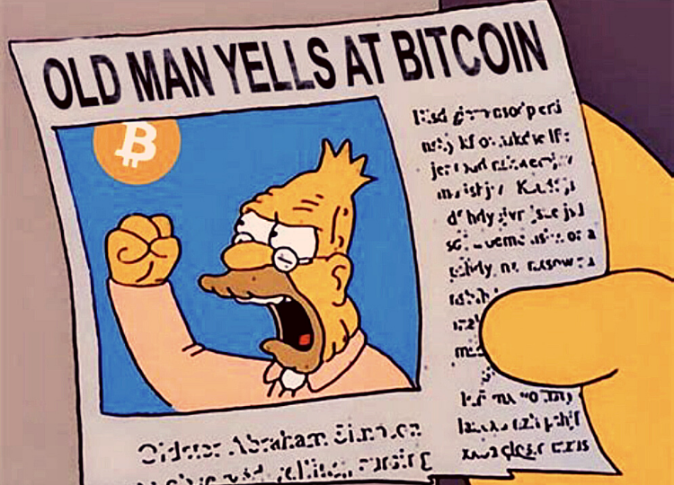
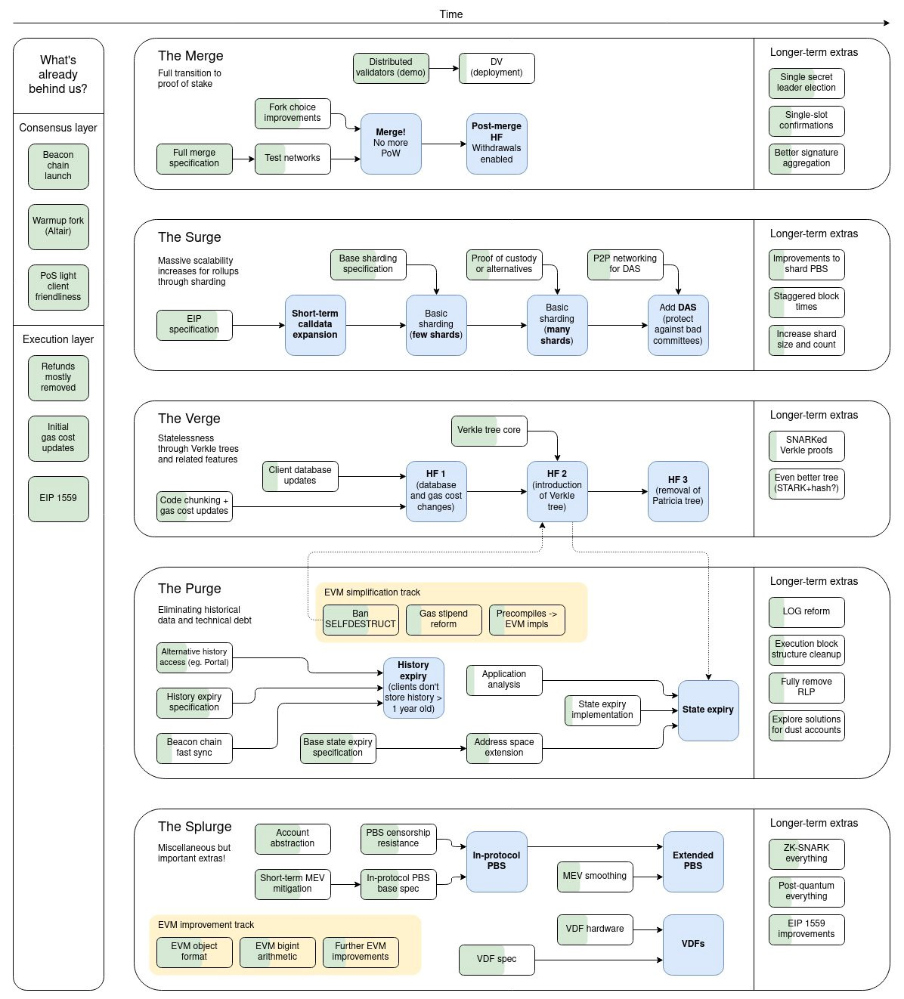

## Now That Crypto is Objectively Dead, This is the Next Big Thing

 In 4 years, bitcoin will be a traumatic memory

 Crypto is [objectively](https://medium.com/yardcouch-com/now-that-crypto-is-dead-whats-the-next-big-thing-b71630da9867) dead.

 It had a good run but the huge bubble just popped.

 We lasted over 10 years but Bitcoin and Ethereum still haven’t contributed anything of value to the world — or so the bears like [Mr. Whale](https://twitter.com/CryptoWhale?ref_src=twsrc%5Egoogle%7Ctwcamp%5Eserp%7Ctwgr%5Eauthor) and Peter Schiff keep saying.

 The honest truth is all of this has been said countless times.

 Crypto isn’t going anywhere. It is the future. The future of more than just finance. We (myself included) are just a bunch of impatient assholes, and not even rightfully so. Crypto moved insanely fast. 10 years is nothing.

 Here are all the reasons the crypto critics are telling you to sell right now, and why you shouldn’t listen to any of them.

## Bitcoin is the AOL of the cryptocurrency markets

 Bitcoin is old, Boomer-tier obsolete tech from the last century.

 Bitcoin’s only value is the first-mover advantage. It’s been outdated since 2013 when Ethereum dropped its white paper like Eminem dropping a sick diss track.

 Nope. You’ve got it all wrong.

 Bitcoin’s technology isn’t lightning-fast, or as extensive as Etherum or Solana, but this is by design. Bitcoin is extra conservative on purpose. Security and decentralization are the number one priorities for Bitcoin, not tech.

 BTC is Fort Knox for your purchasing power. It’s slowly becoming the ultimate method to preserve your wealth.

 

 If you are too lazy to research how the current banking system is screwing wealthy people, as well as broke people, here’s exactly why Bitcoin’s simplicity would be attractive to investors:

 1) Cash-rich people want ROI, not NIRP.
 2) There’s not enough BTC for every millionaire on the planet to own one, in other words, the value, almost predictably, will go up.

 [NIRP](https://www.investopedia.com/terms/n/negative-interest-rate-policy-nirp.asp) is when the Fed pays you to borrow money in order to stimulate the economy. Ostensibly this helps investors out but ultimately it doesn’t solve the problem of preserving your wealth.

 If inflation is still on the rise or the [supply chain is broken](https://medium.com/yardcouch-com/welcome-to-2030-i-own-nothing-have-no-privacy-and-life-has-never-been-better-b15eca64b694) your purchasing power still burns to ash. The Fed cannot preserve your wealth as Bitcoin does, it can only try to set parameters to do so.

 Crypto is less of an invention and more of a discovery. The genie is out of the bottle. It got out in 2009 and it’s not going back in.

 
## Crypto is Monopoly money

 What exactly is the point of crypto apart from being a Ponzi scheme for millennials?

 In reality, Crypto is a bubble on top of a bubble, in the sense that the Fed’s money printing — which was used to save the economy’— is pushing the [markets to new heights](https://medium.com/yardcouch-com/hyperinflation-is-now-here-so-spend-your-money-as-soon-as-you-earn-it-ef1b8f99e586). Now that money printing is grinding to a halt crypto is doomed.

 Wrong again.

 Crypto is the type of money most suitable for the internet.

 The reason that crypto is better than fiat is that fiat money is factually guaranteed to lose its value every single year. It’s for suckers. All it takes is one generation smart enough to realize this to change everything.

 This is exactly what’s happening with Millennials and Gen Z, the two generations who own the most crypto.

 

     [66%](https://www.benzinga.com/markets/cryptocurrency/21/09/22936136/the-biggest-transfer-of-wealth-in-human-history-bitcoin-popularity-among-millennials-and-g) of millennials have more faith in the cryptocurrency market than in the traditional market.
 
 

 If we continue to rely on physical currency, the entire financial system won’t be able to keep up. Crypto is a no-brainer for the tech-minded generations.

## Ethereum 2.0 is a lie

 This is true.

 I’ll do a full article on this soon but Ethereum founder Vitalik Buterin and company have [intentionally scrapped](https://www.youtube.com/watch?v=bg9NyakaE4E&t=339s) the name “Ethereum 2.0.” Now, Eth2.0 is split into five different upgrades.

 Uh-oh.

 These [updates](https://medium.com/@Ground_Zero/gz-daily-the-merge-surge-verge-purge-and-splurge-of-the-ethereum-blockchain-b1a9e95ff28d) are called, “the merge, the surge, the verge, the purge, and the splurge.” And guess what? Vitalik Buterin himself admitted it would take six more years for it all to get finished…

 Now… before you hunt down Vitalik with a bowie knife there is good news.

 Buterin confirmed that Ethereum only needs “the merge” and “the surge” to essentially complete the Ethereum 2.0 vision. These two updates would introduce [proof of stake and sharding](https://medium.com/yardcouch-com/cardano-vs-ethereum-2-0-which-is-the-best-right-now-fb3baf31825c) onto Eth, all of which should come in 2022.

 

 If Ethereum achieves its objectives, it will power a sizeable part of our infrastructure within 10 years. While this doesn’t necessarily mean a high valuation, it would be surprising if it didn’t.

 Think of all of this not as a valuation of the coin itself, but the value of the security of a global network in which the next generation of applications are built on top of.

## Regulations are the real black swan event

 The [real black swan event](https://medium.com/yardcouch-com/the-real-crypto-black-swan-event-is-coming-now-74e1d336657c) in crypto won’t be tether and it won’t be some grand conspiracy theory.

 It’s government regulations. There will be a common effort to regulate crypto.

 Vitalik [Butrein once said](https://www.youtube.com/watch?v=W8a7mf210zg) that governments could severely marginalize cryptocurrency and make it something only fringe communities use.

 

    Governments don’t have the ability to prevent blockchains from existing, but they definitely have the ability to really marginalize it. Like if they ban all exchanges or all links from the fiat ecosystem to crypto.
 
 

 China, the US and the EU governments are all on the same side for this, at least according to the critics. And you know what? Good. Regulate crypto. This will only legitimize it more.

 In the 2010s regulating crypto meant banning it, now it means making it more legit and easier for people to buy. The only person who really wants to ban crypto anymore is _Elizabeth Warren_, but nobody really listens to her.

 The only cryptocurrencies that should be concerned with an outright ban are privacy tokens like Monero and Zcash.

 Everything else will suffer pullbacks and places where the devs will have to meet the government halfway, but it won’t ultimately kill crypto.

## So, What’s the Next Big Thing?

 What novel tech will spawn a multi-trillion dollar industry like cryptocurrency?

 Nothing.

 At least nothing in our lifetime.

 The next big thing for me right now is to [dollar-cost average](https://medium.com/yardcouch-com/this-is-investment-advice-840b28a3b268) my profits back into Bitcoin and Ethereum and to stop staring at my computer for so long to see whether it’s going up or down.

 If you believe the “bubble has popped” you’re insulting all of the people who held during the 2017–2018 crash.

 Sure, maybe you timed the cycle terribly and now have to bag hold for a few months or a year before you are in profit again. That doesn’t mean crypto isn’t dead. It isn’t and never will be.

 