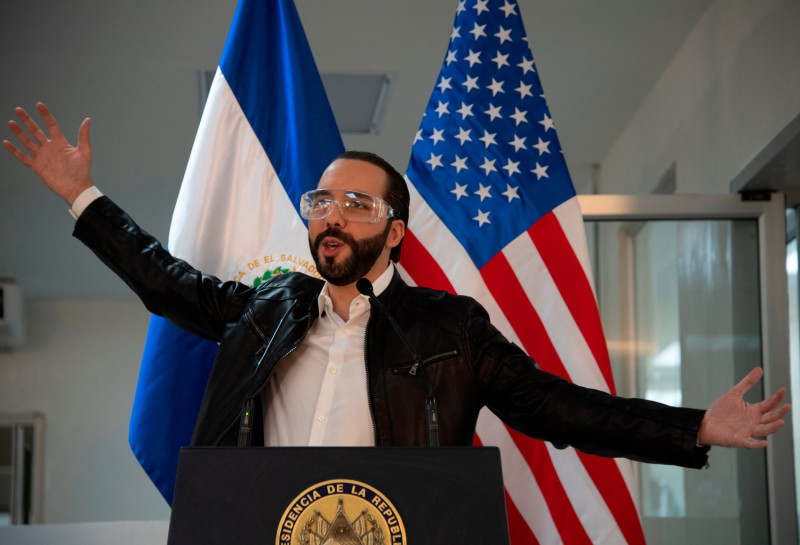
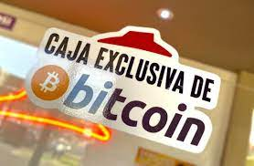
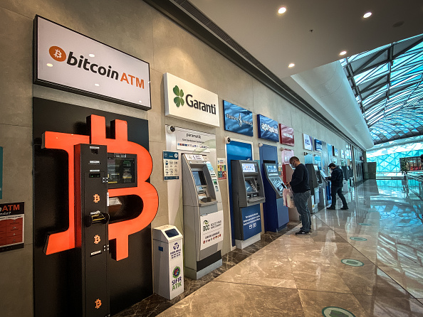
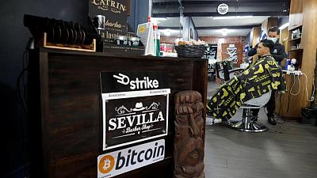

 In response to: https://www.theverge.com/2021/9/7/22660457/el-salvador-bitcoin-legal-tender-currency-cryptocurrency-chivo-wallet

---

 This is simply bad (if not ignorant) reporting... Japan (and other countries) have already updated their laws to permit cryptocurrency as "legal tender" for several years now.  https://www.fukuoka-now.com/en/update-on-regulations-on-cryptocurrency-in-japan/

 There seems some confusion between “legal tender” and “official currency”. "Legal tender" permits usage as a payment method but it isn’t classified as an official currency. From what I've read, the national currency of El Salvador is officially the US Dollar. However, they've updated their laws to permit BTC as "legal tender." As far as I'm aware, they haven't replaced the Dollar.

 From the viewpoint of business, there are no easy point-of-sale systems that makes it trivial for users to quickly confirm the payment for goods & services. Even within the G8 countries...

 Depending on how El Salvador implements the payment system (*Chivo*) will determine if they can separate the currency volatility from the purchasing power. For example, if they should set a loaf of bread to 25,000 *satoshis*, then regardless of the exchange rate everyone will buy. 
 
 The bit in the article about the the fluctuations of Bitcoin to fiat is deliberate fear mongering. How many people consider the exchange rate of their home currency compared to a foreign currency? All that truly matters is that the cost of the goods & services don't oscillate as madly as a stock trader's emotions.

 ## UPDATE
  One thing that appears different in El Salvador compared to any of the G8 countries where Bitcoin is accepted as legal tender is that they have gotten most businesses onboard with the infrastructure to manage the payments via Bitcoin. Reportedly, [Strike](https://strike.me/) is the payment processor that manages all payments on layer 2 of BitCoin networks. El Salvador's President Nayib Bukele is a _lot_ younger than any politican found in the G8 country's leadership. We could all use newer blood in the political halls of leadership.
  
  

  
 
   
   
   
 
