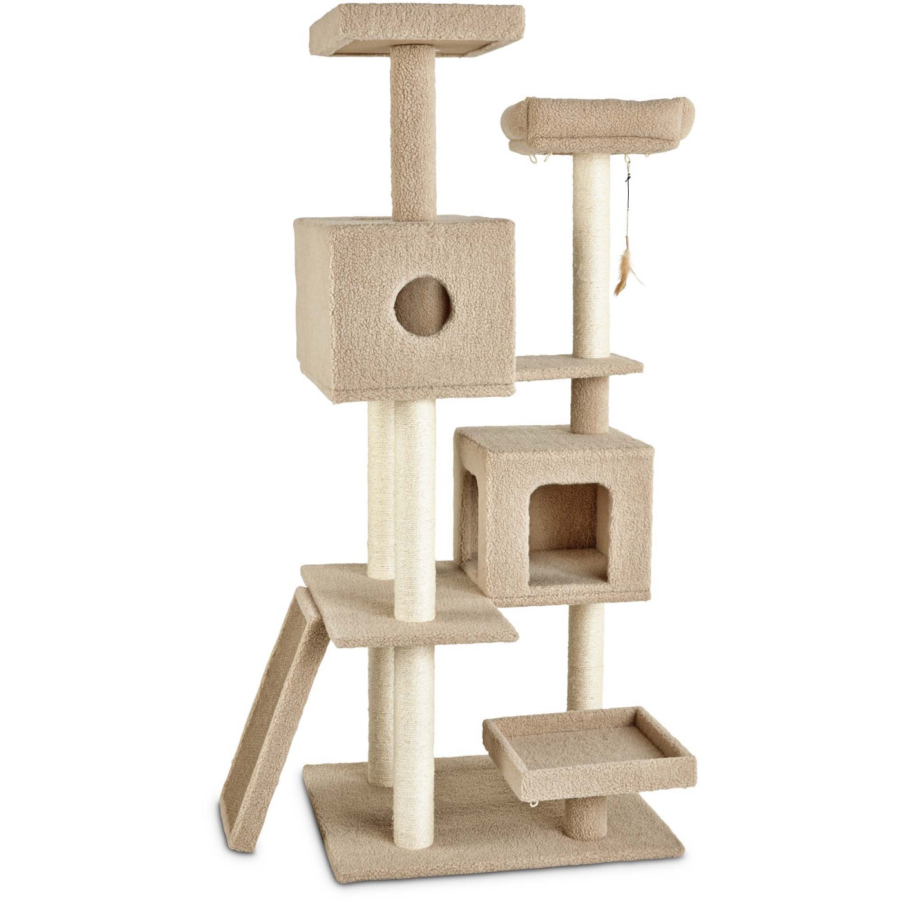
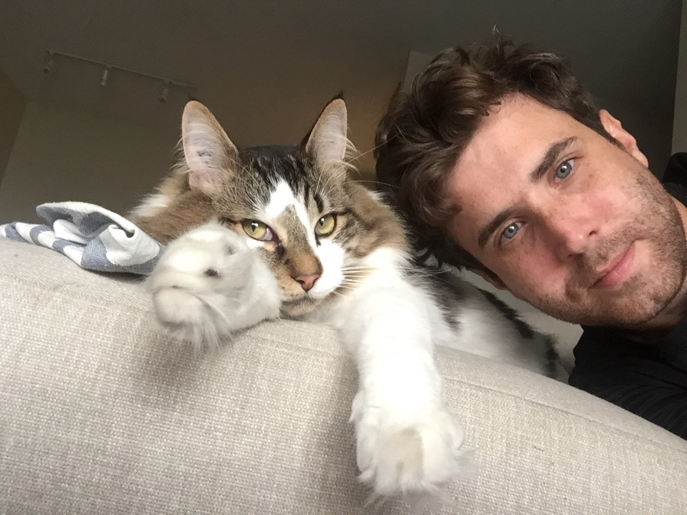

*How This Cat Behaviorist Makes 7 Figures Running 3 Online Businesses With Only His Cofounder*

Jackson Cunningham may not have been the most extroverted realtor in the room. In fact, he’ll tell you, he wasn’t a great networker at all. But it didn’t matter. He had an ace up his sleeve that the other realtors did not.

Jackson’s secret was setting up digital marketing conversion funnels. It was “his pleasure.”

In 2011, he was getting most of his leads online.

Soon, he realized he wasn’t actually interested in his real estate job anymore, just the digital marketing side.

But in order to quit his job and do what he loved full-time, the 25-year-old (at the time) needed to figure out how to make money — a common pain point that initiates many entrepreneurs.


This is the story of how Jackson Cunningham, now 32, started three niche e-commerce companies and grew them into a portfolio of over one million dollars in annual revenue.


You’ll **learn insightful tips** on how to hire contractors from Upwork to free up your time, how to stay focused on one thing when you have a hundred things on your plate, and how to pick the right idea/product to sell online when you’re starting from absolute zero.

*Interesting Fact:* You might recognize [Jackson Cunningham](https://medium.com/u/53c9a8b698b5)’s name from a [viral Medium story he wrote about being banned for life from Airbnb](https://medium.com/@jacksoncunningham/digital-exile-how-i-got-banned-for-life-from-airbnb-615434c6eeba).

## How it started: (M)ask me anything
When you enjoy digital marketing more than the thing you’re actually selling, you’re free to be emotionally detached, allowing you to sell literally anything.

That’s exactly what happened with Jackson Cunningham.

He searched for a product that would sell, not one for which he had any personal affinity.

Very methodically, he plugged in keywords, analyzed online traffic, and assessed the current market offering for hundreds of products.

**He spotted a gap.**

He found an overlooked corner of the fashion sector that hadn’t been penetrated with a premium, high-quality, and high-priced option.

**Masquerade masks.**

He found authentic Italian artists who designed gorgeous masks and signed them. He invested his own money to source inventory.

He spun up a Shopify store in the Spring and called the brand VIVO Masks.

Juggling this new project with his real estate business became untenable. He couldn’t do both. Searching on the popular freelancing site Upwork, he found a local professional to take over his real estate work. But the person he met was not who he expected.

He met Josh for coffee at a local shop and they hit it off. Turns out, they read the same books and listened to the same podcasts. When Jackson mentioned the masks project, Josh was intrigued.

The meeting was no longer a freelance interview.

“Would you be interested in going in on VIVO Masks with me, fifty-fifty?” asked Jackson.

Josh nodded enthusiastically.

Unbeknownst to the duo at the time, this coffee meeting put the roots in the ground for a lifelong multi-business partnership.

Their skill sets were and still are complementary, says Jackson: Jackson is more operational and passionate about automation. Josh is more strategic and adds a long-term mindset to their overall marketing plan. Together, they manage a stable of contractors (more on how this exactly works soon).

“Having two of us helps smooth the inevitable highs and lows in motivation that come from running a business,” says Jackson. “When I’m down, he’s up, and when he’s down, I’m up — we keep each other balanced and focused.”

By October of the same year, the cofounders grew VIVO Masks to $30,000 a month in sales by October. They didn’t pay themselves a dime, but rather reinvested the revenue into growing inventory and marketing until they fully stopped the real estate business in the following Spring.

## The only 3-step e-commerce growth funnel you’ll ever need
The key to setting up an effective digital marketing funnel has nothing to do with tweaking online advertisement settings, copy, and the perfect software setup to form a “well-oiled machine” where every $1 spent nets $1.50 in revenue, says Jackson. “It’s much more human than that, especially at the beginning.”

Jackson says spend most of your time finding the absolute best possible product first.

“If you put most of your effort into sourcing the best possible product on the front end, it will make your marketing down the road much easier,” he says. He spoke about how his handmade masks have high-end artisanal Italian origins. “I can say with full integrity that I sell the highest-quality masquerade masks in the world.”

Once you’ve found a “really nice” product to sell online, shift your thinking from short-term — “How do I get this to make money next month? — to long-term — “How do I get this to make money next year?”

“There are a hundred options to create money next month but not so many options to create money next year,” says Jackson. “When you start to think more long-term, the possible growth strategies shrink down. It’s a much clearer way to think through growth options.”

He likens this way of thinking about marketing as “planting seeds” where you don’t reap the rewards quickly and the initiatives are a slower burn, such as partnerships, content pieces, and service enhancements like free shipping, but turn out to be more profitable and sustainable in the end.

## Don’t think about making money next month
This Bezosian approach to growth has proven successful time after time, not only in business, but also in life. In his book, *12 Rules For Life*, bestselling author Jordan B. Peterson’s puts it most succinctly in Rule #7: “Pursue what is meaningful, not what is expedient.”

For products, this means making it the highest quality product possible and not cutting corners, cheapening, or holding back anything that would stop your product from being the best possible version of itself. *Quality* is meaningful, not expedient.

For services, follow what the author of *The 48 Laws of Power*, Robert Greene, writes as the Fifth Law of Power: guard your reputation far above anything else. Compromising your character may win the deal, appease yourself, or fatten the contract in the short-term, but once it’s ruined can never be regained again. Think of how icons like Bill Cosby, Harvey Weinstein, and Kevin Spacey have been ruined by certain choices. *Reputation* comes from what is meaningful, not expedient.

Jackson explains how this principle applies to an e-commerce company:

“You can spin up ads when you’re ready to scale,” he mentioned as an example of a strategy to hit short-term targets. But ads disappear as soon as you stop paying for them. Whereas a well-written evergreen content piece, for example, can continue to provide value for years on end.

Jackson points at venture-backed companies and summer project upstarts that aim to be successful as quickly as possible but are actually hindering their own growth by aiming at short-term targets.

“Three years is the way to be thinking,” he says. Give the seeds some time to grow. It’s similar to working out in the gym. You won’t see immediate rewards, but with time you’ll start to see results.”

If you can think in this longterm mindset, “It’s very freeing,” Jackson says.

## “Let’s make twenty of these things.”
Less than a year later in 2012, VIVO Masks hit a ceiling in sales.

Jackson and Josh tried lots of things to continue the brand’s growth, such as adding fascinators to the site, but nothing moved the needle.

Nevertheless, the business was a steady cash *calf* (a small cash cow) and the cofounders looked at each other and said, “Let’s make twenty of these things.”

## How to choose a startup idea when you have a ton of ideas
Using a stack of keyword research, landing pages, and ad traffic data, Jackson began [testing and validating](https://entrepreneurshandbook.co/if-youre-going-to-test-your-business-idea-make-sure-you-do-it-right-e9b09a7050c7) all manner of products, from Japanese kimonos to wigs to dream catchers to top hats.

Choosing the right product to focus on was not black and white. Even worse, most of them *could* sell — top hats sold pretty well — but each product required an equal amount of work. The more stores they opened, the more work it would become. The idea of 20 online stores soon became unfeasible.

During this process of validating various product ideas, Jackson learned a valuable lesson about how to choose a product.

“Validating is overused,” he says. “What am I really validating — the fact that something will sell online? That’s not the hard part. I can definitely sell wigs online. [The purpose of the validation period] is more like you’re giving yourself a confidence boost that will get you through the months to come when you’re selling barely anything.”

Jackson and Josh eventually landed on their second product: suspenders.

They researched the suspenders market and found that 90% of the products were low-quality, mass-produced, or old-school grandpa ‘spenders that were too thick.

So they set out to design their own and aimed at making them the best product in the market.

Similar to sourcing the masks from Italy, they sourced their suspenders materials and fabrics from the highest quality makers they could find — in England.

Soon they were manufacturing their own brand of suspenders at the level of quality they knew they could build a business with.

## Physical products without patents are in danger of being knocked off by foreign factories.
This is a serious concern for early founders and has led to hellacious lawsuits for many.

Jackson’s response to this concern was unflinching.


Who has the real power: The people who make the product or people who have the customers?


“Anybody can make anything nowadays,” he says. “Often there’s not a lot you can do to protect your products from copycats, but the reality is that there are built-in and somewhat painful barriers to entry, like hefty startup and inventory costs, lower margins, and no first-mover advantage.

As JJ Suspenders grew bigger, it reached a healthy sales mark, and yet, similar to VIVO Masks, it leveled off and led to diminishing returns.

## The biggest business of them all
Back to the drawing board but this time with more cash, Jackson wanted to give his girlfriend, who worked at a nonprofit, the same freedom he had as a digital entrepreneur. She should start a company so they could travel together, he reasoned.

“What are you interested in?” he asked her.

“Cats,” she said.

Jackson typed “cats” into a search engine.

Cat memes, cat photos, cat costumes — all the things you would expect — showed up at the top of the search results.

Except one keyword phrase stuck out.

Cat tree.

“What the hell is a cat tree?” Jackson wondered.

He applied the same filter that landed him in masquerade masks and men’s suspenders: “Could I make a better product than what’s out there?”

Turns out cat furniture is a lazy industry that hasn’t experienced innovation for hundreds of years, he says.

Five days later in 2016, Jackson embarked on his most capital intensive e-commerce project yet, entering the [$70 billion pet industry](https://www.americanpetproducts.org/press_industrytrends.asp) (USA).

He hired a product engineer, a product designer, and a cat behavioralist to take an Elon Muskian “[First Principles Thinking](https://mayooshin.com/first-principles-thinking/)” approach to solving the most fundamental problems in a cat’s life.

- “Why do cats scratch?”
- “What materials do they prefer to lay in?
- “What should you do with the ‘gifts’ of dead prey they bring you?”

“I get to solve interesting problems,” he says. Although he isn’t sure if he would be doing this if it was his first e-commerce company. “I’m going to be losing money for a few years.”

You can view the high-end cat furniture he is designing and manufacturing at the company’s website: www.tuftandpaw.com.

## How he spends one hour a week on two businesses and devotes the rest of his time to the third
One of the first rules of marketing is:


Lose your focus, lose your shirt.


Running three businesses sounds like it would be the antithesis to staying focused on one thing.

But Jackson Cunningham says he spends only one hour a week managing VIVO Masks and JJ Suspenders and pours the rest of his time and efforts into Tuft+Paw. Here’s how.

**The secret to business automation is hiring talented contractors.**
Jackson’s process and favorite tools for automation look like this:

- My ‘central brain’ is Trello. One board has ten lists. Each list is a goal for a role like designer, writer, marketer. The list contains tasks. I hire a freelancer to get the list of tasks done.
- I use Upwork for everything.

## 6 hiring tips for Upwork
* Only hire people with good ratings with at least a thousand dollars earned, but ideally more than $10,000.
* Pay by the hour not by a fixed rate. The fixed rate incentivizes people to work quicker, not to focus on quality. I prefer to overpay an hourly rate for people to do what they love than to save money and get poor work back quickly.
* Once I pick someone, I check in every five hours (of work) so I can get an idea of what they can accomplish in five hours.
* Once I find someone who’s good at what they do, I now have a person for all businesses whether it’s image editing, email outreach, customer service, or technical fixes on websites.
* Hiring a contractor takes trust (i.e., how do you know they’ll actually be working?). I just look at deliverables. Cut them if it’s not worth it.
* Hire people who are perfect for the specific job. Don’t hire a graphic designer to design an infographic. Hire the best infographic designer. This is a huge advantage of hiring globally through Upwork, you can reach specialists outside of your local talent pool.

## If you’re a founder who’s feeling frazzled and unfocused…

Jackson knows what it’s like to feel distracted, to be ‘busy’ doing too much, and not making any real progress. A lot of fires need to be put out when you have three businesses on your plate.

If you’re overwhelmed and frazzled — burned out from being too busy — you’re thinking too small, says Jackson. This is how Jackson and Josh felt when they were running five projects simultaneously. Every day they worked on hundreds of emails and tasks but didn’t get anything done.

If you’re spinning your wheels like this, it’s a sign you need to pick something bigger to sink your teeth into, the founder recommends. This is how he feels about Tuft+Paw today. “There’s so much I can do in this one area,” he says. “I found a thing with lots of potential that I can call ‘my baby.’”

Having a bunch of things on your plate is totally fine, says Jackson, as long as you can keep your focus.

The key to focus is to be fully immersed in something so that it doesn’t feel like you’re working.

The challenge for entrepreneurs is to *find that something* that’s big enough, rewarding enough, and interesting enough.

For Jackson, the vision is so clear with Tuft+Paw that he has to stop himself from working almost every day because he loves it so much.

“I’m passionately against ugly cat furniture,” he smiles.

## Key takeaways to remember
* Marketing comes ten times easier when you have the best quality product.
* Plan to make money next year, not next month.
* The secret to business automation is hiring talented contractors.
* If you’re feeling frazzled, you’re probably thinking too small and doing too many things. Aim to solve a bigger, more satisfying problem and focus in on it.
