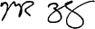


 Like it. Read it.


# It's Becoming Clear That No One Actually Read Facebook's IPO Prospectus Or Mark Zuckerberg's Letter To Shareholders
 

# As Facebook's stock continues to collapse, the volume of whining is increasing.
 Four months ago, you will recall, Facebook was viewed as "the next Google." Now, with no major change in the fundamentals, it's viewed as an over-hyped disaster. Meanwhile, there is ever-louder grumbling that 26-year-old Facebook CEO Mark Zuckerberg is in over his head and should be relieved of command.

 As I listen to all this whining, I have a simple question:

 Didn't anyone even read Facebook's IPO prospectus?

 The answer, I can only assume, is "no."

 Because if anyone had read the Facebook IPO prospectus, they would have learned, among other things, the following:

 - Facebook's growth rate was decelerating rapidly.
 - Facebook's user-base was rapidly transitioning to mobile devices, which produce much less revenue.
 - Facebook's operating profit margin was already an astounding 50%, which suggested it had nowhere to go but down.
 - Facebook's CEO had a nearly unprecedented amount of control over the company.
 - Facebook's CEO had set up this astounding level of control intentionally. Mark Zuckerberg knew all about how impatient public-market shareholders are. And he  set up the whole company so he would never have to pay attention to their whining.
 - In the 9 months following the IPO, insiders would be free to sell more than 2 billion shares of Facebook that they had been holding for years.
 - Facebook was going public at an astoundingly high price for a company with these characteristics—about 60-times the following year's projected earnings, in a market in which other hot tech companies like Apple and Google were trading at less than 15-times.
 - Even more importantly, if anyone had read the IPO prospectus, they also would have learned the following, all of which was expressed in a letter written directly to prospective shareholders by CEO Mark Zuckerberg:

 - Facebook's social mission is more important to Mark Zuckerberg than Facebook's business.
 - Facebook's business exists to support Facebook's product development, not the other way around.
 - Facebook's CEO is an extremely patient man who does not flinch under criticism.
 - Facebook will never care as much about clients and shareholders as it does about its service and users.
 - Facebook cares about the long term, not the short term (read: decades, not months).

 Facebook shareholders may be annoyed by those facts, especially now that the value of their stakes are getting demolished.

 But they can't say that they weren't warned.

 And they also can't say that the stock has been unduly punished:

 At $18, using the correct share count (2.7 billion), Facebook is still valued at almost $50 billion. And it's still trading at ~28-times next year's projected earnings of $0.65, an estimate that looks just as likely to be too high as it is to be too low. Meanwhile, Apple is still trading at less than 15-times projected earnings. So you can't argue that Facebook is now "too cheap."

 Lastly, if Facebook shareholders really think Facebook's CEO Mark Zuckerberg is going to cave to their whining and step down now, all of four months after he told them that he only cared about the long term (which, again, is measured in decades, not months), they don't know Mark Zuckerberg.

 Again, Mark Zuckerberg set up the entire structure of the company so he wouldn't be forced to make dumb short-term decisions by whining public-market shareholders.

 And he TOLD them that he wasn't going to make those decisions.

 They just didn't listen.

 In the interests of "better late than never," I've attached an annotated version of Mark Zuckerberg's letter below.

 If you've already read it, here's what else you should know about Facebook's stock—especially Facebook employees.

 Mark Zuckerberg's letter is in below. (With translation and annotations in blockquotes...)

# LETTER FROM MARK ZUCKERBERG
 Facebook was not originally created to be a company. It was built to accomplish a social mission — to make the world more open and connected.

 We think it’s important that everyone who invests in Facebook understands what this mission means to us, how we make decisions and why we do the things we do.

 I will try to outline our approach in this letter.

 
  Before I begin, let me remind you that I own 57% of the voting stock of Facebook, which means I have complete control over it. I organized the company this way many years ago, with the very deliberate intention of maintaining complete control over it. I did this so I wouldn't get overruled and canned by venture capitalists, a fate that unfortunately befalls many entrepreneurs. I also did it so in the event that we ever had to go public—which we unfortunately have to do now—I would never have to pay attention to whiny short-term public shareholders. Those whiny short-term public shareholders have destroyed many great companies by making management obsess about absurd near-term financial targets. I have made sure that that's never going to happen to Facebook. If there ever comes a day when you and I disagree about the future direction of the company, rest assured: Your choice will be my way or the highway.
 

 At Facebook, we’re inspired by technologies that have revolutionized how people spread and consume information. We often talk about inventions like the printing press and the television — by simply making communication more efficient, they led to a complete transformation of many important parts of society. They gave more people a voice. They encouraged progress. They changed the way society was organized. They brought us closer together.

 Today, our society has reached another tipping point. We live at a moment when the majority of people in the world have access to the internet or mobile phones — the raw tools necessary to start sharing what they’re thinking, feeling and doing with whomever they want.

 Facebook aspires to build the services that give people the power to share and help them once again transform many of our core institutions and industries.

 There is a huge need and a huge opportunity to get everyone in the world connected, to give everyone a voice and to help transform society for the future.

 The scale of the technology and infrastructure that must be built is unprecedented, and we believe this is the most important problem we can focus on.

 We hope to strengthen how people relate to each other.

 Even if our mission sounds big, it starts small — with the relationship between two people. Personal relationships are the fundamental unit of our society. Relationships are how we discover new ideas, understand our world and ultimately derive long-term happiness.

 At Facebook, we build tools to help people connect with the people they want and share what they want, and by doing this we are extending people’s capacity to build and maintain relationships.

 People sharing more — even if just with their close friends or families — creates a more open culture and leads to a better understanding of the lives and perspectives of others. We believe that this creates a greater number of stronger relationships between people, and that it helps people get exposed to a greater number of diverse perspectives. By helping people form these connections, we hope to rewire the way people spread and consume information.

 We think the world’s information infrastructure should resemble the social graph — a network built from the bottom up or peer-to-peer, rather than the monolithic, top-down structure that has existed to date. We also believe that giving people control over what they share is a fundamental principle of this rewiring.

 We have already helped more than 800 million people map out more than 100 billion connections so far, and our goal is to help this rewiring accelerate. We hope to improve how people connect to businesses and the economy.

 We think a more open and connected world will help create a stronger economy with more authentic businesses that build better products and services. As people share more, they have access to more opinions from the people they trust about the products and services they use. This makes it easier to discover the best products and improve the quality and efficiency of their lives.

 One result of making it easier to find better products is that businesses will be rewarded for building better products — ones that are personalized and designed around people.

 We have found that products that are “social by design” tend to be more engaging than their traditional counterparts, and we look forward to seeing more of the world’s products move in this direction. Our developer platform has already enabled hundreds of thousands of businesses to build higher-quality and more social products. We have seen disruptive new approaches in industries like games, music and news, and we expect to see similar disruption in more industries by new approaches that are social by design.

 In addition to building better products, a more open world will also encourage businesses to engage with their customers directly and authentically. More than four million businesses have Pages on Facebook that they use to have a dialogue with their customers. We expect this trend to grow as well.

 We hope to change how people relate to their governments and social institutions. We believe building tools to help people share can bring a more honest and transparent dialogue around government that could lead to more direct empowerment of people, more accountability for officials and better solutions to some of the biggest problems of our time.

 By giving people the power to share, we are starting to see people make their voices heard on a different scale from what has historically been possible. These voices will increase in number and volume. They cannot be ignored.

 Over time, we expect governments will become more responsive to issues and concerns raised directly by all their people rather than through intermediaries controlled by a select few. Through this process, we believe that leaders will emerge across all countries who are pro-internet and fight for the rights of their people, including the right to share what they want and the right to access all information that people want to share with them.

 Finally, as more of the economy moves towards higher-quality products that are personalized, we also expect to see the emergence of new services that are social by design to address the large worldwide problems we face in job creation, education and health care.

 We look forward to doing what we can to help this progress.

 
  What I care about most is Facebook's product and service and "social mission." The business is secondary.
 

 ## Our Mission and Our Business
 As I said above, Facebook was not originally founded to be a company. We’ve always cared primarily about our social mission, the services we’re building and the people who use them. This is a different approach for a public company to take, so I want to explain why I think it works.

 
  For those of you who missed it the first two times I said it, I'm going to say it again. Facebook's social mission is what I care about most. The business is secondary. If you don't like that, there's always the highway.
 

 I started off by writing the first version of Facebook myself because it was something I wanted to exist. Since then, most of the ideas and code that have gone into Facebook have come from the great people we’ve attracted to our team.

 Most great people care primarily about building and being a part of great things, but they also want to make money. Through the process of building a team — and also building a developer community, advertising market and investor base — I’ve developed a deep appreciation for how building a strong company with a strong economic engine and strong growth can be the best way to align many people to solve important problems.

 Simply put: we don’t build services to make money; we make money to build better services. And we think this is a good way to build something.

 
  This is the most important sentence in the whole letter. Unlike most companies, Facebook views its "business" as a way to fund its product. This is profound and important, especially for investors who believe that products are just tools with which to build businesses and generate cash for shareholders. I, personally—Henry Blodget—completely agree with Mark Zuckerberg here. I think most companies should be run the way Facebook is run, with the product being center stage and then equal consideration given to customers, shareholders, and employees. I think America and Americans would be much better off if companies were run this way, and I think we'd have companies with stronger, more defensible competitive positions. A lot of public-market shareholders do NOT think that way, however. They think management should always "maximize profits." Those investors obviously shouldn't buy Facebook.
 

 These days I think more and more people want to use services from companies that believe in something beyond simply maximizing profits.

 
  Agreed. And if not, simply "maximizing profits" leads to modestly lower share prices, so be it. The tradeoff will be worth it.
 

 By focusing on our mission and building great services, we believe we will create the most value for our shareholders and partners over the long term — and this in turn will enable us to keep attracting the best people and building more great services.

 
  Also critically important. And, most likely, true.  "Maximizing near-term profits" often means under-investing in future innovation, customers, and employees. And although it sometimes temporarily boosts stock prices, it often guts companies and clobbers their value over the long haul. Amazon CEO Jeff Bezos has never paid the slightest attention to appeasing Wall Street's demand for near-term financial performance. Instead, he has always focused on Amazon's products and customers. And it's no accident that Amazon has built the single most successful and valuable long-term franchise of all the 1990s Internet companies.
 

 We don’t wake up in the morning with the primary goal of making money, but we understand that the best way to achieve our mission is to build a strong and valuable company. This is how we think about our IPO as well.

 
  There it is again, just in case you missed it the first five times.
 

 We’re going public for our employees and our investors. We made a commitment to them when we gave them equity that we’d work hard to make it worth a lot and make it liquid, and this IPO is fulfilling our commitment. 

 As we become a public company, we’re making a similar commitment to our new investors and we will work just as hard to fulfill it.

 
  We don't want to go public. We're only going public because we have to. I understand that, by taking your money, I do owe you something. But I want to be very clear with you about what I think my obligation is.
 

 ## The Hacker Way
 As part of building a strong company, we work hard at making Facebook the best place for great people to have a big impact on the world and learn from other great people. We have cultivated a unique culture and management approach that we call the Hacker Way.

 The word “hacker” has an unfairly negative connotation from being portrayed in the media as people who break into computers. In reality, hacking just means building something quickly or testing the boundaries of what can be done.

 Like most things, it can be used for good or bad, but the vast majority of hackers I’ve met tend to be idealistic people who want to have a positive impact on the world.

 The Hacker Way is an approach to building that involves continuous improvement and iteration. Hackers believe that something can always be better, and that nothing is ever complete. They just have to go fix it — often in the face of people who say it’s impossible or are content with the status quo.

 Hackers try to build the best services over the long term by quickly releasing and learning from smaller iterations rather than trying to get everything right all at once. To support this, we have built a testing framework that at any given time can try out thousands of versions of Facebook.

 We have the words “Done is better than perfect” painted on our walls to remind ourselves to always keep shipping. Hacking is also an inherently hands-on and active discipline. Instead of debating for days whether a new idea is possible or what the best way to build something is, hackers would rather just prototype something and see what works.

 There’s a hacker mantra that you’ll hear a lot around Facebook offices: “Code wins arguments.”

 Hacker culture is also extremely open and meritocratic. Hackers believe that the best idea and implementation should always win — not the person who is best at lobbying for an idea or the person who manages the most people.

 To encourage this approach, every few months we have a hackathon, where everyone builds prototypes for new ideas they have. At the end, the whole team gets together and looks at everything that has been built. Many of our most successful products came out of hackathons, including Timeline, chat, video, our mobile development framework and some of our most important infrastructure like the HipHop compiler.

 To make sure all our engineers share this approach, we require all new engineers — even managers whose primary job will not be to write code — to go through a program called Bootcamp where they learn our codebase, our tools and our approach.

 There are a lot of folks in the industry who manage engineers and don’t want to code themselves, but the type of hands-on people we’re looking for are willing and able to go through Bootcamp.

 The examples above all relate to engineering, but we have distilled these principles into five core values for how we run Facebook:

 ## Focus on Impact
 If we want to have the biggest impact, the best way to do this is to make sure we always focus on solving the most important problems. It sounds simple, but we think most companies do this poorly and waste a lot of time. We expect everyone at Facebook to be good at finding the biggest problems to work on.

 ## Move Fast
 Moving fast enables us to build more things and learn faster. However, as most companies grow, they slow down too much because they’re more afraid of making mistakes than they are of losing opportunities by moving too slowly.

 We have a saying: “Move fast and break things.” The idea is that if you never break anything, you’re probably not moving fast enough.

 ## Be Bold
 Building great things means taking risks. This can be scary and prevents most companies from doing the bold things they should. However, in a world that’s changing so quickly, you’re guaranteed to fail if you don’t take any risks.

 We have another saying: “The riskiest thing is to take no risks.” We encourage everyone to make bold decisions, even if that means being wrong some of the time.

 ## Be Open
 We believe that a more open world is a better world because people with more information can make better decisions and have a greater impact. That goes for running our company as well. We work hard to make sure everyone at Facebook has access to as much information as possible about every part of the company so they can make the best decisions and have the greatest impact.

 ## Build Social Value
 Once again, Facebook exists to make the world more open and connected, and not just to build a company. We expect everyone at Facebook to focus every day on how to build real value for the world in everything they do.

 
  We're going to stay aggressive. Sometimes we'll screw up. Then we'll iterate, learn, and move on. If you can't stand that heat, stay out of the kitchen.
 

 Thanks for taking the time to read this letter. We believe that we have an opportunity to have an important impact on the world and build a lasting company in the process. I look forward to building something great together.
 