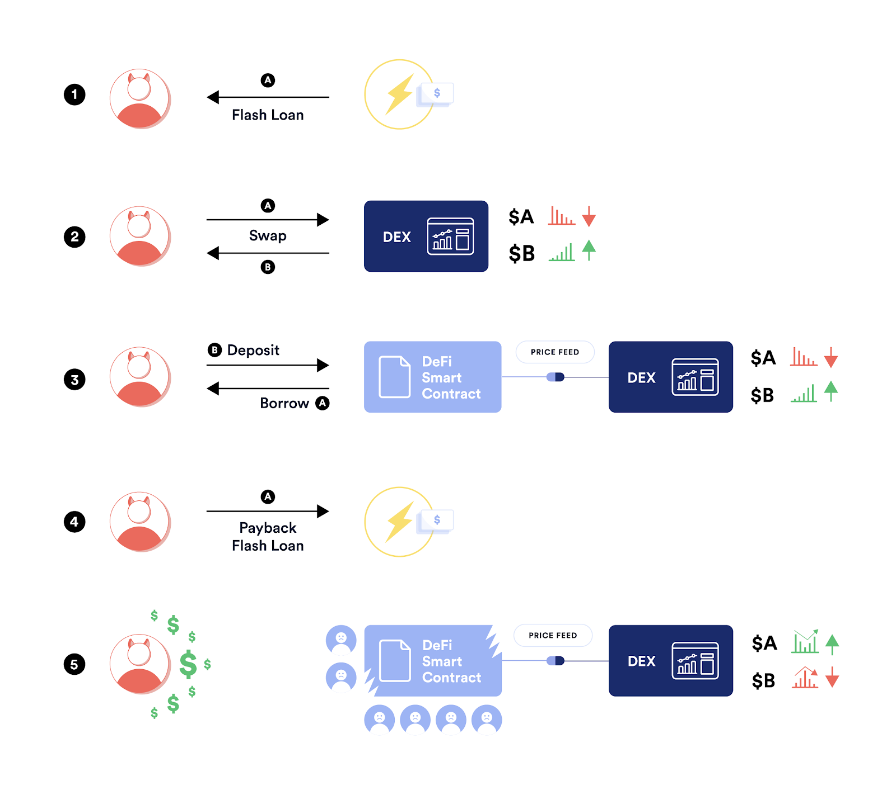
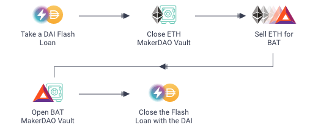

 This lesson covers flash loans, one of DeFi’s most exciting and complex features. They are often praised for their simplicity and swiftness, especially when compared to similar products from today’s financial system. However, many believe that flash loans are incredibly risky and that they have no place in DeFi. What are the arguments, and where does the bad reputation come from?

 Dealing with institutions from the traditional banking system is messy and cumbersome. A simple loan requires tons of bureaucratic paperwork, and even when all the right conditions are met, there are bound to be at least some problems.

 For most who are familiar with DeFi, flash loans appear to be the perfect alternative. They require no upfront collateral, and anyone can create a loan without any limitations. Moreover, this is the only loan that does not require personal identification.

 But there are also disadvantages. Flash loans are highly dangerous, and it is the number one smart contract vulnerability - which is why so many DeFi investors lost money in 2020. While some demand that developers outright remove flash loans, others propose that we should keep them and improve them, rather than outright ban them.

 Without flash loans, DeFi cannot rightfully call itself a ‘self-driving bank’ (a moniker given by ex-OCC chief Brian Brooks). Flash loans are the life force that powers most protocols, and the market would not be the same without them.

## What Are Flash Loans?
 Flash Loans enable crypto users to take out near-instant crypto loans without having to provide collateral in return. The process is entirely decentralized and does not require any kind of KYC documentation. Even for beginners, the process takes a few minutes at most.

 

 By requesting a flash loan, users can take any sum of money possible. Even millions you might ask? That is entirely possible.

## How Repaying a Flash Loan Works
 There is a catch. Repaying a flash loan is an entirely different process compared to taking out standard crypto loans. A flash loan taken from a [protocol like Aave](https://academy.shrimpy.io/post/what-is-aave) must be returned within the same transaction block in order to successfully complete the loan. If the borrower fails to do so, the original transaction is reverted.

 Not repaying a loan is out of the question, not only in real life, but in DeFi as well. Blockchain networks will go as far as entirely reverting a loan transaction if it is not paid back on time. 

 The action of reverting a flash loan is possible with the help of [EIP-140](https://eips.ethereum.org/EIPS/eip-140), an Ethereum Improvement Proposal. The EIP in question enables developers to call a revert function, which instructs the network to revert to a previous state.

## Flash Loans Use Cases
 

 Although flash loans gained popularity in 2020 with the help of Aave and dYdX, the concept dates back to 2018 with [Marble Protocol’s first flash loan design](https://medium.com/marbleorg/introducing-marble-a-smart-contract-bank-c9c438a12890). Marble dubbed its creation ‘flash lending’ and called the entire protocol a smart contract bank.

 Today, users can access all kinds of decentralized financial instruments and tools that make our lives easier and more prosperous. In the case of loans, users can take out both regular loans and the market’s brand-new flash loans. But there is one thing that we have not covered yet - what is the purpose of a flash loan?

 Specifically, what is the end goal of a loan that must be repaid in such a short time? Believe it or not, there are actually a couple of popular use cases.

## Using Flash Loans for Arbitrage Trading
 Arbitrage trading is a process in which a trader purchases an asset on one exchange and sells it on another exchange to take advantage of price differences. It is as simple as buying low and selling high.

 One can utilize flash loans in the case of arbitrage trading to leverage higher levels of liquidity and earn extra profit.

 For example, If you spot a drastic price difference of an asset like LINK, you can take out a flash loan and buy the asset on Uniswap only to end up selling it on FTX. You then repay the original flash loan and go back home with the rest of the profit.

 This is what the general strategy looks like on a step-by-step basis:

 1. Take out a $5,000 flash loan on AAVE.
 2. Use the flash loan to buy LINK on Uniswap.
 3. Sell LINK for a higher price on FTX.
 4. Repay the loan and interest back to AAVE.
 5. Enjoy the leftover profits gained from the arbitrage.

## Debt Refinancing
 Debt refinancing is the second-best use case for flash loans, frequently used in situations where a user creates regular DeFi loans. More often than not, a crypto enthusiast will take out a loan only to discover that another platform offers the same loan but with better interest rates.

 In that scenario, the individual could make use of the other platform with the help of flash loans. He would have to pay off the interest rate (e.g., 10%) on the original loan and borrow 5% from the second loan at the more affordable lending platform. The cycle is completed by paying back the flash loan, after which the user ends up having the loan with the better interest rate in his hands.

## Financial Tool
 Flash loans are a niche financial tool that more technically knowledgeable DeFi users can utilize. They are great for arbitraging and debt refinancing. 

 As we have mentioned earlier, flash loans are the future of finance, and their decentralized structure completely blows traditional bank loans out of the water. It is possible to make money with flash loans without ever having to provide your private information, and the process only takes a few minutes at most.

 But while the advantages are definitely great, there is one major problem that presents a dealbreaker for most. Flash loans are highly susceptible to smart contract exploits, and developers have still not figured out how to protect their users’ funds from hackers.

## Video (15:36 minutes)
  Top Ways to Make Money With Flash Loans

 


    start: 0,
    allowfullscreen: 1,
    autoplay: 0,
    hl: en,
    cc_lang_pref: en,
    cc_load_policy: 1,
    color: white,
    controls: 1,
    disablekb: 0,
    enablejsapi: 1,
    fs: 0,
    iv_load_policy: 3,
    loop: 0,
    modestbranding: 1,
    playsinline: 0,
    privacy_mode: yes,
    rel: 0,
    showinfo: 0,
    origin: blog.richiebartlett.com,
    widget_referrer: blog.richiebartlett.com


## Links




