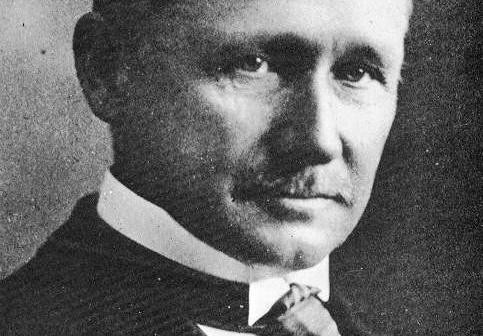
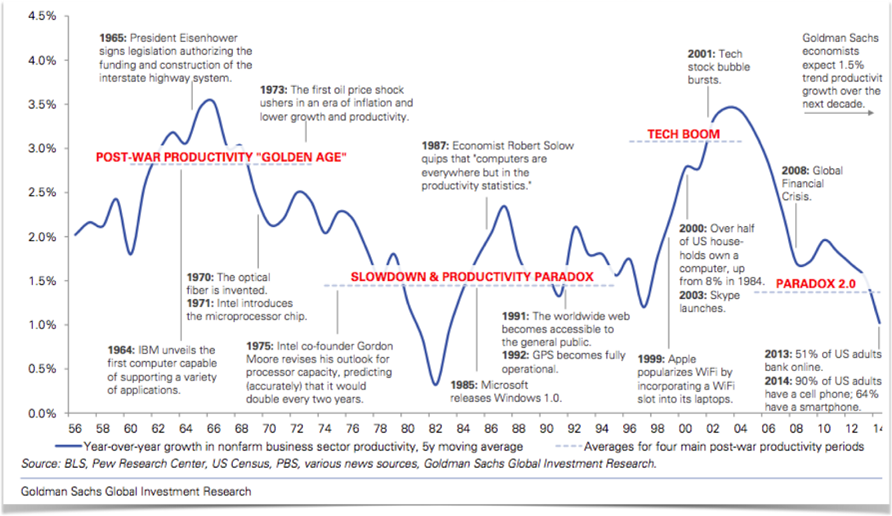
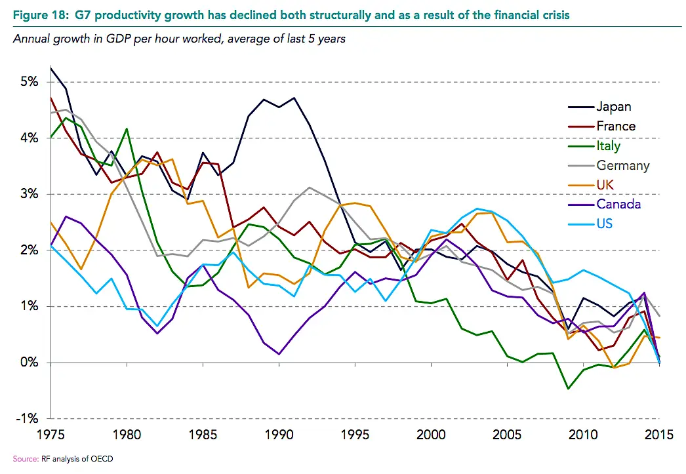
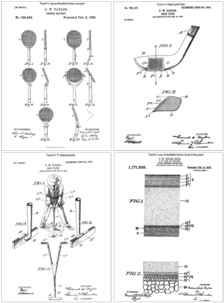
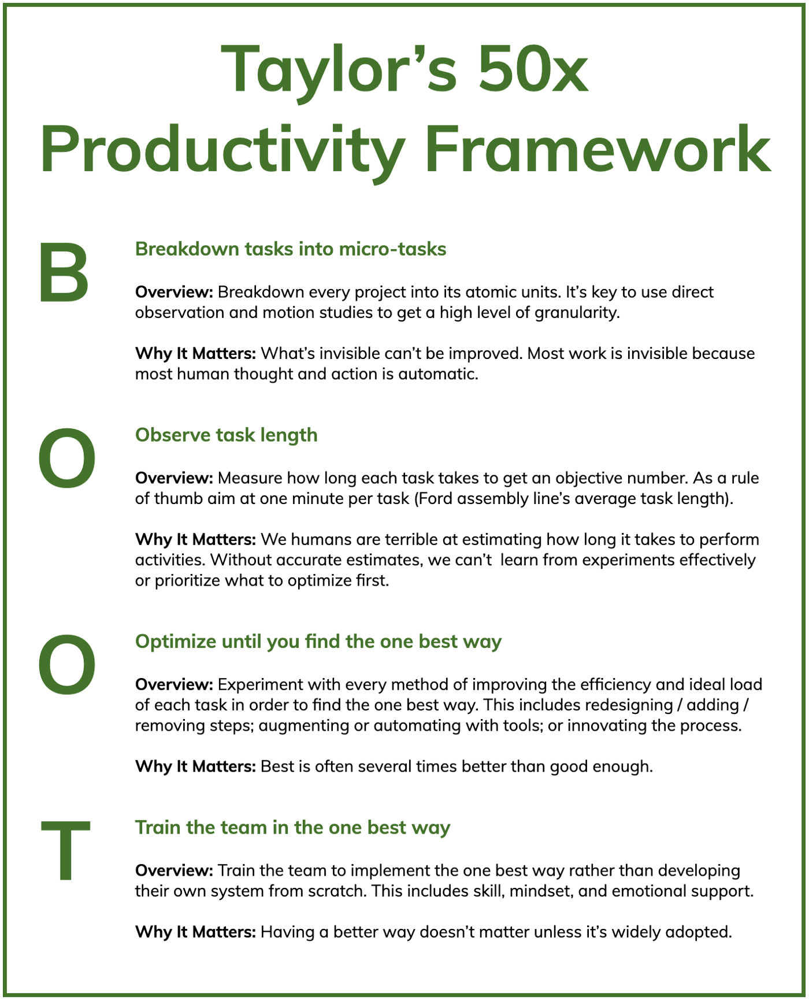
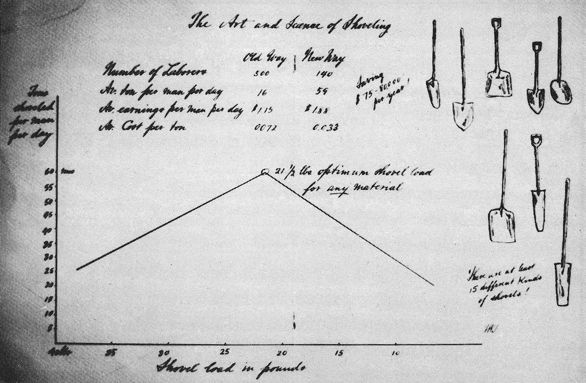
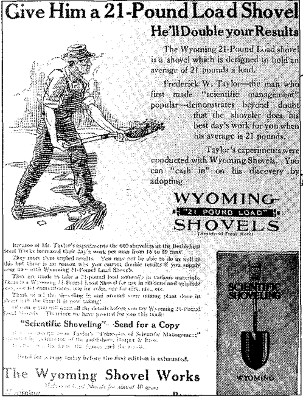

# In 1911, an influential expert revealed a forgotten science of how to be 50x more productive without working more hours
 



    The most important, and indeed the truly unique, contribution of management in the 20th century was the fifty-fold increase in the productivity of the manual worker in manufacturing.



 Peter Drucker, one of the most respected management thinkers in history, stated these words at the close of the 20th century.

 The significance of this quote cannot be overstated.

 Drucker isn’t just talking about 50x productivity for the smartest people. He’s talking about 50x productivity _on average_ for an _entire society_. It’s profound historically. It’s profound personally. It’s profound societally.

 * **Historical Profundity**: The sudden rise in worker productivity is a historical anomaly. Drucker says, “For hundreds of years there had been no increase in the ability of workers to turn out goods or to move goods.”
 * **Personal Profundity**: Imagine if you could do an entire week’s work in less than an hour? Or imagine if you could work a full work week, but got 50x the results of everyone else? It would catapult your career — your salary, your impact, your reputation, your self-confidence.
 * **Societal Profundity**: Over the long run, productivity determines what governments societies adopt. If productivity drops for too long, revolutions happen. If productivity goes up, the system stays because workers enjoy higher incomes and more leisure time. Drucker believes that had the productivity revolution not happened, capitalism may have fallen to communism during the Great Depression.

 Yet, something very odd happened in the last 50 years.

 At the exact point you’d expect another 50x increase in productivity because of computers, there was stagnation in the United States…

 

 …and in other developed countries…

 

 The oddness of this surprise is captured in the following quote by a Nobel laureate economist:

 

    You can see the computer age everywhere but in the productivity statistics.


 
 What’s going on here?

 A single employee with a laptop can do more than a roomful of people from the 1960s. Yet, we aren’t seeing this in the productivity data.
  
 How is it that we make one of the most significant shifts in history and don’t see big, undeniable results from it?

 This surprising phenomenon is known as the productivity paradox.

 This paradox led Drucker to issue a challenge for our generation…



    The most important contribution management needs to make in the 21st century is similarly to increase the productivity of knowledge work and knowledge workers.



 When I first read these words in 2018, I was shocked and inspired. So, I decided to dive deeper…

## Millions Of Articles On Shallow Productivity Hacks… But Almost None On 50X Productivity
 My first surprise was this:

 * There are hundreds of millions of pages on the Internet that mention productivity. In fact, there is a whole cottage industry of articles, books, and videos on productivity by productivity gurus.
 * Yet, most people into productivity (including myself) had never heard of the most important breakthrough in the history of productivity or the person behind it.

 It’s like collectively learning a philosophy (scientific method) or discovering a technology (steam engine) that changes everything and then removing it from the history books and subsequently forgetting about it.

 So, I became hooked. I wanted to understand why the 50x shift happened in the first place and how to replicate it with knowledge work instead of just manual work. After all, who doesn’t want a 50x productivity boost?

 Furthermore, we can see the consequences of the recent productivity stagnation in many areas of politics and culture — from social rifts between classes to key issues in elections. When the pie isn’t growing, people fiercely fight to divvy up what’s left and tear down existing institutions. So, increasing productivity is an important social issue as well.

 Naively, I thought I would find an answer quickly and write an article about it. But, as I dove deeper into the literature on knowledge work productivity, I realized that the topic was still unsolved.

 Therefore, rather than rushing something out, I went on a multi-year research journey through dozens of academic articles and books. Some of my favorite being:

 * [Knowledge Work Factory](https://amzn.to/3Kcvnlp) by William Heitman
 * [America’s Assembly Line](https://amzn.to/3Mdsenc) by David Nye
 * [Principles Of Scientific Management](https://amzn.to/3vBPt4z) by Frederick Winslow Taylor
 * [Competitive Advantage](https://amzn.to/36T5qcd) by Michael Porter
 * [The Effective Executive](https://amzn.to/35q8exa) by Peter Drucker
 * [The Rise Of The Knowledge Society](http://archive.wilsonquarterly.com/essays/rise-knowledge-society-0) by Peter Drucker
 * [The One Best Way](https://amzn.to/3vBlcCM) by Robert Kanigel
 * [My Life And Work](https://amzn.to/3tKKADV) by Henry Ford
 * [Knowledge Worker Productivity](http://genderi.org/pars_docs/refs/63/62938/62938.pdf) by Peter Drucker

 By the end, I found a surprisingly simple 4-step framework (backed by more than 100 years of proof) that could be applied to knowledge work. But, before we understand the framework, it’s critical to first understand the fascinating person behind it along with the process he used to discover it…

## A Forgotten Thinker, Who Started Off As a Machine Shop Laborer, Sparked The Productivity Revolution
 If you read Drucker, there is no confusion about the root cause of the productivity revolution. It all goes back to one person — Frederick Winslow Taylor.

 


    In the decade after Frederick Winslow Taylor first looked at work and studied it, the productivity of the manual worker began its unprecedented rise… On this achievement rest all of the economic and social gains of the 20th century.



 Drucker not only considers Taylor to be the creator of the science of management, he sees him as one of the three most important “makers of the modern world.” In fact, [he attributes](http://genderi.org/pars_docs/refs/63/62938/62938.pdf) almost all of the important management innovations in the last century (industrial engineering, work enrichment, job rotation, assembly line, total quality management, quality circle, continuous improvement, and lean manufacturing) back to Taylor.

 Drucker is not alone in his assessment. In 1977, Taylor was ranked the #1 contributor ever to management thought and practice by a panel of business and economics historians beating out the likes of John Rockefeller, Andrew Carnegie, Alfred Sloan, Thomas Edison, and Henry Ford. Similarly, when the Academy Of Management, the academic association for the management discipline, was given the same task, Taylor again topped the list. To put his lead in perspective, Taylor had 31 first place votes. The next person down had three.

 Furthermore, Taylor was a celebrity in his own era. According to his biographer:

 


    At the peak of his celebrity in the early twentieth century, Taylor gave lectures around the country and was as famous as Edison or Ford.



 To understand why Taylor was so widely known and respected, we need to look back at his life, which is eccentric enough to be a Hollywood script…

 Taylor was born in 1856 and brought up as an aristocrat. His father was a Princeton-educated lawyer and Taylor went to Phillips Exeter Academy — one of the country’s top private schools. He was also a high achiever. By the end of high school, he was accepted to Harvard and had plans to become a lawyer just like his father.

 However, while studying 4–5 hours per night in order to keep up in the pressure cooker environment, he started getting headaches that became more and more severe. Not knowing what the root cause was and fearing it would get worse, Taylor dropped out of high school, decided not to go to Harvard, and chose a profession that would be less taxing on his eyes.

 Taylor was later diagnosed with the eye condition of Astigmatism. A condition which today is easy to diagnose and fix. Straining to focus on words was what caused the headaches. Although corrective lenses had come to America in 1862, the condition and solution had not become widely known by 1874 when Taylor dropped out. **So, by a weird quirk of fate, Taylor went to the shop floor as an apprentice machinist rather than Harvard to become a lawyer.**

 As a machinist, he noticed that the workmen were not working nearly as hard as they could — often working at the slowest pace they could without getting punished. At the age of 25, when he became a foreman in a steel plant, he started to experiment with how worker productivity could be improved.

 From there, he hit his stride. Over the next few years, his responsibilities grew from foreman, to master mechanic, to chief draftsman, to chief engineer. His ambitions were not small:



    My head was full of wonderful and great projects to simplify the processes, to design new machinery, to revolutionize the methods of the whole establishment.


 During these years, Taylor envisioned and tested the components that would eventually become his science of management. Furthermore, he became rich very early on through his metalworking inventions — ultimately having more than 40 patents to his name. At the age of 37, Taylor decided to help other companies implement what he had learned. And so he became one of the first management consultants ever.

 Later in his career, Taylor committed himself to evangelizing the principles of scientific management. In 1911, at the age of 55, he published his magnum opus — [Principles Of Scientific Management](https://amzn.to/3gK5QTV) and went on the speaking circuit.

 We can see evidence of Taylor’s zeal for his philosophy in a letter to his brother-in-law…

 


    …I have been out of business, that is, money-making business, for about nine years, and during this period I have devoted all of my spare time to the object of promoting modern scientific management. In this I feel I can accomplish much more than I could in any other way, because it has been practically my life’s work; and I also think it is my duty to devote my time and money to this cause, for the reason that there is no one else in the country who is in a position to accomplish what I am able to do in this direction.


 **Taylor did not just view the principles of scientific management as only being applicable to manual work factories.** He, himself, wrote that the principles of scientific management “can be applied with equal force to all social activities: to the management of our homes; the management of our farms; the management of the business of our tradesmen, large and small; of our churches, our philanthropic institutions, our universities, and our governmental departments.”

 According to his biographer, many from other fields agreed with Taylor. “Look back to 1910 and the first explosion of interest in scientific management and you see field after field absorbing its message” including offices, hospitals, libraries, prisons, and schools.

 In fact, he even applied the principles to become a world-class tennis and golf player (he won the national doubles championship in 1881). And true to form, the principles of scientific management helped him create unorthodox but extremely effective motions and create new tools. He patented everything from new tennis racquet and golf club designs to turf management techniques and tennis net designs.

 

 And so we got the foundational theory for the 50x productivity revolution from an ambitious man who through a quirk of fate lived two contradictory lives. One life was spent working 10–11 hours a day on the shop floor. The other was spent playing tennis and golf at country clubs while also “studying physics and mathematics at home, singing in choral groups,” among other activities. If Taylor’s astigmatism had been cured, he likely would’ve become a successful lawyer unknown to the annals of history.

 Educated on the critical role that Taylor played in the productivity revolution, I was ready to deep dive on the fundamental principles that caused the 50x productivity revolution in manual work…

## What Caused The 50x Manual Worker Revolution Boom Is Surprising
 The core thesis of Taylor’s [Principles Of Scientific Management](https://amzn.to/3gK5QTV) boils down to applying the scientific method to productivity using the following 4-step process:

 

## Using this system, Taylor achieved astounding results for tasks you would think are impossible to improve.

 Take something as simple as shoveling. Having been in existence for some 7,000 years, you would think that the optimal approach had been figured out long ago. Interestingly, this was not the case. In 1898, Taylor was hired by Bethlehem Steel to make its 600 shovelers more productive. So, he endeavored to create a science of shoveling.

 First, Taylor questioned basic assumptions:



    For a first-class shoveler there is a given shovel load at which he will do his biggest day’s work. What is this shovel load? Will a first-class man do more work per day with a shovel load of 5 pounds, 10 pounds, 15 pounds, 20, 25, 30, or 40 pounds?


 Next, he answers these questions with time and motion studies combined with experiments on:

 * Kinds of shovels (they settled on 8–10)
 * Shoveling techniques (testing various distances, weights, and heights)
 * Management systems (Training employees on the scientific method so they can perform experiments. Standardizing the winning experiments into the company processes and culture. Providing bonuses to individuals rather than having a common group wage.)

 

 After much experimentation, he found the optimal shovel load was 21 pounds, which led to advertisements like this one…

 

 What was the end result of these shoveling experiments?

 The output per man doubled. As a result, employees earned 35% more on average while the company paid significantly less.

 All of this from turning the simple act of shoveling into a science.

 Taylor gives other fascinating case studies in the book. One amazing example is bricklaying. Even though the trade had existed for 6,000 years and there had been almost no innovation for hundreds of years, two of Taylor’s students, Frank and Lillian Gilbreth, were able to improve efficiency by 3x. Using the principles of scientific management, they…

 * Examined the movements of bricklaying frame-by-frame.
 * Reduced the number of motions from 18 to 5.
 * Created custom tools. For example, they created a simple apparatus that held the bricks at the same height as the wall so they didn’t have to constantly bend down to pick them.
 * Taught people to use their hands simultaneously rather than in sequence.

## Bricklaying Ergonomics -Video (2:10 minutes)
 This is an excerpt from a half hour documentary on the life and work of Frank Gilbreth.  Gilbreth lived at the turn of the last century and was a student of Frederick Taylor.  He studied work to make it more efficient.  This excerpt is about his work to improve bricklaying and find the "one best way" to lay bricks.  In doing so he made bricklaying more efficient but also safer.  More on his life can be found at the Gilbreth Network website.



    start: 0,
    allowfullscreen: 1,
    autoplay: 0,
    hl: en,
    cc_lang_pref: en,
    cc_load_policy: 1,
    color: white,
    controls: 1,
    disablekb: 0,
    enablejsapi: 1,
    fs: 0,
    iv_load_policy: 3,
    loop: 0,
    modestbranding: 1,
    playsinline: 0,
    privacy_mode: yes,
    rel: 0,
    showinfo: 0,
    origin: blog.richiebartlett.com,
    widget_referrer: blog.richiebartlett.com


 *(Fun editorial note: Two of Frank and Lillian’s children co-authored the book Cheaper By The Dozen, which became a Hollywood movie three times—one of which starred Steve Martin. The Gilbreth’s home doubled as laboratory to test their ideas on education and efficiency.)*

 Henry Ford also used the principles of scientific management. For example, one of Ford’s most famous management innovations came from breaking down how employees spent their time and realizing that half of a worker’s time was wasted simply walking between materials and tools. So Ford had the work come to workers rather than them walking to the work. This innovation was called the assembly line, and the increased productivity allowed Ford to drastically increase worker pay.

 One of my favorite optimization examples from [Ford’s autobiography](https://www.amazon.com/dp/B002RKR216/ref=dp-kindle-redirect?_encoding=UTF8&btkr=1) is a step-by-step overview of how he turned a 20-minute assembly job into a 5-minute one (a 4x improvement):

| Innovation | Minutes |
| -- | -- |
| One person doing the complete job | 20 |
| Splitting what one person did alone into 29 operations done by separate people (specializations) | 13 |
| Raised the height of the line 8 inches | 7 |
| Optimized the speed of the assembly line | 5 |

 When reading about the drastic improvements in shoveling, bricklaying, and assembly, my mind was boggled. I didn’t understand how fields that had been around for thousands of years could be improved so easily and drastically — not by complex theories but by a simple process anyone could replicate. Taylor’s book shed light on the peculiarity…

 * **As a field evolves, it develops best practices.** Best practices are passed down from generation to generation.
 * **These best practices go unexamined.** “Practically in no instances have they been codified or systematically analyzed or described,” explains Taylor.
 * **There is a lot of diversity among practices.** Taylor adds, “Instead of having only one way which is generally accepted as a standard, there are in daily use, say, fifty or a hundred different ways of doing each element of the work.”
 * **This diverse body of practice based on “rule of thumb” is far from optimal.** You might think that if a profession has been around for decades and even centuries that it would discover the optimal processes and pass those down. However, Taylor’s work showed that this doesn’t happen. Even the most basic ancient tasks like shoveling or bricklaying could be done much more efficiently.

 **Bottom line:**

 * Fields evolve to a point of being good enough, but not optimality.
 * The good enough approach is significantly less efficient than the optimal approach.
 * These huge improvements can be made via the surprisingly simple process of scientific management.

 To summarize…

## What We Have Been Taught About Productivity Is Fundamentally Wrong
 When I was taught about the industrial revolution somewhere in middle school, I learned that it occurred because of electrified factories with big machines. Overall, I was left with the impression that the cause of the productivity boost was technology.

 What I now know is that this viewpoint is only half the story. **Technology is not the fundamental cause of productivity. Simply mastering the latest and greatest tools will not take you to the promised land of productivity — despite many headlines on social media promising it.** This insight helps us understand why the introduction of the computer hasn’t led to as big and fast of a productivity boom as one might expect.

 What history shows us is that what really matters is first having the right production process — the steps you follow to create good or service. Then, technology boosts the power of that process.

 **In other words, the production process is the fire. The technology is the gasoline that accelerates the fire.**

 Optimizing the process first is deep productivity. It has the most leverage, but requires rethinking one’s whole production process, which takes a lot of time. **Finding quick hacks using the latest tools while using an unoptimized process is shallow productivity. It is like putting lipstick on a pig.** It provides quick bursts of productivity, but is not the ideal approach long-term.

 

 Now that we have a gist of how manual worker productivity skyrocketed as a result of Taylor’s scientific management, let’s fast forward to today. It’s been decades since the rise of knowledge work. So, of course, we would have taken Taylor’s ideas and fully applied them to knowledge work. Right?

 Not quite…

## We Are Still In The 1800s Of Knowledge Work


    The more you talk to knowledge workers about their work activities, the clearer it becomes that they, and their managers, have devoted almost no thought to this topic. The result? Every organization, often every individual, defines these “atomic-level” universal work activities inadvertently, randomly, and — of course — differently.    


 Let’s do a simple thought experiment. Let’s go through the average day of a knowledge worker and think about all of the tasks they perform:

 * Prioritize the day with a to do list
 * Exercise their craft
 * Communicate with others (emails, meetings, memos, proposals)
 * Make decisions
 * Solve problems
 * Learn
 * Teach
 * Innovate
 * Etc.

 Now, let’s run these tasks through Taylor’s 50x Framework to see how well we collectively apply it to knowledge work:

 * **Task Breakdown.** Are most people aware that the knowledge work skills above even exist — let alone breaking them down into their individual micro-tasks?
 * **Measurement how long each task takes.** Do most people track their time? If so, are they tracking their micro-tasks?
 * **Experiment to find the one best way.** Are people simply using good-enough rules of thumb or are they using the scientific method to find the optimal approach?
 * **Train for standardization.** Once the optimal approach has been figured out, are most people being trained in them?

 Very quickly, it becomes clear that the answer to each of these is ‘no.’

 Most knowledge workers are winging it or using a best practice from their specific boss, company, or job rather than using the most scientifically tested approach. People are mired in never-ending meetings, going through endless to-do lists, and constantly responding to emails without measuring their productivity.

 For example, one of the hallmark studies of manual work industrialization is finding the optimal shovel load weight of 21 lbs (mentioned earlier). If workers attempt to carry too heavy of a load, they risk getting exhausted too quickly and getting injured. Whereas, with a lighter load, their overall productivity per day is higher. Similarly, [researchers](http://jbm.johogo.com/pdf/volume/1701/JBM-vol-1701.pdf#page=123) have made the case that there is an “optimal” load for knowledge consumption and that if we consume too much there are real consequences:



    Info overload often leads to stress, inefficiency, and mistakes that can result in poor decisions, bad analysis, and/or miscommunication.

 
 Yet, there is no science on the ideal load for knowledge consumption.

 To put the cost of not industrializing knowledge work in context, William Heitman, author of [Knowledge Work Factory](https://amzn.to/3pyV33W) and consultant to major companies on knowledge work industrialization for nearly 30 years believes that:



    Today’s knowledge workers waste a third of their day, every day, on activities that could be reduced, consolidated, or eliminated altogether.

 
 **Altogether, it’s incredibly surprising to realize that knowledge work is still in its infancy and is using almost none of the proven techniques used during the most rapid productivity boom in human history.** It’s mind-boggling in the same way that it is mind-boggling that suitcase wheels weren’t standard until the 1980s.

 Fortunately, there is a silver lining. The fact that we’re in the 1800s of knowledge work means that all of us have the opportunity to be pioneers…

## My Life Before And After The 50x Framework: Five Fundamental Changes

 Writing this article has been life-changing on two levels. It has fundamentally changed how I:

 * View productivity
 * Organize my work

 What I now understand is that Taylor didn’t just introduce a new process for manual work. He introduced a universal productivity paradigm…

 | | Conventional | New |
 |--|--|--|
 | Sequencing | Tech-First | Process-First |
 | Focus | few big changes | many small changes |
 | Measurement | Get the gist by estimating your mind | Be precise with a measurement instrument |
 | Methodology | Rule of Thumb | Scientifica Method |
 | Optimization | good enough | one best way |

 Before understanding this paradigm, the idea of becoming ultra efficient felt undesirable and unimportant. Now, I think the opposite:

 * **Productivity doesn’t make us a machine.** One of the main reasons science has progressed so far is tools that help us get finer grain, objective perspectives on reality than our senses can. I now understand how timing myself and building a granular, objective map of my thought/action process can augment my humanness rather than stunting it.
 * **Productivity is good.** There is a cottage industry of writers who shoot down the frivolity of productivity. But, now I see that increasing society’s average productivity means fewer revolutions, less cultural warfare, less environmental waste, and higher quality of life (more leisure, better healthcare, etc). These are big deals. I now think society under-focuses on productivity.
 * **Small productivity gains aren’t frivolous.** Amazing productivity gains come from small hacks, which individually seem frivolous, but together add up to mind-boggling change. Just like the microscope unveiled entire universes of organisms (viruses, germs) and matter (quarks, atoms), finer attention to detail opens a whole new world of productivity.
 * **Knowledge work productivity can be 50x’d.** Knowledge work is still in its infancy. This means that the potential gains we can have with the existing tools may be much larger than anyone thinks.
 * **Productivity is essential to non-productivity.** The more efficient we are at work individually and collectively, the more time we have to carve out for slow, deep living not based on optimization. To put the impact of efficiency in context, the average work week in manufacturing in 1840 was about 68 hours according to the [U.S. Department of Interior](https://eh.net/encyclopedia/hours-of-work-in-u-s-history/). By 1988, that had fallen to less than 40 hours per week. That’s about 1,000 more hours per year of leisure.
 * **It’s worth each of us individually spending hundreds (if not thousands) of hours improving our productivity.** We all have our own knowledge work factory. But, rather than just running the factory, we should also focus on improving it. Elon Musk captures the significance of this in the following quote: “We realized that the true problem, the true difficulty, and where the greatest potential is — is building the machine that makes the machine. In other words, it’s building the factory. I’m really thinking of the factory like a product.” Elsewhere, he goes so far as to say that, “Tesla’s long-term competitive advantage will be manufacturing.”

 **Going through this personal transformation has inspired me to more methodically apply Taylor’s ideas to my own work.** Before coming across his work, I was already thinking systematically about:

 * Learning how to learn (knowledge learning)
 * Engineering epiphanies (knowledge creation)
 * Online writing (knowledge sharing)

 But, Taylor’s framework helped take things to the next level. Over the last several years, my team and I have spent many thousands of hours following the steps below:

 

 The journey of applying these steps has been lots of things — eye-opening, winding, complicated, time-consuming, challenging, exhilarating and insightful. I have:

 * Spent 1,000+ hours studying the patterns of top online writers via [Buzzsumo](https://buzzsumo.com/).
 * Hired over ten of the top online writers as consultants to help me walk through their article creation process step-by-step.
 * Used this knowledge to come up with theories on better ways to approach the process of writing.
 * Performed over 4,000 A/B tests to understand what works and what doesn’t from the theories
 * Turned these lessons into longform [blockbuster articles](https://medium.com/accelerated-intelligence/the-1-mental-model-for-writers-who-want-to-write-high-quality-viral-content-43ecf0d4ec05) that have now gotten tens of millions of views in Fortune, Forbes, Inc., Harvard Business Review, and other top publications.
 * Personally taught and coached hundreds of students one-on-one over four years so I could see where students get stuck and troubleshoot why in order to help students get better results and to make our breakdown of steps more granular and accurate.
 * Refined the research process over a long period of time. I’ve read well over 1,000 books over my adult life, spent over 1,000 hours studying learning how to learn, and taught several live cohorts of our learning how to learn course.
 * Refined the process for coming up with ideas. More specifically, I’ve spent four years studying the most important mental models and then creating a 10,000-word mastery manual every month (48 in total) in order to understand the specific mental steps to making better decisions and being more creative.

 While the journey might sound easy and linear when I share the highlight reel, the reality is that it has also been hard on multiple levels:

 * It has taken many years, and we’re still just scratching the surface. For example, I’ve never timed my work. I anticipate that we’ll be building our knowledge factory for at least five more years.
 * It requires a long-term, probabilistic thinking mindset. Spending hours doing deep analysis directly took away time from writing articles or growing the business in the short-term. Making those tradeoffs has been and still is difficult. It requires valuing changes that will payoff over years rather than weeks. And, it requires making lots of probabilistic bets that may or may not payoff. The brutal reality is that most experiments fail.
 * It requires team members and stakeholders that think the same way. And even when you have the right team members, there will still be tension on whether the bets are worth it.
 
 That’s been my journey so far with the 50x Framework.

 What will yours be?