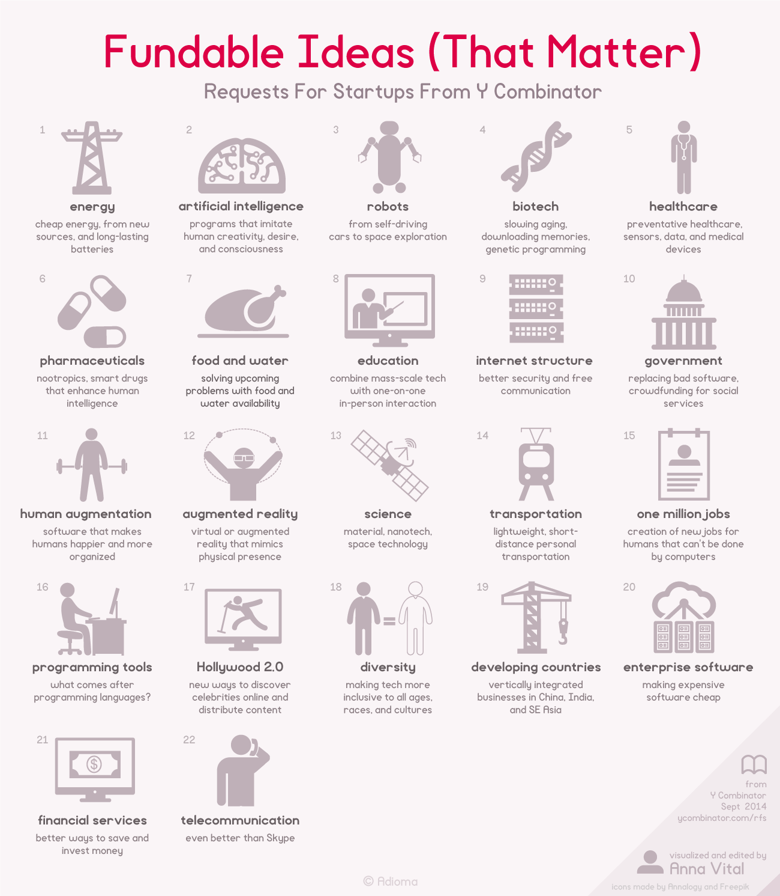

If there is any mystery in what kind of startup ideas are fundable, the good news is there are quite a few ideas that clearly are. Why don’t people jump on them right away? As you will see these ideas are just as useful as they are challenging. But not impossible.

List of such ideas compiled by [Y Combinator](https://www.ycombinator.com). They come in large categories.

[[**UPDATED**: Based on Y Combinator *request for startups* from August 2022 ]]

## A.I.
AI stands to have a [large impact](http://blog.samaltman.com/ai) on society.

It feels like it could be one of the dividing lines in the history of technology, where before and after look totally different. We’re interested in people applying research to any narrow domain (drug discovery, programming assistant, legal advice, fraud detection, etc) and especially those focused on the intersection of AI and robotics (manufacturing, self-driving cars, etc).

## BIO
It’s still early, but we’re finally making real progress hacking biology.

We are certain that this is going to be a surprising, powerful and controversial field over the next several decades. It feels a little bit like microcomputers in the 1970s.

Engineering principles are now routinely applied through synthetic biology and bio is touching all aspects of life from healthcare to manufacturing and even food and agriculture.

There are so many directions this can go–fighting disease, slowing aging, merging humans and computers, downloading memories, genetic programming, etc.

Reading DNA has become incredibly fast and cheap. There are many interesting applications here. There will perhaps be even more interesting applications as we get better at writing DNA.

We are also interested in applications of biotech to prevent its own misuses. For example, if the bad guys can create new infectious diseases quickly, it’d be nice if the good guys could create new cures and vaccines quickly as well.

## BRICK and MORTAR 2.0
We are interested in seeing startups that use brick-and-mortar commercial or retail space in interesting and efficient ways.

Amazon is putting malls and big box stores out of business. Rather than fighting a losing battle with Amazon, brands need to rethink how to use retail space in ways that play to their strengths. Tesla, Warby Parker, and Peloton, for example, use brick and mortar locations as showrooms that complement their online sales channels. Without the need to store inventory, retail space can be used much more efficiently.

Interesting uses of brick-and-mortar space are not limited to retail stores: similar sea changes are happening to restaurants, entertainment venues, local service providers, and office buildings. New businesses will be purpose-built for customers that are trained to expect features like online ordering, deep integrations with other services, and immediate delivery. Flexibility is key. For instance, it is likely that rather than multi-year leases, businesses of the future will utilize “micro-leases” that last days or even hours.

Additionally, the era of big box stores that migrated consumer attention out of main street and into suburban shopping centers flanked by parking lots is likely to change as the era of self-driving begins. Once self-driving cars are adopted widely, our relationship with physical space will evolve in ways that are hard to predict. We want to see startups that are thinking about that shift and building new ways to use physical space.

## CARBON REMOVAL TECHNOLOGIES
**The Paris Agreement set forth a global goal to limit the earth’s temperature increase to 1.5°C this century. Just switching to renewables isn’t going to be enough to reach that goal. We will also have to remove carbon from the atmosphere.**

Carbon removal and sequestration technologies are still in their infancy. The current solutions can be divided into two groups: natural (such as reforestation and biochar) and technological (such as direct air capture). Several countries including the US recently stepped up and created financial incentives for removing carbon from the atmosphere, but it is not yet cost effective with current technology.

Other approaches to geoengineering to counteract the effects of climate change could have potential as well.

We wrote a lot more about this at [carbon.ycombinator.com](https://carbon.ycombinator.com/).

## CELLULAR AGRICULTURE and CLEAN MEAT
**Recent scientific developments have changed the way we think about producing protein.**

For the first time, we can now produce food that is scientifically indistinguishable from animal products like meat and dairy, using only cells and not harming any animals.

Today humans use farm animals mostly for meat and dairy production. Whether or not you believe this is cruel and wasteful, we know it’s not sustainable. More people eat meat every year, yet most of the available farmland in our world is already being used for production of meat. The agricultural sector is the world’s second-largest emitter of greenhouse gas after the energy sector, and the use of antibiotics in farming is real danger to our own health system.

Growing real animal-meat directly from cells is a revolutionary science. We would love to fund more startups taking this science to market. We also want to fund startups specializing in the scaling phase of cellular agriculture. The world will massively benefit from a more sustainable, cheaper and more healthy production of meat.

## DIVERSITY
A diverse workforce is good for business and good for the world.

Without different perspectives, the products and services we create will miss big opportunities for large segments of people. We want to fund non-profits and startups that are working on making technology a place that is more inclusive and attractive to people of all ages, races, sexual orientations, and cultures.

## EDUCATION
If we can fix education, we can eventually do everything else on this list.

Human brain power is vastly underutilized on this planet because most people lack access to a good education. Strong education systems lead to greater social mobility, better workers, better citizens, and more and better startups. A small increase in the learning output of education systems across the globe would have an enormous impact on human productivity and economic growth.

We are interested in new school models that can develop critical thinking, creativity, citizenship, and job skills at massive scale. We’re looking for ideas that combine technology and person-to-person interactions to deliver highly individualized educational experiences.

We also know that 90% of the human brain develops before age 5 and achievement gaps open up well before kindergarten. We’re interested in ventures that dramatically improve outcomes for children from birth to age five, that reduce inequality, and that have the potential to enhance the future quality of life for those children and their families. Scalable solutions in these areas should now be doable thanks to advances in brain science and technologies such as smart home devices, wearables, and mobile.

## ENERGY
**There is a remarkable correlation between the cost of energy and quality of life.**

Throughout history, when the cost of energy has come down a lot (for example, with the steam engine) the quality of life has drastically improved.

Cheap energy would do a huge amount to reduce poverty. New energy sources could also help the environment, the economy, reduce war, ensure a stable future, make food and water more abundant, and much more.

We believe economics will dominate—new sources must be cheaper than old ones, without subsidies, and be able to scale to global demand. Nuclear energy can hit the bid, and possibly so can renewables. But pricing is the first order question.

In addition to generation, we’re also interested in energy storage and transmission. 10x better batteries would enable great new things, as would the ability to easily move energy around.

## ENTERPRISE SOFTWARE
**Software used by large companies is still awful and still very lucrative.**

Category-defining enterprise software companies will emerge to solve problems for every vertical, every business size, and every job function. Here are 3 specific areas we think are particularly interesting:

1. **Making The Expensive Cheap**: Because of the cost of traditional enterprise software, many categories of solutions were previously cost prohibitive for small or even medium sized businesses to benefit from.

2. **The Next Billion Workers**: Traditionally office-based knowledge workers have been the users of enterprise software. Mobile phones and tablets turn every type of employee – from the retail store associate to the field services team – into a knowledge worker.

3. **Digitizing Every Industry**: Every industry is going through some form of information-based disruption; this is causing businesses to modernize their practices, leveraging new data, accelerating key processes, and delivering digitally-enabled experiences in the process.

## FINANCIAL SERVICES
**The world’s financial systems are increasingly unable to meet the demands of consumers and businesses.**

That makes some sense because regulations designed to protect customers can’t change fast enough to keep up with the pace at which technology is changing the needs of those customers. This mismatch creates inefficiencies at almost every level of the financial system. It impacts how people invest their savings, how businesses gain access to capital to grow, how risk is priced and insured, and how financial firms do business with each other.

We think that software will accelerate the pace at which financial services change and will eventually shift the nature of regulations. We want to fund companies with novel ideas of how to make that happen.

## FUTURE OF WORK
**Jobs will look very different 25 years from now.**

We’ve already seen a massive shift toward automation, robots, and AI, and the pace of their impact on work isn’t slowing down.

There’s uncertainty on whether these new technologies will result in more or fewer jobs in aggregate. We’re interested in what you think will happen and what comes next.

In particular, we want to figure out what new work will be created to leverage these new technologies. And what can be built to help people and companies adapt to the changing skills requirements they face.

We also want to know how the meaning of work will evolve. People seek full-time jobs for many reasons, including money, healthcare, and a sense of purpose. We’d love to see solutions that address each of these factors (or any others) in anticipation of a changing job market.

## GOVERNMENT 2.0
In 2018, Pew Research Center reported that 57% of Americans believe that children in America today will be worse off financially than their parents. Since 2013, this number has been as high as 65% — even though we are experiencing our tenth straight year of economic growth.

We believe this mindset is the result of increased family debt, stagnant wages, and a lack of government commitment to provide equal access to the basic services families need to thrive. These services include access to quality education, affordable housing, healthcare, food, physical safety, accurate news and information, a social safety net, and a livable environment.

## HEALTHCARE
**Healthcare in the United States is badly broken. We are getting close to spending 20% of our GDP on healthcare; this is unsustainable.**

We’re interested in ways to make healthcare better for less money.

We’re especially interested in healthcare startups working in the following spaces:

* **Pharmaceuticals**: With computational drug discovery and omics data, we have vastly more powerful tools than before for inventing new drugs. It’s more achievable than ever for startups to make breakthroughs in this area.

* **Cell Therapies**: With breakthroughs in iPSC and CAR-T technology, there is a well-warranted explosion of interest in cell therapies. What we’ve seen here is probably just the beginning.

* **Diagnostics**: There are big trends in this space towards continuous monitoring and portable and point-of-care diagnostics. We’re interested in both hardware and software / AI based diagnostics.

* **Medical Devices**: Costs of prototyping and manufacturing are lower than ever and computational power is higher than ever. We’re excited to see what devices have the most clinical impact and how the data they generate can make medical devices more valuable than ever before.

* **Data**: With the ability to collect omics data inexpensively, there is a a huge opportunity to create new datasets of healthcare data and mine them for useful insights.

## IMPROVING MEMORY
**Human memory is too volatile.**

Compared with computers, humans have an odd memory system. We can recall subtle emotions and feelings from 10 years ago while simultaneously forgetting where our phone is and what to pick up at the store. The increasing bombardment of information and ideas certainly does not make it easier, nor do age onset diseases like dementia and Alzheimer’s.

[The Merge](http://blog.samaltman.com/the-merge) is coming. Some solutions like voice assistants and wearables may help supplement short-term memory. More complex approaches involve neural interfaces but raise new UX problems. We want to fund startups that are exploring how to improve human memory with technology. Ideally we can solve [Mitch Hedberg’s problem](https://quotecatalog.com/quote/mitch-hedberg-i-write-jokes-f-jpXNBB1) once and for all.

## LONGEVITY and ANTI-AGING
**We spend billions of dollars a year researching diseases of aging like cancer and heart disease, but only a tiny fraction of that researching aging itself.**

We think this is a misallocation of resources. We now have the understanding of biology to work on therapies that directly address the root causes of aging. We’ve funded several companies working on this and we’d like to fund more.

## ONE MILLION JOBS
**We want to fund companies that have the potential to create a million jobs.**

There are a lot of areas where it makes sense to divide labor between humans and computers-—we are very good at some things computers are terrible at and vice versa—-and some of these require huge amounts of human resources.

This is both good for the world and likely a good business strategy—-as existing jobs go away, a company that creates a lot of new jobs should be able to get a lot of talented people.

## SUPPORTING CREATORS
**The internet has made it easy to distribute creative work to millions of people, but no one has figured out how to help creatives make a sustainable living.**

In the arts, there is an army of middle men that exist between the artist and the fan. Each person in the middle takes a cut of each dollar made by the artist. We want to see more startups that are building a direct pipeline from artist to fan.

We believe there are ways to build more creator-friendly platforms, and we’re interested in seeing projects that make it easier for artists to raise funding, track consumption of their work and prevent piracy.

## TRANSPORTATION and HOUSING
**About half of all energy is used on transportation, and people spend a huge amount of time unhappily commuting.**

Face-to-face interaction is still really important; people still need to move around. And housing continues to get more expensive, partially due to difficulties in transportation. We’re interested in better ways for people to live somewhere nice, work together, and have easier commutes.

Specifically, lightweight, short-distance personal transportation is something we’re interested in.

## UNDERSERVED COMMUNITIES and SOCIAL SERVICES
**Tens of millions of working poor in America don’t see a path to the middle class.**

This population has to navigate a world with substandard services, low quality housing, overcrowded schools, and crime in their neighborhoods. They are often unbanked and living paycheck to paycheck.

The US government alone spends hundreds of billions of dollars per year on social services and safety net programs for these underserved communities.

We believe great non-profits and for-profits can bring technology and strong metrics-driven approaches to this largely ignored, massive market.

## VR and AR
**Virtual reality and augmented reality have been a long-unfulfilled promise.**

But we feel the wave is coming, and this is the right time to start working on it.

## References




