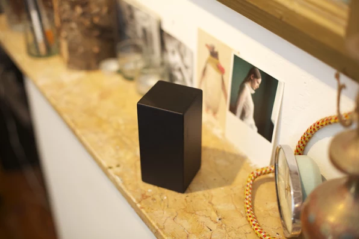

> A Xmas gift for the block-head in your family when you just have money to burn...

# A blog post about Nothing: A block of wood to remind us of over-consumption
How much money can be made by selling a block of wood meant to remind people that they don't need to spend money on frivolous goods? Amsterdam-based copywriter Pim de Graaff hopes to answer that question...

** https://www.fastcompany.com/3026064/buy-this-50-block-of-wood-to-remind-you-to-stop-buying-so-much-stuff