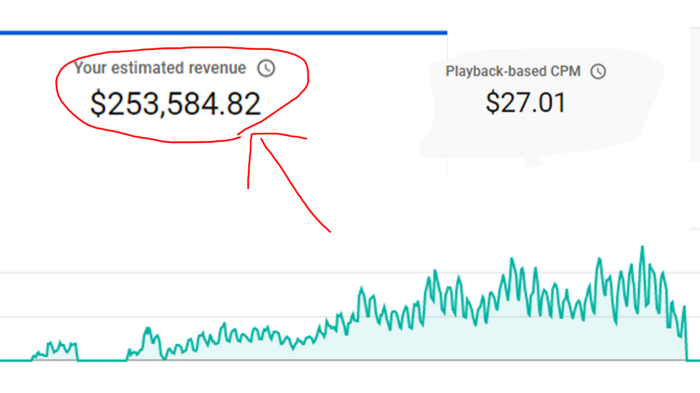
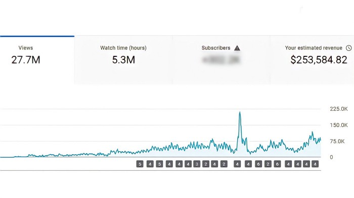
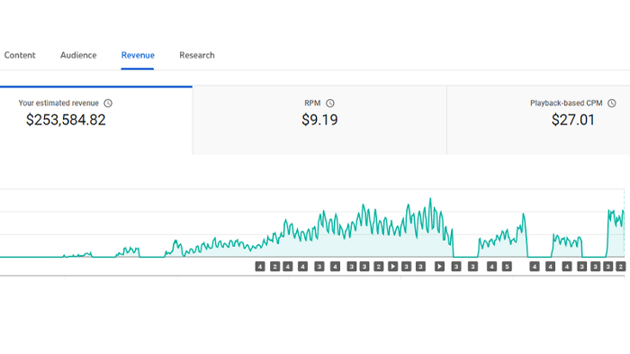
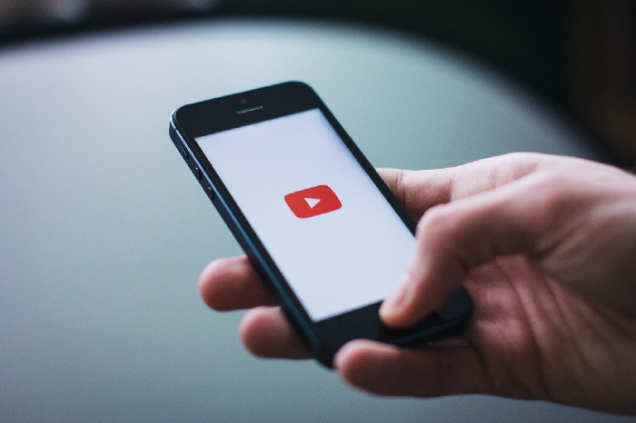

Yeah, that’s right. I made $253,584 from YouTube over the past 2 years, uploading almost 200 videos.

Due to an identity crisis in 2020, I decided to use my time for something productive and to make money. It was then I acted on my idea for a YouTube channel. I heard from a YouTube tips video that most channels get viral after uploading almost 50 videos(on average).

So it was a rush to get to the first 50 videos, and I did it within the first month. I didn’t even step outside of my house that month. The 38th video of the channel went viral. And it brought in almost 1K subscribers within the first 2 months of starting the channel. I am not revealing the name of my channel due to privacy reasons.

Now, after 2 years and a couple of months, the channel has generated a total of 27.7 Million views and $253,584 in revenue.

Let me break it down for you.

The most important factors that influence YouTube revenue...

## Where your audience is watching from
You will have a higher revenue per 1000 views if most of your viewers are from developed countries(US, UK, Australia, etc.). The reason for this is the higher purchasing power of the citizens in these countries.

## The age group of your viewers
The age category your audience belongs to is also an essential factor. YouTube RPM is higher for the channels with an adult audience, mainly in the age group 34–55 years old, as they are the viewers with the most purchasing power.

## Category of your video
A video’s category matters because, imagine you have a kids channel, your audience will be in the age group 5–13, who has the least buying power comparatively. So YouTube won’t show them a commercial for an expensive brand.

Expensive brands or companies in the financial sector(Insurance companies) spend the most on advertising on YouTube. So if your videos are in the finance category, that can boost your RPM. Videos in the educational category also stand at the top of RPM rate charts.

## Length of your video
The longer your video is, the more ads you can place in it, which leads to higher revenue. Also, YouTube prioritizes videos with longer audience retention as it keeps the viewer’s eyeballs on the platform for a comparatively longer time.

Most of my audience was from the US, between the age group 25–34, and the content I uploaded was in the educational category. Contributing to an RPM of $12–14. RPM is revenue per 1000 views. The US audience has more buying power than other countries, so my RPM was also high as most of my audience was from the US.

## Metrics

* 70% of my total revenue came from just 10 videos.
* $57,065.06 from the top-performing video.
* $22,052.67 from the 2nd most top-performing video.
* $19,202.08 from the 3rd, $18,812.61 from the 4th, and $14,042.84 from the 5th most top-performing video.

## fini
I know people who have uploaded videos consistently for 10 years and didn’t go viral or make money much from YouTube. I would say that they didn’t try to differentiate their channel from those in their same niche. That was the reason they didn’t go viral. There should be a reason for people to spend, let’s say, 10 minutes of their day watching your video.

If your videos are similar to other creators, then maintaining a loyal fan-base or even going viral for the first time can be challenging. Even after you go viral, you should strive to improve each one of your videos to make the viewer stick to your channel. A better and simple strategy for YouTube is to just — make your next video better than the last one.

It really struck me when [MrBeast](https://en.wikipedia.org/wiki/MrBeast) said in an interview that when you look at your videos uploaded 6 months back, you should feel ashamed of those seeing how bad they are. That mindset is the reason why we see him on our YouTube home page daily.

## BONUS
16 Proven tips to promote your YouTube Channel
1. Write engaging, must-see titles
2. Optimize your videos for visibility
3. Figure out what your audience wants
4. Engage with the YouTube community
5. Customize your thumbnails
6. Cross-promote your own videos on YouTube
7. Target Google search results
8. Run a contest or giveaway
9. Encourage viewers to follow your series
10. Embed your YouTube videos
11. Create playlists to organize your YouTube content
12. Increase engagement with calls to action
13. Give live streaming a try
14. Collaborate with other creators and brands
15. Run a paid YouTube ad campaign
16. Regularly publish your YouTube content to social media

## References
- https://www.tubebuddy.com/blog/category/youtube-strategy-tips/
- https://sproutsocial.com/insights/how-to-promote-your-youtube-channel/
- https://blog.hootsuite.com/how-to-create-a-youtube-account-channel/
- https://blog.hootsuite.com/youtube-marketing/