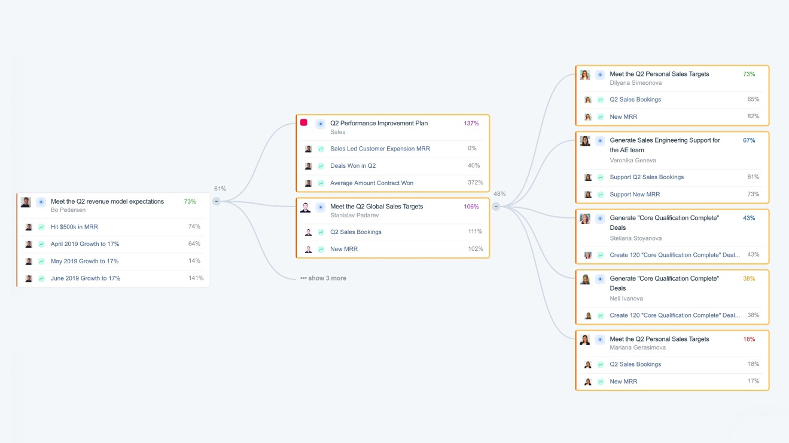
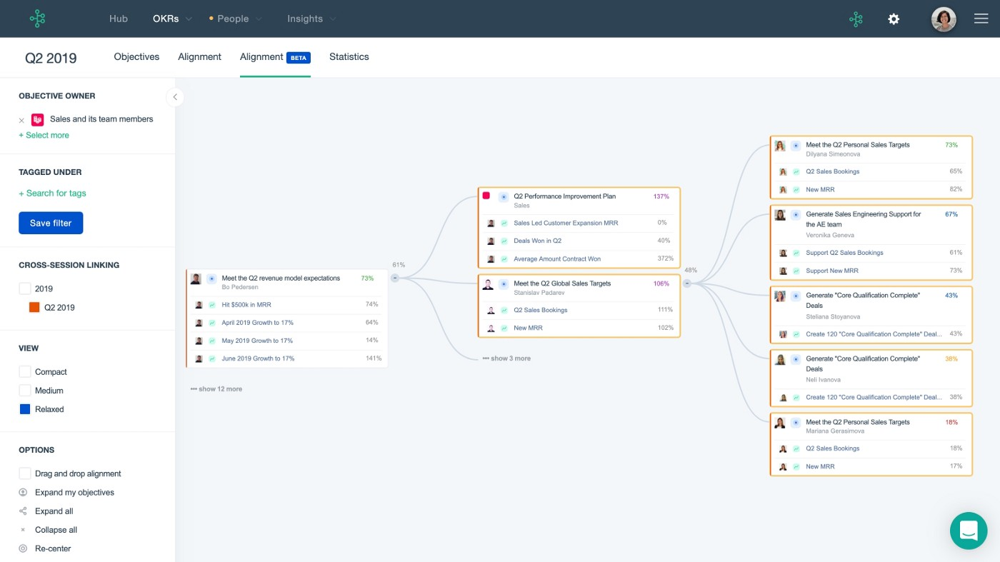
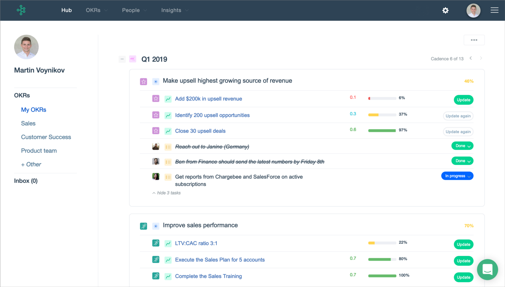
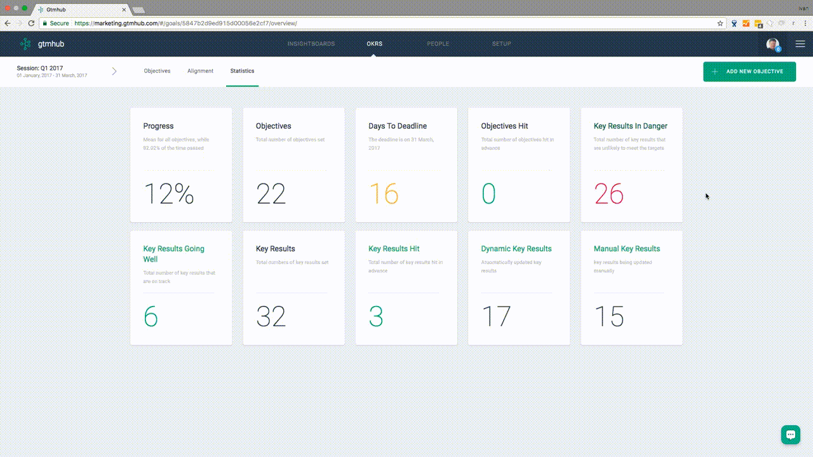

 *Amazon, Facebook & Microsoft all use the same approach*
 
 

 10 years after having started his company, and after going from a 5-people company to 50 full-time employees, my CEO sold for $30 million last year.

 3 years before selling however, the company was not in good shape at all. In fact, we were headed straight into a hard concrete wall unless we decided to change the way we did things. We were losing too many customers and not signing new ones, no leads were coming through, and our internal turnover was very high. Employees were leaving because they didn’t see a future with the company, and there was no structure to the workflow whatsoever.

 We did have one recurring event that took place every Monday: the Weekly Town Hall. The goal was to keep everyone in the loop on what was happening in various departments. It was on a Monday that our CEO announced we were going to implement a new strategy to completely revamp the way we did things internally: the OKR strategy.

 Ever since we started working with this strategy, the company has grown exponentially, and I am 100% certain we could have never sold for millions without this change. The company would have either died before that, or become an unorganised, money-bleeding shipwreck bound to sink, that nobody would have been interested in buying.

 This is not to say that the OKR strategy is a magic recipe that will save any company from bankruptcy. But I definitely think it can help bringing structure, accountability and productivity to an organisation that doesn’t really have a framework in place. The OKR strategy is great for 3 main reasons:

 * **It is crystal clear:** key results lead to objectives, defined in the overall strategy.
 * **It is segmented:** each department can have their own goals while being part of the same strategy.
 * **It is scalable:** whether you’re a one-person company or a 100-employee business, you can use this strategy.

 The OKR strategy is used by some of the biggest and most successful companies in the world: Amazon, Facebook, Microsoft, Oracle, Slack, Uber…

 Let’s see how it works.

## The strategy
 The OKR strategy was developed in 1968 by Andrew Grove, the co-founder and CEO of Intel at the time. He based his strategy off the MBO strategy (Management By Objectives), and it proved very efficient. He introduced it to Larry Page and Sergey Brin (Google’s founders) when he joined the board of early investors at the then young Silicon Valley company. To this day, the OKR strategy is still used by Google.

### OKR stands for Objective Key Results
 * **Objective:** it explains where you want to go, what the desired end-result is. Once an objective is reached, another objective will replace the current one. Objectives in the OKR strategy are not technical, not measured, and usually don’t contain numbers. They should be as easy to understand as possible.
 * **Key Result:** unlike the Objective the Key Result should be as precise, technical and measured as possible. It is used as an indicator of whether or not the Objective is being worked on. Key results should be time-bound, often quarterly or yearly.

### A few examples
#### Objective A
 Optimise the marketing funnel to reduce the lead-to-customer time.

#### Key Results A
 Develop 2x more email marketing funnels before the end of the quarter + Increase click rate by 50%.

#### Objective B
 Release a game-changing product feature that will place the company ahead of the competition.

#### Key Results B
 Beta-test a new feature with 10 existing customers + Release 3 blogposts about the feature.

#### Objective C
 Make sure existing customers are enticed to upgrade their license.
#### Key Results C
 Increase customer satisfaction rating by 4 points + break down advantages of an upgrade to 10 customers minimum.

## The benefits
 The number one benefit of the OKR strategy is that it creates transparency and accountability within the organisation. Given our relatively small size and our CEO’s managing style, we never had transparency issues at our company, but everything was all over the place. It wasn’t that we were not allowed to see things, but it was all blurry, there was not much to see.

 This is not to say that companies in general don’t know where they’re going (although that’s the case for many). But in any company, even the biggest ones, organisation and transparency could often be improved.

 From the moment we started implementing the OKR strategy, each manager would take 2 minutes every Monday on our Town Halls to explain to everyone what their team’s Key Results were, and what initiatives they had in place to reach them. This accountability and reporting framework creates a positive synergy where every employee feels part of the organisation, and is able to contribute to the overarching vision of the company.

 OKRs also help teams focusing on what’s most important by dismissing tasks that don’t contribute to increasing the Key Result metrics, and by understanding how each team’s tasks interact with each other. This was helped even more by using an OKR tracking tool internally.

## The tool
 All OKR tools basically do the same thing: they give all employees the ability to get a clear, visual picture of where the company is headed. They translate the OKR framework into a visually compelling output. At our office, we use [Gtmhub](https://gtmhub.com/) for that, and this is what it looks like:

 

 Each Objective is expandable to reveal the Key Results attached to it, which can reveal the different initiatives assigned to each employee. Objectives and Key Results involve teams, and initiatives involve specific people. Gtmhub has a ton of search options to filter based on:

 * Person in charge
 * Completion rate
 * Department task
 * Team assigned
 * …

 Everything is made easy to search and understand. Of course, the bigger the company, the more complex the “strategy tree” will look. That’s why a more simple table view is also available:

 

 All Key Results are automatically added up together and averaged by Gtmhub, and an overview of all the metrics is available in the Statistics section, as a dashboard. Tiles that involve Key Results are clickable to get a direct overview of the metrics they’re referring to.

 

## The results
 Within 2 years of having implemented the OKR strategy, my CEO’s company went from nearly bankrupt to being acquired for $30 million and still expanding. In the meantime, the biggest pandemic in over a century struck all around the world, and as everyone tried to work around the new normal, I am convinced this strategy played a huge part in the company being able to sail through the storm.

 The OKR strategy was developed 50 years ago by Intel, was adopted by Google in 1999, and is still used by the biggest organisations nowadays. It is not the only framework available to companies looking to change the way they do things in the 21st century, but it is definitely one of the most reliable, efficient, and time-tested one.

