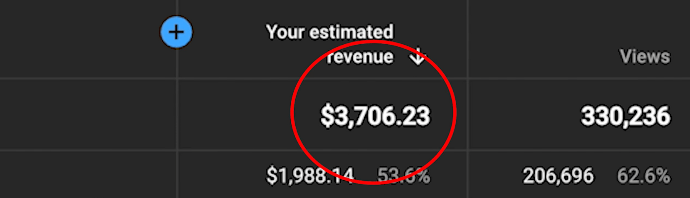
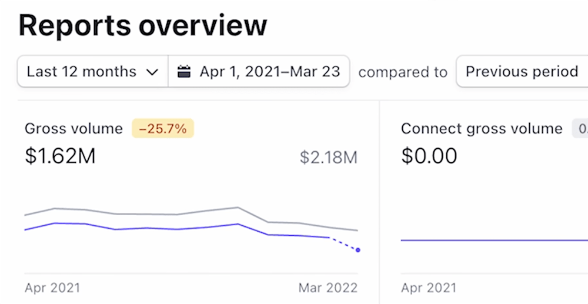
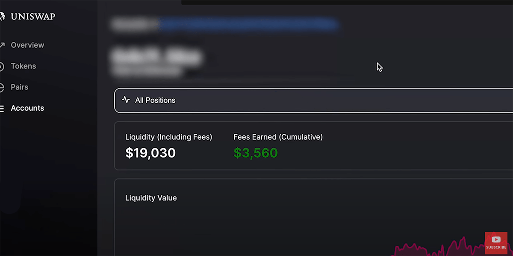
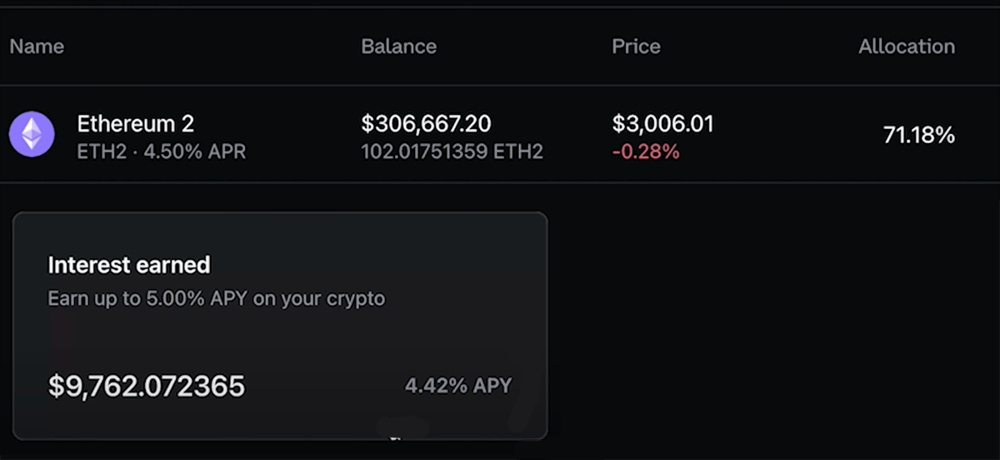
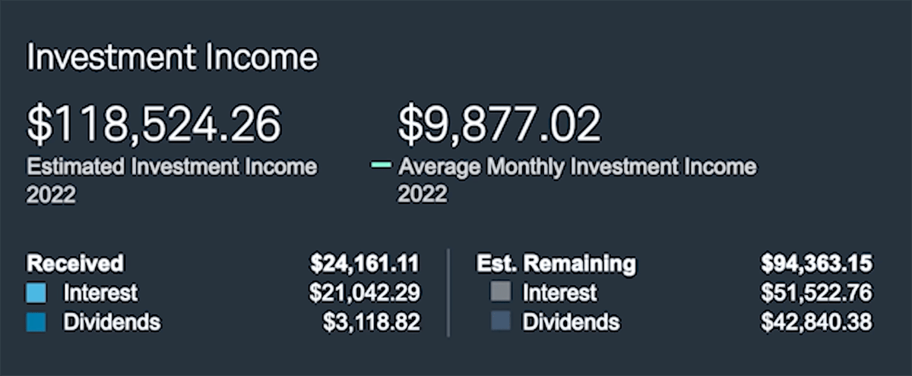
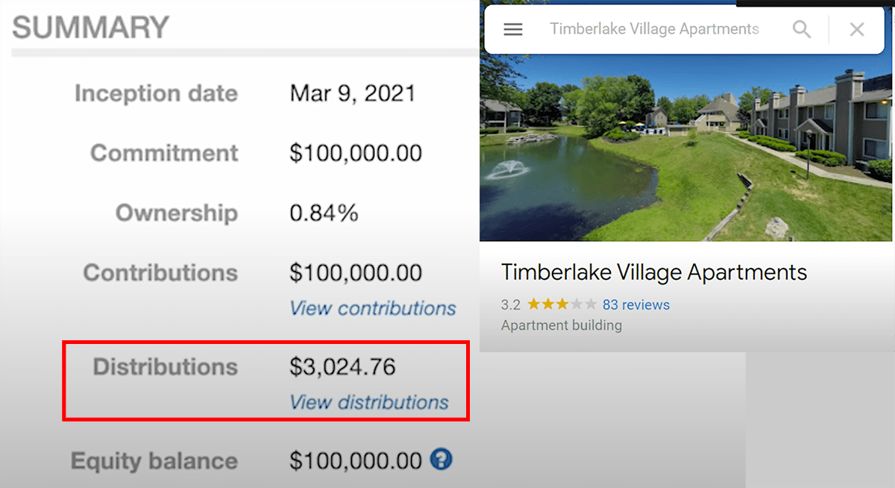
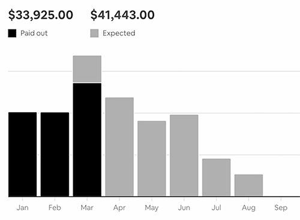

 *Work while you’re awake to make money while you sleep.*

 Noah Kagan is a 40-year-old entrepreneur who built sumo.com, one of the most popular email capture tools out there. He also has a Youtube channel where he regularly posts money-making ideas and entrepreneurship tips for people who want to follow in his footsteps.

 Noah recently posted [a video](https://youtu.be/HHR-NeSuynw) where he breaks down his “passive” income channels as an entrepreneur and Youtuber, and how they make him over $350K per month. The thing is, a lot of his income streams are not passive at all. Rather, they are the accumulative result of years of hard work and dedication, which now enables him to take a step back, relax and enjoy his success. But to be clear, he would never be making this amount of money “passively” if he hadn’t worked his butt off before that.

 In this article, I want to go over the caveats of Noah’s so-called passive income and break down what it really takes to make money while you sleep (hint: to work while you’re awake).

## Digital products — $2,227
 Noah makes $2,227 per month thanks to 2 digital products he created over 8 years ago. The first one is a book he wrote after he was fired from Facebook. It’s still netting him $227 in amazon royalties every month.

 The second one is a business course he created with his team, and that still makes around $2,000 per month. It’s important to note that although this income stream is now 100% passive (people just come to his website, purchase, and consume it) it took a whole team and a lot of money to make this course happen. Noah did make his money back as the course generated over $1 million in sales the first year it launched, but this goes to show there is a big upfront investment in work and people.

## Youtube revenue on old videos — $3,700
 

 Noah noticed that videos he shot with his team over a year ago are only now starting to make decent money (he has 368K subscribers on his channel). The big caveat is that his studio spent around $400,000 on making content that same year, so he’s in the negative here. Noah also doesn’t go into the details of how much his channel is making now versus how much he’s spending on it (I assume this number is negative as well).

 Later, when he grows his audience and his videos start making even more money, the investment in time and money will be 100% worth it, because he’ll be able to recoup his production costs. But right now, saying his old Youtube videos are making “passive income” is a bit of a stretch.

## Blog and email list — $65
 The amount of money Noah makes from his email list is negligible compared to the rest of his income streams, but he does have a very interesting take on it:


This has probably been one of the most valuable passive and active income streams I’ve had in my life. It introduced me to the most amazing people. An example of this is I was able to meet Tim Ferriss who’s become a good friend of mine over many many years. I think this is one of the easiest to start, where you can get a blog on so many different sites, you can start a newsletter super easily.


 As a blogger and entrepreneur myself, I can 100% relate to what he is saying here. Building an email list and responding to emails from people who read and like my content has been one of the best ways to discover great work and stay in touch with people online.

 Just by getting in touch via email, I’ve also had the opportunity to interview [75 people](https://josephmavericks.com/75people) on the topics of productivity, entrepreneurship, and online writing. The wealth of information, knowledge, and motivation I acquired through these interviews has been absolutely invaluable, worth a lot more than what I can make from my email list.

## Owning a business — $310,000
 This is how Noah makes most of his money, and again it’s not 100% accurate to say this is passive income, for 2 main reasons:

 Running and maintaining a business requires a lot of work, even if you get highly rewarded for it.
 
 This is business income, not personal income. It doesn’t go directly into Noah’s pocket and doesn’t include all the expenses (employees, office space, and other operating costs…)
 
 This income channel is split into 3 subcategories:

### Lifetime deals on appsumo.com
 Noah founded appsumo.com in 2010. It is a daily deals website for digitally distributed goods and online services, and you can get crazy deals on awesome products there (like paying once for lifetime access). Noah gives the example of Sendfox, a solution to automatically send customized emails that makes over $27,500 per month.

### Sumo.com
 Noah also created and owns sumo.com, one of the most popular email capture tools online. It’s subscription-based and made over $1.62 million from April 2021 to March 2022.

 

 It’s interesting to note that on the screenshot Noah shares, you can see his gross volume is down 25% (highlighted in orange) from the 12 months before April 2021. If this trend continues, his revenue will shrink in the years to come.

 This is very important to consider when running a business, especially Saas (Software As A Service). In the first section of this article, we mentioned how Noah made $1 million in the first year he launched his online course, and how he’s now making “only” $2,000 per month from it. This is what happens when you don’t update and maintain your offering.

 I used sumo.com for years for my blog, before switching to another platform. The reason for my choice was very simple: as Noah says himself, his solution has stayed the same for years, and the team doesn’t do any updates. I’m all for simple, efficient tools, but I’ve found that sumo.com’s UX and design clearly need a refresh, which hasn’t come yet. If the team doesn’t update the tool, I expect his revenue to keep dropping.

### Salary as founder
Noah also mentions he personally makes an additional $80,000 per month from sumo.com. While it’s not clear how exactly he makes that money, he seems to imply it’s his compensation as the founder of the company.


When I created this company 12 years ago it took a lot of work, and for the first 3 years I made almost 0 dollars. But through many many years of consistency and putting in the work, finding a business model and awesome customers, building a team, I’ve been able to create a company where, whether I’m involved or not involved, it’s been able to do really well for me as a passive income business.


 As for many of the income streams mentioned in this article, the main caveat for all of Noah’s money coming from his business is that he had to work for 12 years to get here. You don’t go from making $0 to $1.6 million in sales in a few months.

## Cryptocurrency — $7,523
 We are now getting into the “investments” part of the article: things like real estate, index funds, and… cryptocurrency. It’s important to remember that most people don’t have $20,000 or even $10,000 lying around that they can afford to invest and lose if things go south.

 While it’s accurate to say that these income streams are 100% passive (unlike the 4 ones above), the cash required to invest in those options usually comes from exactly the opposite of passive income: years of hard work, dedication, and commitment (like the 4 options mentioned above).

### Uniswap liquidity pools — $323


A liquidity pool is a crowdsourced pool of cryptocurrencies or tokens locked in a smart contract that is used to facilitate trades between the assets on a decentralized exchange.


 Essentially, it’s about providing liquidity on an exchange platform, to make sure trades between users go smoothly. Exchange platforms usually reward users for providing liquidity with a return on their initial investment, and that’s how Noah makes his money there.

 He has around $19,000 split across 2 currency pairs on his account, and makes around $323 per month from it:

 

 That’s an annual return of 20%, which is huge. But there are very big caveats to this income stream:
 * The interest earned is paid out in crypto, and since crypto prices change every day, your payout itself will vary in value from one day to the other
 * The principal ($19,000) is owned in crypto as well, so the value of your initial investment will vary with the crypto market too, making it highly volatile and extremely risky
 * There is zero guarantee on the return rate, and between fees and volatility, this option may very well start losing money at some point

### Staking crypto — $7,200
 Staking offers crypto holders a way of putting their digital assets to work and earning passive income without needing to sell them.


You can think of staking as the crypto equivalent of putting money in a high-yield savings account. When you deposit funds in a savings account, the bank takes that money and typically lends it out to others. In return for locking up that money with the bank, you receive a portion of the interest earned from lending.


 Except the cryptocurrency market is NOT a bank. Again, the combination of crypto volatility and the fluctuation in return rates makes for a very high-risk cocktail. Noah is holding 100 ETH (worth around $306,000 at the time the video was shot) and he’s made almost $10,000 from it doing nothing, but his principal will lose value if ETH goes down. For this reason, the return rate of staking is usually less than the advertised number.

 

 Another caveat when it comes to crypto: any crypto marketplace can go out of business and take your money with them. Although this is unlikely to happen with the few most established platforms, it has happened countless times with smaller platforms. I highly advise against investing in cryptocurrency unless you can afford to lose the money.

## Index funds — $10,000
 


I’ve been investing in index funds since 2004. All I do is, every single month it goes straight from my paycheck into the [investment] account. I was putting 50% of my income through this stuff and lived really cheap for many years, that is how I was able to become a millionaire by 30.


 I would be very cautious when hearing people claim they became millionaires by investing part of their paycheck in index funds. In fact, Noah published another video where he explains how he made his first million with his company sumo.com, not by investing in the stock market.

 Index funds are generally considered a safe and reliable way to earn a consistent return on your investment, that is true. But they usually won’t make you more than 5% a year, which is only $5,000 per year if you invest $100,000. Plus, you have to pay taxes when you cash it out.

 And again, if you live paycheck to paycheck this option is a no-go for you, so you might as well start by looking into creating your own business, becoming your own boss, making money blogging…

## Real estate — $22,500
 This is the last of Noah’s income streams, and he invests in real estate in 3 different ways:

### Syndicates — $2,500
 

 Syndicates are private people who collect money from investors and use it to buy buildings. As an investor, you then earn a return on your money based on how much the building makes in rent and how much you invested in the project. Noah says he has invested around $300,000 in this and generally makes a 10% yearly return.

### Renting out office space — $10,000
 Noah bought office space that he is renting to his company, which is very common for founders to do (again if you have the liquidity). As an owner of your own business, being your landlord and your tenant at the same time is a great deal.

### Airbnb — $10,000
 

 Noah has 2 properties managed by a property manager, so he doesn’t have to take care of anything. One of his Airbnbs is a house he just moved out of, and the reason he was able to move somewhere else without selling is that his net worth is high enough.

## Work first, invest later
 If there is one big lesson to remember from all this, that’s the one. There is so much content out there on so-called “passive income”, but usually with options that either require money most people don’t have or that derive from owning your own business/company, which is nowhere near passive.

 I invest in crypto once in a while, I’ll play around with stocks a little bit… But I never, ever invested any of my money before I started making a decent income with my business. My advice is to only invest money you can afford to lose, especially when going with risky options like crypto, staking, or even real estate which can be risky too (you have to know the state of the building, the taxes on it, the rents, the paperwork…)

 In conclusion, focus on making the money first, then have fun with it, and don’t believe all the easy passive income stuff you’ll see along the way.

 Good luck, and enjoy the journey.