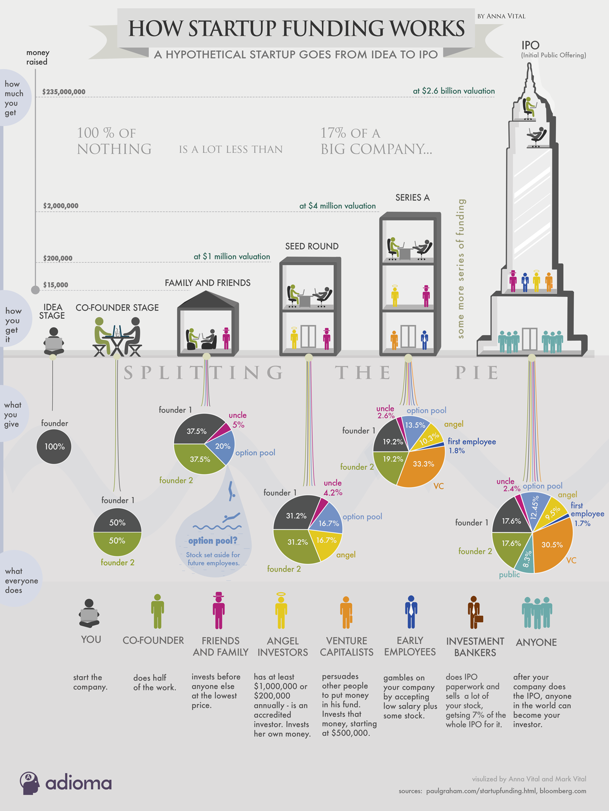

A hypothetical startup will get about $15,000 from family and friends, about $200,000 from an angel investor three months later, and about $2 Million from a VC another six months later. If all goes well. See how startup funding works in this infographic:

First, let’s figure out why we are talking about startup funding as something you need to do. This is not a given. The opposite of funding is “bootstrapping,” the process of funding a startup through your own savings. There are a few companies that bootstrapped for a while until taking investment, like MailChimp and AirBnB.

If you know the basics of how funding works, skim to the end. In this article I am giving the easiest to understand explanation of the process. Let’s start with the basics.

Every time you get funding, you give up a piece of your company. The more startup funding you get, the more company you give up. That ‘piece of company’ is ‘equity.’ Everyone you give it to becomes a co-owner of your company.

## Splitting the Pie
The basic idea behind equity is the splitting of a pie. When you start something, your pie is really small. You have a 100% of a really small, bite-size pie. When you take outside investment and your company grows, your pie becomes bigger. Your slice of the bigger pie will be bigger than your initial bite-size pie.

When Google went public, Larry and Sergey had about 15% of the pie, each. But that 15% was a small slice of a really big pie.

## Startup Funding Stages
Let’s look at how a hypothetical startup would get funding.

### Idea stage
At first it is just you. You are pretty brilliant, and out of the many ideas you have had, you finally decide that this is the one. You start working on it. The moment you started working, you started creating value. That value will translate into equity later, but since you own 100% of it now, and you are the only person in your still unregistered company, you are not even thinking about equity yet.

### Co-Founder Stage
 As you start to transform your idea into a physical prototype you realize that it is taking you longer (it almost always does.) You know you could really use another person’s skills. So you look for a co-founder. You find someone who is both enthusiastic and smart. You work together for a couple of days on your idea, and you see that she is adding a lot of value. So you offer them to become a co-founder. But you can’t pay her any money (and if you could, she would become an employee, not a co-founder), so you offer equity in exchange for work (sweat equity.) But how much should you give? 20% – too little? 40%? After all it is YOUR idea that even made this startup happen. But then you realize that your startup is worth practically nothing at this point, and your co-founder is taking a huge risk on it. You also realize that since she will do half of the work, she should get the same as you – 50%. Otherwise, she might be less motivated than you. A true partnership is based on respect. Respect is based on fairness. Anything less than fairness will fall apart eventually. And you want this thing to last. So you give your co-founder 50%.

 Soon you realize that the two of you have been eating Ramen noodles three times a day. Your startup needs funding. You would prefer to go straight to a VC, but so far you don’t think you have enough of a working product to show, so you start looking at other options.

**The Family and Friends Round**: You think of putting an ad in the newspaper saying, “Startup investment opportunity.” But your lawyer friend tells you that would violate securities laws. Now you are a “private company,” and asking for money from “the public,” that is people you don’t know would be a “public solicitation,” which is illegal for private companies. So who can you take money from?

1. **Accredited investors** – People who either have $1 Million in the bank or make $200,000 annually. They are the “sophisticated investors” – that is people who the government thinks are smart enough to decide whether to invest in an ultra-risky company, like yours. What if you don’t know anyone with $1 Million? You are in luck, because there is an exception – friends and family.
2. **Family and Friends** – Even if your family and friends are not as rich as an investor,  you can still accept their cash. That is what you decide to do, since your co-founder has a rich uncle. You give him 5% of the company in exchange for $15,000 cash. Now you can afford room and ramen for another 6 months while building your prototype.

## Registering the Company
To give uncle the 5%, you registered the company, either though an online service like LegalZoom ($400 as of 2019), or through a lawyer friend (0$-$2,000). You issued some common stock, gave 5% to uncle and set aside 20% for your future employees – that is the ‘option pool.’ (You did this because ① Future investors will want an option pool; ② That stock is safe from you and your co-founders doing anything with it.)

### The Angel Round
With uncle’s cash in pocket and 6 months before it runs out, you realize that you need to start looking for your next startup funding source right now. If you run out of money, your startup dies. So you look at the options:

1. Incubators, accelerators, and “excubators” – these places often provide cash, working space, and advisors. The cash is tight – about $25,000 (for 5 to 10% of the company.) Some advisors are better than cash, like [Paul Graham](https://www.ycombinator.com/blog/author/paul-graham) at Y Combinator.
2. Angels – in 2013 (Q1) the average angel round was $600,000 (from the [HALO report](http://www.angelresourceinstitute.org/resource-center/2012haloreportinfographic.aspx)). That’s the good news. The bad news is that angels were giving that money to companies that they valued at $2.5 million. So, now you have to ask if you are worth $2.5 million. How do you know? Make your best case.  Let’s say it is still early days for you, and your working prototype is not that far along. You find an angel who looks at what you have and thinks that it is worth $1 million. He agrees to invest $200,000.

Now let’s count what percentage of the company you will give to the angel. Not 20%. We have to add the ‘pre-money valuation’ (how much the company is worth before new money comes in) and the investment

$1,000,000 + $200,000 = $1,200,000  post-money valuation

(Think of it like this, first you take the money, then you give the shares. If you gave the shares before you added the angel’s investment, you would be dividing what was there before the angel joined. )

Now divide the investment by the post-money valuation $200,000/$1,200,000=1/6= 16.7%

The angel gets 16.7% of the company, or 1/6.

| shareholder | shares | percent |
| -- | -- | -- |
| angel | 200 | 16.7 |
| uncle | 50 | 4.2 |
| each founder | 250 | 20.8 |
| option pool | 200 | 16.7 |
| -- | -- | -- |
| **total** | 1200 | 100 |

## How Funding Works – Cutting the Pie
What about you, your co-founder and uncle? How much do you have left? All of your stakes will be diluted by 1/6. (See the infographic.)

Is dilution bad? No, because your pie is getting bigger with each investment. But, yes, dilution is bad, because you are losing control of your company. So what should you do? Take investment only when it is necessary. Only take money from people you respect. (There are other ways, like buying shares back from employees or the public, but that is further down the road.)

### Venture Capital Round
Finally, you have built your first version and you have traction with users. You approach VCs. How much can VCs give you?   They invest north of $500,000. Let’s say the VC values what you have now at $4 million. Again, that is your pre-money valuation. He says he wants to invest $2 Million. The math is the same as in the angel round. The VC gets 33.3% of your company. Now it’s his company, too, though.

Your first VC round is your series A. Now you can go on to have series B,C – at some point either of the three things will happen to you. Either you will run out of funding and no one will want to invest, so you die. Or, you get enough funding to build something a bigger company wants to buy, and they acquire you. Or, you do so well that, after many rounds of startup funding, you decide to go public.

## Why Companies Go Public?
There are two basic reasons. Technically an IPO is just another way to raise money, but this time from millions of regular people. Through an IPO a company can sell stocks on the stock market and anyone can buy them. Since anyone can buy you can likely sell a lot of stock right away rather than go to individual investors and ask them to invest. So it sounds like an easier way to get money.

There is another reason to IPO. All those people who have invested in your company so far, including you, are holding the so-called ‘restricted stock’ – basically this is stock that you can’t simply go and sell for cash. Why? Because this is stock of a company that has not been so-to-say “verified by the government,” which is what the IPO process does. Unless the government sees your IPO paperwork, you might as well be selling snake oil, for all people know. So, the government thinks it is not safe to let regular people to invest in such companies. (Of course, that automatically precludes the poor from making high-return investments. But that is another story.) The people who have invested so far want to finally convert or sell their restricted stock and get cash or unrestricted stock, which is almost as good as cash. This is a liquidity event – when what you have becomes easily convertible into cash.

There is another group of people that really want you to IPO. The investment bankers, like Goldman Sachs and Morgan Stanley, to name the most famous ones. They will give you a call and ask to be your lead underwriter – the bank that prepares your IPO paperwork and calls up wealthy clients to sell them your stock.  Why are the bankers so eager? Because they get 7% of all the money you raise in the IPO. In this infographic your startup raised $235,000,000 in the IPO – 7% of that is about $16.5 million (for two or three weeks of work for a team of 12 bankers). As you see, it is a win-win for all.

## Being an Early Employee at a Startup
Last but not least, some of your “sweat equity” investors were the early employees who took stock in exchange for working at low salaries and living with the risk that your startup might fold. At the IPO it is their cash-out day.
