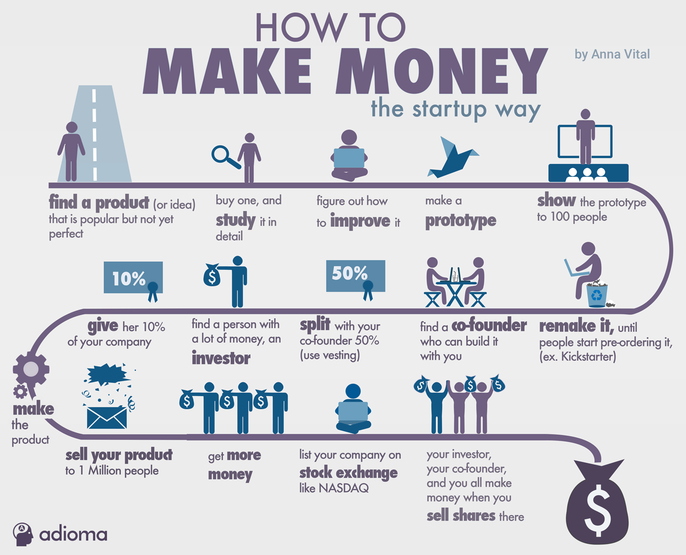

Having a good job is no longer the preferred way of making money among the younger people. This is why:

Starting a company is. This way of money making is riskier but more straightforward than working a job. There is no boss to decide what happens to you. There are 4 protagonists: you, your customers, your investors, and your co-founder. If you succeed, they succeed. And the way to making money for you looks like this:

1. Find a product (or idea) that is popular but not yet perfect
2. Buy one and study it in detail
3. Figure out how to improve it
4. Make a prototype
5. Show the prototype to 100 people
6. Remake it until people are willing to pre-order (for example on Kickstarter or Indiegogo)
7. Find a co-founder who can build it with you
8. [Split the equity](http://fundersandfounders.com/how-funding-works-splitting-equity/) – give your co-founder 50%, but use a vesting agreement so that their share becomes worth more the longer they work on the company
9. Find an investor. This can be a person who has a lot of money (an angel investor)
10. Give her or him 10% of your company
11. Make the product
12. Sell your product to 1 Million people
13. Get more money (this time from VCs)
14. List your company on stock exchange (this is after you’ve either raised a lot of money or have a lot of revenue, or better yet profit)
15. Sell a lot of shares when you list on stock exchange
16. Then just wait out the cooling off period (about 6 months) and you will have your money
