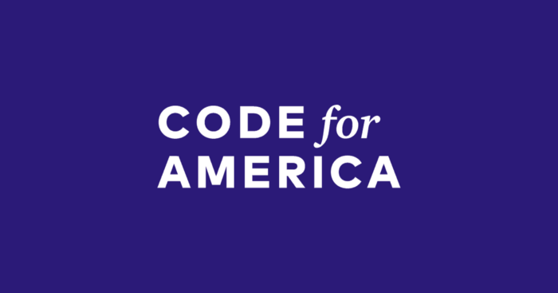
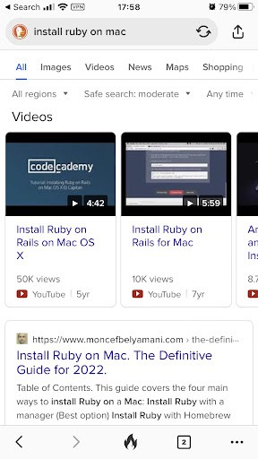

 *Moncef Belyamani started as a DJ in DC area. Now he’s selling a script that makes him $3K a month. Here’s a secret to his success.*

 

 Moncef has always considered himself a deeply tech person. But started his journey as a DJ. For several years he made people dance “the best in House Music in one of DC’s hottest night clubs”. The music did not make him rich — no surprise here — but working as a DJ Moncef learned an important lesson. Listening skill is one of the greatest powers.

 Several years into DJ career — and Moncef decided to make a pivot. He self-taught how to code and was admitted into Code for America fellowship program where promising devs were invited to put their heads together to make an impact. Moncef’s project was about public health services (Ohana API open source platform) built on Ruby — the coding language he became very passionate about. No surprises about it as well — in 2013 Ruby became exceptionally popular in the dev community with the rise of Twitter which became the first super successful startup built on Ruby. This experience with Code for America left Moncef with another important lesson: build for community.

 

 Fast Forward several years — and he was, in the middle of pandemic, no job, and no idea what to do next. That’s where the life lessons he’s gained before came in very handy. Moncef decided to build a product for a community. But first, *listen to what this community really needs*.

## A blog for Ruby developers
 The community Moncef decided to serve was the community of Ruby developers. Or, widely, everyone who was interested in Ruby coding language. [The blog](https://www.moncefbelyamani.com) Moncef has been running for years, became his listening tool. He simply went over the blog posts that were the most popular and found out that the absolute champion was a post he had written some time ago on [How to install Ruby on Mac](https://www.moncefbelyamani.com/how-to-install-xcode-homebrew-git-rvm-ruby-on-mac/). This is indeed the problem many developers face: Moncef himself had struggled a lot with it but when he figured out the right sequence of Terminal commands he put together a blog post and a simple script for people to download. This page became the most visited one on his website.

 Looking at the website stats Moncef figured out that this situation has all prerequisites of a perfect startup:

 * a pressing problem many people are trying to solve,
 * a niche but massive market segment
 * a very clear understanding of the audience and its needs
 * a very precise knowledge of the customer journey (99% of prospects obviously went to Google to type in “install [Ruby on Mac](https://www.rubyonmac.dev)” quarry or browsed Stackoverflow comments, therefore it was pretty clear where and how to bring a product in front of the audience’s eyes).

 And most importantly, he almost had a product — the script.

 Wait, the script? How can a line of code that someone puts in Terminal on Mac become a product? Moreover, this script has been in public access for years — certainly you can’t just paywall it and make it a product.

 Well, it turns out, you can.

 But under several conditions.

## Productizing the code
 Moncef once again used his active listening skills he acquired while working as a DJ. He ran a survey with his website visitors and people on his mailing list trying to understand their jobs to be done. Meaning, why specifically they needed to install Ruby on Mac, what were the circumstances and what were their demographic parameters (age, location, a level of technical literacy). Moncef had thought that mostly people who downloaded the script were tech newbies who have just started learning Ruby. If he had decided to build for this audience he would have crafted a simple one-off solution. But it turned out to be an absolutely false assumption. The majority of people interested in Ruby on mac script were very experienced developers who just did not want to waste their time coming up with the commands to type or waiting for hours when Terminal ran their commands one by one. Using a script that got the job done in minutes was a smart choice.

 Knowing that his customers were mostly developers who valued their time, Moncef came up with 3 pricing tiers for the launch.

 **Plan Basic** ($7) offered bare minimum to work with Ruby. It was aimed at mostly Android developers.

 **Plan Plus** ($17) — included everything in Basic plus Jekyll and Rails.

 **Plan Prime** ($37) — offered everything in Plus plus reset mode that allowed a user to get rid of mistakes they could have made trying to solve the installation problem on their own.

 In a week after the launch he ditched the Plus plan, and left only Basic for $19 and Prime for $49.

## Acquiring customers
 The only acquisition channel Moncef used was Twitter — he tweeted about the plan to launch a product and then some more about the progress. But having only 900 followers did not help to make his tweets viral. Also he sent out a message to everyone on his mailing list that the script they have used before would be updated, improved and productized and they could purchase it with a discount.

 In February 2022 Moncef launched the script. There was no splashy campaign, no big buzz on Product Hunt. But just because he already had pre-existing traffic on the blog post about Ruby on Mac he started getting sales from day one. And not just some sales — Moncef got 3 orders per day. In 4.5 weeks his revenue reached $3K — all with selling one line of code.

 Once again, how?

 Simple. Whenever someone types in Google “Install [Ruby on Mac](https://www.rubyonmac.dev)” they immediately see Moncef’s old blog post.

 

 Because Google reasonably believes this content is highly relevant and helps users with solving their problem. As soon as they click and land on the blog post users see an explanation that resonates with them a lot: you can waste hours following the instructions below or you can buy a script and save yourself a lot of time. As the audience that lands on the page value their time Moncef has a pretty good conversion rate.

 Moncef has plans to go further — maybe move into the B2B segment and create packages for enterprises where developers constantly struggle with installing Ruby on Mac. Maybe use more content marketing, shoot video tutorials and try to conquer TikTok with them. However, even if he leaves it at what it is and does not move a finger, he’ll still have his 3 orders a day and about $25K a year.

 Only because he knew how to **actively listen to customers** and built for a community.
