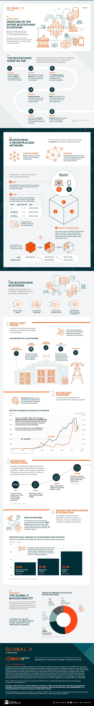

## A Visual Guide to Investing in the Blockchain Ecosystem
Many technologies are coined as “disruptive”, but only a select few can be considered transformational.

One such technology is blockchain, because it has the potential to permanently change our economic, legal, and political systems.

In the infographic (below) from [Global X ETFs](https://go.globalxetfs.com/l/750543/2021-10-18/rg5gq), we provide an overview of the entire blockchain ecosystem, and look at some different ways investors can gain access to it.

## Blockchain: A Decentralized Network
In its most basic sense, a [blockchain](/2022/0617/Science_科学/Technology_技術/Practical-uses-for-Blockchain.html) is a type of database with several unique properties.

One of these is **decentralization**, which means no single party has control over the data. To see why this matters, consider a traditional database where users store their data on a central server. The server is ultimately controlled by a single entity with the authority to modify or delete data.

In the event that this authority is compromised, users of the database can be left at great risk. A blockchain, on the other hand, is distributed across many participants in a peer-to-peer network. This means that all users play a role in verifying the integrity of the database, as well as verifying new additions.

Furthermore, blockchains are designed with an **append-only structure**. This means that users can only A) search and retrieve data from the blockchain; and B) add more data onto the blockchain.

## Blockchain Structure
A blockchain is made up of “blocks” which contain three items.

First, there’s the **data** itself. In the case of Bitcoin, this includes all of the relevant information for a given transaction such as date and quantity. Second is the block’s **hash**, a unique value that identifies the block and its contents.

For Bitcoin, a hash takes the form of a [64-digit hexadecimal number](https://www.mathsisfun.com/hexadecimals.html), though this can be different for other blockchains. The following table provides a simple example of how hashes are generated.

| Input (the block’s data)| Hash function |	Hash |
| -- | -- | -- |
| Car	| --> |	AW94 42RZ 66TZ |
| The blue car was speeding |	--> |	85ZU I9Y2 RTH2 |
| The red car was speeding |	--> |	5RT8 U1IY 148H |

On any given blockchain, the hash values will share the same format. Modifying a block’s data will also result in an entirely different hash.

The third and final item is the **hash of the previous block**, and is what contributes to the “chain” part of blockchain. This feature makes it nearly impossible for someone to tamper with the blockchain’s data, because their copy of the chain would then conflict with all other users.

## The Blockchain Ecosystem
Holding cryptocurrency is one way to gain exposure to blockchain, but as companies continue to study it, new use cases are emerging. Here’s an explanation of the four segments of the blockchain ecosystem.

### Digital Asset Mining
Digital asset mining consists of companies that process transactions on blockchain ledgers, including Bitcoin. Processing transactions is known as “mining” because participants can receive cryptocurrency as compensation.

From an operations perspective, cryptominers are relatively simple when compared to other businesses. The following table lists the components a cryptominer needs.

| Component |	Details |
| :-- | :-- |
| Network infrastructure |	Equipment that allows a miner to connect to various blockchain networks.|
| Mining computers |	These computers run 24/7 to update and verify blockchain ledgers. |
| Internet connection |	Cryptominers require an internet connection because blockchains are network-based. |
| HVAC |	Mining computers must be kept cool for optimal performance. Some miners will locate in colder parts of the world to minimize costs. |
| Electricity |	Electricity is one of the biggest costs for a cryptominer. Many companies locate in countries where electricity is cheap. |

Digital asset mining requires a significant amount of electricity and has sparked debate in recent years over its environmental impact.

### Blockchain Hardware
Blockchain hardware consists of companies that produce blockchain-related equipment.

This includes graphic processing units (GPUs), which are used in computing applications such as rendering and animation. GPUs were not originally intended for blockchain use (and have been around for much longer), but their high processing speeds makes them suitable for mining.

Today, cryptominers are transitioning to [application-specific integrated circuit (ASIC) chips](https://www.pcmag.com/news/cryptocurrency-miners-are-getting-a-new-custom-5nm-chip) that are solely designed for cryptomining. Using these chips is critical for maximizing hash rate and profitability.

### Blockchain Transactions
The blockchain transactions category includes companies that operate digital asset trading platforms. The segment is quickly evolving as new and existing businesses enter the space.

| Company (year founded) |	Blockchain Involvement |
| -- | -- |
| Visa (1958)	| Visa aims to make cryptocurrency more usable through its crypto-linked credit cards. |
| PayPal (1998)	| PayPal’s widely-used platform began offering cryptocurrency trading in 2020. |
| Square (2009)	| Square added Bitcoin trading to its Cash App platform in 2018. |
| Coinbase (2012)	| Coinbase is America’s largest crypto exchange with over 43 million retail users. |

## Blockchain Applications & Integration
This segment is the broadest of the four, and includes any software or service that uses blockchain.

In many cases, blockchain can be used to improve our existing industries. Consider [IBM Food Trust](https://www.ibm.com/blockchain/solutions/food-trust), a blockchain designed to create a more efficient and sustainable food supply chain.

Blockchain can also be used for more ambitious projects, such as creating a metaverse. While still largely conceptual, a metaverse is a digital world which would be accessed via virtual reality. In it, people would be able to work, play, socialize, and consume media.

These virtual worlds would also need their own economies—something blockchain could play a big role in. It’s reported that several companies, including the [recently-named Meta](https://www.visualcapitalist.com/saying-bye-to-facebook-why-companies-change-their-name/), are investing billions each year in metaverse development.

## Infographic


**Disclaimer**: *This is not financial, tax, or legal advice, the information in this article is for educational purposes only.* Consult a financial professional before making any major financial decisions.

