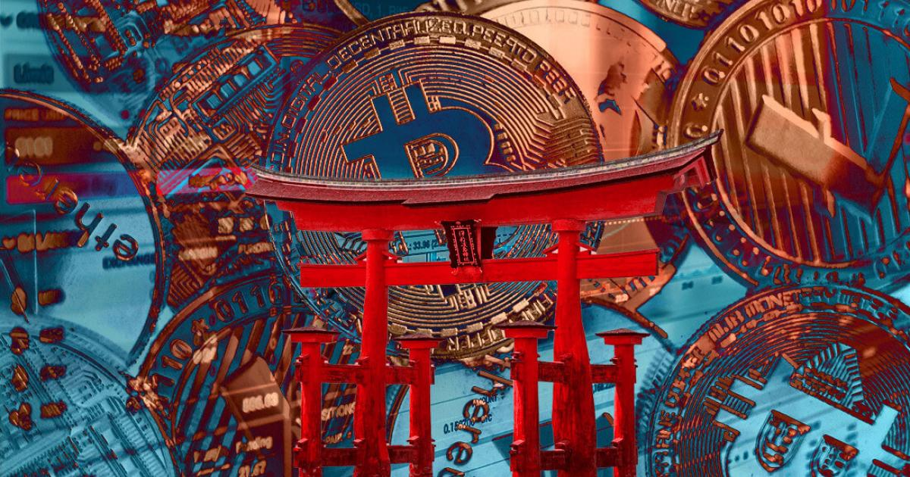

 Defaulters of this order could face up to 3 years imprisonment and a fine of 1 million yen ($8,478.52).

 

 Japanese authorities have [told](https://www.reuters.com/business/finance/japan-urges-crypto-exchanges-act-line-with-sanctions-against-russia-2022-03-14/) crypto exchanges to comply with sanctions imposed on Russia. To do this, it has asked them not to process transactions subject to the sanctions against Russia and Belarus.

 According to officials, this compliance is in line with the new G7 announcement seeking to put more pressure on the Russian government to end the invasion of Ukraine.

## Japan urges crypto exchanges to obey sanction orders
 There have been growing concerns among world powers that Russian entities and individuals may resort to crypto to avoid the financial sanctions imposed over Ukraine attacks.

 Available information shows that there has been an [increased interest in crypto](https://cryptoslate.com/russians-are-paying-up-to-20000-above-market-rate-to-buy-bitcoin) from oligarchs in Belarus and Russia. The report claims that many are looking to liquidate their assets or acquire properties in the UAE through crypto.

 While crypto exchanges may not have the capacity to facilitate transactions necessary for the whole country, allies of Putin can still use crypto as a haven to escape sanctions.

 But the G7 group is determined to stop this to ensure the effectiveness of the sanctions. According to a statement jointly released by Japan’s Ministry of Finance and Financial Services Agency (FSA), the government will work to prevent the transfer of funds in violation of the sanctions using crypto assets.

 The FSA added that unauthorized payments to those sanctioned, even with digital assets, whether NFTs or crypto, will attract punishment. This can be a 1 million yen ($8,478.52) fine or 3 years imprisonment.

 Although the directive doesn’t ban Japanese crypto exchanges from facilitating transactions with Russian-based wallets, it puts higher compliance requirements on the 31 exchanges in the country.

## U.S reiterates sanction compliance measures
 Japan isn’t the only country seeking to prevent the use of crypto to [evade sanctions](https://cryptoslate.com/pushing-russia-out-of-crypto-one-country-at-a-time-singapore-switzerland-and-japan-will-join-in-the-sanctions). The US Treasury Department Office of Foreign Assets Control (OFAC) has also reiterated this.

 Last week, it issued a guidance statement requiring US residents and digital assets companies to comply with the sanctions when facilitating crypto transactions.

 It stated that there’s a need for vigilance among entities and individuals in the US “against attempts to circumvent OFAC regulations.” They should therefore take “risk-based steps to ensure they do not engage in prohibited transactions.”

 This statement comes even though White House officials have stated that they don’t see [Russia using crypto to evade sanctions](https://cryptoslate.com/why-russia-cant-use-crypto-to-evade-sanctions) completely. The Financial Crimes Enforcement Network (FinCEN) had earlier required all crypto exchanges to report suspicious transactions. But the OFAC guidance takes it up a notch.

 Several crypto exchanges are already [complying with the sanctions](https://cryptoslate.com/coinbase-clarifies-they-were-already-participating-in-russian-sanctions) even though they have refused to stop their operations in Russia. However, there are fears that world powers may eventually impose this on crypto exchanges if the conflict escalates.