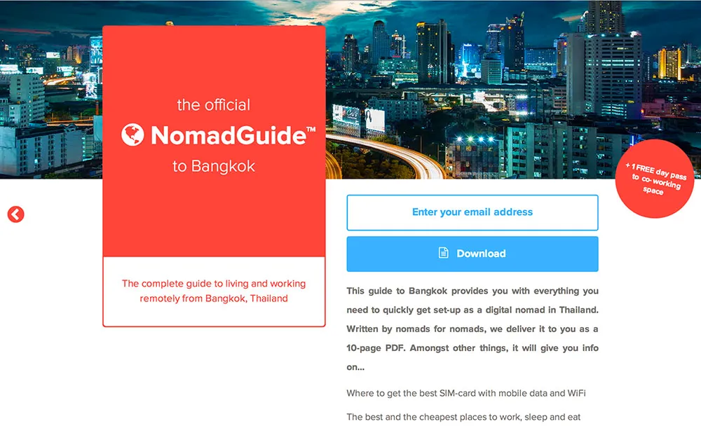

 

Nomad entrepreneur...

Talk about a shoe(less) string budget...


# This Guy Is Launching 12 Startups in 12 Months

**CAN'T GET ENOUGH** of that animated GIF where [Oprah unleashes a swarm of bees on her studio audience](http://beesbeesbees.com/)? Or the one where [some guy gets hit in the face by a trashcan](https://gs1.wac.edgecastcdn.net/8019B6/data.tumblr.com/tumblr_m81yffjkvL1qgczcwo1_250.gif)? You're in luck. Soon, a new startup called [Gifbook](https://gifbook.io) will sell you some flip books that recreate your favorite animated GIFs, so that you can enjoy them even when away from your computer. Three books will set you back just $25.

That may sound like a gag from *Silicon Valley*, the spot-on TV parody of the tech world, but Gifbook is a honest-to-goodness internet service. It was founded by [Pieter Levels](https://levels.io) &mdash; a 28-year-old Dutch programmer, designer, and entrepreneur &mdash; and it's just one of several unexpected online services Levels has unleashed on the world.

Levels is on a quest to launch 12 "startups" in just 12 months, and he's a third of the way home now. One, called [Play My Inbox](https://playmyinbox.com/), gathers all the music it finds in your e-mail inbox into a single playlist. Another, called [Go Fucking Do It](https://gofuckingdoit.com), gives you a new way to set personal goals. Basically, if you don't reach your goal, you have to cough up some cash to Levels. Gifbook, due to launch by the end of the month, is his fifth creation.


Levels represents everything that's right about the state of the technology industry &mdash; or everything that's wrong.


Launching one product a month would be a major endeavor for anyone, but Levels has ramped up the degree of difficulty. For one, he's building all this stuff while traveling the world. He has no fixed address. Instead, he lives out of a single backpack and works from coffee shops and co-working spaces. And two, each of these "startups" is a one-man operation. "I do everything," he tells WIRED from his current home, The Philippines. "I'm sort of a control freak."

Depending on who you ask, Levels represents either everything that's right about the state of the technology industry or everything that's wrong. He's self-motivated, ambitious, and resourceful, building each of these projects without any outside investment. But on the flip side, he's yet another young white male making products that solve what many people see as trivial problems for an already privileged subset of the population, while ignoring larger issues like global warming and wealth disparity.

Worse, as a "digital nomad" who has left to West to create new tech gizmos in places like Thailand and Indonesia, some argue that he's exploiting wealth disparity to his own benefit. But Levels is no fool. He's deeply aware of the contradictions in his work, and he's trying hard to sort through them. He may or may not succeed.

## Before the 12
Levels launched his first business entirely by accident. Five years ago, while studying at Rotterdam School of Management, he started uploading his own electronic music mixes to YouTube. His [channel](https://www.youtube.com/user/pandadnb) &mdash; called Panda Mix Show &mdash; did surprisingly well, and soon, other DJs were asking to upload their mixes too.

By the time he graduated in 2012, he was earning enough money from YouTube advertising to support himself. But he didn't like being tied to some other company's service &mdash; Google's YouTube machine &mdash; and he wanted to build something more ambitious. And he was tired of his home town. So, when a friend pointed out that he could work from anywhere, he left.

In April 2013, Levels sold most of his possessions &mdash; everything that couldn't fit into a single carry-on &mdash; and booked a flight to Thailand. It took him awhile to get any real work done. Several ideas fell by the wayside. "I'd work on them for a long time, trying to get them perfect, then I'd move on to the next thing," he says. "I was always scared to launch." He settled on the 12 Startups in 12 Months gimmick so that he would actually see his ideas through. This past March, he launched his first service, Play My Inbox.

## The Digital Nomads
Levels is a bona fide "digital nomad," part of a growing community of professionals who travel from country to country, staying for about a month in each &mdash; depending on how long their visas last &mdash; while working for U.S. companies or running their own online businesses.

This movement was largely inspired by self-help author Tim Ferris and his book *The Four Hour Work Week*. Ferris encouraged Westerners to quit their day jobs and start online businesses while living in foreign countries where their dollars or euros would stretch further, and many followed his advice.

According to an [Associated Press analysis of government data](https://news.yahoo.com/1-2-graduates-jobless-underemployed-140300522.html), 53 percent of recent college graduates in the U.S. were either unemployed or working jobs that didn't require a degree. The situation in most European countries is at least as bad, and even as all these young people struggle to find a footing in the West, the cost of living in major cities is skyrocketing. It's little wonder that some are seeking cheaper rents in foreign cities, where they can stretch their earnings from the gig economy further.

But some question whether this is a good thing. Though blogger Duff McDuffee, a [frequent critic](http://beyondgrowth.net) of Ferris and the "personal development" movement as a whole, says there's nothing inherently wrong with travel, or trying to live cheaply, he argues that nomads like Levels should consider the bigger picture. "There's sort of a colonial aspect to taking advantage of cheap labor and currency discrepancies," he says.

Levels has friends who call him "neocolonialist." And he sees their point. He worries that even though he spends money locally, he's taking advantage of local infrastructure and government services &mdash; such as the protection of local police &mdash; without giving much back in the way of taxes.

## The Good With the Scammy
Amarit Charoenphan, the founder of the Bangkok co-working space [HUBBA](http://hubbathailand.com), where about half the occupants are digital nomads, says these traveling entrepreneurs are pretty good for the local economy. And more importantly, he believes, they're helping Bangkok grow its own tech startup community.


They have the skills and the fortitude and the assets necessary to become a good startup founder or co-founder. They know what they're doing. They can make money.


He acknowledges, however, that some digital nomads, particularly those influenced by Ferris, aren't running legitimate tech businesses. Instead, he says, they're promoting [scammy](http://www.theverge.com/2012/5/10/2984893/scamworld-get-rich-quick-schemes-mutate-into-an-online-monster) multi-level marketing schemes and e-books on how to make money online by, of course, selling e-books on how to make money online.

Levels says he has met many nomads that are part of this racket, but he says things are getting better. Many serious startups, such as live translation service [Babelverse](http://techcrunch.com/2013/02/15/the-trials-and-tribulations-of-a-global-startup/) and link sharing service [Buffer](https://buffer.com/about) were [founded by nomads](http://joel.is/the-joys-and-benefits-of-working-as-a-distributed-team/), he points out, and many other travelers work as freelance designers or programmers and have skills they can share.

## Minimum Viable Products
How much value are his "startups" creating? That's another open question. After all, Levels isn't really creating 12 different companies. He's building what people in tech land call "minimum viable products" &mdash; simple prototypes that can be used to gauge the level of interest in your idea.

The problem is that these rapid prototypes created by 20-something year old software developers tend to only address the needs of a small group of people &mdash; namely other 20-something year-old software developers with money to burn. What we end up with is an endless procession of apps and services with pitches like "Uber for laundry."

Levels ideas tend to fit this mold. One of his startups is called [NomadList](http://nomadlist.io), a leaderboard of the cheapest cities to work from for one month. In other words, it's a site for people just like him. It's hard to imagine the next General Electric emerging from this bootstrapped approach to building companies &mdash; let alone something that solves global issues like hunger or poverty.

But for Levels, this is about learning and experimentation. And it's working out &mdash; at least for him. *Just Fucking Do It* has attracted acquisition offers and inquiries from investors. NomadList, his most successful product to date, was profitable on the first day, even though he didn't even know what the business model would be until after launched it. As turns out, people wanted to advertise jobs on the service.

He hopes that, eventually, he can do something that would have a far bigger impact, and perhaps his travels will help him figure out what.


You have to start somewhere. I'd love to create more meaningful products that have a significant impact on the world, but how can I if I can't afford to pay my own rent first?
