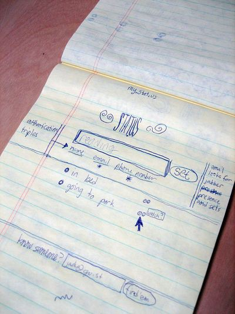

SOURCE: https://entrepreneurshandbook.co/lessons-from-a-billionaire-ceo-who-cant-focus-on-anything-for-more-than-4-hours-6422990630df

Joseph Mavericks
2021-07-17 

---

 Jack Dorsey is not your typical CEO

 

 In the late nineties, a 22-year old kid named Jack Dorsey hacked into the systems of Dispatch Management Services, a New York-based bike messaging dispatching company. Instead of suing the kid for the offense, the company decided to hire Jack and have him move from Missouri to New York. Jack accepted and also enrolled in NYU, just to have a backup plan.

 Flash forward to a few years later, in 1999. Jack decides to drop out of NYU, quit his job, and move to California to create his own startup focused on dispatching taxis and couriers. In 2002, he’s fired from the company, which would soon implode with the dot-com bubble. He moves back to Missouri, then to San Fransisco in 2005, and he creates what would become Twitter in 2006.

 In 2007, Jack Dorsey becomes the CEO of Twitter, a position he is still in today (not without a few ups and downs, as we will see). On top of being the CEO of one of the most famous companies in the world, he created Square, a payment-processor company that generates billions of dollars in revenue.

 Jack Dorsey is not your typical CEO. He likes to spend time on his own hobbies too, and this has caused him a few torments in the past. How does one manage 2 massive tech companies at the same time, all the while finding time to invest in other ventures, give away over $1 billion to charity, and go on meditative retreats up to 60 days per year? This is what we’ll try to answer in this article.

## Be relentless

 As we mentioned in the introduction, Dorsey has basically been innovating in the tech world for the past 20 years. He started with his dispatch software back in 1999, and even back then he was already doing 10 things at the same time. In fact, he sketched out the idea that would become Twitter for the first time in 2000. This is what it looked like:

 

 Jack shelved the idea for years, until in 2006 he was able to get help from his friend Florian Weber, and from a colleague at Odeo (a podcast company Jack used to work at) named Noah Glass.

 
    Everyone has an idea. But it’s really about executing the idea and attracting other people to help you work on the idea
 

 In 2007, Dorsey became the CEO of Twitter. A year later, he got fired from his own company because prominent board members found him unsuited for the job, unable to resolve critical technical issues. They also didn’t like his tendency to leave work early to go to the sauna or meditate for hours.

 Following this mishap, Dorsey found yet another way to rebound. He creates Square 2 years after having left Twitter, in 2009. Square helps anyone with a smartphone and a small business accept credit card payments. Then in 2011, Twitter’s management team got reshuffled, and Dorsey returned to Twitter as CEO. Except this time, he was even busier than before, and not just with yoga: with his other company.

 He somehow managed to convince everyone involved that this was not a problem, and he began splitting his time between the 2 projects. In 2013, Twitter went public and Dorsey became a billionaire. 2 years later, Square entered the stock market at a valuation of $2.9 billion.

 Long story short, Dorsey never stops. Being relentless and always juggling between projects and ideas is not necessarily the right way to get things done, and this comes down to personal preference. Many people will actually not thrive in multitasking like Dorsey does. But what’s for sure is this: by always innovating, looking for new ideas, and challenging the status quo, Dorsey was able to not only be extremely productive, but also redefine 2 of the biggest industries of our modern times: social media and financial services.

## Theme your days

 

      All my days are themed. Monday is management. At Square we have a directional meeting, at Twitter we have our operating committee meeting. Tuesday is product, engineering, and design. Wednesday is marketing, growth, and communications. Thursday is partnership and developers. Friday is company and culture. It works in 24-hour blocks. On days beginning with T, I start at Twitter in the morning, then go to Square in the afternoon. Sundays are for strategy, and I do a lot of job interviews. Saturday is a day off.

 

 Day theming is a very popular time management technique among top Silicon Valley CEOs. Steve Jobs was also known to use this strategy. Mondays were for executive team meetings, Wednesdays were for advertising and marketing. Most afternoons were spent on design with Jony Ive.

 Day theming works great when you have a multitude of things to do, and little time to allocate to each of those things, which is exactly the situation many CEOs are in. It sits at the crossroads between time-blocking and batching.

 This technique is also very efficient because it helps the teams you work with to automatically align with you. When everyone knows what today’s theme is, it’s a lot easier to know what to do, what reports to prepare, what data to look at. In many companies, everyone gets assigned random tasks that can’t really be linked together when looking at the bigger picture. Day theming ensures a minimum of consistency across everyone’s workload and work topic.

## Have a routine before and after

 Day theming takes care of the tasks for the day, but what about before and after work? To help set the foundation for an efficient time management framework, a good morning and evening routine are primordial.

 Dorsey wakes up around 6am and begins his day with an hour-long meditation. He’s a big advocate of the Vipassana approach to meditation and has been on multiple silent retreats. In a 2019 podcast interview with Ben Greenfield, Dorsey said that the number one most impactful decision he made around his mental health and stress handling has been meditation.

 After his meditation, Dorsey does a 7-minute workout, and then goes into the sauna for about 20 minutes. On days he goes to the office he walks there (it takes him around 1h15 for 8 miles), and he works remote on Tuesdays and Thursdays.

 In the evening, Dorsey goes to bed around 11pm. Before that, he clocks in one more hour of meditation, and eats. In fact, he is known for eating only one meal a day.

 

      For the past two years, I only have dinner. I usually eat around 6:30, and I eat until about 8:30 or 9:00 at the latest. And that’s when I can also drink wine, like red wine usually.
 
 

## Ignore critics

 Jack Dorsey was ranked one of the worst CEOs in America 2 years in a row, in 2016 and 2017. He’s been criticised many times for prioritising his personal life and hobbies over growing the companies he helped create. Many investors haven’t seen the return they had hoped for with their investment in Twitter, and they’ve blamed it on Dorsey more than once.

 Stakeholders in both Square and Twitter have also been unhappy with the fact that Dorsey splits his time between 2 companies. In their view, this dissipates a lot of energy, and they don’t like that Dorsey is never able to fully focus on one thing at a time. But is that a fair judgment?

 The main reason investors have been dissatisfied with Twitter is because the stock price has never been great (it has only started to show steady growth in the past year). But can this be blamed on the CEO’s routine? The stock market in general reacts in a million different ways to a million different factors, most of which are outside of the control of absolutely everyone. The CEO and his/her employees’ job is to do the best they can to provide value for the company, do great work, and keep moving forward.

 Dorsey knows this, and that’s why he’s been fighting to keep his position at both Twitter and Square. Here is an excerpt from the book [Deep Work](https://www.calnewport.com/books/deep-work/) by Cal Newport. In it, the author explains why Dorsey’s work can’t be considered shallow, and how the CEO thrives on his short-term model of productivity. I will quote the excerpt at length because I think it is very relevant to illustrate my point:

 

      Dorsey reports that he ends the average day with thirty to forty sets of meeting notes that he reviews and filters at night. In the small spaces between all these meetings, he believes in serendipitous availability. “I do a lot of my work at stand-up tables, which anyone can come up to,” Dorsey said. “I get to hear all these conversations around the company.” This style of work is not deep […] Dorsey’s attention residue is likely slathered on thick as he darts from one meeting to another, letting people interrupt him freely in the brief interludes in between. And yet, we cannot say that Dorsey’s work is shallow, because shallow work […] is low value and easily replicable, while what Jack Dorsey does is incredibly valuable and highly rewarded in our economy (as of this writing he was among the top one thousand richest people in the world, with a net worth over $1.1 billion).
      
 

 As of this writing, Dorsey’s net worth is nearly $14 billion. Twitter and Square stocks are up 113% and 278% respectively since the beginning of 2020. Dorsey may not be able to sit still and focus on something for more than a few hours. He may go on silent retreats, vacation too much for the investors’ taste, and spend too much time in the sauna.

 Yet for the past 10 years, he’s helped create 2 of the most successful Silicon Valley companies, so he must be doing something right. On April 7, 2020, he also pledged to transfer $1 billion worth of his shares of Square to fund Covid-19 relief efforts, universal basic income, support for girls’ health and education.

 He would have never ended up in that position had he let critics crush his vision.

