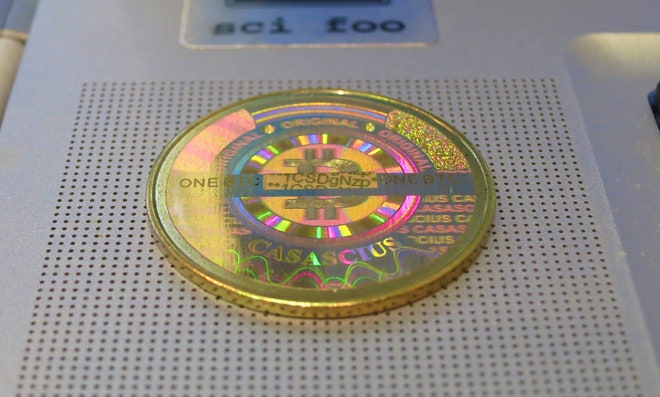



La viva le web revolution. 


 Perhaps the best way to think of stolen bitcoin is as stolen art. Sure, we can hang it anywhere. Don’t expect to sell it at Christie’s. A resource that loses its value as soon as it is stolen, may be one that isn’t stolen.

 

 **BITCOIN. EVERYBODY’S TALKING** about it. What’s true, and what’s hype? Perhaps the only thing that’s clear about Bitcoin is that it’s not going away anytime soon. Who am I to say? I’m not an economist; I’m a hacker, who has spent his career exploring and repairing large networks. And networks may very well be how the world works -- financial, social, electronic, even physical.

 I’m on neither “Team Bitcoin” nor “Team Global Financial System.” I’m on “Team Lets Fix This Thing.”

## We do need another currency.
 I’ll be blunt: Money’s gotten buggy. People who don’t realize this might be in high finance -- indeed, we’ve gotten very good at moving the revenues of entire generations within a precise number of femtoseconds -- but what if you’re just trying to buy a smoothie?

 > Bitcoin is the Internet, applied to Money.

 I walked into a Jamba Juice recently, and was informed in no uncertain terms that if I attempted to use anything larger than a $20 bill, or if my credit card was demagnetized, no smoothie for me. (I can’t even imagine the blank look I’d have gotten if I’d tried to pay with a personal check.)

 We do have credit cards. But credit cards change money from something anyone can give anyone (peer to peer) to something with a consumer class (client) and a merchant class (server). There are innovative startups that attempt to reverse that, and every time one of these systems pops up -- Square, Stripe, Venmo -- billions of dollars starts flowing through them.

 We wouldn’t get this sort of growth without pent-up demand. But even the new systems find themselves failing -- I love Paypal, but is there anyone who hasn’t either had their account suspended, or knows someone who has? I’ve certainly never had a $20 in my pocket go dark for 48 hours.

 Bitcoin’s got its issues. But it is not competing with perfection.

## Bitcoin’s no more disruptive to the dollar than the euro -- but it’s still a big deal.
 If the dollar can coexist with the euro, an economic melding of epic scale, it can survive bitcoin. And let’s be honest, when governments around the world discuss Cyprus, Bitcoin’s not coming up all that much.

 A noted security researcher, **Dan Kaminsky** has advised Fortune 500 companies such as Cisco and Avaya; worked for Microsoft; and is currently developing systems to reduce the cost and complexity of securing critical infrastructure. Kaminsky is best known for his work finding a critical flaw in the internet’s Domain Name System (DNS), and for leading what became the largest synchronized fix to the internet’s infrastructure. Of the seven Recovery Key Shareholders who possess the ability to restore the DNS root keys, Kaminsky is the American representative.

 The internet’s proven to be a pretty big deal for global society, and Bitcoin could basically be thought of as the Internet, applied to Money.

 There’s an old comment that the internet interprets censorship as damage and routes around it. Sure, we’ve routed money over the internet for a while now, but those flows have always been managed, moderated, regulated by some vestige of authority.

 Bitcoin’s about as friendly to this sort of regulation as the rest of the internet is -- not very. To put it another way: Bitcoin’s a dollar bill, with a teleporter built in. We can just poke in a few coordinates and poof, off it goes, with the ease of posting to some forum somewhere. That’s somewhat new.

## Bitcoin’s price is volatile, obviously. But it’s here to stay.
 An unregulated resource is [behaving wildly](https://medium.com/money-banking/2b5ef79482cb). This is what unregulated resources do, in every network imaginable. With Bitcoin, the supply of this awesome thing completely ignores the demand for it.

 And yet it’s not going away. It could have. There have been a couple of major crashes. But the value has never hit zero, because as William Gibson wrote decades ago, _the street finds a use for things_.

 People keep trying to describe bitcoin as an amazing store of value. Perhaps it is. But its real value proposition is as a medium for transfer.

 It really works. And keep in mind, if we’re just holding the currency for a few minutes, we don’t care about the absolute value of the item -- if it’s $5 or $5000 a unit, we’re still just trading the appropriate subdivided amount of that unit. Sure, there’s short-term volatility, but the faster we can exchange, the less we care.

## Bitcoin is not as secure as we think.
 Fraud is what makes every money transfer system buggy. As a security professional, I am deeply aware of why Paypal blocks accounts, why credit cards limit who we can pay, why Jamba Juice doesn’t want to be on the hook for the validity of $100 bills and the loss of $95 in “change”: If these businesses aren’t paranoid and customer-hostile, they lose hundreds of millions of dollars. It’s that simple.

 > Think of stolen bitcoin as stolen art. Sure, we can hang it anywhere. Just don’t expect to sell it at Christie’s.

 We’re constantly looking for new mechanisms and technologies to avoid this truth. Bitcoin is one of our newest attempts. After all, the internet runs on a foundation of buggy technologies, and it survives. Why not Bitcoin?

 Bitcoin’s fundamental principle of fraud management is one of denial. If we drop our wallet on the street, the U.S. government is not going to compensate us for our lost cash. Bitcoin attempts to make the same deal, to the point where it calls its stores of keys, “wallets.” If we drop our wallet on the street -- heck, if someone picks it out of our pockets -- the money’s gone.

 There have been bitcoin thefts. A few years ago, I [tried](http://www.businessinsider.com/dan-kaminsky-highlights-flaws-bitcoin-2013-4) to break Bitcoin, and failed quite gloriously. The system and framework itself is preternaturally sound. But it too is built on the foundation of buggy technologies we call the internet, and so Bitcoin must experience failures from the code around it. Hackers don’t care whose code they broke on their way to bitcoin, any more than pickpockets care that they’re exploiting the manufacturer of one’s jeans or leather wallet. So they break the server below the money, or the web interface above it. They still win.

 At least, that’s the theory. Reality is more complicated. Of all the millions of dollars of purloined bitcoin that’s floating around out there, not one Satoshi of it has been spent. That's because while most other stolen property becomes relatively indistinguishable from its legitimate brethren, everybody knows the identity of this particular stolen wealth, and can track it until the end of time.

 > Nothing made by humans is ever free of politics or even error. Not even math, and certainly not Bitcoin.

 A pallet of $100 bills that disappears in Iraq is a socialized loss against everyone who holds dollars. A million dollars of lost bitcoin carries its identity, at least as a traceable taint. This loss remains privatized, and it can be sued for, forever.

 There are a small number of choke points, which someday may be asked to honor these thefts. Will the currency translators accept the money? Will the mining pools? It’s really an open question. We just don’t know.

 Perhaps the best way to think of stolen bitcoin is as stolen art. Sure, we can hang it anywhere. Don’t expect to sell it at Christie’s. A resource that loses its value as soon as it is stolen, may be one that isn’t stolen.

## Bitcoin is mostly decentralized. _Mostly_.
 Bitcoin’s resilience comes from a property I refer to as Too Big To Regulate. Put simply, it’s easier to tell ten people to behave, than ten thousand. So if we want a system that’s impossible to regulate, get the power in the hands of ten thousand rather than ten.

 But there are some factors in Bitcoin that are not Too Big To Regulate. There’s only a few parties that turn bitcoin (which teleports) into dollars (which buy stuff). There can, and will be more, but the quantity of these critical nodes is not set by Bitcoin itself.

 What is set by Bitcoin is how many people win the “lottery” and mine new bitcoin. It’s one person, every ten minutes, worldwide. If hundreds of thousands of people are mining a day, and there are only 144 winners a day, most people would never win anything, even after years. To fix this, “mining pools” have been created to smooth things out. If we do 14% of the work necessary to mine one winning coin, we get about 14% of one coin (minus pool fees). Now everybody wins, according to their contribution.

 But there’s now a choke point. BTC Guild -- as per the hashrate distribution chart here -- controls almost 50% of all work done to establish the consensus that drives Bitcoin. This isn’t a coincidence; they’re simply choosing not to exceed the boundary.

 Would BTC Guild also honor the stolen bitcoin? Nobody knows. But it’s a decision they get to make.

## Yes, bitcoin is like gold.
 > Bitcoin validates locally, like gold, and subdivides easily.

 Why is gold valuable? It’s not because it’s shiny, or [because we can put it into teeth](http://www.nytimes.com/2013/04/15/opinion/krugman-the-antisocial-network.html), or because it makes for nice clean highways for electron motion. Speaking as an engineer, we’ve got lots of things that do all that (I don’t exactly see ads for Cash4RandomElectricalConductor). No, gold’s value comes from its usefulness as a currency, going all the way back to antiquity.

 There’s no real central point (Paypal, etc.) that we have to ask if our bitcoin money is valid, or that can lie to us about that being true or false. Bitcoin validates locally, like gold, and subdivides as easily as any number on a computer might. Gold is gold intrinsically. So, as it happens, is bitcoin.

 Beyond that, the supply of gold actually does grow naturally, and somewhat in response to demand. Once, gold was in such supply that random miners could just show up at a stream and make a fortune. But eventually, technology rose up, and the low-hanging fruit supply dropped, such that pretty much only major corporate and state actors organizing large amounts of people and capital could acquire the stuff at relevant scale.

 > Bitcoin must interact with the messy real world, and absorb its faults and foibles.

 Bitcoin adopts some of these properties. Strong pressure for gold allows new mines to be opened, increasing the supply. Strong pressure for bitcoin does the same -- but the supply doesn’t change, merely the distribution. It would be as if opening a mine in South Africa reduced production of a mine in Utah.

 Gold mining is ultimately something of a stand-in for the amount of work the actual miner can accomplish -- how many people can you muster, with how much capital? Bitcoin [miners](https://www.wired.com/wiredenterprise/2013/04/bitcoin-mining-rigs/) could very well be doing useful work, same as the gold miners. That the work is pointless misses the point. Diamonds, for example, represent little more than millions of years of earthly labor making dull black coal into a shiny clear crystal. Having a currency run a dual purpose as a directly useful thing has historically been considered a bug! Consider when pennies started being worth less than the metal they were made of.

## But bitcoin is arguably better than gold.
 Gold doesn’t have a teleporter like bitcoin, so it is just another commodity traded on electronic networks. People lie about how much stuff they really have all the time, and there’s no way to tell: Sometimes they know they’re lying (“naked shorts”), sometimes they don’t (“proven reserves”), but the point is, the supply can adapt to meet the demand.

 Because everything’s backed by cryptographic keys in Bitcoin, one can actually prove s/he has access to a certain amount of it. We are either able to sign messages linked to the private keys, or we are not.

 Thus, we end up with the Winklevii twins (of _The Social Network_/ Facebook fame, or notoriety) [saying](http://dealbook.nytimes.com/2013/04/11/as-big-investors-emerge-bitcoin-gets-ready-for-its-close-up/) “We have elected to put our money and faith in a mathematical framework that is free of politics and human error.”

## Regulation isn’t necessarily bad. But arguing over what’s fiat is pointless.
 Nothing made by humans is ever free of politics or even error.

 Not even math, and certainly not Bitcoin. It’s not merely that Bitcoin must interact with the messy real world, and absorb its faults and foibles. Currencies do not _naturally_ maintain fairly stable valuations. Their rate of change is absolutely manipulated over time. De Beers controls the diamond supply, the Central Banks control the Gold and Money Supply, and look: Everything that’s regulated, behaves like it’s regulated. Not perfect, but not as volatile as Bitcoin. It’s not actually clear that a currency with a genuinely fixed legitimate supply rate is a good thing. Depressions and crashes aren’t exactly popular.

 Fighting over what’s 'fiat' and what’s 'real' is silly. **It’s all fiat.** Fighting over what’s “fiat” and what’s “real” is silly. It’s _all fiat_. Gold isn’t conscious; all value is belief. What’s fiat is who can change the supply and how. Nobody can just declare the existence of one million new bitcoin and start trading on it. It doesn’t matter how much we do or don’t trust the U.S. Federal Reserve, the system knows how many bitcoin exist at what time, and knows where they all are, globally.

 The supply shocks, the hoarding, the speculation -- all admit the possibility that Bitcoin just might not scale to all the uses that people have for teleporting, difficult-to-regulate currency. Everything else has a pressure release valve -- currency can be printed, stocks and bonds can be issued, loans can be given, even commodities can be invented (to say nothing of all the exotic financial instruments out there). Bitcoin stands alone. There will be 25 new Bitcoins, every ten minutes, for some time, no matter what. And then 12.5, and then 6.25, and then eventually, none.

 Perhaps that’s good. Perhaps that’s bad. It’s definitely leading to wild valuations, and I don’t really see the volatility declining in the present model.

 But this is an experiment. And it continues.

## The one thing we can count on is that Bitcoin will change.
 The ecosystem around Bitcoin will grow and improve. Everyone on the internet is learning to develop more secure systems; I think Bitcoin’s constant embarrassing failures will do what embarrassing failures always do, which is force ever higher levels of quality and paranoia. This is certainly good.

 > Don’t think that a thing like Bitcoin can't be co-opted by governments.

 I don’t know whether Bitcoin can fix its most severe engineering error, however: the use of a work function that can be done faster by dedicated hardware. Bitcoin depends on there being too many nodes in the system mining, to control them all. That means leveraging the world supply of PC hardware. But at this point, anyone with dedicated silicon is so much faster than PCs that the masses might as well not participate (any more than they participate in making dollars or actually mining gold). This can be fixed by using algorithms like scrypt, which the Bitcoin competitor Litecoin actually does. Whether it will be fixed is an open question. Making this change directly impacts the investments of Bitcoin’s most productive supporters, and it’s rare that any system makes a change that hurts the first batch of people that got wealthy from it.

 The other change I think we might see is something like Bitcoin Hawala or Bitcoin Bearer Bonds. The technology is really flexible enough to say -- I promise to provide $100 to whoever returns this data back to me, in whatever portion. This model is really able to grow with user demand, and is profitable. However it’s also completely regulatable, since there’s an obvious single point of currency translation.

## Governments probably can’t kill Bitcoin.
 Don’t think, by the way, that a thing like Bitcoin can’t be co-opted by governments. A global public ledger is a very good system for everyone seeing if taxes are being paid or not. The network could literally reject transactions that don’t include a tax declaration, and directly pay to a bitcoin account controlled by taxation services. Everything can be subverted.

 > It would take a massive, society-rending effort against general purpose computing to really keep Bitcoin down.

 The euro is a much bigger deal than bitcoin is going to be on any reasonable timescale. But governments are keeping an eye on it, because you know, that internet thing eventually did become significant.

 Short of an all out war on technological innovation, it’s just really tricky to see how to even try to stop Bitcoin. The internet was not the first time networked communication was tried, but it was the first time a major network became available that didn’t have gatekeepers everywhere.

 It would take a massive, society-rending effort against general purpose computing to really keep Bitcoin down.

 That’s not impossible, though. Cory Doctorow has been [warning](http://boingboing.net/2012/08/23/civilwar.html) about this very thing, a coming war over general purpose computing. And Apple’s App Store, begrudgingly copied by Microsoft, really does reflect a world where some computers do much less. But note that we’re not seeing any of these limitations even remotely working on the server side of things.

 Freedom is winning quite well, and the web continues to grow.

