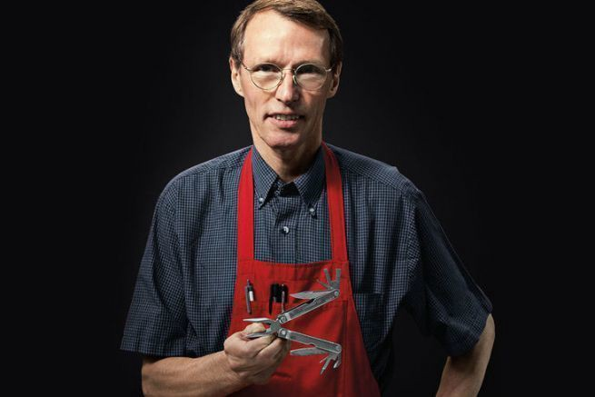

 *3 unconventional pieces of wisdom that led to his success.*

 

 The knifeman.

 Well, that’s what I call him. It’s a weird title but an appropriate one when I tell you the story of Tim Leatherman.

 He’s the guy who spent 2 years building a prototype of a, you guessed it, knife. I didn’t think you could spend 2 years making a knife but turns out I didn’t know much about the knife industry. Or Tim Leatherman for that matter.

 He spent 2 years building that prototype and then when the prototype was ready, he took it to market. After 2 years he was ready to reap in his riches, kick back and relax. What happened? Well, it was outrageously overpriced and no one wanted it. Back to the drawing board, he went. He spent 7 years at that drawing board.

 7 years working on something that would eventually become the Leatherman brand. But to get there, Tim Leatherman would be the guy that could face more rejection than most of us have nightmares of; listening to his story here are 3 pieces of wisdom that I thought might be worth sharing.

## 1. Be the user in your user research
 

     I was carrying a scout knife and used it for everything from slicing bread to fixing the car. But I kept wishing I had a pair of pliers!
 
 

 On a trip to Europe, Tim and his wife were faced with problem after problem. Broken down car, lights that needed fixing, things that needed repairing. That’s what happens when you travel on a budget. Tim carried his trusty knife with him but he wished it had more bells and whistles on it.

 He made a list of the things he could do after the trip for work, and he decided that creating a knife come plier combo was the best use of his time. He decided that this was a problem worth pursuing. That was enough to set the course for the rest of his life.

 He told his wife he thought it would take a month to build a prototype. That month turned into 3 years. _It’s funny how things go_. You know, when starting a business, most of us worry. Worry about the market fit, the niche, the size of the audience. Worry, worry, worry. Tim didn’t really worry, he just figured that he needed this contraption and therefore other people would. Simple.

 

     Commit to something. Start. Build. Create. The rest will follow. Don’t worry about the other stuff, work on your invention.

 

## 2. Invention is actually incredibly simple
 

     It was in his brother-in-law’s cubicle in Oregon that he began to imagine and implement his clamp prototypes. The first tests were made of cardboard, but Tim soon applied his know-how to create a viable prototype from scratch.
 
 
 
 The [Leatherman](https://www.leatherman.com/home) story is a funny one. It’s quite odd how an idea so flippant stood for such a length of time. Usually, there is a romance about the stories we see in Forbes and Business Insider. The kind that makes your heart melt and your brain twirl. Founders' stories have deep roots, they develop from immense frustration or complete obsession.

 Most stories of a successful business start with a dire need for something. That product doesn’t exist and so it drives the founder wild with frustration. They end up getting so het up that they solve the problem themselves.

 Tim Leatherman had no experience making tools. **His first tests were of _cardboard_.** Yep, cardboard. He had a problem and a view of how to solve it and he got to work. It was that simple.

 

     Sometimes we overthink. Sometimes we think we need to reinvent the wheel or land on something huge in order to make a success of ourselves. Tim shows us that actually, the invention is incredibly simple.

 

## 3. Create an unshakable belief
 

     I contacted every knife company there was… all of the answers were the same: "sorry we’re not interested"
 
 

 Tim had a stomach of steel. After 3 years of building with patent in hand, he had a finished prototype ready to go to market. Trouble was, no one wanted it. Just to interject here, most people at this point would give up. Can you imagine spending the best part of your late 20s working on something that ultimately no one else wanted?

 Can you imagine the pain he must have felt? I can’t quite get over the resilience of this man because it’s nothing like I’ve heard before.

 It would take Tim 7 years to get that first sale. ***7 years.*** He worked on the prototype, he got rejected. He went back to the drawing board. He got rejected again. And then finally, after years of rejection, he got the orders he wanted.

 Today the Leatherman brand is worth $100 million.

 

     Sometimes we polarise things. It’s not working so we stop. Tim shows that you can adapt. Maybe it takes longer so you work on it whilst working your day job. Resilience means adapting.
 
 

## There’s one thing we always forget in founder’s stories
 You know amongst the romance and feel good, we forget that Tim Leatherman worked mainly on his own for 7 years while developing a product that most people told him was unnecessary.

 Working on his own, year after year speaks to his incredible mindset. Mentally he was a powerhouse. We forget the impact work like this can have on our own’s mental well-being, self-belief, confidence.

 I’m learning that people like Tim are the rule and not the exception. Starting a business is a fistfight. It’s you against the world. Looking after yourself, looking after your mental wellbeing so you can stand the test of time is key to making it a success.

