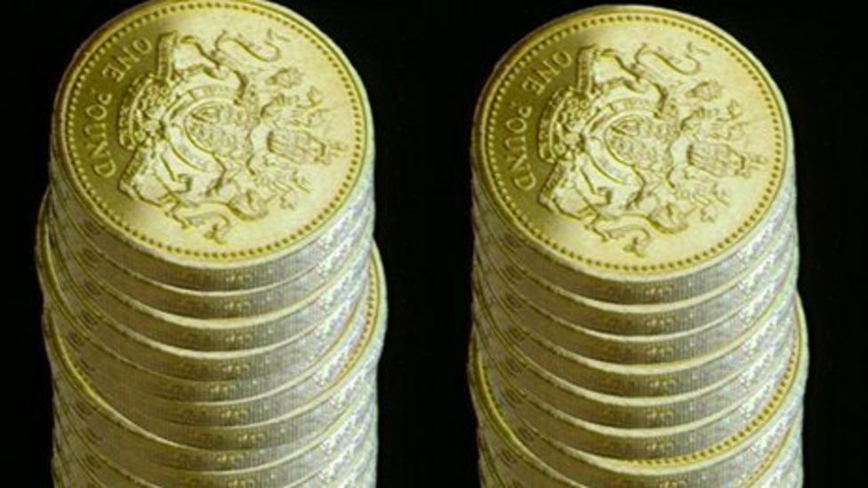
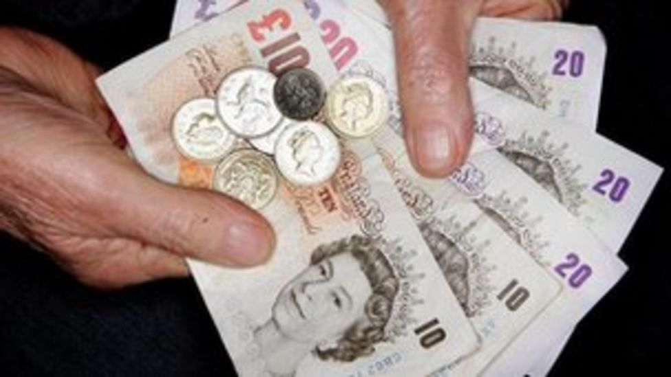



Interesting...


 

## A new study sheds light on how money affects human behaviour.
 Exchanging goods for currency is an age old trusted system for trade. In large groups it fosters co-operation as each party has a measurable payoff.

 But within small groups a team found that introducing an incentive makes people less likely to share than they did before. In essence, even an artificial currency reduced their natural generosity.

 The study is [published in journal PNAS](http://www.pnas.org/cgi/doi/10.1073/pnas.1301888110).

 When money becomes involved, group dynamics have been known to change. Scientists have now found that even tokens with no monetary value completely changed the way in which people helped each other.

 Gabriele Camera of Chapman University, US, who led the study, said that he wanted to investigate co-operation in large societies of strangers, where it is less likely for individuals to help others than in tight-knit communities.

 The team devised an experiment where subjects in small and large groups had the option to give gifts in exchange for tokens.

## Social cost
 They found that there was a social cost to introducing this incentive. When all tokens were "spent", a potential gift-giver was less likely to help than they had been in a setting where tokens had not yet been introduced.

 The same effect was found in smaller groups, who were less generous when there was the option of receiving a token.

 "Subjects basically latched on to monetary exchange, and stopped helping unless they received immediate compensation in a form of an intrinsically worthless object [a token].

 "Using money does help large societies to achieve larger levels of co-operation than smaller societies, but it does so at a cost of displacing normal of voluntary help that is the bread and butter of smaller societies, in which everyone knows each other," said Prof Camera.

 

 But he said that this negative result was not found in larger anonymous groups of 32, instead co-operation increased with the use of tokens.

 

     This is exciting because we introduced something that adds nothing to the economy, but it helped participants converge on a behaviour that is more trustworthy.
 
 

 He added that the study reflected monetary exchange in daily life: "Global interaction expands the set of trade opportunities, but it dilutes the level of information about others' past behaviour. In this sense, one can view tokens in our experiment as a parable for global monetary exchange."

## 'Self interest'
 Sam Bowles, of the Santa Fe Institute, US, who was not involved with the study, specialises in evolutionary co-operation.

 He commented that co-operation among self-interested people will always occur on a vast scale when "helping another" consists of exchanging a commodity that can be bought or sold with tokens, for example a shirt.

 "The really interesting finding in the study is that tokens change the behavioural foundations of co-operation, from generosity in the absence of the tokens, to self-interest when tokens are present."

 "It's striking that once tokens become available, people generally do not help others except in return for a token."

 He told BBC news that it was evidence for an already observed phenomenon called "motivational crowding out, where paying an individual to do a task which they had already planned to do free of charge, could lead people to do this less".

 However, Prof Bowles said that "most of the goods and services that we need that make our lives possible and beautiful are not like shirts".

 

     For these things, exchanging tokens could never work, which is why humans would never have become the co-operative species we are unless we had developed ethical and other regarding preferences.
 
 