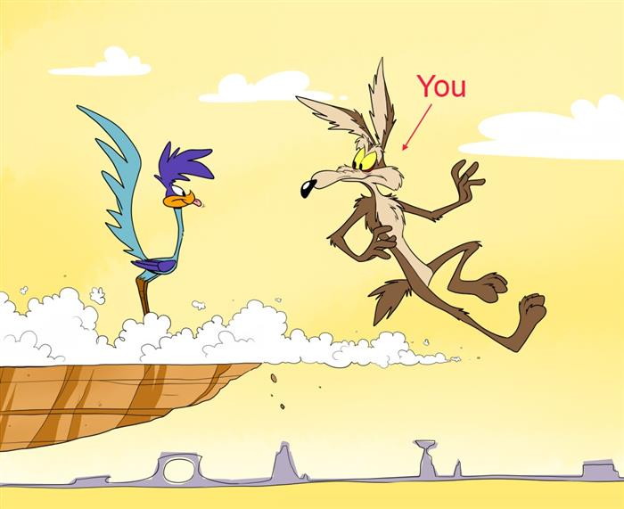
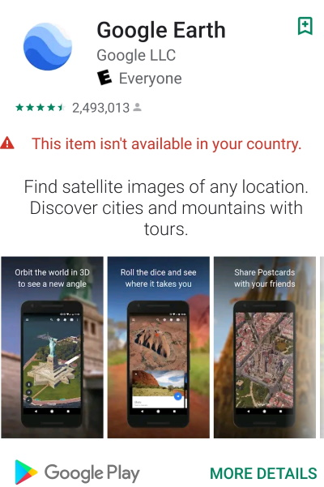


Brilliantly thought out response to piracy...


*As software developers, piracy is something that affects us all. You might not see it directly if you work for a large company but you still have an interest in who is using the company's software. If you work for a small company or are a solo developer, piracy hits a lot closer to home.*

## Introduction
As software developers, piracy is something that affects us all. You might not see it directly if you work for a large company but you still have an interest in who is using your company's software. If you work for a small company or are a solo developer, piracy hits a lot closer to home.

Both large and small companies usually offer knee jerk reactions. Such reactions are contrary to conventional wisdom and generally counterproductive.

CodePlex no longer shows original post date, but only last edit. While I have made revisions and updates, the original article was posted August 9, 2005.

## Emotions and Pride
Most developers have a large amount of pride in their products. Some have egos as well - but that is another subject. Developers are artists, and our software products are our paintings.

Because of this, when developers find their product is being pirated, their reactions are often emotional and strong. "Those stinking pirates! They are stealing my software! They must be stopped!". An emotional response is the wrong one, instead the situation should be evaluated logically. Instead, I ask you to drop the emotions and break it down to a realistic dollar figure.

Look at it from the pirate's view. Pirates only make the effort to crack software that is in demand. If your software has been pirated, it is an indirect compliment and an indicator of your software's success.

Pirates have egos too. Pirates often crack software to show how talented they are. We show other developers our talent by writing software, pirates show theirs by cracking it. Pirates are more like us than we would like to admit. It is the thrill of the chase.

## Show Me the Money
The inspiration for this article is a long time friend and fellow developer. He found his software on a warez site and in a panic, he called me. He was frantic. He had conjured up all kinds of schemes to prevent it. We talked about each of his schemes at length.

First, I let him just talk and marveled at how many schemes he thought up to prevent piracy in his software. Finally, I asked him, "So how long do you think it will take you to implement these safe guards?". He replied, "I think I can do it in 4 weeks."

**4 weeks**. Most professional developers' time is worth at least $50 per hour. I know that my friend works about 70 hours a week. Furthermore, I know that my friend's estimates, like most developers, are far from accurate. Let's assume a fudge factor of 2.

70 (hours per week) x 2 (fudge factor) x 4 (original estimate) x 50 ($ per hour) = $28,000.

$28,000 is a lot of product! Let's assume your product is a mid range product and costs $500.

$28,000 / $500 = 56 sales

Which is more productive? Trying to sell 56 additional products? Or preventing 56 losses?

## Ghost Sales
Are those 56 sales really lost sales? No. Most people using warez sites will not buy your product anyway. You have stopped the freeloaders from using your product, but you have not increased your sales. In fact, you have decreased sales by diverting from mainline development.

In such a battle to outsmart the pirates, you quickly pass the rate of return for your investment of time and effort. Would you invest your money in a bank that provided a negative interest rate?

## Cat and Mouse
No matter how many schemes you come up with, chances are someone will crack it. Many pirates love a challenge and your efforts to thwart them end up rewarding them. In fact, they make your software more valuable to trade on the warez forums because it increases the fame of the cracker.

It is like Wile Coyote and the Roadrunner. But we the developers are not the Roadrunner, we are Wile. Remember how many times Wile got smacked on the head by an anvil, blown up, or otherwise obliterated? Did it look like fun? Do you really want to be Wile Coyote?

## Beneficial Side Effects of Piracy
I'm not endorsing piracy, or telling anyone that it is OK to pirate software. So, please do not take what I'm saying out of context. But an undeniable fact is that piracy has some beneficial side effects. Pirates are unintentional marketers and spread the word about your product.

Many pirates later in life go on to work for legitimate companies. Most corporations do not allow piracy of software that they use. Piracy is too big of a legal risk for them. When these former pirates work for corporations, they are often involved in software recommendations. The corporations thus become your customers. In fact, many of these developers may continue their piracy at home.

One developer told me that he would rather the pirates use his pirate versions of software than legitimate versions of his competitor's competing software. He said that they might later have money and buy it. This is very true, not all pirates are financially deprived forever. Many pirates engage in piracy before they become financially stable, and later in their life buy software. Please take note that I am speaking about their rationalization of the situation - not mine.

If the pirates won't buy your software anyway, why not let them have it? Does it cost you anything? It doesn't, unless you consider it a lost sale. But considering every end user in Siberia or Africa as a potential paying customer is not sound marketing. Yes, some corporations will buy your product if it is too difficult to obtain a warez copy. But an individual making $500 a month and using your software at home will never buy your product unless it goes on the dinner table.

I'm not recommending that you encourage piracy as your latest marketing technique. However, it is good to know that there are at least some benefits that may be reaped from the portion piracy that you cannot prevent and that you not waste resources trying to stamp out every last instance of piracy.

If you have lemons, make lemonade. But this doesn't mean you should become a lemon farmer to produce more lemons.

## Financial Incentives
Your financial incentive is to sell your product. While some pirates make money by selling your software at a lower cost, most pirate it for peer recognition, trading abilities, or for their own use. The pirates that sell your software for pennies on the dollar do not make very much because of the overhead of physical distribution. Thus, the pirates make very little, and have little financial incentive for their efforts. And in fact in this day and age of fast internet connections, the warez stores that were previously popular in metro stations around the world have mostly disappeared.

Your motivations are not the same as the pirates and so you should not approach the problem from the same angle. When you speak of bread, you mean money. When the pirates speak of bread, they might mean it literally.

## Your Software Will NEVER be Pirate Proof
In English, there is a saying, "Locks keep honest people honest". True criminals will pick the lock, or break the door. The same is true for software. Your goal should be to make it reasonably difficult to pirate, but not impossible. Making it impossible to pirate is itself impossible and a fool's errand. One can never make a burglar proof house, and you will never succeed in producing pirate proof software. Producing pirate proof software is like electing an honest politician. If you think you've done it, it is only because you are fooling yourself.

Microsoft spends more on anti-piracy measures than most of us will ever earn in our lives, and their products are pirated more than any other software. You may be smart, but so are many of the brains at Microsoft.

## Impact on YOUR Customers
Some developers are driven so crazy by piracy that they implement hardware locks, dongles, impossible to enter keys, registrations, and other crazy schemes. Each of the schemes I cited has a negative impact on your paying customers. This is bad. When you make it harder for your customers, you increase technical support, and their dissatisfaction with your product. Many of these will cause customers not to buy your product because of concerns of transferring it to new computers.

While attempting to prevent piracy, you are also preventing paying customers. You gain nothing by preventing the average pirate from using your software, but you do lose when you discourage customers from buying your product.

Is it worth eliminating a paying customer for every pirate you prevent? Is the cure worse than the illness? Would you consider beheading an acceptable cure for brain cancer?

## Draconian Solutions
Some vendors resort to hardware dongles. Fortunately, dongles are dwindling in popularity but they still exist. In the past, hardware dongles typically connected to the printer or serial port, and very often interfered with existing devices and did not allow for other dongles to be used. USB has alleviated these problems, but still does not make the use of hardware dongles a good choice. Imagine a USB hub just to provide a place to plug in dongles. Or worse yet, consider laptop users. I have seen hardware dongles fail in remote locations and take down a business for days or even weeks while the customer waited for an expensive Fedex package to arrive and clear customs.

Hardware dongles increase the price of your product. Hardware dongles are typically only used in high end software, and in some rare cases, they can make sense.

Even more troubling is hardware locking. Hardware locking locks the software to a specific computer. This may seem like a great idea to the software vendor, but it is a horrible option for the customer. The customer may change the computer, upgrade the hard drive, or even buy a new computer and dispose of the old one. It should be a customer's right to transfer their software to a new computer and not worry about having most of their software die if they install a new hard drive. Vendors have self justified hardware locking by allowing the customer a limited number of relocks for new computers, however this is a bad solution as well.

Such locks are draconian. While not everyone has the same situation, similar factors apply to many, especially software developers. My situation includes:
 * I travel a lot - sometimes with just a USB hard drive and a few DVDs (boot recovery, etc.). During that time, I install some software on computers where I am, and wipe it when I leave.
 * I change computers several times a year.
 * I use virtual machines extensively. I use them for debugging, build processes, and testing. Software must be installed in the virtual machines each time I build a new environment.

I have about 40 programs that are part of my "Essential kit". If I must contact each vendor every time I change laptops, travel, or create a virtual machine, I'm not going to be a very happy customer.

Some software vendors have gone out of business, or decided not to support older versions of their software. Not supporting an older version can be a justifiable decision, but not when it comes to my ability to install and run it.

## Creating Pirates
Many vendors end up creating their own pirates, often specific to their products. These "pirates" are not normal pirates, but pirate only your software to bypass draconian anti-piracy measures that you put in place. Often they continue to buy your software, but refuse to use your officially released version, but instead seek, create, or use cracked and modified versions without the negative features of your anti-piracy solution. Your solution to prevent piracy has turned on you and has created the need for cracked versions of your software. And once a cracked version exists, the whole market opens up for other pirates to use it.

## Example: Google
Google's Play store by default restricts dozens of countries without apparent reason and many vendors despite selecting "world wide" distribution cannot make it work properly. Approximately 25% of the apps in Play Store are affected. I've tried working with many of the vendors and they simply cannot seem to make their apps truly global when this happens. Even my Roomba app is affected.

Instead, users have to resort to sideloading or using the less secure Aptoide store.

Even Google can't get it right. This is Google Earth when trying to install while travelling to the Caribbean (and no, it was not Cuba). This screenshot is as of September 8, 2019 and the problem has existed for many years.

If you are interested in an extensive article about globalizing and localizing your software, please check out one of my other articles: [Beyond Localization: Software for a Global Audience](https://www.codeproject.com/Articles/222389/Beyond-Localization-Software-for-a-Global-Audience).

## Example: Microsoft
Microsoft uses hardware locking in Windows and other software and calls it activation. Activation locks the software to your computer. You cannot install it to a new computer, or even make too many changes to your computer without disabling the software.

Microsoft realized that their bigger customers would not tolerate this treatment and thus excluded the general scheme of activation from corporate editions. Microsoft felt that it was permissible to inflict such a draconian solution on their individual and small business customers, however.

Deactivation can occur accidentally as well, even though nothing has changed. There are many well documented cases of this.

Because many users refuse to submit to such treatment, cracked editions of Microsoft's software have been created by pirates that do not require activation. But, it's not only the pirates that are using these editions. I know of many people who have legitimately purchased or have OEM Windows licenses, but instead use pirated versions which do not require activation.

Because they have a licensed copy, Microsoft has not lost the money because of these individuals. However, what these individuals have done is still illegal in most countries. But by creating the need for such cracked versions, Microsoft has made their software available to an even wider audience. The end result of Microsoft's anti-piracy move is:
 1. It has created more pirates. People who otherwise would not engage in piracy feel forced to become "weekend pirates" just to use software they legitimately own.
 2. It created the demand for pirate versions. Since pirate versions exist, their anti-piracy implementation has been rendered largely ineffective.
 3. It negatively affected customers. Such a move inconveniences customers, and has turned many Microsoft customers against them. Customers will also consider competition more seriously.

Microsoft has a mixed record on the activation issue and their story has changed over the years. Unfortunately, instead of moving in the right direction, they seem to have a repeated pendulum movement which moves back and forth. Post Windows XP, a user can install Windows without requiring a key. A 30 day grace or trial period is then permitted before requiring a key and activation. This is a very good move that is in the interest of users.

Microsoft Office 2010 however is a different story. In March 2012, my internet service provider suffered a serious problem and I was without internet for a few days. I decided to work on other issues that I had not had time for, but tasks that did not require internet access. A critical application of mine had been malfunctioning since I installed Office 2010. I had also left Office 2007 on the same machine. Generally, the two versions of Office co-existed peacefully, except Word. Word 2007 and Word 2010 continually fought with each other, and made this business critical application malfunction and crash any time I tried to print because it used Word templates.

I decided to uninstall both versions of office, and then reinstall just Office 2010 and see if the application which was designed for Office 2007 would function properly when there was only a single version of Word to content with. The Office 2010 install asked for my key and I entered it. All seemed to go well during the installation, until I actually tried to use any Office 2010 application. On launch, every application told me I had to activate. I was given a cancel option, but if I pressed it, the Office applications only functioned in read only mode. I was given an option of phone activation, but my only option to make a call to activate would require the use of a VOIP phone, which also required Internet. So now not only did I not have Internet, but my Office installation was offline because of the activation policy.

## Example: Recording Industry
The record companies may not have created torrents, but they made it what it is. Users want digital content of their music. Users also want to purchase single tracks without the need to purchase a complete album. By not recognizing this fact, the record companies "pushed" people into the black market. Please note before I proceed, that again **I am not endorsing torrenting of illegal files, or its users**. I am pointing out that being blind does not make things disappear, and often instead fuels the demand.

Instead of offering what customers wanted, they turned a blind eye. What the record companies should have done is listen to the needs of the market and adapt by offering music singles for purchase and download at an affordable cost.

It took the recording industry years to respond, but when they did, they goofed up the response as well. After years of waiting, iTunes and others responded by allowing single song downloads. But many downloads were locked to an individual player, and only available for download in a handful of countries. So users continue to prefer the pirate versions, often paying pirate sites the same amount or more for access because it is more convenient and less restricted.

Television shows are available on iTunes for a dollar or two. Movies are available online via Netflix. Many shows are even available for free on Hulu and the major network sites. However, all of these are typically restricted to the US and sometimes Canada. TV shows that air in the US often do not air for 6 months or a year later in other countries.

The media companies say that they cannot validly protect their distribution in other countries. Yet by offering them for free in the US, but not allowing at all in other countries, they merely encourage piracy of the content.

Another argument is that advertising is targeted to the US and that advertisers do not want to pay for non-US viewers, and that they need advertising pays for the bandwidth which is expensive. This is a false argument as well. There are many global brands that would gladly pay for a global audience. Just think of Microsoft, Pepsi, Coca Cola, and others. Instead of using the IP address to restrict users, they would tune and sell targeted advertisements.

I originally wrote this article in 2004. I have made changes since then to make it more current. Finally, just days after my 2011 update, Netflix "got it". Actually I'm convinced Netflix always got it, but Hollywood didn't. Finally, somehow Netflix either pressured or convinced Hollywood. On June 5, 2011 [Netflix announced that it would expand to 43 new countries in Latin America and the Caribbean](http://gigaom.com/video/netflix-latin-america-expansion/). Netflix was expected to expand, but it was expected to only expand to one or two countries. 43 is a huge move. In this global age, for anything information related, anything short of global just is not acceptable.

When a plague exists, you do not hold back the antidote because some users who would die otherwise might have some negative reactions.

## Release Often
If you have a strong enough protection scheme, pirates will have to resort to release specific cracks. This is a good thing. The easiest way to pirate is to make a key generator or by sharing valid keys. If they cannot use these, they have to crack each version of your software. You can make it difficult to crack your software, but you cannot make it impossible.

Each crack takes time and requires distribution. If your code is structured well, the pirates will have to crack each version rather than apply a generic crack. If you release often, the pirates will soon get tired of cracking each latest update, and the available pirate copies will be of older versions.

## Sell That Which Cannot Be Pirated
Provide more than just an executable. Provide items such as upgrades, authenticated bug reporting, and authenticated support. If you provide public support, you will be supporting the pirates along with your customers and draining your resources. By providing private support, you can focus your resources on your customers and provide a benefit that cannot be pirated. Sure, someone can pass their username and password around, but you can track and contain that. Because of this, usernames and passwords will not be shared very far.

## Make it Cheaper to Buy
I am not telling you that you must lower your selling price. I am telling you to make your software cheaper to buy, than to pirate.

I keep in close touch with other vendors. Most of them have almost no sales in Eastern Europe, or China. We do. In fact, we have quite a few sales in Russia, China, South Korea, and African countries. Why? We provide additional benefits that are difficult, or not cost effective to pirate. These include priority private support, frequent updates, priority bug fixes, and reasonable anti piracy procedures. For companies making money, it is not worth their time to pirate it. It is cheaper for them to buy it, because of the benefits they receive.

Microsoft once had a one price world wide policy. They too adapted to offer regional pricing. Why? Piracy, Apple, and Linux. [CNN Article - Microsoft to emerging markets: We've got a deal for you](http://edition.cnn.com/2004/TECH/biztech/06/10/microsoft.tiered.pricing.ap/index.html).

## Defend, Don't Attack
Defense is a requirement to preserve your software. However, a proper defense does not include directly attacking the pirates. Attacks can consist of attempts to render damage to the pirate's computer, or providing an outright challenge. Neither is wise.

Some developers as a result of their emotional response to piracy of their software wish to inflict damage to the pirates. Damage may consist of attempting to delete system files or formatting the hard drive. This is a very foolish response, and without doubt will accidentally affect a legitimate customer, as well as open you to legal repercussions. Sony was caught in a [major scandal which involved installing rootkit](http://en.wikipedia.org/wiki/Sony_BMG_copy_protection_rootkit_scandal) on customer computers.

Other developers attempt to actively challenge and engage pirates. This too is both dangerous and foolish. Pirates may not have a lot of money, but they do have a lot of talent and time and will accept the challenge.

In 2003, Madonna challenged those who were pirating her songs. The pirates fought back and released unreleased songs, and hacked her website in protest. More recently, we have seen the results of [Anonymous](http://en.wikipedia.org/wiki/Anonymous_(group)) and [Lulzsec](http://en.wikipedia.org/wiki/LulzSec).

## Be Up Front
Should you choose to use system locks, activation, dongles, or other intrusive methods, **clearly tell your customers up front before their purchase**. Twice, I have purchased software that was activated or system locked, and the vendor did not make this fact known before the purchase. They also did not offer any refund option after purchase.

In the first case, the software required activation. I was upgrading from an older version of their software which did not require activation, and the software was an essential part of the system without which the computer could not function. The computer it runs on is a secure computer and heavily firewalled. Upon installation of the registered upgrade, the computer was rendered useless as it could not access the registration server. After finally dialing into the Internet on an international call to attempt to access the registration server, the registration server turned out to be down anyway. Murphy's law always applying, it was the weekend where this company's offices were closed. It took 3 days for the problem to be resolved in a proper manner. If I had not resorted to other less desirable means, the computer would have been unusable for those 3 days until the vendor resolved it.

The second case was less trouble, but had still caused several inconveniences. Fortunately, the software was less critical and thus did not have such serious implications. Had I known that the software was system locked, I would have chosen another vendor to prevent the troubles which it had caused.

## Goals of Piracy Prevention
While it may seem like I am suggesting you allow a free for all on your product, I am not. Let me summarize what you should be doing to limit piracy:
 1. **Take reasonable steps to prevent piracy.** Implement prudent and non-invasive solutions to "keep the honest people honest".
 2. **Follow the money.** Forget those without money. If they do not have money, they will not buy your product.
 3. **Forget your elaborate anti-piracy schemes.** Stick to something simple, un-intrusive, and reasonably effective.
 4. **Sell more than software.** Provide your purchased users with private authenticated support and other options that cannot be pirated.

## DO's of Piracy Protection
**Track your keys.** This will prevent widespread key sharing because you can track them. Make your users well aware that keys are traceable to them, and they will be less likely to share them.
**Use strong keys.** If you use weak keys, the pirates will generate key generators and make their own keys.
**Use asymmetric encryption.** If you use symmetric encryption, the pirates will have your key and can make keys as well.
**Change your license logic.** Change the procedure names and logic of your licensing code frequently to prevent routine cracking.
**Never release debug builds to the public.** Debug builds contain tons of information in your program to assist pirates.
**Release often.** Keep the crackers busy, and make their return on investment a negative value.
**Protect your executable.** While there are many such utilities, and none are crack proof, [ASProtect](http://www.aspack.com) is a nice affordable one. The developer even provides custom builds upon request.

## License
This article, along with any associated source code and files, is licensed under [The Code Project Open License (CPOL)](http://www.codeproject.com/info/cpol10.aspx).

