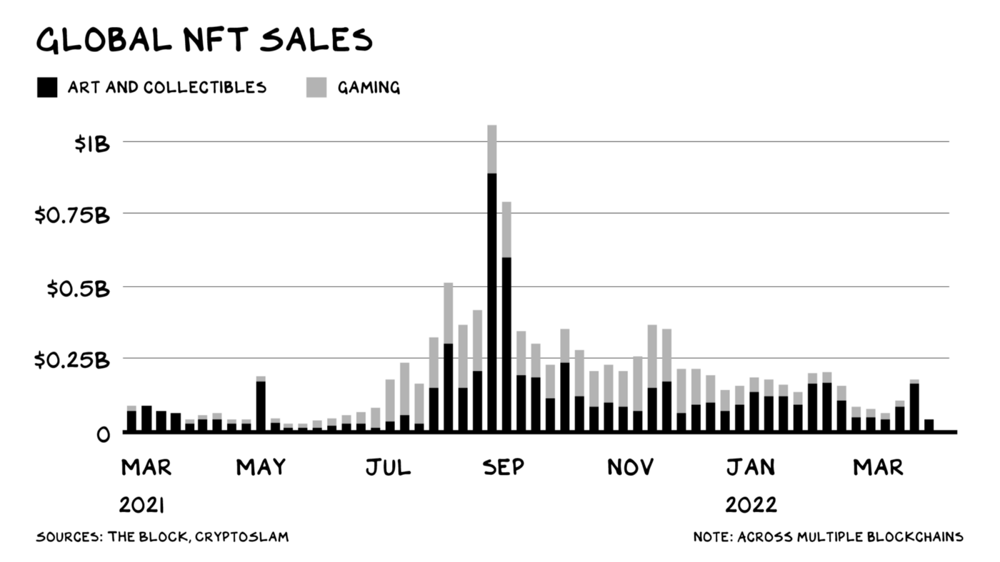
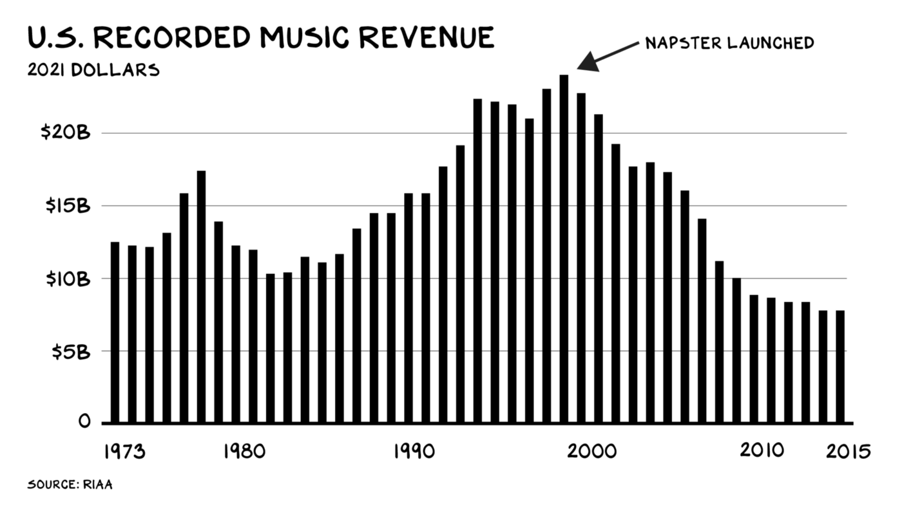
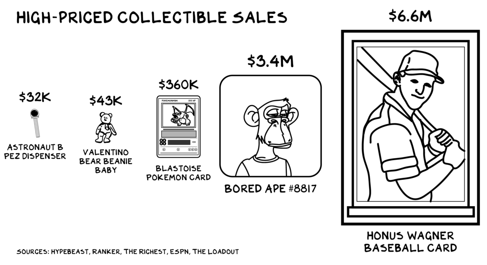

 *Amidst the scams and bubbles, credible scarcity and authenticity will unlock real value in digital markets.*

 Last week, Mark Zuckerberg announced NFTs are coming to Instagram. What does that … *mean*? The [announcement](https://techcrunch.com/2022/03/15/instagram-nfts/?msclkid=e7e8b992aa2011ecba53c319390a64e3) was a word salad of platitudes, so we don’t know how the Zuck will bolt this latest thing onto his Frankenstein product structure. The good money is it won’t work — Meta is one of the best acquirers in history, and one of the least innovative. The broader, and more interesting, question is the half-life of NFTs.

 As we ended 2021, NFTs were white-hot. [Forty-one billion](https://markets.businessinsider.com/news/currencies/nft-market-41-billion-nearing-fine-art-market-size-2022-1#:~:text=The%20market%20size%20for%20digital%20collectibles%20known%20as,data%20company%20Chainalysis%2C%20which%20updated%20a%20previous%20report.?msclkid=fa3028beaa1e11ec800e9f042320281a) dollars hot, and everywhere. Twitter beat Zuckerberg to the NFT punch, letting tweeters use an NFT as their profile picture, [Spotify](https://www.businesstoday.in/crypto/story/spotify-plans-to-integrate-nfts-other-web3-features-326651-2022-03-21#:~:text=Spotify%20is%20a%20media%20and%20music%20streaming%20service,that%20is%20created%20and%20stored%20on%20a%20blockchain.?msclkid=9887ebdeaa2b11ec843b86d5c7060fd2') is hiring for NFTs, and brands from [Budweiser](https://adage.com/article/digital-marketing-ad-tech-news/budweisers-first-nfts-sell-out-under-hour/2383936?msclkid=8876a74ba9f611ec91d7ca207adf4e01) to [Louis Vuitton](https://www.blocksocial.com/louis-vuitton-launches-blockchain-game-nfts/?msclkid=4b0024dca9f711eca4d1e6c25eca616c) are producing them. You can even buy a virtual NFT of the McDonald’s [McRib](https://www.cnn.com/2021/10/28/investing/mcdonalds-mcrib-nft/index.html?msclkid=b3c2ab9aa9f611ec935fe373f81c06aa). But there are signs the hype is fading. Trading is down, Google searches are down, scams and frauds are (still) up.

 

 The sun may have passed midday on the hype cycle, but NFTs (or something similar) have real potential to be an unlock for a fundamental aspect of the digital economy.

 So … WTF is an NFT? Technobabble aside, it’s similar to the deed to a house. A digital document that identifies one true owner of a digital product. Real estate deeds rely on an ecosystem of paper and electronic records, legal standards, and institutions staffed by experts. It’s worth the expense, as real estate is valuable. NFTs, or non-fungible tokens, are deeds rendered in the world of bits, not atoms. Digitally native, NFTS are (theoretically) lower cost than real estate deeds — thus they’re economically practical for digital items and lower-value property. Deeds … for anything. As private property and ownership are central to capitalism, and economic activity increasingly moves online, NFTs may become central to our economy.

## Scarcity and Authenticity
 NFTs offer digital commerce something the Internet lacks: **scarcity** and **authenticity**. A scarcity mentality is built into us at an instinctual level. Our cravings for sugar and fat (historically scarce) have resulted in an obesity crisis, because our instincts haven’t kept pace with ~~industrial food production~~ proper ([WFPB](https://en.wikipedia.org/wiki/Plant-based_diet)) diet awareness. Authenticity’s virtues are practical (we like to know where our food comes from and who we can sue if it makes us sick) and philosophical (if we buy music, is some of the money going to the artist who made it?).

 Limited options for credible scarcity and authenticity have rendered digital commerce chaotic. Napster broke the barriers of scarcity that were inherent to physical distribution of music on plastic discs. The pirating of digital goods of all kinds [reduces](https://www.sciencedirect.com/science/article/pii/S0048733320300391) both tech profitability and long-term innovation. Google put the news media into intensive care by reproducing its content (ending scarcity), and Facebook drove another nail in the coffin by de-emphasizing the source (neutering authenticity).

 

 Enter blockchain. Bitcoin became a trillion-dollar asset class because it cracked this code. A dollar bill is worth $1 because only the U.S. Treasury can make it (authenticity) and we trust Uncle Sam to mint a limited number (scarcity). Bitcoin’s “proof-of-work” system likewise ensures scarcity (there will only ever be 21 million bitcoins produced) and authenticity (all are tracked on an immutable public ledger).

 NFTs offer the promise of scarcity and authenticity for digital goods. NFTs aren’t the only way to create scarcity and authenticity online — trusted, centralized entities such as banks (and platforms such as Twitter and Apple) do it within their verticals, and blockchain tech is evolving to address myriad environmental and security concerns. So the current implementation of NFTs may not be the best way, or even a good way ([many](https://web3isgoinggreat.com) [reasons](https://moxie.org/2022/01/07/web3-first-impressions.html) [to be](https://youtu.be/YQ_xWvX1n9g) [skeptical](https://www.profgalloway.com/web3/)). But they’re … *a* way. A potentially widespread, inexpensive way to offer credible scarcity and authenticity online, opening up new vistas of digital commerce. Prospectors are rushing in.

## Art
 The world beyond crypto-obsessives started paying attention to NFTs a year ago, when digital artist Beeple sold an NFT mosaic of his daily digital images, *Everydays*, at Christie’s for $69 million. No asset class depends more on scarcity and authenticity than art. The *Mona Lisa*’s value relies on our belief that there’s only *one* (scarce); plus, we know it was created by da Vinci (authentic).

 As deeds do for real estate, a whole industry of galleries, museums, and consultants, along with ancient documents and high-tech gadgets, props up the fine art market. We know this from the failures: A single successful forger, Pei-Shen Qian, formerly of Queens, [brought down](https://news.artnet.com/art-world/final-knoedler-forgery-lawsuit-settled-1637302) a 170-year-old art gallery and spawned 10+ lawsuits (and one Alec Baldwin podcast) with his oeuvre of fake Rothkos. NFTs offer a defense against digital forgery. Beeple’s Everydays is authenticated publicly, on the [blockchain](https://etherscan.io/address/0x2a46f2ffd99e19a89476e2f62270e0a35bbf0756#code) (and a less cryptic Opensea [listing](https://opensea.io/assets/0x2a46f2ffd99e19a89476e2f62270e0a35bbf0756/40913), with legibility brought to you by … centralization). The lower priced the art, the more it requires a scalable platform for establishing scarcity and authenticity.

## Bored Ape
 Bored Ape Yacht Club — a series of JPEGs of monkeys wearing different outfits — is no more or less risible than any other trend. There are 10,000 of them, each unique, and they’re collectively valued at $3 billion. The *floor price* for one is $311,000. The company behind *les singes ennuyés*, Yuga Labs, has [consolidated](https://www.theverge.com/2022/3/22/22991272/yuga-labs-seed-funding-a16z-bored-ape-yacht-club-bayc-metaverse-other-side) its position as the dominant force in NFT-based collectible bubbles, buying up the NFT brands CryptoPunks (bored dudes) and Meebits (bored avatars) and raising $450 million at a $4 billion valuation.

 

 Is this a JPEG ape bubble? Likely. Collectible bubbles are nothing new. Beanie Babies were individually unique, cartoonish figures produced at low cost and brilliantly marketed. In 1997, eBay sold [$500 million](https://www.vox.com/the-goods/22870250/nft-beanie-baby-price-guide-bubble-princess-value?msclkid=c4a11d55aaf411ecb52f52a70f4f0b99) worth in a month — 6% of the company’s annual sales. Garbage Pail Kids, Cabbage Patch Dolls, animation cells, POGS, tulips — the list goes on. Some endure, such as vintage baseball cards ([outperforming](https://sports.yahoo.com/from-ruins-to-renaissance-how-the-sports-card-market-became-appealing-to-investors-183139381.html) the S&P 500 since 2008). There is a huge market for modestly priced art and un-bubbled collectibles that could benefit from digital scarcity and authenticity. NFTs also offer the potential for creators to collect royalties every time their art is sold in the secondary market, remedying some of the creative economy’s inequities.

 How long will Bored Apes remain culturally relevant? Don’t know. They are trees, which live and die. Yet the forest is immortal.

## Brands
 For brands, scarcity and authenticity is everything. Chanel can sell sunglasses for $500 because they’re scarce and they’re Chanel. In exchange, the customer gets to say “I’m aspirational” without saying “I’m aspirational.” But branding goes beyond signaling wealth. Doc Marten boots say something, and Wrangler and Levi’s say something else. Oatly is not milk, but it is a statement about who you are.

 People underestimate the power of brands; it’s a lie we tell ourselves. Branded beer [tastes better](https://www.jstor.org/stable/3150054) than non-branded beer. Allergy medication is [more effective](https://www.pnas.org/doi/10.1073/pnas.1012818110) after you watch branded advertisements. Labradoodle vs. Labrador, *Star Wars* vs. *Dragon Ball*, iOS vs. Android, NYU vs. Columbia — we are a tribal species, and we sort ourselves with logos. Logos that we insist are “authentic,” despite the availability of knock-offs. A robust ecosystem of intellectual property laws and institutions ensures a brand’s owners control scarcity, and NFTs augment that system in the digital economy.

 Many companies are catching on to this in their own socially stunted, corporate, Zuckerbergian way. People want to show up to the [Miller Lite metaverse tavern](https://news.yahoo.com/miller-lite-opening-tavern-metaverse-224853143.html?msclkid=4d9aa391aae411ecb26170501596a74b) no more than they want to follow Miller Lite’s Instagram page. There’s no doubt that much of the fullness brands give to physical life is missing online.

## Belongings
 Every morning I put on a Panerai watch to signal my masculinity and success. I haven’t wound it in 10 years. Online I have something even more scarce: A Twitter [blue check](https://twitter.com/profgalloway). The blue check is a digital Panerai (sort of): scarce and authentic, it signals that if you mate with me your kids are more likely to survive than if you couple with someone missing the blue check.

 One of the keys to NFTs will be portability across mediums. A Twitter blue check can’t exist on Instagram, but the NFT equivalent of a Twitter blue check can — and deliver credible authenticity, thanks to that NFT deed. This is the metaverse vision of interoperability that could help make digital belongings feel similar to physical belongings.

 Digital belongings exist on the internet, but there aren’t that many types of them. On Fortnite you can acquire guns and outfits. On Reddit you gain badges. Point is: There’s a lot of stuff on the internet, but there isn’t much stuff that’s yours.

 Now ask yourself: How much physical stuff is yours? Think of every item in your house: books, paintings, photos, CDs, heirlooms, trophies, etc. What’s the market value of all that? As our lives move further online, so will our stuff, and we’ll need some sort of infrastructure that allows us to own it.

## Money Changes Everything
 I’m a capitalist and generally think that functioning markets improve lives. Bringing credible scarcity and authenticity to digital markets is a net positive — but the key word there is “net.” The flood of interest in NFTs has predictably resulted in scams and exploits. The market has cooled off recently, with the top corresponding pretty closely to former First Lady Melania Trump’s [NFT scam](https://news.artnet.com/market/did-melania-trump-buy-her-own-nft-2071931). (She bought her own NFT through shell accounts to create false signals regarding the value.) When I interviewed Mark Cuban (owner of the Dallas Mavericks), he raised concerns about sports team NFTs injecting a money-making incentive between the fans and the team, replacing the emotional bond they feel with the team and players with the anxiety of a Robin Hood day trader sweating a position.
 Scarcity and authenticity are powerful, and not always forces for good. Our instinctual craving for scarce sugar and fat has produced an obesity crisis, but we aren’t going to throw out the industrial food system and live off the land. Amidst the scams and bubbles, credible scarcity and authenticity will unlock real value in digital markets.

 In sum, Madame First Lady Trump,

 **Learn the damn language**: scarcity and authenticity.
