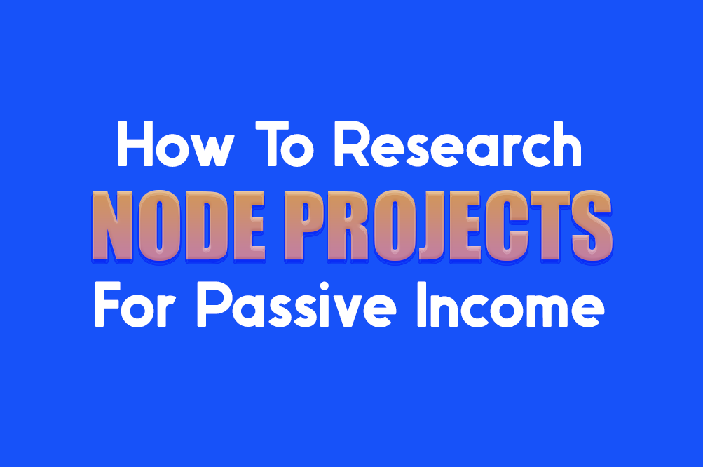
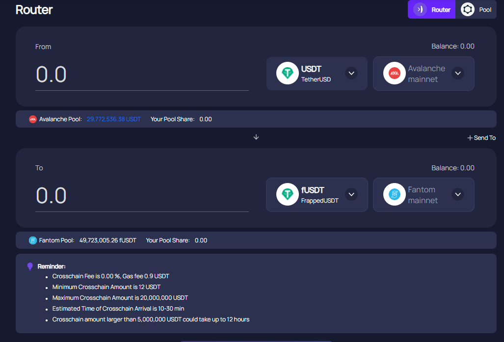
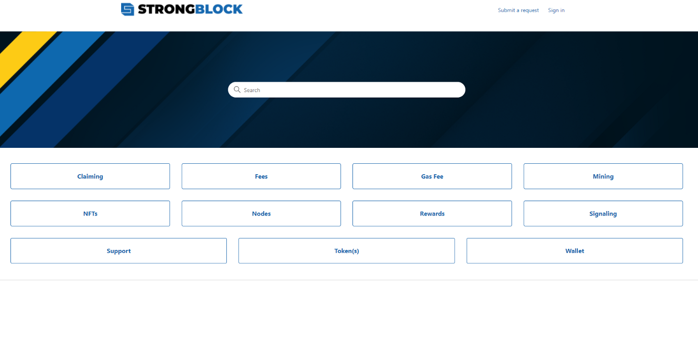
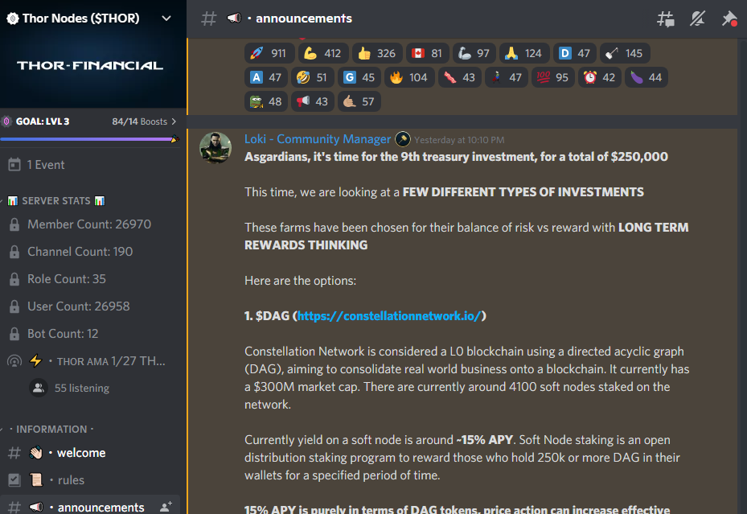
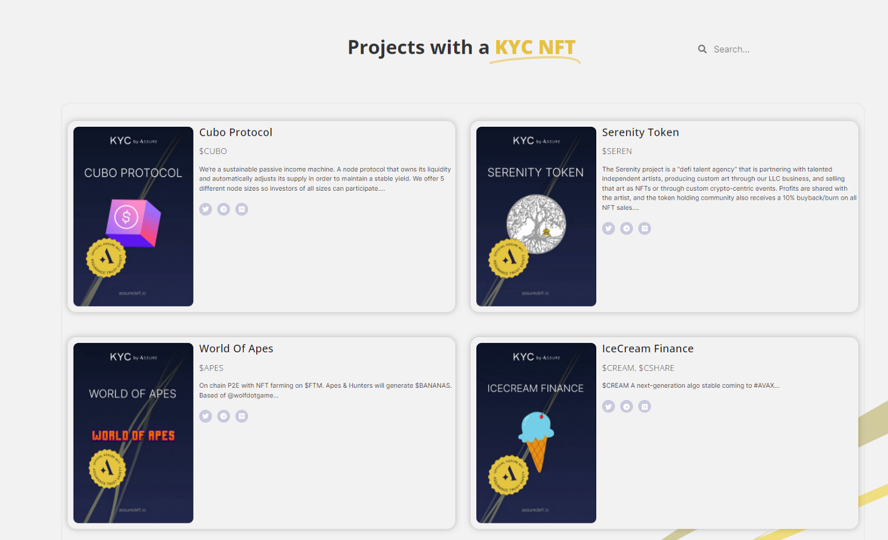
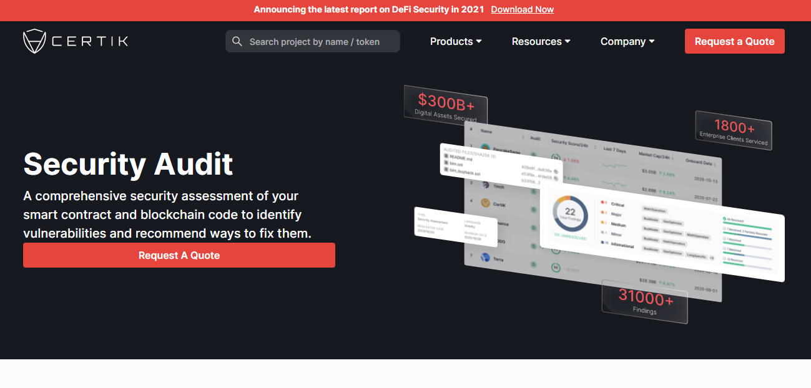
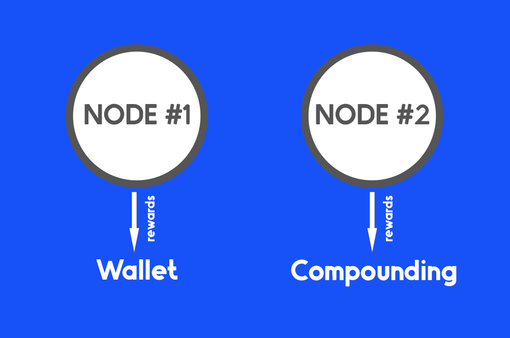

# How To Research Crypto Node Projects for Passive Income
 

 I use the term passive income, but when it comes to investing, it is work. There’s a reason people pay individuals to manage their portfolios in traditional investing markets. You will need to spend time researching, understanding the projects you invest in and knowing when to get out of them.

 ⚠️ *We’re going to go step-by-step into how to properly investigate, research, and invest in a node project.*

## Check Which Network Is The Project On
 This is the first thing you should consider. If it’s on Ethereum, you have to take gas fees into account. Those involved with STRONG might only cash out once a month and need to monitor when gas fees are at their lowest point for cashouts. Those on Fantom and Polygon might have cheaper fees, but if they cash out too frequently, those fees can add up if the rewards you are claiming are too low in dollar value.

 When I invest in a project, I convert a small percentage of my rewards into the network token to cover fees. For example, if I’m claiming $200 of THOR and swapping into DAI, I will put $185 into my DAI stable coin stake, and convert $15 to AVAX anticipating it to cover future fees.

## Can You Easily Bridge Assets To That Network?

If the project you’re interested in is on Fantom, but all your assets are on Coinbase or Crypto.com, you might be wondering how to get your assets from centralized to decentralized. If you are already on DeFi, but maybe on Polygon Network, you might need to figure out how to bridge from there to Fantom.

For both of these solutions, you would need a MetaMask Wallet and the network tokens to cover gas fees. I personally like to use AnySwap’s router to send tokens between chains.



## Read Their Documentation
 

 All projects will have a link to their documentation. If you can’t find it on the mainpage of their website, ask for the documentation links from their discords. Read all of it, even if you don’t understand it.

## Check Their Discord
 

 Documentation is usually not kept up to date (which frustrates me), most changes, votes, and announcements are first mentioned on a project's Discord Server. Notices regarding future reward or contract changes are published on Discord prior to being written into the documentation. If you have questions or don’t understand anything, ask the mods or team members for clarification.

## Has The Team KYC'd?
 

 In order to make the possibility of a rug pull less likely, KYC(Know Your Customer) is where certain team members chose to go through a service that keeps their real identities, country of residency, and information on file. **Find out who has undergone KYC, their role to the team, and if they have access to the treasury wallet.**

## Has The Project Been Audited?
 

 This is important to ensure the protocol is secure and bug free. The integrity of the protocol is audited and the project is awarded an approval rating and documentation detailing the audit.

## Have They Done a Multi-Sig?
 Multi-Sig(multi-signature) is when multiple keys are required to authorize a transaction

## What Are They Offering To Investors?
 These are the questions you must satisfy before investing:
 * What are the current reward rates? 
 * How often are they awarded? 
 * Do investors get to vote on changes to the protocol? 
 * Are there incentives that make their protocol unique from other protocols in the same category?

## Is There A Way To Monitor The Treasury?
 You need to know where the investments into the protocol reside, how it’s being used and the funds fueling the rewards. **If they do not have a page dedicated to this, ask for the public wallet addresses to monitor them.**

## Investigate Price History.
 If the node project you are investing in has a price history, observe it and determine an entry point. Buying during a token's ATH (*All Time High*), might mean you will experience a loss in price value when it dips. I avoid high climbing green candles for an entry position. I like to personally use DEXScreener and/or Tradeview.




## Seriously Consider And Understand The Risks
 There are several risks involved with investing in nodes. Everything from fraud, rug pulls, liquidity drain and more. Risks of investing in nodes can be found in this article:



## Have A Set Budget And Stick To It
 *Knowing what you can afford to lose is the first step.* Then make out how much you’re willing to invest in a project. For example, you might want to invest in a Node project, but the initial upfront cost will be $2000. You have $2000, but your budget was $800 because that’s all you would feel comfortable with losing. It's okay to "miss out" on an opportunity, rather than taking the risk to lose something I can’t afford to lose. There will be other chances and opportunities. I missed my chance at $STRONG for this reason, but some of my other Node investments have thus far worked out well.

## If The Project Offers Investors The Ability To Vote
 Make sure you verify that you’re an investor in order to get the right to vote on important decisions related to the overall project.

## Get Back Your Initial Investment First
 This is a personal choice. You have to do what’s right for you and your financial comfort level. When I invest in a passive income crypto play (such as Nodes or High Yield Rebase projects), I will claim my rewards either daily or weekly depending on the project until I get back my initial investment. Due to market volatility and uncertainty of protocols lasting in this new cryptospace, I make the return my priority, and compounding I save until after I’ve recuperated.

## I Compound With One Node And Claim With The Other
 

 In the early stages of node building, I like to use one node for claiming profits and the other to compound. This way I’m taking profits, but still building my investment. I avoid claiming everything and avoid simply compounding without taking any profits.

## Develop A Way To Track Your Investments
 I like to maintain a spreadsheet and place on it these key things:

 1. How much I spent to invest the project?
 2. How much I’ve earned on the investment (daily or weekly updates)?
 3. How much is left until I’ve gotten back my initial investment?
 4. How much am I getting per day from the project (update this as the protocol changes their reward system)?

 For some, they might be more comfortable tracking their investments with an app on their phone, I just prefer a spreadsheet because I can put other key additional information.

## Create A Schedule And Stick To It
 I go through my spreadsheet and check on my investments at the beginning of each day with my morning tea. For some, they might find it more comfortable to do this weekly. I highly recommend not simply leaving your investments without checking on them. Keep up with important announcements from the developers and any key information that might affect you (such as announcing reward decay).

## Consider The Idea Of Taking Profits to Stablecoins or Precious Metals
 When I take profits I convert them to stablecoins to hold their value. I then will either stake my tokens, borrow crypto for more protocol investments using my tokens as collateral, or use them to buy precious metals.

 **I hope this information aids you in your efforts to research projects. May your journey into a passive income be fruitful.**

 Stay Informed.

---


 I try to remain an ethical crypto investment writer. I won’t shill a project to you for my own personal gain. I only seek to educate and help others avoid the mistake I made in my crypto journey.



 **Disclaimer:** I am not sponsored or affiliated with any of the projects/companies mentioned in this article. *This is not financial advice, the information in this article is for educational purposes only.* Never invest what you can’t afford to lose. I disclaim any liability or loss incurred by any person who acts on the information, ideas, or strategies discussed in my articles. Do Your Own Research.


