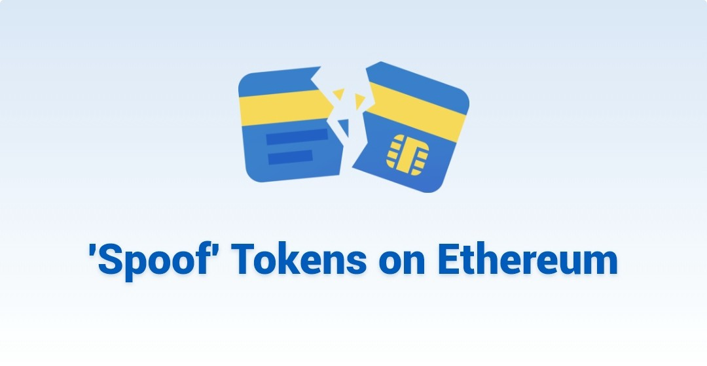
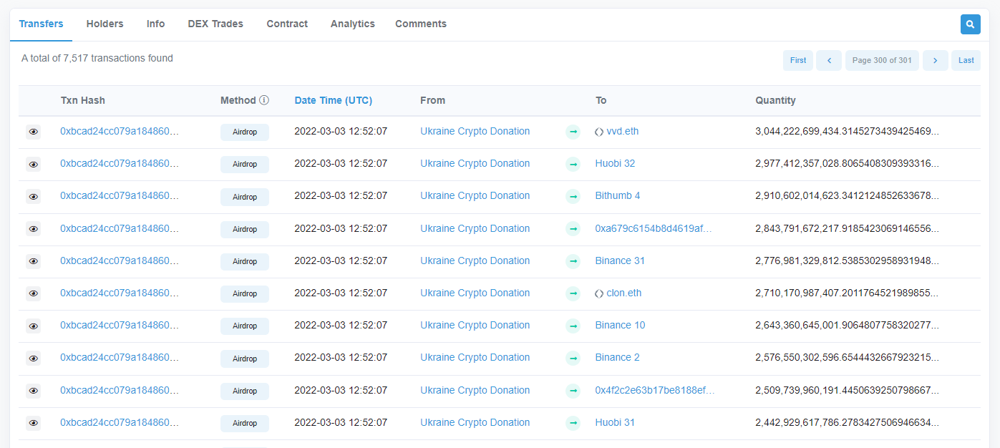
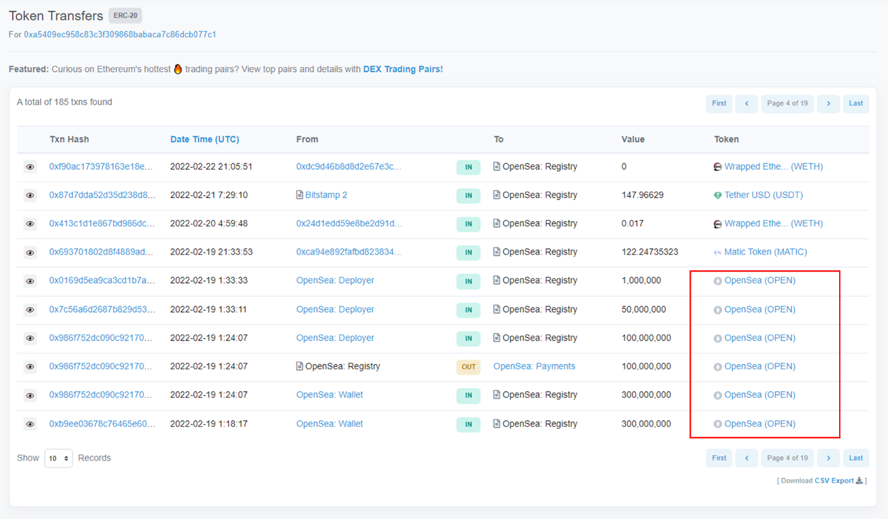
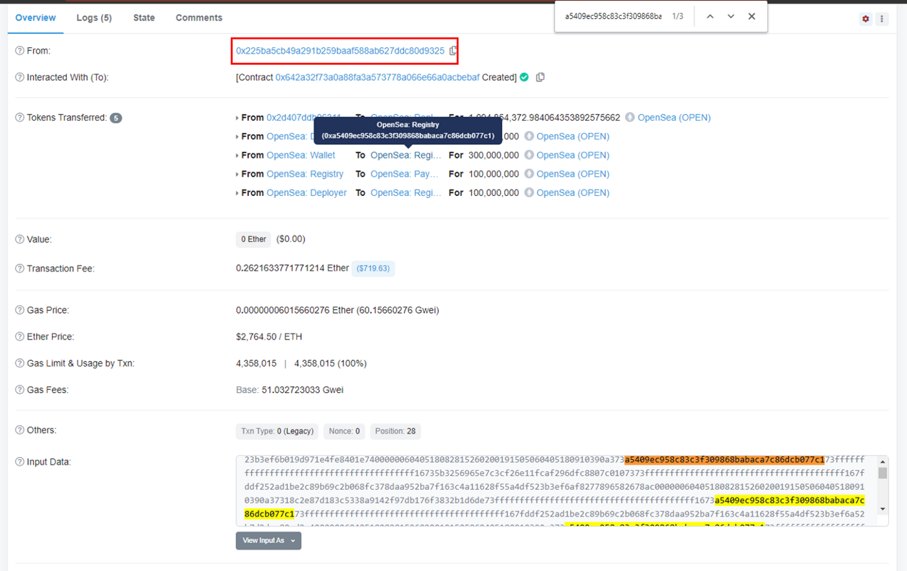
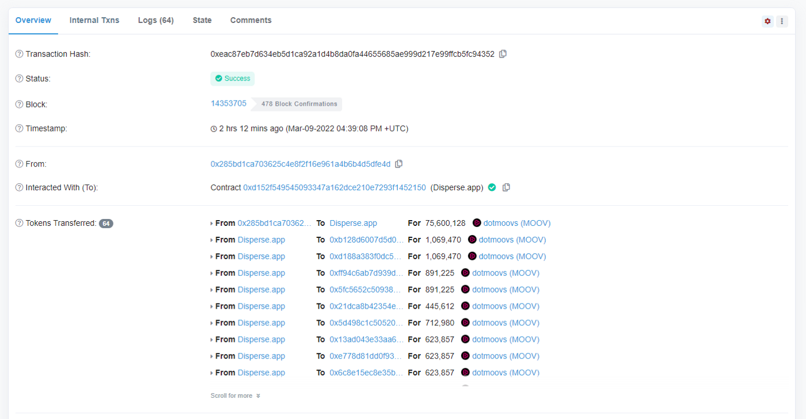
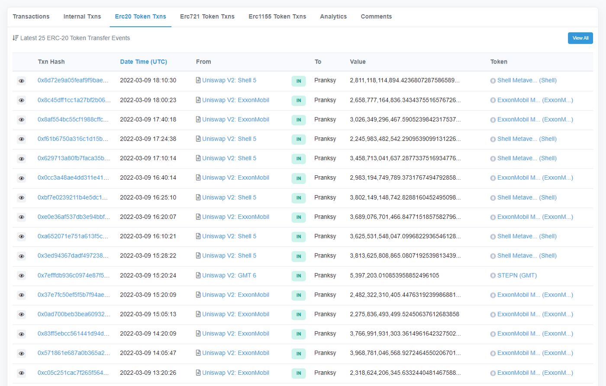

 

 Fake or ‘spoof’ ERC-20 token transfers are not a new occurrence in Ethereum. However, wider adoption of the blockchain in the last year has caused a sharp uptick in these cases. It was a common-enough question that we provided a short answer in our newsletter two months ago, but the increasing number and a recent high-profile case calls for a more in-depth look.

 

 In this article, we go over:

 * What this ‘*spoofing*’ is
 * How to detect it
 * How to avoid it

 Imagine hearing rumors of an upcoming token airdrop from a much-hyped DeFi product. The consummate trader that you are, you scour the blockchain for any hints of this happening.

 Lo and behold, you notice that a token with name and symbol bearing close resemblance to this DeFi product is newly minted. What’s more, you see it sent to an address you’ve privately tagged as belonging to a well-connected whale/influencer.

 And then that address transfers it on. “This must be it!”, you proclaim. Wanting to frontrun others getting into this coin, you ape in buying a large chunk of the token from a just-created Uniswap V2 liquidity pool. An hour later, the LP gets drained of all ETH and you realize you’ve been played.

## What went wrong?

 

 

 The mistake you made was to believe that a token transfer with your trusted influencer listed as the From address was actually made by that address. This ‘spoofing’ tricks unsuspecting users by taking advantage of:

 * The ERC-20 standard design
 * Block explorers’ transparent data display

 The [ERC-20 standard](https://eips.ethereum.org/EIPS/eip-20) transfer and transferFrom functions can be modified to allow any arbitrary address to be the sender of tokens, as long as this is specified within the smart contract, resulting in a token being transferred from a different address than the one that initiated the transaction.

 Often the ‘spoofing’ token contracts are not verified on Etherscan precisely because it helps to obscure the contract’s inner workings.
 
 For ERC-20 token transfers, block explorers such as Etherscan display the address that a token is transferred from, not the initiator address. Data for block explorers are not censored by default due to their very nature.

 In most cases, the extent of damage is limited to bagholding a token with zero value. But more dangerous cases can exist, such as a token with revert error messages that point to a phishing website stealing user private keys. ERC-721 and ERC-1155 tokens (NFTs) may also suffer from the same issue.

 

## How might one detect this?
 The answer is fairly simple. For any of these token transfers, click on the exact transaction hash and inspect its details. The From address that initiated the transaction is clearly not the same From address for the token transfer.

 To dig deeper, look for the spoofed From address in the transaction input data or contract source code. It would typically be included in either location. If the contract is not verified, doing this becomes harder but it automatically makes the token that much more suspicious.

 

 One key caveat. Not all token transfers initiated by a different address are necessarily fake or spoofing. A common example is dApps that send multiple token transfers in bulk. These usually have a Public Name Tag added by Team Etherscan — if there are any untagged, please [let us know](https://etherscan.io/contactus?id=5)!

 

 A close cousin of spoofing is that of spam tokens. While these do not pretend to be sent by an influencer’s address, they are sent en masse to it and make reading the address’s token tabs a miserable experience.

 

## What can be done to avoid this?
 For the average user, there is no need to do anything as this problem is unlikely to affect you much. For the degens, it is wise to stop and ask yourself whether something is too good to be true. And then check the transaction details page.
 
 Etherscan does not censor data by default, but we are exploring ways to help alleviate this problem. The first such step will be to extend the capabilities of our [Token Ignore List](https://etherscan.io/mytokenignore). The feature will:

 1. Automatically hide token transfers in the ERC-20, ERC-721 and ERC-1155 tabs on top of hiding them in address balance and token holdings.
 2. Include a simple option for users to opt into ignoring all tokens that have been flagged as Suspicious or worse by Team Etherscan.

 We hope this feature extension will help protect users from getting spoofed and at the same time enjoy a cleaner user experience on the website.

 As always, happy to hear your feedback!

---

 For more on these ‘spoofing’ tokens, refer to:

 * https://blog.mycrypto.com/bad-actors-abusing-etherscan-to-trick-you
 * https://twitter.com/cryptocatvc/status/1498406376309235713