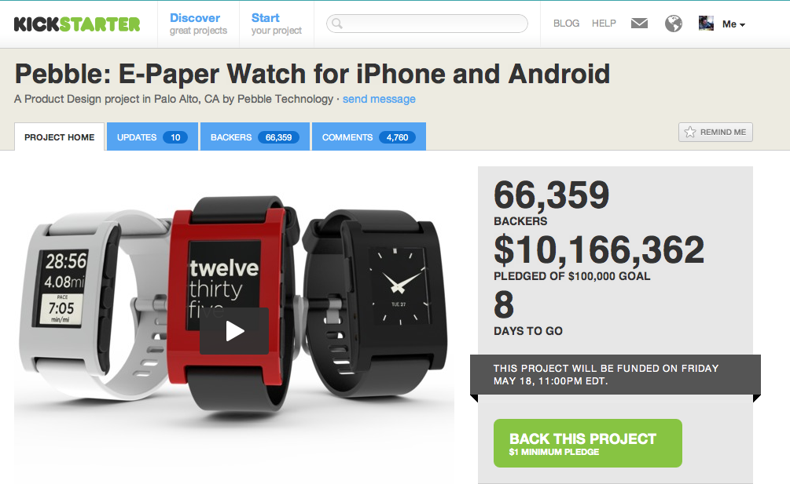
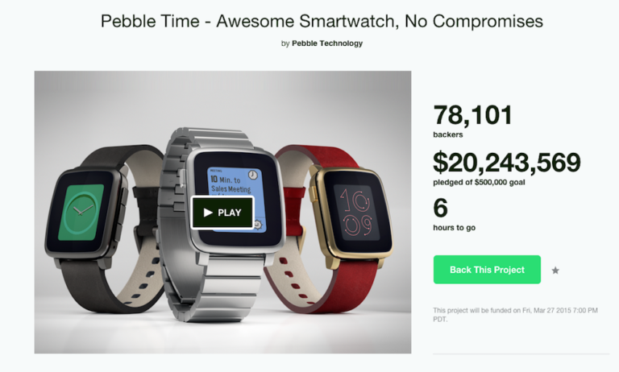
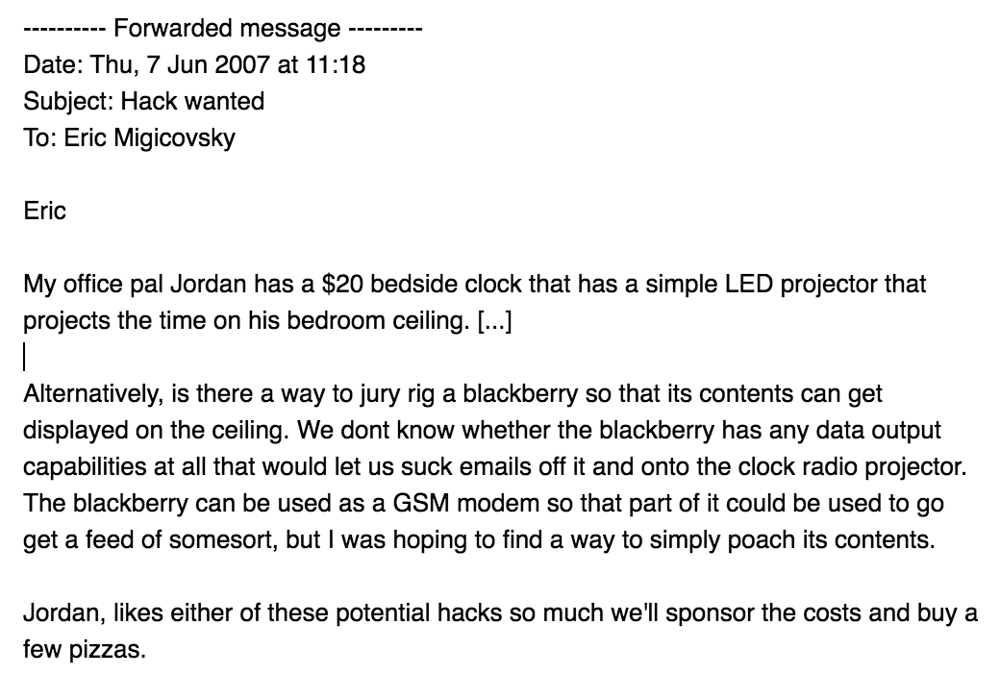
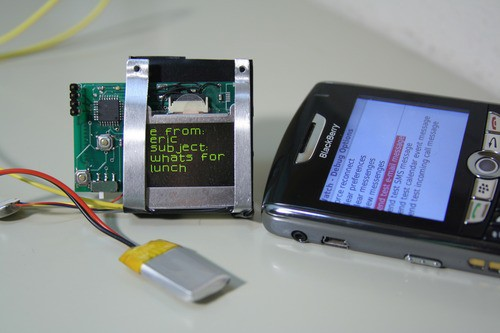
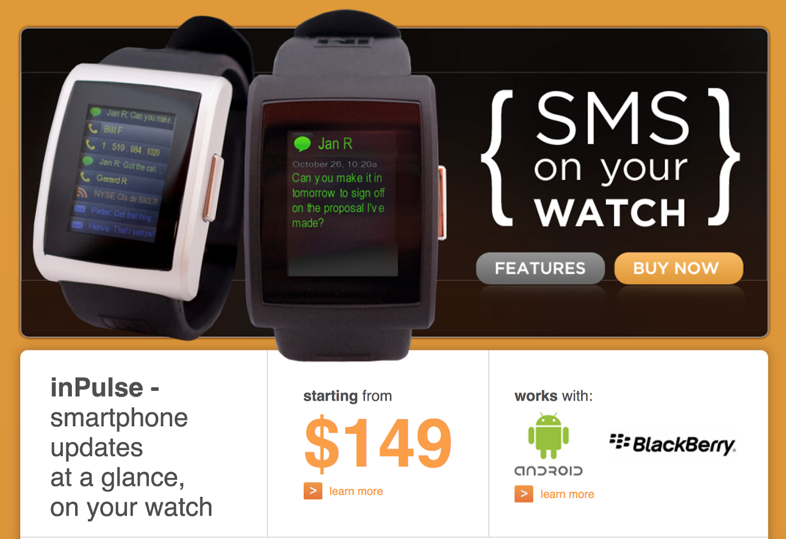
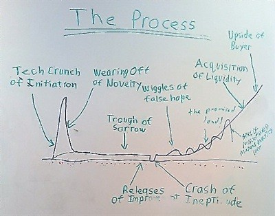
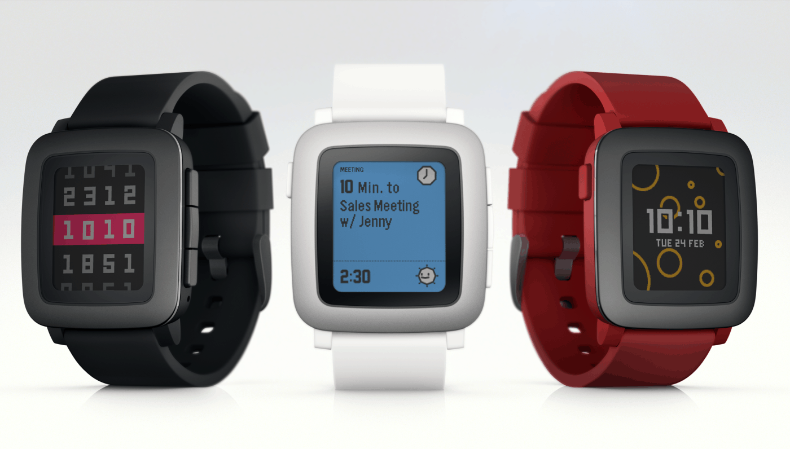
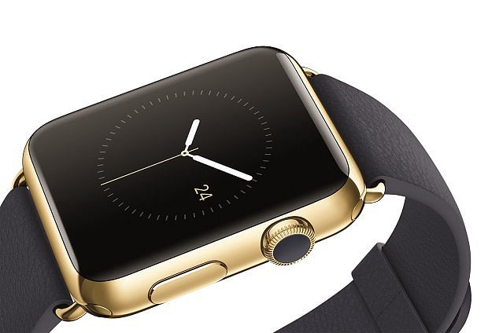
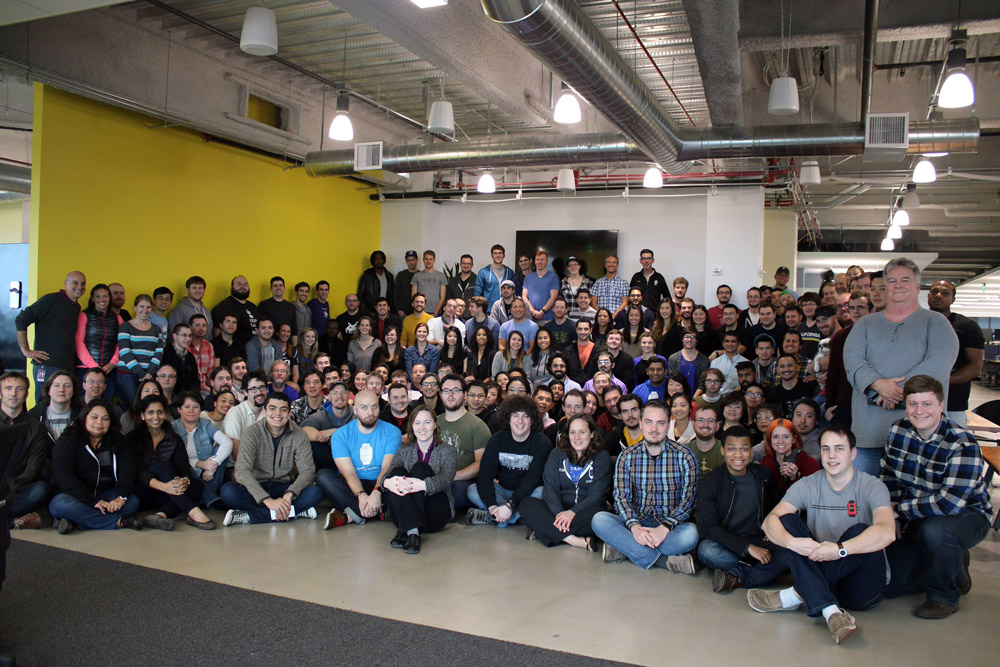

 *I’ve been giving a talk on the importance of learning from failure to every YC batch for last few years. I wrote this post in 2017 but never published it. I dusted it off for the 10 year anniversary of Pebble’s launch on Kickstarter.*

 

 I started Pebble with some friends from the University of Waterloo in 2008. We were the first company to work on smartwatches. Pebble defined what a smartwatch was meant to do — vibrate and display incoming calls and messages, control music without taking out your phone, track your exercise and sleep, and be customizable by downloading [fun watchfaces](https://apps.rebble.io/en_US/watchfaces).

 You might remember us from 2012 we launched [Pebble on Kickstarter](https://www.kickstarter.com/projects/597507018/pebble-e-paper-watch-for-iphone-and-android) and raised over $10m from 68,000 people around the world. This was our first breakthrough (a *classic* 5 year "overnight" success!) Over the next few years, we sold 2 million watches and did over $230m in sales.

 We succeeded at inventing the smartwatch and an entirely new product category. The product itself is amazing, people still use it to this day. I personally still use my Pebble 2 HR every single day and I wouldn’t trade it for any other smartwatch on the market.

 But in the end, we failed to create a sustainable, profitable business. We sold parts of our business to Fitbit at the end of 2016.

## What happened? 
 Here’s my **TL;DR** of why we failed:
 * Sales for our version 2.0 (Pebble Time) in 2015 didn’t hit forecasts and the oversupply in inventory put us into a major cash crunch (targeted ~$100m in sales, we did $82m).
 * Pebble Time did not succeed because in a quest for huge growth we attempted to expand beyond our initial geeky/hacker user base and failed to reposition it — first as a productivity device, then as a fitness watch. In hindsight, this was stupid and obvious and 100% my fault. We didn’t know if there was actually a market for a more ‘productivity’ smartwatch and we weren’t a fitness company at the core.
 * Another reason — the bezel on Pebble Time was too damn big! I knew this in my heart but the project was so behind at the time that I didn’t have the guts to change it.
 * In 2015, we also doubled our operating expenses in anticipation of future growth. This, combined with lower gross margins as we tried to cram more technology into our 2015 lineup, caused us to lose profitability (we did $9m in net profit in 2013 and broke even in 2014).

 

 We spent 2016 desperately trying to cut costs, retain the team, build another product, raise money and, eventually, sell the company.


The underlying problem was that we shifted from making something we knew people wanted, to making an ill-defined product that we hoped people wanted.


 In the days after our Kickstarter campaign, it was easy for me as the CEO to explain what our goal was. Ship the best damn smartwatch that we ourselves wanted to use. Over the years, I tried several times to reposition the product and company onto a variety of new tracks, but none were based on a strong long term vision.

 Startup founder lesson learned — never forget to define and talk about your long term vision for the future. When things are going well, it’s easy to get caught up in growth. But you need this to carry your company through hard times.

 Looking back with hindsight, I should not have aggressively grown the company without a stronger plan. We should have just stuck to what we knew best and continued to build quirky, fun smartwatches for hackers. Pebble, the product, was and still is awesome. Even though we released it 5 years ago, the Pebble 2 HR on my wrist (powered by Rebble.io) still does everything I want it to do 😄

 Feel free to read the rest of the post below with a bunch of details!


**In 2021**, I decided to jump off into the deep end again and start a new company called [Beeper](https://www.beeper.com). We’re building a universal chat app. Chat today is still surprisingly broken. Your contacts are spread out across a dozen different chat networks. You have to check several inboxes to keep tabs on everyone. It’s easy to miss messages and hard to avoid junk texts. We’re fixing this. Most chat apps are not real products, instead they are loss-leaders for other services. We love chat and treat it with the respect and focus that it deserves. Our goal is to build the best damn chat app. In the process, it’s likely that Beeper will become the underlying communication system for everyone on earth. I wrote about our plan in more detail [here](https://blog.beeper.com/p/the-universal-communication-bus-42dfb9a141ad?s=w).

I think a lot about my experience at Pebble, and the many lessons learned in the process. It makes me a better CEO and leader. As I like to say, I’m glad to have learned so much from Pebble, and I’m excited to make new, more interesting mistakes at Beeper 😉


## The Longer Story
 I began working on smartwatches in 2008, but I had been building small electronics projects for a while. My uncle had actually asked me to hack together a bedside clock that would project your Blackberry emails on the ceiling 😂

 

 While studying at TU Delft in 2008 I started to working on smartwatches. There wasn’t [much competition](https://www.wareable.com/smartwatches/smartwatch-timeline-history-watches) at that point. I looked for one to buy but the only thing I could find was a [Sony Erisson watch](https://www.cnet.com/reviews/sony-ericsson-bluetooth-watch-mbw-100-review/) that showed caller ID and cost $300. A few friends (Steve, Garret, Brad, Nick, Rahul, Derek) and I started working on our first watch, called [inPulse](https://web.archive.org/web/20111016072157/http://www.getinpulse.com/). We even had a [blog](https://web.archive.org/web/20130526100520/http://blog.getinpulse.com/?page=2) back then too.

 

 

 Our second act really started in 2011 when Andrew Witte joined the team and designed our next generation watch. We launched Pebble on [Kickstarter](https://www.kickstarter.com/projects/getpebble/pebble-e-paper-watch-for-iphone-and-android) in April 2012. Over the next 5 years, we sold over 2 million watches.

 I won’t be covering the entire history of Pebble. Instead, I want to focus on the latter stages, explain some of our failures and extract some lessons learned that I will apply to future ventures.

## Did Pebble Fail?
 Yes, in the end we failed. We failed to build a long term successful and profitable company. We certainly had successes on the way (the company was over 8.5 years old when we sold!) but the end result was definitive. We ran out of money and [sold what we could](https://www.wired.com/2016/12/the-inside-story-behind-pebbles-demise/) to preserve the product experience for the millions of people out there with Pebbles.
 
 Pebble was always an odd startup. We only were able to raise $150k from angel investors in the year after we went through Y Combinator’s Winter 2011 batch. This was much lower than our batch average. We luckily survived long enough to launch Pebble on Kickstarter.

 The vast majority of startups die before experiencing anywhere near the success we had. Before getting too deep in the stuff we screwed up, we definitely had a few things to be proud of:

 * We recruited a super talented team that invented and defined an entirely new multibillion dollar product category.
 * We had early success in this market, selling over $230 million worth of Pebble smartwatches in 4 years. There are more than 2 million Pebbles spread around the world.
 * Through a combination of luck, timing, and dedication we inspired the imagination of a passionate community that grew around Pebble, watchfaces, apps, skins, mounts, accessories, and even 19 Pebble accessory Kickstarter projects.
 * One of my favourite things in the world… catching a glimpse of a Pebble on someone’s wrist when I travel. (2022 update: I saw another father with a Pebble Time on his wrist at the playground a few weeks ago!)

 Anyways, Pebble doesn’t exist today. A startup is always cycling from lows to highs. The trick is to stay alive between local minima and maxima. While we tried our best in 2016 to pull up from a year-long dive, we weren’t able to make it work.

 

## Here’s How We Failed
 

 In 2015 we came out with a new range of watches — Pebble Time. We had a very successful launch mid year on Kickstarter and began preparing for a wider retail rollout in the fall. Similar to most consumer electronics products, our watches had long production lead times (over 4 months) which meant we had to place all our build orders for the holiday quarter before we had results from the retail rollout.

 *I bet you can see what’s coming.*

 Retail sales were much lower than expected. Our [2015 Kickstarter campaign](https://www.kickstarter.com/projects/getpebble/pebble-time-awesome-smartwatch-no-compromises) was huge — we sold over $20m watches and built our retail sales forecasts around this early traction. Our marketing efforts (outside of the Kickstarter campaign) were pretty awful. We basically dropped units into Best Buy and Amazon and expected them to sell accordingly. We didn’t do any of the standard practices like synchronizing a campaign across all channels or building a strong influencer network. We struggled with making strong decisions on marketing (and sticking to them) and wavered on hiring a head of marketing for years, before making a decision in early 2015.

 This forecast miss left us at the end of 2015 with over $15m of inventory sitting in our warehouses. This put us into a cash crunch in early 2016 that we worked through the whole year to solve.

 Other factors massively complicated this effort.

 From 2013 to 2014 our revenues doubled from ~$30m to $60m. In 2015, we grew the company to catch up with growth but dramatically overshot in anticipation of future growth. We hired a bunch of talented people (filling big gaps in technical and team debt), moved to a new office and doubled our operating expenses. Unfortunately, in 2015 our revenue only grew 35% and our gross margin dropped from an okayish 35% to a dismal 27%. Our 2015 products also cost more to make than we anticipated.

 We also struggled a ton in 2015 with our marketing and positioning.

 In 2013, Pebble was the cool nerdy colourful watch that your coworker kept looking at during lunch. In 2014, Pebble Steel got shinier but still had a geek core (the box proudly displayed a Bitcoin tracker app). Around this time Apple came out with the Apple Watch and we thought the smartwatch market was about to explode. So in a quest for big sales growth, we figured our 2015 strategy would need to shift focus to a broader market, away from our core early adopter market positioning.

 We settled on efficiency and productivity.

 Pebble Time included our new timeline-based operating system that let you perform short, quick interactions (checking weather, calendar, sports, Uber) on your Pebble. We figured this would give us competitive differentiation from sports focused wearables and be useful for a broader set of users. While this software was certainly useful and made sense in the context of a watch, it was exceedingly difficult to explain why customers should care. It failed the ‘make something people want’ test. It was cool and some people used it a lot, but ‘I want my smartwatch to be more efficient’ was not a widespread hair on fire problem. We didn’t do our product research, we didn’t talk to enough of our users.

 

 We weren’t the only one with positioning problems. Look back at the original Apple Watch marketing. ‘Most precise timepiece ever.’ Ultra luxury $17,000 gold models. LVMH partnerships. Thousands of apps on your wrist. $350+ price point. It took Apple 2 years to reposition as a sports/fitness device. This turned out to be the largest market for wearables in 2016/2017. We eventually got there as well with [Pebble 2 and Pebble Core](https://www.kickstarter.com/projects/getpebble/pebble-2-time-2-and-core-an-entirely-new-3g-ultra) but it was too late for us. This delay was solely my fault; my team had been pressuring me in 2015 to adopt a sports/fitness focus but I resisted, unsure of how we could differentiate and optimistic that our efficiency focus would work out.


2022 addition: It’s funny looking back on what I wrote back in 2017. I don’t think we would have really succeeded as a fitness watch even if we had doubled down on it in 2015. We weren’t a fitness company at our core.


 Another significant point that I’ll dive deeper into some other time: we started designing Pebble Time back in 2013. It took us way too long to get it to market. The industrial design was good, but it looked a lot more like a playful, colourful geeky watch than a productivity machine. There was a big mismatch between positioning and physical appearance. This demoralized our software design team as well as the industrial design folks because we weren’t being effective at targeting a specific user base. They both did a tremendous job in getting us back on track with our 2016 product lineup, though! RIP Cutts, PT2 and Core.


I think there’s a bit more to this. Not only did we not have a clear understanding of our target customer that was shared across hardware, software, and marketing, I think we allowed early success (KS1 and even to some extent KS2) to mask the fact that we never gained a good understanding of what our actual customers valued the most. We lucked into having made something people wanted (the original Pebble) and, *IMO*, never really were able to figure out exactly why it was successful. So it was hard to reproduce that success.


## Some of the major lessons learned:
 Forecasting. This is the single most difficult challenge for a consumer hardware company, especially if it has a retail presence. There’s no silver bullet solution that I know of. We should have made smaller inventory purchases, risking less. We should have reacted quicker. And developing a shorter lead time supply chain would have helped a lot. Reducing the number of SKUs that you offer helps tremendously.

 2022 update: [Peloton just got hit hard by this](https://www.businessinsider.com/peloton-company-history-rise-fall-2022-2) last year. That made me feel like less of an idiot.

 * **Don’t grow OPEX** unless your revenue continues to grow. Duh. Seems obvious but still I screwed this up.
 * **Losing profitability** didn’t help, but probably wasn’t the biggest problem. I got onto the VC fundraising treadmill without really acknowledging it, and didn’t create a fundraising strategy to support us.
 * **Market positioning**. We forgot the cardinal YC rule: talk to customers. Build something people want. In 2015, we had the option to narrow our focus to a smaller but more distinct market positioning. Looking back, this is one of my biggest regrets. We could have been *the* smartwatch for hackers but we tried to grow our volumes and market share (and failed).

 That’s a broad look at where the company was back in 2015. But all of those issues could have been fixed if we had caught them a bit earlier and conserved our capital. After many months of pondering, **I think two other issues were actually more critical and would have killed us even if we had solved all the other things**. I’ll cover the biggest one in this post, and write a separate post on the other issue (how Pebble was in a ‘hits driven business’ and didn’t recognize it early enough). 2022 update: I haven’t written this post yet, but long story short Pebble was on the ‘consumer electronics’ release cycle. We had to launch new products each year in order to make money. Instead, we could have charged a subscription or created enduring product lines that could be sold year-over-year.

## But our main issue was that I did a terrible job at defining our long-term vision
 I struggled over and over to define a strong long term vision for what Pebble as a company would accomplish. In some ways we were spoiled…when our Kickstarter in 2012 was super successful, we never had to go through the exhausting process of iterating on sales techniques to acquire customers. We had crystal clear marching orders in 2012: build exactly what we had promised our backers and make it as high quality as possible. That’s what we did in 2012–2014…we just built great smartwatches that we ourselves (young hackers) wanted to use. After Pebble Steel in 2014, we came up for air and found ourselves in a more competitive space. As discussed above, we attempted to expand into a new market, and failed.

 When I would host our Friday all-hands meetings I’d talk about aspirational goals like ‘becoming the future of computing’. This was really my dream goal, inspired by decades of reading sci fi (like Jane from the *Speaker For The Dead*, *Daemon*, *Neuromancer*, *The Light Of Other Days*, *Devil On My Back*, *etc.*).


One of my favourite celebrity Pebble sightings was on the wrist of William Gibson. A fellow Vancouverite, he very kindly answered an email later to hang out!


 My personal vision was that Pebble would become a brain-computer interface company, with the smartwatch as the first always-on, always-worn gateway between computers and our bodies. But I rarely discussed this with the team, or even the exec team. My rationalization for not talking about this more, I think, was that this would distract us from the many tasks and problems we had at hand of just making and selling smartwatches.

 I never invested time in building out a structured plan to *actually* make the brain-computer interface our company’s vision. It never guided our product development. We didn’t talk to customers about problems they had in this space. We never trained or hired engineers to pursue research in the space. It was never in our pitch decks to investors. Every so often it would come up in passing but when colleagues inevitably found holes with the logic I just moved on and focused on tasks at hand instead of trying to address concerns and improve the idea.

 It got to a point where I didn’t even discuss it that much because I got apprehensive about folks thinking it was stupid or that I was just wrong; I was worried they’d lose confidence in me.

 The irony is that while we were successful and growing revenue, I could have spent some of the social capital I’d earned to flesh out the idea and weathered any complaints about it being a stupid idea while it improved with feedback.

 As soon as our growth slowed down in 2015, my colleagues began voicing their concerns more loudly about our lack of long term vision or strategy. I got the question many times ‘What are we really working on at Pebble? Are we a smartwatch company or something else?’. At that point, though, any answer I had for them just hadn’t been fleshed out enough. I toyed with different strategies, testing them out on my exec team and individuals around the company. But there was no foundation to the ideas; they all just felt like band-aids. We were also trying to dig ourselves out of the financial difficulties that we were in, so this took even a further backseat.

 I’m continually amazed and thankful that so many talented colleagues stuck with me and the company through 2016. As I said before, startups are a continuing cycle of ups and downs. I really wish I could have provided a stronger, more motivating vision to keep us together in 2016.

 

 Anyways, that’s a longer than expected post about Pebble in 2015/2016. Let me know in the comments if you have any questions or feedback. I’ll try to answer as much as I can. I’m now a partner at YC, where my goal is to help as many startups as possible become successful–and not just hardware companies!
