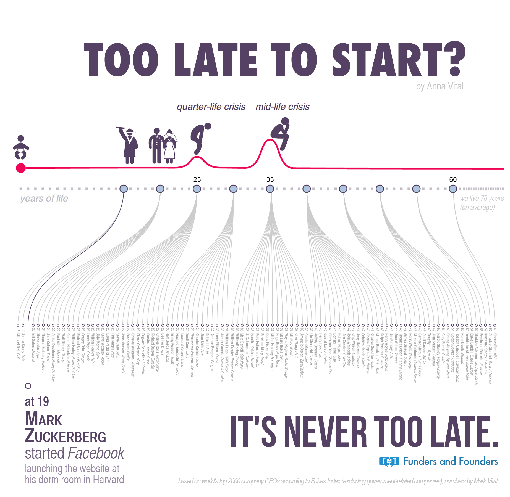

*Does success have a deadline?  And if yes, what is the best age to succeed? Here is a visualization of the relationship between age and success. Tap on the circles below and investigate for yourself.*

## “The Critical Period” – Do It Early or Bust?
Language, it is believed, cannot be learned without an accent after the critical age (usually 16). Musical talent is usually apparent in the first ten years of life. Most people we know as successful programmers started coding as children, and successful athletes commonly celebrate their twentieth birthday already celebrities. This can make one look like a failure at 27 if all you got is a college degree. But that may be a false impression.

## The Data Behind The Success Age
Looking at the biographies of top 100 founders on the Forbes List shows that 35 is the most common age to start one of the top companies in the world. We excluded the companies that were inherited from previous ones, and the companies where governments were heavily involved. For example, one of the largest companies in the world is Agricultural Bank of China. It was founded by Mao Ze Dong while he was the country’s chairman. This types of founders we excluded, to make sure the list only contains self-starting founders.

## The Middle Of Life or Mid-Life Crisis
The result is a bell curve, just like in school most people get grades somewhere in the middle, in life most people succeed mid-life, that is about 35, for the current generation.

Intuitively then, we expect some major life achievements to happen around the middle age, otherwise – the mid-life crisis.

## The Quarter-Life Crisis
When you graduate college, with expectations from parents on your shoulders, seeing teenage CEOs in the news can make you feel like a late bloomer. Even at 25. Since today we expect to live longer than today’s average life span of 78 years, at 25 you can reasonable think you are through a quarter of your life. This is a newer term than the good old mid-life crisis.

## Late Bloomers, Not Losers
So what about those who succeed later in life – the late bloomers. Is it better to be an early achiever or a late bloomer? That’s the same as asking if it is better to start Facebook at 19 or IBM at 61? For the world at large it does not matter. Perhaps Facebook could never happen if IBM did not exist. Should Charles Flint have felt himself a loser when he organized IBM out of a time-card punching technology firm at the ripe age of 61? Those time card punchers turned out to be early prototypes of computers.

Perhaps you have not heard much about Flint, but the device you are looking at right now is possible in part because of what Flint started at 61. He even lived another 24 years, working and enjoying the fruits of his late-in-life success. A later bloomer? Perhaps. Too late for him at 61? Never too late.