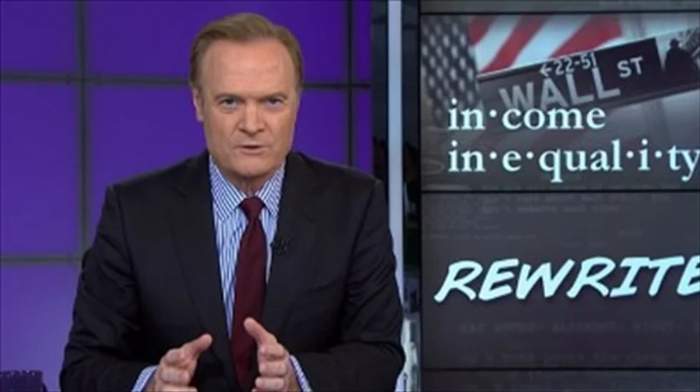

MSNBC host Lawrence O'Donnell argued on Tuesday that a new report highlighting the damage income inequality does to Wall Street should change the debate around the subject by excluding morality in favor of economic self-interest for the wealthy.

"Worrying about income inequality is now way too important to be left to the liberals, according to this Wall Street report" O'Donnell said.

As the [New York Times reported](http://www.nytimes.com/2014/08/06/upshot/alarm-on-income-inequality-from-a-mainstream-source.html?_r=0), the study by Standard & Poor's Ratings Services found that the rise of income inequality in the U.S. has damaged the growth of the country's gross domestic product, to the point that Standard & Poor's downgraded the country's projected growth rating over the next decade from 2.8 percent to 2.5 percent.

"We see a narrowing of the current income gap as beneficial to the economy," the report stated. "In addition to strengthening the quality of economic expansions, bringing levels of income inequality under control would improve U.S. economic resilience in the face of potential risks to growth."

O'Donnell further argued that the massive gap in income distribution hurts those at both the top, since their disposable income is less likely to be put back into the economy.

"If you have all the houses you think you need and all the yachts you think you need and all the private planes you think you need and you still have tens of millions of dollars left over, and tens of millions of dollars of new income coming in next year, then very little of your new income is going to be used for new spending, and the economy always needs new spending," he said. "And in the lower end of the income scale, where people have no savings and not enough money to make ends meet, they have to cut back on their spending. Long-term, those two conditions can strangle the economy."