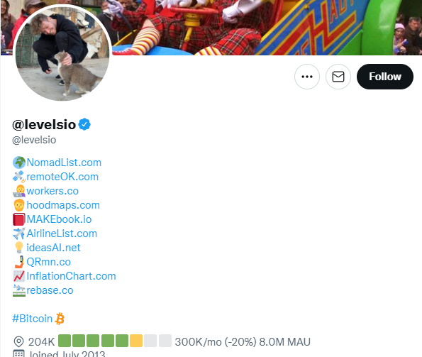
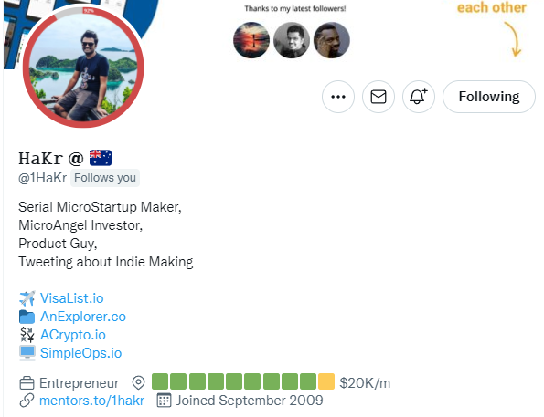

 *Is this the future of startups?*

 

 We often see the news that a huge startup just got funded for millions of dollars or that a startup just got acquired by a tech giant for billions. Some of these startups may seem simple on the surface but, in reality, require a massive amount of funding, team members and a large amount of capital burn to get it to the stage of profitability.

 Unfortunately, most startups will never get to that scale, yet many entrepreneurs aim towards these massive valuations as their ultimate goal.

 I recently spoke to a friend who runs a marketing agency, and she mentioned she had a problem working with a client of hers who was an early stage funded startup. When I prompted what the problem was, her client wanted to ‘scale as quickly as possible’ and burn capital on ads so they could grow and get a larger valuation in their next round.

 In her words, ‘they wanted to become a unicorn as fast as possible’. As soon as I heard this, I rolled my eyes. These are founders who think that the only way to run a successful startup is to take round after round of funding until you’re worth more than a billion dollars.

 Of course, the reality is there are a ton of other ways to grow your startup. One of the ways of thinking about it is what is described as a ‘microstartup’.

## What is a microstartup
 Although there isn’t a ‘real’ definition of what a microstartup is, they often have a few attributes that make it one including:

 1. They are usually run by 1 to 5 people maximum
 2. They require only a small amount of capital to get started (so bootstrapped)
 3. Usually, the goal is to make some kind of revenue from it

 Often, microstartups are set up to scale without the need for large teams and to produce income for its creator. These ideas often help tackle one major problem that users want to solve and are willing to pay money for.

 What’s interesting about the concept of microstartups versus your typical one is the intention of making money. Revenue might not be the intention for some startups (especially ones working on innovation, deep tech, etc.), but this is the exact goal of a microstartup.

 The beauty of running a microstartup is that you can often work on multiple of them. There are great examples of entrepreneurs doing precisely these types of startups.

## Here are my favorite two that I follow below!
 

 

 What’s awesome is these ideas are super simple and niche but generate a large amount of income for both of these entrepreneurs. They also go one step further, and they both add the revenue generated on their profile for transparency.

## Look to solve a problem you, a friend or someone around you has
 Your goal is to figure out an easy problem people are willing to pay money for. If you look into the products in the Twitter profiles of the two previous entrepreneurs, the problems they solve aren’t world-changing but rather annoying ones that people are willing to take their wallets out for.

 The goal is to create almost multiple sources of income by solving various problems separately. This could be in the form of subscriptions, ad revenue, or other sources.

 This means more than often, software, apps or websites are a great way to help scale multiple products in your portfolio.

## What about getting acquired?
 Of course, not all microstartups generate regular recurring revenue for the entrepreneur. Some of these may end up being acquired by huge companies before they can scale up.

 Although not officially a microstartup by any means, Wordle was purchased by New York Times for more than $1 million. Of course, this wasn’t the product's intention, but reaching its velocity and scale was enough for it to be acquired for that much.

 Bigger tech giants also acquired other products like Vine and Luma during its time (Vine by Twitter and Luma by Instagram before it got acquired by Facebook).

 Both of these products only had a 3-man team and were acquired in their first year of operation. Although making money might be a goal for some microstartups, getting scale and velocity is another way of being noticed, and instead, you may end up being acquired for the tech you build.

 Of course, being acquired could be a valid strategy for building a microstartup, but the safer option would always be to go after a product that can net you recurring revenue without ‘requiring’ an acquisition.

## Does that mean I have to be a techie?
 Well, it would help, of course, to be technical so you can build projects out, but there are plenty of ways to build successful simple applications without the need for technical knowledge.

 What’s great about today’s day of age, there are so many no code or low code apps out there you can use to build awesome apps and software.

 I built my first app from Glide, Airtable and other no-code tools ([here’s the link if you want to check it out](https://www.valuablerare.com/)). This is coming from someone with basic technical knowledge (I’ve had friends do it with zero technical knowledge), so if I can do it, you can too.

 Another suggestion is to do it with a friend who might be more technical. I’ve always found working with another partner a better way to build a business than running solo.

 Of course, this doesn’t mean you can’t do it solo, but I’ve always found splitting the work easier and being able to bounce ideas off one another a great way of approaching work. This is especially great if you can find someone who has a similar drive to you (with different skillsets) so you can keep each other accountable.

## Time to find that problem
 There are so many problems around us that people create their own ad hoc solutions for every day. More than often, we’re willing to pay a couple of bucks a month just to solve the hours of time needed to solve these issues.

 I could personally name a ton of problems I have every day that I am willing to spend a bit of money on to reduce the hassle.

 So why not start digging around to see what you can build with your current knowledge. Remember to keep it simple and stick to solving a problem people are willing to pay money for.
