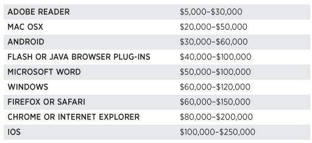

 
#FORBES - Shopping For Zero-Days: A Price List For Hackers' Secret Software Exploits


 Time to put my "black-hat" on!?

 ---
 
 A clever hacker today has to make tough choices. Find a previously unknown method for dismantling the defenses of a device like an iPhone or iPad, for instance, and you can report it to Apple and present it at a security conference to win fame and lucrative consulting gigs. Share it with HP's Zero Day Initiative instead and earn as much as $10,000 for helping the firm shore up its security gear. Both options also allow Apple to fix its bugs and make the hundreds of millions of iPhone and iPad users more secure.

 But any hacker who happens to know one Bangkok-based security researcher who goes by the handle "the Grugq"--or someone like him--has a third option: arrange a deal through the pseudonymous exploit broker to hand the exploit information over to a government agency, don't ask too many questions, and get paid a quarter of a million dollars--minus the Grugq's 15% commission.

 That iOS exploit price represents just one of the dozens of deals the Grugq (pictured above) has arranged in his year-old side career as a middle man for so-called "zero-day" exploits, hacking techniques that take advantage of secret vulnerabilities in software. Since he began hooking up his hacker friends with contacts in government a year ago, the Grugq says he's on track to earn a million in revenue this year. He arranged the iOS deal last month, for instance, between a developer and a U.S. government contractor. In that case, as with all of his exploit sales, he won't offer any other details about the buyer or the seller.

 Even with the $250,000 payout he elicited for that deal, he wonders if he could have gotten more. "I think I lowballed it," he wrote to me at one point in the dealmaking process. "The client was too happy."

 A six-figure price for a single hacking technique may sound extravagant, but it's hardly unique. Based on speaking with sources in this secretive but legal trade, I've assembled a rough price list for zero-day exploits below.

 

 Each price assumes an exclusive sale, the most modern version of the software, and, of course, not alerting the software's vendor. Some fees might even be paid in installments, with each subsequent payment depending on the vendor not patching the security vulnerabilities used by the exploit.  In some cases the techniques would need to be used in combination to be effective.

 An exploit's price factors in both how widely the target software is used as well as the difficulty of cracking it. A technique that allows a hacker to gain control of a Mac OSX machine after hacking an application might earn only a fraction of one that targets Windows, for instance, because of Windows' greater market share. But an iOS exploit pays more than one that targets Android devices partly because it requires defeating Apple's significantly tougher security features. That means most agencies can simply develop their own Android attacks, the Grugq says, while ones that can penetrate the iPhone are rare and pricey. For the [Jailbreakme 3 iOS exploit created by the hacker Comex](http://www.forbes.com/sites/andygreenberg/2011/08/01/meet-comex-the-iphone-uber-hacker-who-keeps-outsmarting-apple/) last year, the Grugq says he heard agencies would have been eager to pay $250,000 for exclusive use of the attack.

 Who's paying these prices? Western governments, and specifically the U.S., says the Grugq, who himself is a native of South Africa. He limits his sales to the American and European agencies and contractors not merely out of ethical concerns, but also because they pay more. "Selling a bug to the Russian mafia guarantees it will be dead in no time, and they pay very little money," he says, explaining that he has no contacts in the Russian government. "Russia is flooded with criminals. They monetize exploits in the most brutal and mediocre way possible, and they cheat each other heavily."

 As for China, he says that the country has too many hackers who sell only to the Chinese government, pushing down prices. "The market is very depressed," he says. Other regions like the Middle East and the rest of Asia can't match Western prices either.

 As a result, the Grugq earns 80% of his revenue from the U.S., though occasionally the developers who work with him have asked that he sell only to Europeans. Over more than a decade in the hacker scene, he's met enough federal agents to have contacts at multiple U.S. agencies, and he knows how to package his developer's exploits for sale to those buyers, with professional marketing and support. "You’re basically selling commercial software, like anything else. It needs to be polished and come with documentation," he says. "The only difference is that you only sell one license, ever, and everyone calls you evil."

 One of the most vocal of those critics is Chris Soghoian, a privacy activist with the Open Society Foundations, [who has described](http://www.forbes.com/sites/andygreenberg/2012/03/21/meet-the-hackers-who-sell-spies-the-tools-to-crack-your-pc-and-get-paid-six-figure-fees/) the firms and individuals who sell software exploits as "the modern-day merchants of death" selling "the bullets of cyberwar."

 "As soon as one of these weaponized zero-days sold to governments is obtained by a ‘bad guy’ and used to attack critical U.S. infrastructure, the shit will hit the fan," Soghoian [warned in a talk at the Kaspersky analyst summit in February](http://www.zdnet.com/blog/security/0-day-exploit-middlemen-are-cowboys-ticking-bomb/10294). "Security researchers should not be selling zero-days to middle man firms...These firms are cowboys and if we do nothing to stop them, they will drag the entire security industry into a world of pain."

 The Grugq sees no ethical compromise in his work. "The Chinese are conducting espionage on a massive scale. [Soghoian] wants to ban sales of software--sorry, exploits--to the U.S. and European allies?" he asks. "The only possible outcome is that the Chinese will increase their internal production and skills and the...West will fall behind."

 Anyway, he adds, he doesn't believe banning the sale of exploit code would make users more secure. "That'll work just as well at eliminating exploits as the war on drugs has worked at eliminating drugs," he says.

 The Grugq is hardly alone in his industry. Small firms like Vupen, Endgame and Netragard buy and sell exploits, as do major defense contractors like Northrop Grumman and Raytheon.

 Netragard's founder Adriel Desautels says he's been in the exploit-selling game for a decade, and describes how the market has "exploded" in just the last year.  He says there are now "more buyers, deeper pockets," that the time for a purchase has accelerated from months to weeks, and he's being approached by sellers with around 12 to 14 zero-day exploits every month compared to just four to six a few years ago.

 Desautels won't offer much about exactly who his customers are. But he says not every buyer aims to use his zero-days for spying. He claims to have recently sold a browser exploit for $125,000 to a private sector client for who aimed to use it merely as a proof-of-concept for marketing purposes. Other buyers use Netragard's exploits for penetration testing, he says. "If you test a bullet proof vest, you use a bullet, not a squirt gun," says Desautels.

 Nonetheless, he says that the firm is "extremely careful" about choosing its customers. "We reject a lot more people than we accept," he says. "Realistically, we’re selling cyberweaponry."

 And what about the option of selling the exploits to the software vendor itself, so that it can patch the targeted program? Firms like Mozilla and Facebook offer developers a few thousand dollars for reporting bugs. Google typically offers a maximum of $3,133.70 for information about the most complex flaws in its software, a number that's meant to spell out "elite" in hacker slang.

 But a four-figure price is hardly elite enough for the Grugq. "If they want their bugs fixed, they can buy them at market rates like everyone else," he says. "From each according to their ability, to each according to their needs? That’s communism. If they want the output, they can pay for it like anyone else. They have my email."