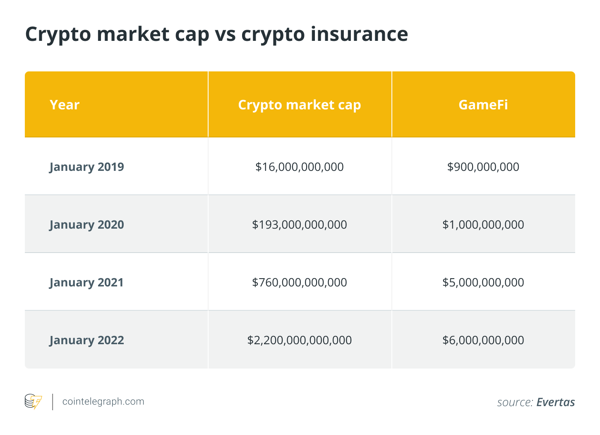
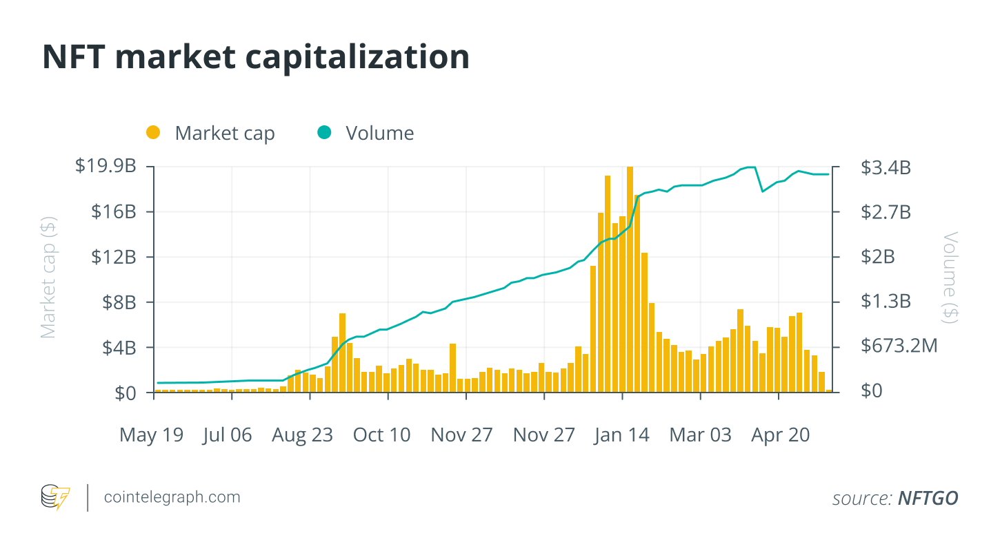

*Traditional insurance isn’t going to step up and protect our crypto assets, so we need to do it ourselves, in a decentralized manner.*

<!--  -->

The insurance industry has a long history of providing vital support for major leaps in innovation. It’s no coincidence that the modern insurance industry and the industrial revolution arose in parallel. Indeed, it has been convincingly [argued](https://eh.net/book_reviews/insuring-the-industrial-revolution-fire-insurance-in-great-britain-1700-1850/) that the invention of fire and property insurance — in response to the Great Fire of London — lubricated the gears of capital investment that powered the industrial revolution and is likely the reason why it started in London. Through that first and each subsequent technological revolution, insurance has offered innovators and investors a safety net and served as an outside, objective validator of risk — thereby acting as a source of both the encouragement and the security needed to confidently test and break barriers.

Today, we are in the midst of a new digital financial revolution, and the case for this new technology is clear and compelling. The recent [White House executive order](https://cointelegraph.com/news/biden-signs-executive-order-on-crypto-authorizes-all-government-effort-to-consolidate-regulation) on “Ensuring Responsible Development of Digital Assets” further underscored this and was a watershed moment for the industry, elevating the discussion around the importance of the technology to the national stage and acknowledging its importance to the United States strategy, interests and global competitiveness.

## The lack of crypto insurance
Yet, considering current crypto insurance capacity is estimated to be about $6 billion — a drop in the bucket for an asset class with a roughly $2-trillion market capitalization — it’s clear that the insurance industry is failing to keep up and play its vital role.

This striking lack of insurance protection for digital assets was specifically [referenced](https://www.youtube.com/watch?v=F_kZELcynKQ&t=3832s) in December’s House Financial Services Committee hearings on the state of the market. Should this state of affairs persist, it does so at the risk of impeding future growth and adoption.

Why have traditional insurers avoided entering this space despite the obvious need and opportunity?

Traditional insurers face several fundamental impediments in responding to the new risk class presented by crypto. The most basic of these is a lack of understanding of this often counterintuitive technology. Even when the technical understanding is present, challenges such as properly classifying new and nuanced risk types — *e.g.*, those associated with hot, cold and warm wallets and how myriad technology, business and operational factors bear upon each of these — remain. The problem is further compounded by rapid change in the industry, perhaps best exemplified by the seemingly overnight emergence of new and occasionally confounding risk classes, such as nonfungible tokens (NFT).

And of course, many insurers are still licking their wounds inflicted by their rush to write cybersecurity policies in the early dot-com days without fully understanding those risks and the enormous losses that frequently resulted.

Meanwhile, [according](https://blog.chainalysis.com/reports/2022-crypto-crime-report-introduction/#:~:text=roughly%20%243.2%20billion%20worth%20of%20cryptocurrency%20stolen%20in%202021) to Chainalysis, about $3.2 billion in crypto was stolen in 2021. In the absence of risk mitigation options, that number is enough to give any responsible financial institution considering real participation in this space [serious heartburn](https://cointelegraph.com/news/institutional-investors-plan-to-buy-every-bitcoin-price-dip-data-suggests). In contrast, U.S. banks generally lose less than $15 million to fiat robberies each year. One reason why bank robberies are so rare and unproductive (with a success [rate](https://nypost.com/2017/09/09/theres-no-payoff-to-bank-heists-anymore/#:~:text=Authorities%20have%20solved%20bank%20heists%2086%20percent%20of%20the%20time%20this%20year%2C%20up%20from%20the%2079%2Dpercent%20%E2%80%9Cclearance%20rate%E2%80%9D%20in%202016%20and%202015.) of only about 20% while netting the perpetrator on average just [around](https://ucr.fbi.gov/crime-in-the-u.s/2019/crime-in-the-u.s.-2019/tables/table-23/#:~:text=Bank,4%2C213) $4,000 per incident) is that in order to operate, most U.S. banks must qualify for blanket bond insurance, which requires security measures designed to limit these losses. In this way, insurance not only manages the risk of losses due to robbery but creates an environment in which those losses are much less likely to occur, to begin with.

## The need for crypto insurance
The same applies to insurance against the loss of crypto assets. The goods stored in insured wallets are not only protected but are much less likely to be lost, to begin with, since the underwriting process imposes such a high level of multidisciplinary expert scrutiny and compliance requirements.

The need for and benefit of crypto asset insurance is obvious. But given the circumstances, it’s clear that traditional insurance is unlikely to step up to solve the crypto asset risk problem on a reasonable timeline. Instead, the solution will need to originate from within. We need crypto-native solutions tailored to the industry’s needs, with the flexibility to cover the full spectrum of crypto asset risks, products and services, including NFTs, decentralized finance protocols, and infrastructure.

The advantages of home-grown risk solutions are manifold.

Primarily, dedicated crypto insurance companies possess greater industry knowledge and expertise, enabling higher quality coverage, which, in turn, equates to greater security and safety for the crypto industry as a whole. Given this level of understanding, crypto-native insurance firms would be able to craft risk mitigation products with the flexibility to meet the unique and rapidly changing needs of the industry. Then, once in place, these firms could expand insurance capacity on the order of trillions of dollars by working in partnership with the traditional insurance market. Finally, a dedicated crypto insurance sector will better meet legal and regulatory requirements, ensuring that the lack of insurance does not stall adoption or the growth of crypto.

In light of all this, what’s keeping crypto-native insurance solutions from stepping up to solve the problem?

Ironically, in the case of crypto asset insurance, the industry is overwhelmingly choosing to direct its investment resources in the direction of the very crypto projects whose future viability will be negatively impacted by the lack of insurance capacity resulting from the lack of investment in that space.

That we are in the midst of a new technological revolution is undeniable. So, too, is the fact that insurance has played a vital role in helping past technological revolutions meet their full potential. The extreme lack of crypto asset risk protection in place today is unsustainable and poses an unacceptable threat. It is vital that the crypto community recognize the danger posed by the status quo with its severe lack of crypto asset insurance options.

The good news is we got this far by solving seemingly insurmountable technological and economic problems ourselves, and we believe we can do it again.

