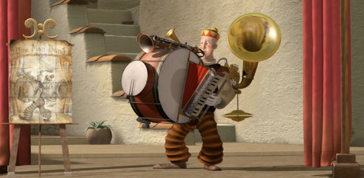
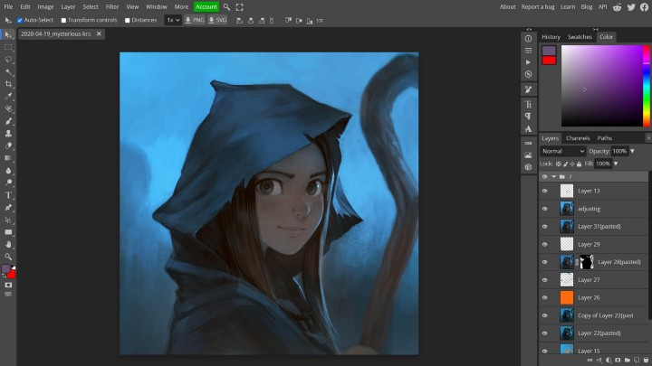
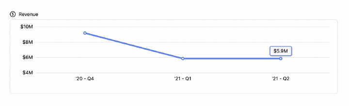
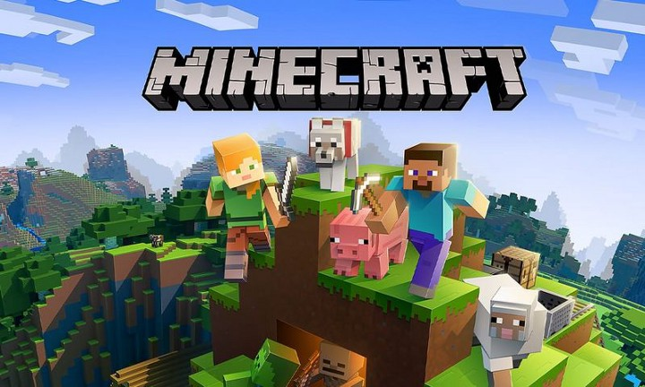
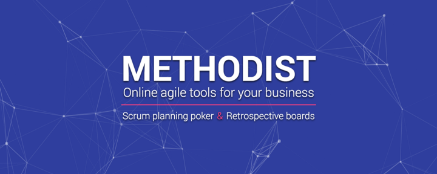

*Sometimes even solo developers can be competitors for huge companies*

Many projects started as a one-person side hustle but eventually grew into a successful large business. Good illustrations are projects like Gumroad created by Sahil Lavingia, MATLAB created by Cleve Moler, and the most known example — Facebook, founded by Mark Zuckerberg.

However, there are also many smaller projects that are very profitable and supported by only one enthusiast. Let me share them with you, and probably something will inspire you to make your own.

## Solo Creator Takes on Adobe Photoshop
In 2016, Ukrainian Ivan Kutskir launched the **Photopea**.com web application. This full-fledged image editor works in the browser, absolutely free. Today, the product brings Ivan more than $1 million a year. At the same time, Kutskir does not have an office, employees, and other mandatory attributes of a business — he does everything alone as he said in his interview with [Lunadio](https://www.lunadio.com/blog/the-story-of-a-unicorn-solo-founder-making-dollar500000-arr/) and highlighted in [Ain’s article](https://ain.ua/ru/2021/04/13/istorija-photopea/).

Before Photopea, Ivan worked under the development of flash games, which in the early 2000s literally teemed with the Internet. Developers monetized such games by displaying banner ads in them. In the future, deep knowledge of this monetization model will be helpful to Kutskir for his graphical web editor.

Ivan used Photoshop a lot in his work and studied it very well. At some point, he became curious if it was possible to parse .psd files in the browser. So he created a simple web tool where you could open a .psd and display all of its layers separately. This tool was just the beginning — the programmer was on fire with the idea of ​​developing a free analog of Photoshop, which would work entirely through the browser.

## Photopea from $0 to $1 million per year
Ivan started working on the Photopea project eight years ago and launched monetization five years ago. Today, the app has become his primary source of income: in 2020, Ivan mentioned he earned $500,000 on Photopea.

### Photopea has three sources of income
* Almost 90% of the money comes from displaying ads in the app
* *Premium subscriptions* — users can subscribe to it in order not to see ads in Photopea
* *Sale of licenses* — Photopea can be customized for your project and integrated via API. Kutzkir charges a monthly fee for these integrations

### No office, no employees, no marketing
As of today, Photopea has 300,000 daily active users. On average, they use 45,000 hours of application daily. At the same time, Kutskir’s material expenses for using the project are more than modest: $45 per year per server.

## Text editor with a focus on text
Jon Skinner is the creator of **Sublime Text**, a popular text editor. He left his job as a software engineer at Google to pursue his dream of creating a better text editor. The result is Sublime Text, which was first released to the public on January 18, 2008.

Sublime Text has many features that make it popular among users. For example, its GUI is similar to the version we are using today. In addition, because TextMate and Sublime Text share a similar minimalist design, switching was simple for those already familiar with TextMate. Furthermore, support for TextMate syntax files was added in early 2008, giving SublimeText a solid foundation to grow by leveraging the already-established TextMate community.

The project system, goto declaration, robust customization, python plugins, package management of Sublime Text, and the fact that it was cross-platform (Windows, OS X, and Linux) propelled it through the public alpha in early 2011. As of September 2017, there are over 2 million users on Sublime Text editor.

Sublime Text is a great text editor that I use for all my coding needs. It’s straightforward to use and has a ton of features. The revenue for Sublime Text is about $6 million, which is pretty impressive.

## One of the most successful games on the planet
Minecraft was born thanks to the Swedish programmer Markus Persson, better known as Notch. His creation is one of the most impressive success stories in the independent gaming world.

Notch showed an interest in computers from an early age and made his first video game at 8. However, it is clear that this was not the limit of his abilities, and in the future, with age, his skills grew, and his passion for programming became stronger. Finally, Markus quit his job to devote himself entirely to his brainchild: the game Minecraft.

He wanted to create a game with RPG elements where you could build anything with blocks. At the same time, the player had almost unlimited freedom of action. Do I need to say that the idea was a success? After becoming a billionaire, Notch sold the rights to his creation to Microsoft for $2.5 billion. Minecraft remains one of the most popular multiplayer games to this day. And although its creator is no longer working on the game, he has 100% earned his place in the pantheon of great game designers.

## Tools for teams with remote workers
I think it’s awe-inspiring when people manage to create a successful project independently. Of course, it can be challenging to do everything yourself, but it’s worth it when you see the result. As you can see, there are many cases when people solo managed to create a successful project. Even I, three years ago, founded my project solo and called it Methodist.io.

I was working in a company with solid security. Everyone was working through a company VPN with a network firewall. That’s why sites that include the word “Poker” in their title were blocked as gambling. Mostly all popular planning poker apps were not available, so I decided to create a simple web app with the same functionality, but without mentioning the “Poker” word.

I liked doing a planning poker app as a side project. I regularly added new features to it, like custom voting points, team chat, reports, custom deck faces, different user roles. And later, I found out how to grow the project not only as a planning tool.

I decided to make a swiss knife for teams who work remotely. So I added the ability to conduct online retrospectives. Recently I added a platform for doing technical interviews. To read more about Methodist, check my [previous article](https://golosay.medium.com/best-planning-poker-apps-2022-comparison-77b35ce39408).

As of now, Methodist.io has over 10,000 regular users from more than 750 different companies. This number is constantly growing as new companies and users discover the platform benefits.

## So what does all this mean?
Side projects are an incredible source of inspiration, a way to experiment. The business ideas at the heart of side projects are often better and more interesting than your current activity. ***Why not try?***
