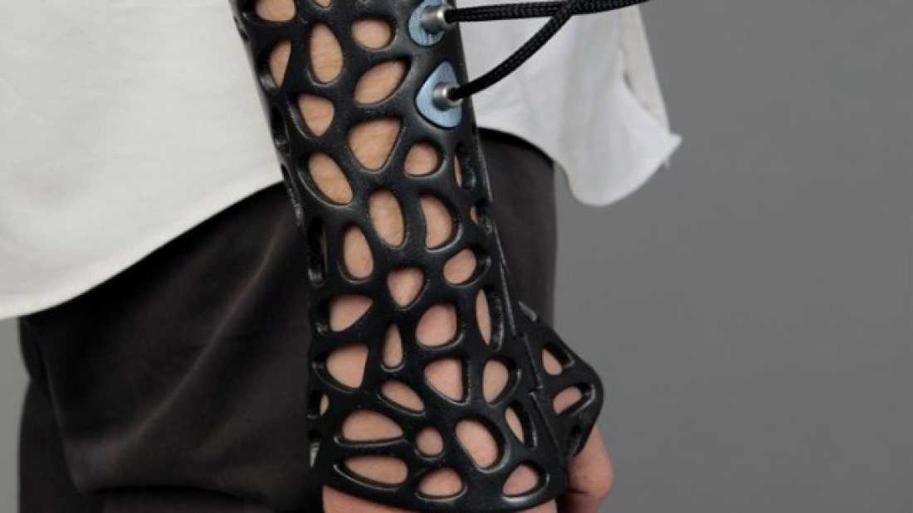


Can they do something like this for my shoulder?


A new prototype brings together 3D printing, room to breathe and ultrasound pulses to create a cast that is not only comfortable and stylish to wear but is expected to speed healing relative to existing options.
 
Designer Deniz Karasahin has adopted the idea of using Low-Intensity Pulsed Ultrasound, (LIPUS) to [speed bone regrowth](http://www.ijoonline.com/article.asp?issn=0019-5413;year=2009;volume=43;issue=2;spage=132;epage=140;aulast=Mundi). Pulses of sound waves too high frequency to hear have been shown to increase the incorporation of calcium ions in cultures of cartilage and bone cells, as well as increasing the [expression of genes known to assist in healing](http://www.ncbi.nlm.nih.gov/pmc/articles/PMC2762251/). 

However, despite success in vitro and promising results from [clinical studies](http://www.ncbi.nlm.nih.gov/pubmed/20182238) LIPUS has not been widely adopted, partly because the measured benefit has varied across trials, in some cases appearing too small to justify the effort.

LIPUS currently involves a daily session at a medical clinic,but [Deniz Karasahin](http://www.dkdesign.biz) added a portable ultrasound generator to this cast. "For single 20 minute daily sessions this system promises to reduce the healing process up to 38% and increase the heal rate up to 80% in non-union fractures," he has claimed, using figures from the top of the ranges produced in trials of LIPUS without changing cast technology.

Operating LIPUS with conventional plaster or fiberglass casts is tricky however, since probes need to be attached directly to the skin, requiring a break in the cast. The [Cortex exoskeletal cast](http://www.cnet.com/news/3d-printed-cast-is-made-to-scratch/) offers a way to eliminate that problem. The brain child of New Zealand designer Jake Evill, the 3D printed cast has several benefits. Besides being lightweight it would allow air to ventilate, the owner to scratch an itch on the affected limb and avoid the common smelliness of casts. Karasahin realized it provides plenty of opportunity for LIPUS probes to access the skin, and took it to the next level.

In both Evill's original and the Karasahin extension, dubbed the Osteoid Cast, an X-Ray and 3D scanner map the area that needs to be supported and a cast is designed and printed. The lattice is [made in two halves and snapped together](http://jakevilldesign.dunked.com/cortex). The holes are made smaller around the injury site to increase support, but are still large enough to allow probe to be threaded through.
 
Costs are still unknown, but likely to fall as 3D printing becomes more widespread.
