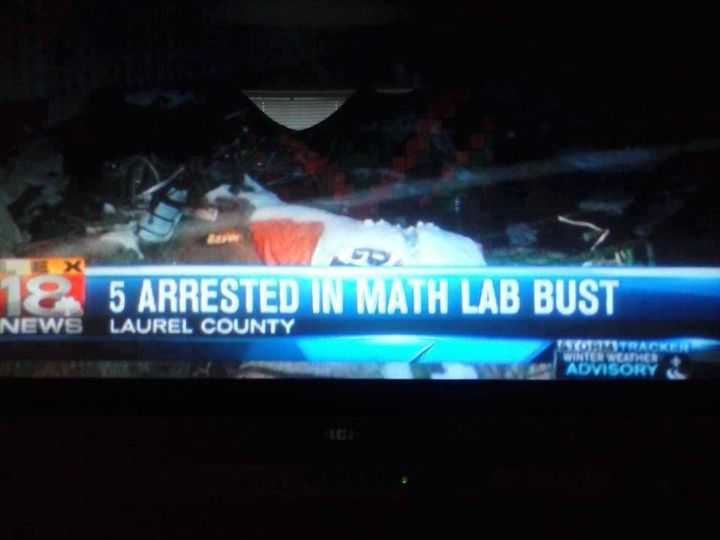

> Heh, next time, they'll add up the differentials with the grow & decay algorithms plus take the cube root before their sums become irrational... 
> 
> Must get the MATH right, chumps!



May 22, 2014
Look, I don't want to go on a tangent here, but all sines point to this being an irrational crime.


