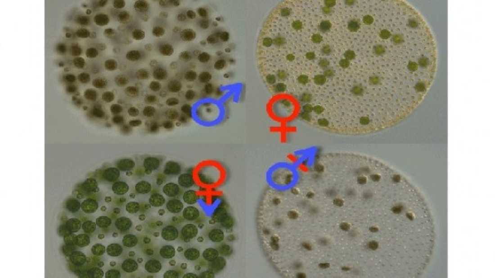

 

 In an intriguing new study, scientists discovered that a single gene in multicellular green algae that determines whether the organisms produce sperm or eggs evolved from a primitive form in its unicellular ancestor that does not have separate sexes. The research may therefore hint at how sexes in multicellular organisms evolved from sexless ancestors. The work has been published in [PLOS Biology](http://www.plosbiology.org/article/info:doi/10.1371/journal.pbio.1001904).

 While it is known that male and female sexes evolved on several separate occasions in various organisms, little was known about how sexless unicellular organisms fitted into the equation. These unicellular organisms have mating types as opposed to different sexes; their reproductive cells look the same but can only mate with those of a different mating type.

 It has been suggested that sexual dimorphism (differences between males and females) may have its origins in this more ancestral unicellular system, but this has been difficult to prove given the fact that the evolution of the sexes started such a long time ago.

 “Our unicellular ancestors that also engaged in sex are so distant from us that a lot of what’s happened in between has been erased or changed,” study author James Umen told [Live Science](http://www.livescience.com/46697-algae-sex-gene-identified.html?cmpid=514627_20140709_27466696).

 The evolution of sexes in a group of green algae called [volvocine algae](http://www.ncbi.nlm.nih.gov/pmc/articles/PMC2734051/), however, occurred much [more recently](http://www.livescience.com/46697-algae-sex-gene-identified.html?cmpid=514627_20140709_27466696), making them an ideal model to study the origins of the different sexes. Furthermore, this group includes both single-celled species such as *C. reinhardtii* that has mating types and multicellular species such as *V. carteri* that has separate sexes.

 In order to gain an insight into how sex may have evolved, the researchers looked at a conserved gene found in these organisms called MID, the presence or absence of which determines whether *C. reinhardtii* is a “plus” or “minus” mating type. In *V. carteri*, however, the *MID* gene is present in males but absent in females.

 By sequencing and comparing both forms of the MID gene, the researchers were able to establish that the DNA sequences were very similar for both organisms, which led them to believe that *V. carteri*’s MID probably evolved from the more primitive form in *C. reinhardtii*. Despite sequence similarity, however, the MID gene from *C. reinhardtii* was [unable to substitute](http://phys.org/news/2014-07-transgender-algae-reveal-evolutionary-sexes.html) for *V. carteri*'s MID. 

 Amazingly, when the researchers took the MID gene from male V. carteri organisms (top left of header image) and inserted it into females (top right), the females produced functional sperm packets (bottom right). Furthermore, when they switched off MID in male organisms they produced functional eggs (bottom left). The researchers were even able to carry out [matings](http://phys.org/news/2014-07-transgender-algae-reveal-evolutionary-sexes.html) with these gender-swapped strains. 

 The researchers therefore conclude that MID from unicellular ancestors underwent changes that eventually reprogrammed it to control the development of different gametes in multicellular descendants. *MID* is not the only gene involved, however, but rather a master regulator that controls various genes involved in sperm and egg development. The researchers will therefore continue this work by looking at how these genes came under the control of *MID*. 