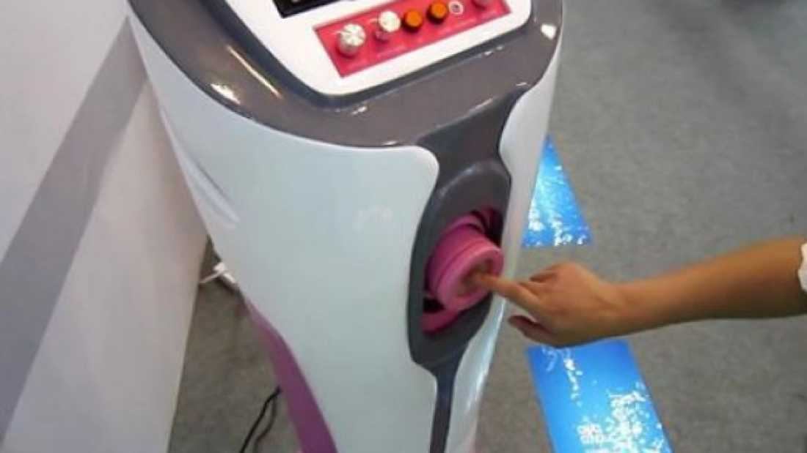


Who wants to get *milked* at the hospital??


 

 A Chinese hospital in Nanjing, capital of Jiangsu Province, has introduced a new machine that makes sperm donation even easier- an automatic sperm extractor. I’m all for hands-free technology, but have scientists gone a little too far with this invention?

 The effortless machine features a massage pipe that can be adjusted to suit the height of the user. All the gentleman has to do is plug in the frequency, amplitude and temperature and off they go. It’s also fitted with a small screen for those feeling uninspired.

 According to the director of the urology department of the hospital, the machine is designed to help individuals that are finding it difficult to retrieve sperm the old fashioned way. We're not entirely convinced that standing in a room shared by many other people and being milked like a cow is going to help, but their efforts are commendable. Here’s to technology.

 Check out a video of the machine here: 

## Video (1:40 minutes)
 'Sperm Extractor' Machine Replicates Human Vagina for Donors



    start: 0,
    allowfullscreen: 1,
    autoplay: 0,
    hl: en,
    cc_lang_pref: en,
    cc_load_policy: 1,
    color: white,
    controls: 1,
    disablekb: 0,
    enablejsapi: 1,
    fs: 0,
    iv_load_policy: 3,
    loop: 0,
    modestbranding: 1,
    playsinline: 0,
    privacy_mode: yes,
    rel: 0,
    showinfo: 0,
    origin: blog.richiebartlett.com,
    widget_referrer: blog.richiebartlett.com

